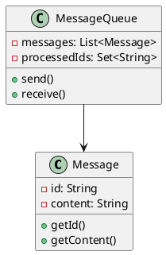
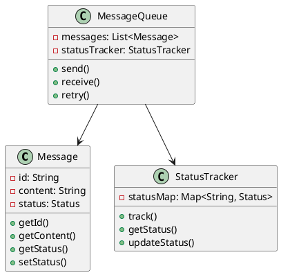
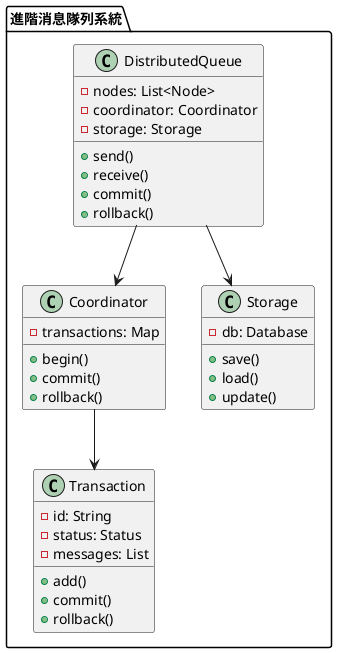

# 消息隊列不重複消費教學

## 初級（Beginner）層級

### 1. 概念說明
消息隊列不重複消費就像學校的點名系統：
- 每個學生只能被點名一次
- 如果點名表上已經有你的名字，就不會再點你一次
- 這樣可以確保每個學生只被點到一次名

初級學習者需要了解：
- 什麼是不重複消費
- 為什麼需要避免重複消費
- 基本的消息標記概念

### 2. PlantUML 圖解


### 3. 分段教學步驟

#### 步驟 1：基本消息標記
```java
public class SimpleMessage {
    private String id;
    private String content;
    
    public SimpleMessage(String content) {
        this.id = UUID.randomUUID().toString();
        this.content = content;
    }
    
    public String getId() {
        return id;
    }
    
    public String getContent() {
        return content;
    }
}

public class SimpleQueue {
    private List<SimpleMessage> messages;
    private Set<String> processedIds;
    
    public SimpleQueue() {
        messages = new ArrayList<>();
        processedIds = new HashSet<>();
    }
    
    public void send(SimpleMessage message) {
        System.out.println("發送消息：" + message.getContent());
        messages.add(message);
    }
    
    public SimpleMessage receive() {
        if (!messages.isEmpty()) {
            SimpleMessage message = messages.remove(0);
            if (!processedIds.contains(message.getId())) {
                processedIds.add(message.getId());
                System.out.println("接收消息：" + message.getContent());
                return message;
            }
        }
        return null;
    }
}
```

## 中級（Intermediate）層級

### 1. 概念說明
中級學習者需要理解：
- 消息狀態管理
- 冪等性處理
- 重試機制
- 狀態追蹤

### 2. PlantUML 圖解


### 3. 分段教學步驟

#### 步驟 1：消息狀態管理
```java
public enum MessageStatus {
    PENDING,
    PROCESSING,
    COMPLETED,
    FAILED
}

public class AdvancedMessage {
    private String id;
    private String content;
    private MessageStatus status;
    
    public AdvancedMessage(String content) {
        this.id = UUID.randomUUID().toString();
        this.content = content;
        this.status = MessageStatus.PENDING;
    }
    
    public String getId() {
        return id;
    }
    
    public String getContent() {
        return content;
    }
    
    public MessageStatus getStatus() {
        return status;
    }
    
    public void setStatus(MessageStatus status) {
        this.status = status;
    }
}
```

#### 步驟 2：狀態追蹤
```java
public class StatusTracker {
    private Map<String, MessageStatus> statusMap;
    
    public StatusTracker() {
        statusMap = new HashMap<>();
    }
    
    public void track(String messageId, MessageStatus status) {
        statusMap.put(messageId, status);
    }
    
    public MessageStatus getStatus(String messageId) {
        return statusMap.getOrDefault(messageId, MessageStatus.PENDING);
    }
    
    public void updateStatus(String messageId, MessageStatus newStatus) {
        statusMap.put(messageId, newStatus);
    }
}
```

## 高級（Advanced）層級

### 1. 概念說明
高級學習者需要掌握：
- 分散式冪等性
- 事務管理
- 狀態持久化
- 並發控制

### 2. PlantUML 圖解


### 3. 分段教學步驟

#### 步驟 1：分散式事務
```java
public class DistributedQueue {
    private List<Node> nodes;
    private Coordinator coordinator;
    private Storage storage;
    
    public DistributedQueue() {
        nodes = new ArrayList<>();
        coordinator = new Coordinator();
        storage = new Storage();
    }
    
    public void send(Message message) {
        Transaction tx = coordinator.begin();
        try {
            // 保存消息
            storage.save(message);
            
            // 同步到其他節點
            for (Node node : nodes) {
                node.replicate(message);
            }
            
            // 提交事務
            coordinator.commit(tx);
        } catch (Exception e) {
            // 回滾事務
            coordinator.rollback(tx);
            throw e;
        }
    }
    
    public Message receive() {
        Transaction tx = coordinator.begin();
        try {
            Message message = storage.load();
            if (message != null && !isProcessed(message)) {
                markAsProcessing(message);
                coordinator.commit(tx);
                return message;
            }
            coordinator.rollback(tx);
            return null;
        } catch (Exception e) {
            coordinator.rollback(tx);
            throw e;
        }
    }
}
```

#### 步驟 2：事務管理
```java
public class Coordinator {
    private Map<String, Transaction> transactions;
    
    public Coordinator() {
        transactions = new HashMap<>();
    }
    
    public Transaction begin() {
        String txId = UUID.randomUUID().toString();
        Transaction tx = new Transaction(txId);
        transactions.put(txId, tx);
        return tx;
    }
    
    public void commit(Transaction tx) {
        tx.commit();
        transactions.remove(tx.getId());
    }
    
    public void rollback(Transaction tx) {
        tx.rollback();
        transactions.remove(tx.getId());
    }
}

public class Transaction {
    private String id;
    private TransactionStatus status;
    private List<Message> messages;
    
    public Transaction(String id) {
        this.id = id;
        this.status = TransactionStatus.ACTIVE;
        this.messages = new ArrayList<>();
    }
    
    public void add(Message message) {
        messages.add(message);
    }
    
    public void commit() {
        status = TransactionStatus.COMMITTED;
    }
    
    public void rollback() {
        status = TransactionStatus.ROLLED_BACK;
    }
}
```

#### 步驟 3：狀態持久化
```java
public class Storage {
    private Map<String, Message> db;
    
    public Storage() {
        db = new HashMap<>();
    }
    
    public void save(Message message) {
        db.put(message.getId(), message);
        System.out.println("保存消息：" + message.getContent());
    }
    
    public Message load() {
        if (!db.isEmpty()) {
            String key = db.keySet().iterator().next();
            return db.remove(key);
        }
        return null;
    }
    
    public void update(Message message) {
        db.put(message.getId(), message);
    }
}
```

這個教學文件提供了從基礎到進階的消息隊列不重複消費學習路徑，每個層級都包含了相應的概念說明、圖解、教學步驟和實作範例。初級學習者可以從基本的消息標記開始，中級學習者可以學習狀態管理和追蹤，而高級學習者則可以掌握分散式事務和持久化等進階功能。 