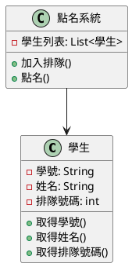
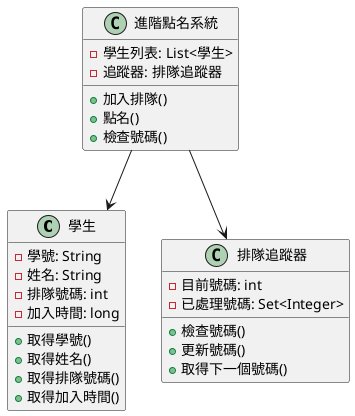
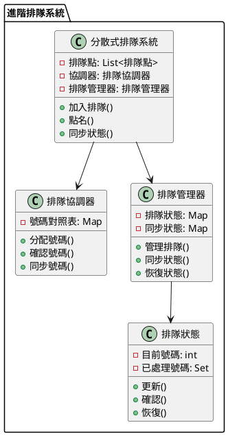

# 消息隊列順序消費教學

## 初級（Beginner）層級

### 1. 概念說明
消息隊列就像學校的點名系統：
- 同學們要按順序排隊點名
- 先來的同學先被點到
- 不能插隊，要遵守順序

初級學習者需要了解：
- 什麼是排隊系統
- 為什麼要排隊
- 基本的排隊規則

### 2. 使用原因
為什麼需要排隊系統：
1. 公平性：
   - 確保先來的人先被服務
   - 避免有人插隊
   - 維持秩序

2. 正確性：
   - 確保每個人都有被點到
   - 不會漏掉任何人
   - 不會重複點名

3. 效率：
   - 讓點名過程更快速
   - 減少混亂
   - 節省時間

### 3. 問題表象
可能遇到的問題：
1. 順序問題：
   - 有人插隊
   - 順序混亂
   - 點名順序錯誤

2. 遺漏問題：
   - 有人沒被點到
   - 重複點名
   - 點名表遺失

3. 效率問題：
   - 點名太慢
   - 隊伍太長
   - 等待太久

### 4. 避免方法
如何避免問題：
1. 系統設計：
   - 使用排隊號碼
   - 設置排隊規則
   - 建立檢查機制

2. 管理方法：
   - 定期檢查順序
   - 記錄已點名的人
   - 清理過期資料

3. 優化方法：
   - 加快點名速度
   - 控制隊伍長度
   - 定期評估效率

### 5. 問題處理
遇到問題怎麼辦：
1. 順序問題處理：
   - 檢查排隊順序
   - 修正錯誤順序
   - 恢復正確順序

2. 遺漏問題處理：
   - 檢查點名表
   - 補點漏掉的人
   - 修正重複點名

3. 效率問題處理：
   - 加快處理速度
   - 調整隊伍長度
   - 增加點名人員

### 6. PlantUML 圖解


### 7. 分段教學步驟

#### 步驟 1：基本排隊系統
```java
public class 學生 {
    private String 學號;
    private String 姓名;
    private int 排隊號碼;
    
    public 學生(String 姓名, int 排隊號碼) {
        this.學號 = UUID.randomUUID().toString();
        this.姓名 = 姓名;
        this.排隊號碼 = 排隊號碼;
    }
    
    public String 取得學號() {
        return 學號;
    }
    
    public String 取得姓名() {
        return 姓名;
    }
    
    public int 取得排隊號碼() {
        return 排隊號碼;
    }
}

public class 簡單點名系統 {
    private List<學生> 學生列表;
    
    public 簡單點名系統() {
        學生列表 = new ArrayList<>();
    }
    
    public void 加入排隊(學生 學生) {
        System.out.println("加入排隊：" + 學生.取得姓名() + "，號碼：" + 學生.取得排隊號碼());
        學生列表.add(學生);
        // 按號碼排序
        學生列表.sort(Comparator.comparingInt(學生::取得排隊號碼));
    }
    
    public 學生 點名() {
        if (!學生列表.isEmpty()) {
            學生 學生 = 學生列表.remove(0);
            System.out.println("點名：" + 學生.取得姓名() + "，號碼：" + 學生.取得排隊號碼());
            return 學生;
        }
        return null;
    }
}
```

## 中級（Intermediate）層級

### 1. 概念說明
中級學習者需要理解：
- 排隊系統的運作原理
- 如何追蹤排隊狀態
- 如何處理特殊情況
- 如何優化排隊流程

### 2. PlantUML 圖解


### 3. 分段教學步驟

#### 步驟 1：排隊追蹤
```java
public class 排隊追蹤器 {
    private int 目前號碼;
    private Set<Integer> 已處理號碼;
    
    public 排隊追蹤器() {
        目前號碼 = 0;
        已處理號碼 = new HashSet<>();
    }
    
    public boolean 檢查號碼(int 號碼) {
        return 號碼 == 目前號碼 + 1;
    }
    
    public void 更新號碼(int 號碼) {
        已處理號碼.add(號碼);
        目前號碼 = 號碼;
    }
    
    public int 取得下一個號碼() {
        return 目前號碼 + 1;
    }
}
```

#### 步驟 2：進階點名系統
```java
public class 進階點名系統 {
    private List<學生> 學生列表;
    private 排隊追蹤器 追蹤器;
    
    public 進階點名系統() {
        學生列表 = new ArrayList<>();
        追蹤器 = new 排隊追蹤器();
    }
    
    public void 加入排隊(學生 學生) {
        System.out.println("加入排隊：" + 學生.取得姓名() + "，號碼：" + 學生.取得排隊號碼());
        學生列表.add(學生);
        // 按號碼排序
        學生列表.sort(Comparator.comparingInt(學生::取得排隊號碼));
    }
    
    public 學生 點名() {
        if (!學生列表.isEmpty()) {
            學生 學生 = 學生列表.get(0);
            if (追蹤器.檢查號碼(學生.取得排隊號碼())) {
                學生列表.remove(0);
                追蹤器.更新號碼(學生.取得排隊號碼());
                System.out.println("點名：" + 學生.取得姓名() + "，號碼：" + 學生.取得排隊號碼());
                return 學生;
            }
        }
        return null;
    }
}
```

## 高級（Advanced）層級

### 1. 概念說明
高級學習者需要掌握：
- 多個排隊系統的協調
- 排隊狀態的同步
- 特殊情況的處理策略
- 多人同時排隊的管理

### 2. PlantUML 圖解


### 3. 分段教學步驟

#### 步驟 1：分散式排隊管理
```java
public class 分散式排隊系統 {
    private List<排隊點> 排隊點列表;
    private 排隊協調器 協調器;
    private 排隊管理器 管理器;
    
    public 分散式排隊系統() {
        排隊點列表 = new ArrayList<>();
        協調器 = new 排隊協調器();
        管理器 = new 排隊管理器();
    }
    
    public void 加入排隊(學生 學生) {
        // 分配號碼
        int 號碼 = 協調器.分配號碼(學生);
        學生.設定排隊號碼(號碼);
        
        // 同步到所有排隊點
        for (排隊點 點 : 排隊點列表) {
            點.複製排隊資訊(學生);
        }
        
        System.out.println("加入排隊：" + 學生.取得姓名() + "，號碼：" + 號碼);
    }
    
    public 學生 點名() {
        // 取得下一個號碼的學生
        int 下一個號碼 = 管理器.取得下一個號碼();
        學生 學生 = 協調器.確認號碼(下一個號碼);
        
        if (學生 != null) {
            管理器.更新號碼(下一個號碼);
            System.out.println("點名：" + 學生.取得姓名() + "，號碼：" + 下一個號碼);
        }
        
        return 學生;
    }
}
```

#### 步驟 2：排隊協調
```java
public class 排隊協調器 {
    private Map<Integer, 學生> 號碼對照表;
    
    public 排隊協調器() {
        號碼對照表 = new HashMap<>();
    }
    
    public int 分配號碼(學生 學生) {
        int 號碼 = 號碼對照表.size() + 1;
        號碼對照表.put(號碼, 學生);
        return 號碼;
    }
    
    public 學生 確認號碼(int 號碼) {
        return 號碼對照表.get(號碼);
    }
    
    public void 同步號碼(int 號碼, 學生 學生) {
        號碼對照表.put(號碼, 學生);
    }
}
```

#### 步驟 3：排隊狀態管理
```java
public class 排隊管理器 {
    private Map<String, 排隊狀態> 排隊狀態表;
    private Map<String, Set<Integer>> 同步狀態表;
    
    public 排隊管理器() {
        排隊狀態表 = new HashMap<>();
        同步狀態表 = new HashMap<>();
    }
    
    public void 管理排隊(String 排隊點ID, int 號碼) {
        排隊狀態 狀態 = 排隊狀態表.computeIfAbsent(排隊點ID, k -> new 排隊狀態());
        狀態.更新(號碼);
    }
    
    public void 同步狀態(String 排隊點ID, Set<Integer> 號碼集合) {
        同步狀態表.put(排隊點ID, 號碼集合);
    }
    
    public int 取得下一個號碼() {
        // 計算所有排隊點中最小的未處理號碼
        return 排隊狀態表.values().stream()
            .mapToInt(排隊狀態::取得目前號碼)
            .min()
            .orElse(0) + 1;
    }
}
```

### 7. 實戰案例

#### 案例一：學校點名系統
```java
public class 學校點名系統 {
    private 進階點名系統 點名系統;
    private 排隊追蹤器 追蹤器;
    
    public void 處理點名(學生 學生) {
        // 創建排隊資訊
        學生 排隊學生 = new 學生(
            學生.取得學號(),
            學生.取得姓名(),
            學生.取得排隊號碼()
        );
        
        // 加入排隊
        點名系統.加入排隊(排隊學生);
        
        // 處理點名
        處理點名流程();
    }
    
    private void 處理點名流程() {
        while (true) {
            學生 學生 = 點名系統.點名();
            if (學生 == null) break;
            
            // 處理點名
            處理學生點名(學生);
        }
    }
}
```

#### 案例二：餐廳排隊系統
```java
public class 餐廳排隊系統 {
    private 分散式排隊系統 排隊系統;
    private 排隊追蹤器 追蹤器;
    
    public void 處理排隊(顧客 顧客) {
        // 創建排隊資訊
        學生 排隊顧客 = new 學生(
            顧客.取得顧客編號(),
            顧客.取得姓名(),
            顧客.取得排隊號碼()
        );
        
        // 加入排隊
        排隊系統.加入排隊(排隊顧客);
        
        // 處理排隊
        處理排隊流程();
    }
    
    private void 處理排隊流程() {
        while (true) {
            學生 顧客 = 排隊系統.點名();
            if (顧客 == null) break;
            
            // 處理顧客
            處理顧客(顧客);
        }
    }
}
```

### 8. 最佳實踐

#### 1. 使用現有工具
```java
// 使用 RabbitMQ 實現排隊系統
public class RabbitMQ排隊系統 {
    private final String 隊列名稱;
    private final ConnectionFactory 工廠;
    
    public RabbitMQ排隊系統(String 主機, String 隊列名稱) {
        this.隊列名稱 = 隊列名稱;
        this.工廠 = new ConnectionFactory();
        this.工廠.setHost(主機);
    }
    
    public void 開始排隊() throws Exception {
        try (Connection 連線 = 工廠.newConnection();
             Channel 頻道 = 連線.createChannel()) {
            
            // 設置隊列為單一處理模式
            頻道.basicQos(1);
            
            // 宣告隊列
            頻道.queueDeclare(隊列名稱, true, false, false, null);
            
            // 處理排隊
            頻道.basicConsume(隊列名稱, false, new DefaultConsumer(頻道) {
                @Override
                public void handleDelivery(String 消費者標籤,
                                         Envelope 信封,
                                         AMQP.BasicProperties 屬性,
                                         byte[] 內容) throws IOException {
                    String 訊息 = new String(內容, "UTF-8");
                    System.out.println("收到：" + 訊息);
                    
                    // 處理訊息
                    處理排隊訊息(訊息);
                    
                    // 確認處理完成
                    頻道.basicAck(信封.getDeliveryTag(), false);
                }
            });
        }
    }
}
```

#### 2. 監控與告警
```java
public class 排隊監控器 {
    private 指標收集器 收集器;
    private 告警管理器 告警器;
    
    public void 監控() {
        排隊指標 指標 = 收集器.收集指標();
        
        // 檢查排隊狀態
        if (!指標.是否順序正確()) {
            告警器.告警("順序警告", 指標.取得詳細資訊());
        }
        
        // 檢查處理狀態
        if (指標.取得處理狀態() != 處理狀態.正常) {
            告警器.告警("處理警告", 指標.取得詳細資訊());
        }
        
        // 檢查效率狀態
        if (指標.取得效率狀態() != 效率狀態.最佳) {
            告警器.告警("效率警告", 指標.取得詳細資訊());
        }
    }
}
```

#### 3. 錯誤處理與恢復
```java
public class 排隊恢復器 {
    private 排隊追蹤器 追蹤器;
    private 訊息儲存器 儲存器;
    
    public void 恢復() {
        // 檢查排隊狀態
        檢查排隊狀態();
        
        // 修復排隊錯誤
        修復排隊問題();
        
        // 恢復處理流程
        恢復處理流程();
    }
    
    private void 檢查排隊狀態() {
        // 實現排隊狀態檢查邏輯
    }
    
    private void 修復排隊問題() {
        // 實現排隊修復邏輯
    }
    
    private void 恢復處理流程() {
        // 實現處理流程恢復邏輯
    }
}
```

這個教學文件提供了從基礎到進階的排隊系統學習路徑，每個層級都包含了相應的概念說明、圖解、教學步驟和實作範例。初級學習者可以從基本的排隊概念開始，中級學習者可以學習排隊追蹤和狀態管理，而高級學習者則可以掌握分散式排隊系統和協調等進階功能。 