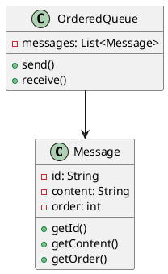
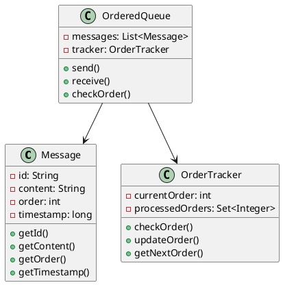
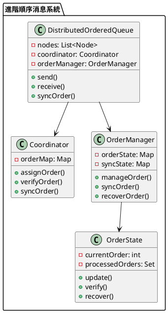

# 消息隊列順序消費教學

## 初級（Beginner）層級

### 1. 概念說明
消息隊列順序消費就像學校的排隊系統：
- 同學們要按順序排隊
- 先來的同學先被服務
- 不能插隊，要遵守順序

初級學習者需要了解：
- 什麼是順序消費
- 為什麼需要按順序處理
- 基本的排隊概念

### 2. 使用原因
消息隊列順序消費的主要使用原因包括：
1. 業務邏輯需求：
   - 確保操作順序正確
   - 維護數據一致性
   - 保證業務流程完整性

2. 數據一致性：
   - 避免數據衝突
   - 確保數據更新順序
   - 防止數據錯誤

3. 系統可靠性：
   - 提高系統穩定性
   - 確保處理順序
   - 優化系統效能

### 3. 問題表象
常見的問題表象包括：
1. 順序問題：
   - 消息順序錯亂
   - 處理順序不一致
   - 順序跳躍

2. 數據問題：
   - 數據不一致
   - 數據衝突
   - 數據錯誤

3. 效能問題：
   - 處理延遲
   - 系統阻塞
   - 資源浪費

### 4. 避免方法
避免問題的方法包括：
1. 系統設計：
   - 實現順序保證
   - 設計順序檢查
   - 建立追蹤機制

2. 數據管理：
   - 實現順序標記
   - 設置順序檢查
   - 定期清理數據

3. 效能優化：
   - 優化處理流程
   - 實現並發控制
   - 定期效能評估

### 5. 問題處理
遇到問題時的處理方法：
1. 順序問題處理：
   - 檢查順序一致性
   - 修復順序錯誤
   - 恢復正確順序

2. 數據問題處理：
   - 檢查數據一致性
   - 修復數據錯誤
   - 恢復正確狀態

3. 效能問題處理：
   - 優化處理流程
   - 調整資源分配
   - 實現動態擴展

### 6. PlantUML 圖解


### 7. 分段教學步驟

#### 步驟 1：基本順序處理
```java
public class OrderedMessage {
    private String id;
    private String content;
    private int order;
    
    public OrderedMessage(String content, int order) {
        this.id = UUID.randomUUID().toString();
        this.content = content;
        this.order = order;
    }
    
    public String getId() {
        return id;
    }
    
    public String getContent() {
        return content;
    }
    
    public int getOrder() {
        return order;
    }
}

public class SimpleOrderedQueue {
    private List<OrderedMessage> messages;
    
    public SimpleOrderedQueue() {
        messages = new ArrayList<>();
    }
    
    public void send(OrderedMessage message) {
        System.out.println("發送消息：" + message.getContent() + "，順序：" + message.getOrder());
        messages.add(message);
        // 按順序排序
        messages.sort(Comparator.comparingInt(OrderedMessage::getOrder));
    }
    
    public OrderedMessage receive() {
        if (!messages.isEmpty()) {
            OrderedMessage message = messages.remove(0);
            System.out.println("接收消息：" + message.getContent() + "，順序：" + message.getOrder());
            return message;
        }
        return null;
    }
}
```

## 中級（Intermediate）層級

### 1. 概念說明
中級學習者需要理解：
- 消息順序保證
- 順序檢查機制
- 順序恢復機制
- 順序追蹤

### 2. PlantUML 圖解


### 3. 分段教學步驟

#### 步驟 1：順序追蹤
```java
public class OrderTracker {
    private int currentOrder;
    private Set<Integer> processedOrders;
    
    public OrderTracker() {
        currentOrder = 0;
        processedOrders = new HashSet<>();
    }
    
    public boolean checkOrder(int order) {
        return order == currentOrder + 1;
    }
    
    public void updateOrder(int order) {
        processedOrders.add(order);
        currentOrder = order;
    }
    
    public int getNextOrder() {
        return currentOrder + 1;
    }
}
```

#### 步驟 2：順序保證
```java
public class AdvancedOrderedQueue {
    private List<OrderedMessage> messages;
    private OrderTracker tracker;
    
    public AdvancedOrderedQueue() {
        messages = new ArrayList<>();
        tracker = new OrderTracker();
    }
    
    public void send(OrderedMessage message) {
        System.out.println("發送消息：" + message.getContent() + "，順序：" + message.getOrder());
        messages.add(message);
        // 按順序排序
        messages.sort(Comparator.comparingInt(OrderedMessage::getOrder));
    }
    
    public OrderedMessage receive() {
        if (!messages.isEmpty()) {
            OrderedMessage message = messages.get(0);
            if (tracker.checkOrder(message.getOrder())) {
                messages.remove(0);
                tracker.updateOrder(message.getOrder());
                System.out.println("接收消息：" + message.getContent() + "，順序：" + message.getOrder());
                return message;
            }
        }
        return null;
    }
}
```

## 高級（Advanced）層級

### 1. 概念說明
高級學習者需要掌握：
- 分散式順序保證
- 順序同步機制
- 順序恢復策略
- 並發順序控制

### 2. PlantUML 圖解


### 3. 分段教學步驟

#### 步驟 1：分散式順序管理
```java
public class DistributedOrderedQueue {
    private List<Node> nodes;
    private Coordinator coordinator;
    private OrderManager orderManager;
    
    public DistributedOrderedQueue() {
        nodes = new ArrayList<>();
        coordinator = new Coordinator();
        orderManager = new OrderManager();
    }
    
    public void send(Message message) {
        // 分配順序
        int order = coordinator.assignOrder(message);
        message.setOrder(order);
        
        // 同步到所有節點
        for (Node node : nodes) {
            node.replicate(message);
        }
        
        System.out.println("發送消息：" + message.getContent() + "，順序：" + order);
    }
    
    public Message receive() {
        // 獲取下一個順序的消息
        int nextOrder = orderManager.getNextOrder();
        Message message = coordinator.verifyOrder(nextOrder);
        
        if (message != null) {
            orderManager.updateOrder(nextOrder);
            System.out.println("接收消息：" + message.getContent() + "，順序：" + nextOrder);
        }
        
        return message;
    }
}
```

#### 步驟 2：順序協調
```java
public class Coordinator {
    private Map<Integer, Message> orderMap;
    
    public Coordinator() {
        orderMap = new HashMap<>();
    }
    
    public int assignOrder(Message message) {
        int order = orderMap.size() + 1;
        orderMap.put(order, message);
        return order;
    }
    
    public Message verifyOrder(int order) {
        return orderMap.get(order);
    }
    
    public void syncOrder(int order, Message message) {
        orderMap.put(order, message);
    }
}
```

#### 步驟 3：順序狀態管理
```java
public class OrderManager {
    private Map<String, OrderState> orderState;
    private Map<String, Set<Integer>> syncState;
    
    public OrderManager() {
        orderState = new HashMap<>();
        syncState = new HashMap<>();
    }
    
    public void manageOrder(String nodeId, int order) {
        OrderState state = orderState.computeIfAbsent(nodeId, k -> new OrderState());
        state.update(order);
    }
    
    public void syncOrder(String nodeId, Set<Integer> orders) {
        syncState.put(nodeId, orders);
    }
    
    public int getNextOrder() {
        // 計算所有節點中最小的未處理順序
        return orderState.values().stream()
            .mapToInt(OrderState::getCurrentOrder)
            .min()
            .orElse(0) + 1;
    }
}
```

### 7. 實戰案例

#### 案例一：電商訂單處理
```java
public class OrderProcessor {
    private OrderedQueue queue;
    private OrderTracker tracker;
    
    public void processOrder(Order order) {
        // 創建順序消息
        OrderedMessage message = new OrderedMessage(
            order.getId(),
            order.getData(),
            order.getSequence()
        );
        
        // 發送消息
        queue.send(message);
        
        // 處理消息
        processMessages();
    }
    
    private void processMessages() {
        while (true) {
            OrderedMessage message = queue.receive();
            if (message == null) break;
            
            // 處理訂單
            processOrder(message);
        }
    }
}
```

#### 案例二：金融交易處理
```java
public class TransactionProcessor {
    private OrderedQueue queue;
    private TransactionTracker tracker;
    
    public void processTransaction(Transaction transaction) {
        // 創建順序消息
        OrderedMessage message = new OrderedMessage(
            transaction.getId(),
            transaction.getData(),
            transaction.getSequence()
        );
        
        // 發送消息
        queue.send(message);
        
        // 處理消息
        processMessages();
    }
    
    private void processMessages() {
        while (true) {
            OrderedMessage message = queue.receive();
            if (message == null) break;
            
            // 處理交易
            processTransaction(message);
        }
    }
}
```

### 8. 最佳實踐

#### 1. 使用現有工具
```java
// 使用 RabbitMQ 實現順序消費
public class RabbitMQOrderedConsumer {
    private final String queueName;
    private final ConnectionFactory factory;
    
    public RabbitMQOrderedConsumer(String host, String queueName) {
        this.queueName = queueName;
        this.factory = new ConnectionFactory();
        this.factory.setHost(host);
    }
    
    public void consume() throws Exception {
        try (Connection connection = factory.newConnection();
             Channel channel = connection.createChannel()) {
            
            // 設置隊列為單消費者模式
            channel.basicQos(1);
            
            // 聲明隊列
            channel.queueDeclare(queueName, true, false, false, null);
            
            // 消費消息
            channel.basicConsume(queueName, false, new DefaultConsumer(channel) {
                @Override
                public void handleDelivery(String consumerTag,
                                         Envelope envelope,
                                         AMQP.BasicProperties properties,
                                         byte[] body) throws IOException {
                    String message = new String(body, "UTF-8");
                    System.out.println("Received: " + message);
                    
                    // 處理消息
                    processMessage(message);
                    
                    // 確認消息
                    channel.basicAck(envelope.getDeliveryTag(), false);
                }
            });
        }
    }
}
```

#### 2. 監控與告警
```java
public class OrderMonitor {
    private MetricsCollector metricsCollector;
    private AlertManager alertManager;
    
    public void monitor() {
        OrderMetrics metrics = metricsCollector.collectMetrics();
        
        // 檢查順序狀態
        if (!metrics.isOrderConsistent()) {
            alertManager.alert("順序警告", metrics.getDetails());
        }
        
        // 檢查處理狀態
        if (metrics.getProcessingStatus() != ProcessingStatus.NORMAL) {
            alertManager.alert("處理警告", metrics.getDetails());
        }
        
        // 檢查效能狀態
        if (metrics.getPerformanceStatus() != PerformanceStatus.OPTIMAL) {
            alertManager.alert("效能警告", metrics.getDetails());
        }
    }
}
```

#### 3. 錯誤處理與恢復
```java
public class OrderRecovery {
    private OrderTracker tracker;
    private MessageStore store;
    
    public void recover() {
        // 檢查順序狀態
        checkOrderState();
        
        // 修復順序錯誤
        fixOrderIssues();
        
        // 恢復處理流程
        restoreProcessing();
    }
    
    private void checkOrderState() {
        // 實現順序狀態檢查邏輯
    }
    
    private void fixOrderIssues() {
        // 實現順序修復邏輯
    }
    
    private void restoreProcessing() {
        // 實現處理流程恢復邏輯
    }
}
```

這個教學文件提供了從基礎到進階的消息隊列順序消費學習路徑，每個層級都包含了相應的概念說明、圖解、教學步驟和實作範例。初級學習者可以從基本的順序處理開始，中級學習者可以學習順序追蹤和保證，而高級學習者則可以掌握分散式順序管理和協調等進階功能。 