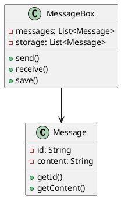
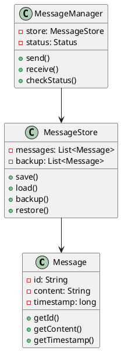
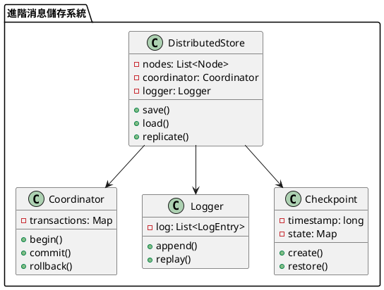

# 消息隊列訊息不丟失教學

## 初級（Beginner）層級

### 1. 概念說明
消息隊列訊息不丟失就像學校的作業本：
- 老師發的作業本要好好保存
- 如果作業本不見了，就沒辦法寫作業
- 所以我們要把作業本放在安全的地方

初級學習者需要了解：
- 什麼是訊息不丟失
- 為什麼需要保存訊息
- 基本的訊息儲存概念

### 2. PlantUML 圖解


### 3. 分段教學步驟

#### 步驟 1：基本訊息儲存
```java
public class SimpleMessage {
    private String id;
    private String content;
    
    public SimpleMessage(String content) {
        this.id = UUID.randomUUID().toString();
        this.content = content;
    }
    
    public String getId() {
        return id;
    }
    
    public String getContent() {
        return content;
    }
}

public class SafeMessageBox {
    private List<SimpleMessage> messages;
    private List<SimpleMessage> storage;
    
    public SafeMessageBox() {
        messages = new ArrayList<>();
        storage = new ArrayList<>();
    }
    
    public void send(SimpleMessage message) {
        System.out.println("發送消息：" + message.getContent());
        messages.add(message);
        // 同時保存到儲存區
        storage.add(message);
    }
    
    public SimpleMessage receive() {
        if (!messages.isEmpty()) {
            SimpleMessage message = messages.remove(0);
            System.out.println("接收消息：" + message.getContent());
            return message;
        }
        return null;
    }
    
    public void recover() {
        // 如果消息丟失了，從儲存區恢復
        messages.addAll(storage);
        System.out.println("已恢復所有消息");
    }
}
```

## 中級（Intermediate）層級

### 1. 概念說明
中級學習者需要理解：
- 訊息持久化
- 備份機制
- 恢復機制
- 狀態檢查

### 2. PlantUML 圖解


### 3. 分段教學步驟

#### 步驟 1：訊息持久化
```java
public class PersistentMessage {
    private String id;
    private String content;
    private long timestamp;
    
    public PersistentMessage(String content) {
        this.id = UUID.randomUUID().toString();
        this.content = content;
        this.timestamp = System.currentTimeMillis();
    }
    
    public String getId() {
        return id;
    }
    
    public String getContent() {
        return content;
    }
    
    public long getTimestamp() {
        return timestamp;
    }
}
```

#### 步驟 2：訊息儲存管理
```java
public class MessageStore {
    private List<PersistentMessage> messages;
    private List<PersistentMessage> backup;
    
    public MessageStore() {
        messages = new ArrayList<>();
        backup = new ArrayList<>();
    }
    
    public void save(PersistentMessage message) {
        messages.add(message);
        // 同時備份
        backup.add(message);
        System.out.println("已保存消息：" + message.getContent());
    }
    
    public PersistentMessage load(String messageId) {
        return messages.stream()
            .filter(m -> m.getId().equals(messageId))
            .findFirst()
            .orElse(null);
    }
    
    public void restore() {
        messages.clear();
        messages.addAll(backup);
        System.out.println("已從備份恢復所有消息");
    }
}
```

## 高級（Advanced）層級

### 1. 概念說明
高級學習者需要掌握：
- 分散式儲存
- 事務日誌
- 檢查點機制
- 容錯處理

### 2. PlantUML 圖解


### 3. 分段教學步驟

#### 步驟 1：分散式儲存
```java
public class DistributedStore {
    private List<Node> nodes;
    private Coordinator coordinator;
    private Logger logger;
    private Checkpoint checkpoint;
    
    public DistributedStore() {
        nodes = new ArrayList<>();
        coordinator = new Coordinator();
        logger = new Logger();
        checkpoint = new Checkpoint();
    }
    
    public void save(Message message) {
        Transaction tx = coordinator.begin();
        try {
            // 記錄日誌
            logger.append(new LogEntry("SAVE", message));
            
            // 保存到所有節點
            for (Node node : nodes) {
                node.save(message);
            }
            
            // 創建檢查點
            checkpoint.create();
            
            coordinator.commit(tx);
        } catch (Exception e) {
            coordinator.rollback(tx);
            throw e;
        }
    }
    
    public void recover() {
        // 從最近的檢查點恢復
        checkpoint.restore();
        // 重放日誌
        logger.replay();
    }
}
```

#### 步驟 2：事務日誌
```java
public class Logger {
    private List<LogEntry> log;
    
    public Logger() {
        log = new ArrayList<>();
    }
    
    public void append(LogEntry entry) {
        log.add(entry);
        System.out.println("記錄操作：" + entry.getOperation());
    }
    
    public void replay() {
        for (LogEntry entry : log) {
            System.out.println("重放操作：" + entry.getOperation());
            // 執行日誌中的操作
        }
    }
}

public class LogEntry {
    private String operation;
    private Message message;
    private long timestamp;
    
    public LogEntry(String operation, Message message) {
        this.operation = operation;
        this.message = message;
        this.timestamp = System.currentTimeMillis();
    }
    
    public String getOperation() {
        return operation;
    }
}
```

#### 步驟 3：檢查點機制
```java
public class Checkpoint {
    private long timestamp;
    private Map<String, Message> state;
    
    public Checkpoint() {
        state = new HashMap<>();
    }
    
    public void create() {
        timestamp = System.currentTimeMillis();
        System.out.println("創建檢查點：" + timestamp);
    }
    
    public void restore() {
        System.out.println("從檢查點恢復：" + timestamp);
        // 恢復系統狀態
    }
}
```

這個教學文件提供了從基礎到進階的消息隊列訊息不丟失學習路徑，每個層級都包含了相應的概念說明、圖解、教學步驟和實作範例。初級學習者可以從基本的訊息儲存開始，中級學習者可以學習持久化和備份機制，而高級學習者則可以掌握分散式儲存和容錯處理等進階功能。 