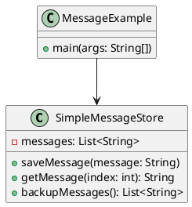
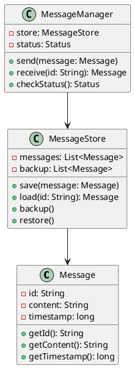
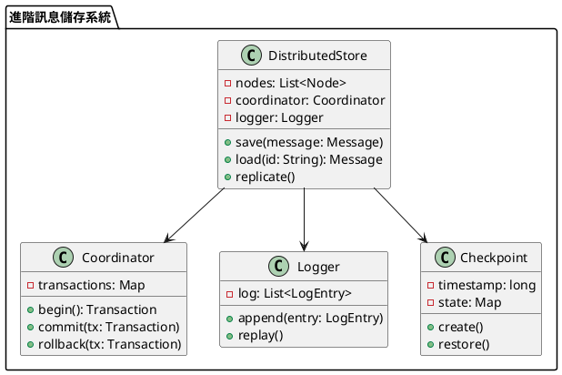

# 消息隊列訊息不丟失教學

## 初級（Beginner）層級

### 1. 概念說明
消息隊列就像學校的傳紙條系統：
- 當你要傳紙條給同學時，需要確保紙條不會弄丟
- 如果紙條不見了，對方就收不到訊息
- 所以我們需要一個安全的地方來保存這些紙條

初級學習者需要了解：
- 什麼是訊息不丟失
- 為什麼要保存訊息
- 基本的訊息儲存概念

### 2. 使用原因
為什麼我們需要保存訊息：
1. 確保訊息不會消失：
   - 就像老師發的作業本要好好保存
   - 如果作業本不見了，就沒辦法寫作業
   - 所以我們要把作業本放在安全的地方

2. 讓事情順利進行：
   - 確保每個人都收到訊息
   - 不會漏掉重要的事情
   - 可以追蹤訊息的狀態

3. 系統穩定運作：
   - 讓電腦系統更可靠
   - 不會因為訊息不見而出錯
   - 可以處理更多訊息

### 3. 問題表象
可能會遇到的問題：
1. 訊息不見了：
   - 傳送的訊息消失了
   - 收不到重要訊息
   - 訊息順序混亂

2. 系統出問題：
   - 電腦當機
   - 網路斷線
   - 儲存空間不足

3. 效能變慢：
   - 處理訊息變慢
   - 系統反應遲鈍
   - 儲存空間不夠

### 4. 避免方法
如何避免這些問題：
1. 好好保存訊息：
   - 把訊息存在安全的地方
   - 定期備份訊息
   - 檢查訊息是否完整

2. 監控系統狀態：
   - 檢查系統是否正常
   - 監控儲存空間
   - 定期維護系統

3. 優化系統效能：
   - 清理不需要的訊息
   - 優化儲存方式
   - 定期檢查系統

### 5. 實作範例

#### 簡單的訊息儲存系統
```java
public class SimpleMessageStore {
    // 用來存放訊息的列表
    private List<String> messages = new ArrayList<>();
    
    // 儲存訊息
    public void saveMessage(String message) {
        messages.add(message);
        System.out.println("已儲存訊息：" + message);
    }
    
    // 讀取訊息
    public String getMessage(int index) {
        if (index < messages.size()) {
            return messages.get(index);
        }
        return null;
    }
    
    // 備份所有訊息
    public List<String> backupMessages() {
        return new ArrayList<>(messages);
    }
}
```

#### 使用範例
```java
public class MessageExample {
    public static void main(String[] args) {
        // 創建訊息儲存系統
        SimpleMessageStore store = new SimpleMessageStore();
        
        // 儲存一些訊息
        store.saveMessage("你好！");
        store.saveMessage("今天天氣真好！");
        store.saveMessage("記得寫作業！");
        
        // 讀取訊息
        String message = store.getMessage(0);
        System.out.println("讀取到的訊息：" + message);
        
        // 備份訊息
        List<String> backup = store.backupMessages();
        System.out.println("備份的訊息數量：" + backup.size());
    }
}
```

### 6. PlantUML 圖解


## 中級（Intermediate）層級

### 1. 概念說明
中級學習者需要理解：
- 訊息持久化：把訊息永久保存下來
- 備份機制：準備第二份備用的訊息
- 恢復機制：當訊息不見時可以找回來
- 狀態檢查：確認訊息是否正常

### 2. PlantUML 圖解


### 3. 分段教學步驟

#### 步驟 1：建立訊息類別
```java
public class Message {
    private String id;
    private String content;
    private long timestamp;
    
    public Message(String content) {
        this.id = UUID.randomUUID().toString();
        this.content = content;
        this.timestamp = System.currentTimeMillis();
    }
    
    public String getId() {
        return id;
    }
    
    public String getContent() {
        return content;
    }
    
    public long getTimestamp() {
        return timestamp;
    }
}
```

#### 步驟 2：建立訊息儲存系統
```java
public class MessageStore {
    private List<Message> messages;
    private List<Message> backup;
    
    public MessageStore() {
        messages = new ArrayList<>();
        backup = new ArrayList<>();
    }
    
    public void save(Message message) {
        messages.add(message);
        // 同時備份
        backup.add(message);
        System.out.println("已儲存訊息：" + message.getContent());
    }
    
    public Message load(String messageId) {
        return messages.stream()
            .filter(m -> m.getId().equals(messageId))
            .findFirst()
            .orElse(null);
    }
    
    public void restore() {
        messages.clear();
        messages.addAll(backup);
        System.out.println("已從備份恢復所有訊息");
    }
}
```

#### 步驟 3：建立訊息管理器
```java
public class MessageManager {
    private MessageStore store;
    private Status status;
    
    public MessageManager() {
        store = new MessageStore();
        status = Status.NORMAL;
    }
    
    public void send(Message message) {
        store.save(message);
        System.out.println("已發送訊息：" + message.getContent());
    }
    
    public Message receive(String messageId) {
        return store.load(messageId);
    }
    
    public Status checkStatus() {
        return status;
    }
}
```

## 高級（Advanced）層級

### 1. 概念說明
高級學習者需要掌握：
- 分散式儲存：在多台電腦上儲存訊息
- 事務日誌：記錄所有操作的日記
- 檢查點機制：定期保存系統狀態
- 容錯處理：當系統出問題時如何處理

### 2. PlantUML 圖解


### 3. 分段教學步驟

#### 步驟 1：建立分散式儲存系統
```java
public class DistributedStore {
    private List<Node> nodes;
    private Coordinator coordinator;
    private Logger logger;
    private Checkpoint checkpoint;
    
    public DistributedStore() {
        nodes = new ArrayList<>();
        coordinator = new Coordinator();
        logger = new Logger();
        checkpoint = new Checkpoint();
    }
    
    public void save(Message message) {
        Transaction tx = coordinator.begin();
        try {
            // 記錄日誌
            logger.append(new LogEntry("SAVE", message));
            
            // 儲存到所有節點
            for (Node node : nodes) {
                node.save(message);
            }
            
            // 創建檢查點
            checkpoint.create();
            
            coordinator.commit(tx);
        } catch (Exception e) {
            coordinator.rollback(tx);
            throw e;
        }
    }
    
    public void recover() {
        // 從最近的檢查點恢復
        checkpoint.restore();
        // 重放日誌
        logger.replay();
    }
}
```

#### 步驟 2：建立日誌系統
```java
public class Logger {
    private List<LogEntry> log;
    
    public Logger() {
        log = new ArrayList<>();
    }
    
    public void append(LogEntry entry) {
        log.add(entry);
        System.out.println("記錄操作：" + entry.getOperation());
    }
    
    public void replay() {
        for (LogEntry entry : log) {
            System.out.println("重放操作：" + entry.getOperation());
            // 執行日誌中的操作
        }
    }
}

public class LogEntry {
    private String operation;
    private Message message;
    private long timestamp;
    
    public LogEntry(String operation, Message message) {
        this.operation = operation;
        this.message = message;
        this.timestamp = System.currentTimeMillis();
    }
    
    public String getOperation() {
        return operation;
    }
}
```

#### 步驟 3：建立檢查點機制
```java
public class Checkpoint {
    private long timestamp;
    private Map<String, Message> state;
    
    public Checkpoint() {
        state = new HashMap<>();
    }
    
    public void create() {
        timestamp = System.currentTimeMillis();
        System.out.println("創建檢查點：" + timestamp);
    }
    
    public void restore() {
        System.out.println("從檢查點恢復：" + timestamp);
        // 恢復系統狀態
    }
}
```

這個教學文件提供了從基礎到進階的訊息儲存學習路徑，每個層級都包含了相應的概念說明、圖解、教學步驟和實作範例。初級學習者可以從基本的訊息儲存開始，中級學習者可以學習持久化和備份機制，而高級學習者則可以掌握分散式儲存和容錯處理等進階功能。 