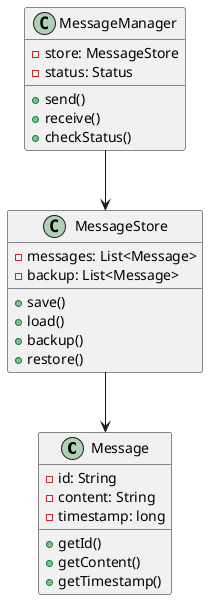
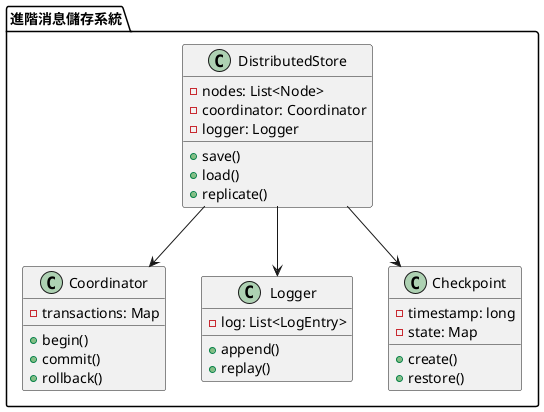

# 消息隊列訊息不丟失教學

## 初級（Beginner）層級

### 1. 概念說明
消息隊列訊息不丟失就像學校的作業本：
- 老師發的作業本要好好保存
- 如果作業本不見了，就沒辦法寫作業
- 所以我們要把作業本放在安全的地方

初級學習者需要了解：
- 什麼是訊息不丟失
- 為什麼需要保存訊息
- 基本的訊息儲存概念

### 2. 使用原因
消息隊列訊息不丟失的主要使用原因包括：
1. 數據可靠性：
   - 確保消息不會丟失
   - 保證數據完整性
   - 防止數據錯誤

2. 業務連續性：
   - 確保業務流程不中斷
   - 保證交易完整性
   - 維護業務一致性

3. 系統穩定性：
   - 提高系統可靠性
   - 確保服務可用性
   - 優化系統效能

### 3. 問題表象
常見的問題表象包括：
1. 數據問題：
   - 消息丟失
   - 數據不一致
   - 數據錯誤

2. 業務問題：
   - 業務中斷
   - 交易失敗
   - 流程異常

3. 效能問題：
   - 儲存壓力
   - 恢復延遲
   - 資源消耗

### 4. 避免方法
避免問題的方法包括：
1. 系統設計：
   - 實現持久化
   - 設計備份機制
   - 建立恢復機制

2. 數據管理：
   - 實現消息儲存
   - 設置備份策略
   - 定期清理數據

3. 效能優化：
   - 優化儲存策略
   - 實現並發控制
   - 定期效能評估

### 5. 問題處理
遇到問題時的處理方法：
1. 數據問題處理：
   - 檢查數據完整性
   - 修復數據錯誤
   - 恢復正確狀態

2. 業務問題處理：
   - 檢查業務流程
   - 修復業務異常
   - 恢復正常流程

3. 效能問題處理：
   - 優化儲存策略
   - 調整資源分配
   - 實現動態擴展

### 6. 實戰案例

#### 案例一：電商訂單處理
```java
public class OrderMessageProcessor {
    private MessageStore store;
    private MessageBackup backup;
    
    public void processOrder(Order order) {
        // 創建持久化消息
        PersistentMessage message = new PersistentMessage(
            order.getId(),
            order.getData(),
            System.currentTimeMillis()
        );
        
        // 保存消息
        store.save(message);
        
        // 備份消息
        backup.save(message);
        
        // 處理消息
        processMessage(message);
    }
    
    private void processMessage(PersistentMessage message) {
        try {
            // 處理消息
            processOrder(message.getContent());
            
            // 確認處理完成
            store.markAsProcessed(message.getId());
        } catch (Exception e) {
            // 處理失敗，從備份恢復
            backup.restore(message.getId());
        }
    }
}
```

#### 案例二：金融交易處理
```java
public class TransactionMessageProcessor {
    private MessageStore store;
    private MessageBackup backup;
    
    public void processTransaction(Transaction transaction) {
        // 創建持久化消息
        PersistentMessage message = new PersistentMessage(
            transaction.getId(),
            transaction.getData(),
            System.currentTimeMillis()
        );
        
        // 保存消息
        store.save(message);
        
        // 備份消息
        backup.save(message);
        
        // 處理消息
        processMessage(message);
    }
    
    private void processMessage(PersistentMessage message) {
        try {
            // 處理消息
            processTransaction(message.getContent());
            
            // 確認處理完成
            store.markAsProcessed(message.getId());
        } catch (Exception e) {
            // 處理失敗，從備份恢復
            backup.restore(message.getId());
        }
    }
}
```

### 7. 最佳實踐

#### 1. 使用現有工具
```java
// 使用 RabbitMQ 實現消息持久化
public class RabbitMQPersistentConsumer {
    private final String queueName;
    private final ConnectionFactory factory;
    
    public RabbitMQPersistentConsumer(String host, String queueName) {
        this.queueName = queueName;
        this.factory = new ConnectionFactory();
        this.factory.setHost(host);
    }
    
    public void consume() throws Exception {
        try (Connection connection = factory.newConnection();
             Channel channel = connection.createChannel()) {
            
            // 設置隊列持久化
            boolean durable = true;
            channel.queueDeclare(queueName, durable, false, false, null);
            
            // 設置消息持久化
            AMQP.BasicProperties properties = MessageProperties.PERSISTENT_TEXT_PLAIN;
            
            // 消費消息
            channel.basicConsume(queueName, false, new DefaultConsumer(channel) {
                @Override
                public void handleDelivery(String consumerTag,
                                         Envelope envelope,
                                         AMQP.BasicProperties properties,
                                         byte[] body) throws IOException {
                    String message = new String(body, "UTF-8");
                    System.out.println("Received: " + message);
                    
                    try {
                        // 處理消息
                        processMessage(message);
                        
                        // 確認消息
                        channel.basicAck(envelope.getDeliveryTag(), false);
                    } catch (Exception e) {
                        // 處理失敗，拒絕消息
                        channel.basicNack(envelope.getDeliveryTag(), false, true);
                    }
                }
            });
        }
    }
}
```

#### 2. 監控與告警
```java
public class MessageMonitor {
    private MetricsCollector metricsCollector;
    private AlertManager alertManager;
    
    public void monitor() {
        MessageMetrics metrics = metricsCollector.collectMetrics();
        
        // 檢查消息狀態
        if (!metrics.isMessageConsistent()) {
            alertManager.alert("消息警告", metrics.getDetails());
        }
        
        // 檢查儲存狀態
        if (metrics.getStorageStatus() != StorageStatus.NORMAL) {
            alertManager.alert("儲存警告", metrics.getDetails());
        }
        
        // 檢查效能狀態
        if (metrics.getPerformanceStatus() != PerformanceStatus.OPTIMAL) {
            alertManager.alert("效能警告", metrics.getDetails());
        }
    }
}
```

#### 3. 錯誤處理與恢復
```java
public class MessageRecovery {
    private MessageStore store;
    private MessageBackup backup;
    
    public void recover() {
        // 檢查消息狀態
        checkMessageState();
        
        // 修復消息錯誤
        fixMessageIssues();
        
        // 恢復處理流程
        restoreProcessing();
    }
    
    private void checkMessageState() {
        // 實現消息狀態檢查邏輯
    }
    
    private void fixMessageIssues() {
        // 實現消息修復邏輯
    }
    
    private void restoreProcessing() {
        // 實現處理流程恢復邏輯
    }
}
```

## 中級（Intermediate）層級

### 1. 概念說明
中級學習者需要理解：
- 訊息持久化
- 備份機制
- 恢復機制
- 狀態檢查

### 2. PlantUML 圖解


### 3. 分段教學步驟

#### 步驟 1：訊息持久化
```java
public class PersistentMessage {
    private String id;
    private String content;
    private long timestamp;
    
    public PersistentMessage(String content) {
        this.id = UUID.randomUUID().toString();
        this.content = content;
        this.timestamp = System.currentTimeMillis();
    }
    
    public String getId() {
        return id;
    }
    
    public String getContent() {
        return content;
    }
    
    public long getTimestamp() {
        return timestamp;
    }
}
```

#### 步驟 2：訊息儲存管理
```java
public class MessageStore {
    private List<PersistentMessage> messages;
    private List<PersistentMessage> backup;
    
    public MessageStore() {
        messages = new ArrayList<>();
        backup = new ArrayList<>();
    }
    
    public void save(PersistentMessage message) {
        messages.add(message);
        // 同時備份
        backup.add(message);
        System.out.println("已保存消息：" + message.getContent());
    }
    
    public PersistentMessage load(String messageId) {
        return messages.stream()
            .filter(m -> m.getId().equals(messageId))
            .findFirst()
            .orElse(null);
    }
    
    public void restore() {
        messages.clear();
        messages.addAll(backup);
        System.out.println("已從備份恢復所有消息");
    }
}
```

## 高級（Advanced）層級

### 1. 概念說明
高級學習者需要掌握：
- 分散式儲存
- 事務日誌
- 檢查點機制
- 容錯處理

### 2. PlantUML 圖解


### 3. 分段教學步驟

#### 步驟 1：分散式儲存
```java
public class DistributedStore {
    private List<Node> nodes;
    private Coordinator coordinator;
    private Logger logger;
    private Checkpoint checkpoint;
    
    public DistributedStore() {
        nodes = new ArrayList<>();
        coordinator = new Coordinator();
        logger = new Logger();
        checkpoint = new Checkpoint();
    }
    
    public void save(Message message) {
        Transaction tx = coordinator.begin();
        try {
            // 記錄日誌
            logger.append(new LogEntry("SAVE", message));
            
            // 保存到所有節點
            for (Node node : nodes) {
                node.save(message);
            }
            
            // 創建檢查點
            checkpoint.create();
            
            coordinator.commit(tx);
        } catch (Exception e) {
            coordinator.rollback(tx);
            throw e;
        }
    }
    
    public void recover() {
        // 從最近的檢查點恢復
        checkpoint.restore();
        // 重放日誌
        logger.replay();
    }
}
```

#### 步驟 2：事務日誌
```java
public class Logger {
    private List<LogEntry> log;
    
    public Logger() {
        log = new ArrayList<>();
    }
    
    public void append(LogEntry entry) {
        log.add(entry);
        System.out.println("記錄操作：" + entry.getOperation());
    }
    
    public void replay() {
        for (LogEntry entry : log) {
            System.out.println("重放操作：" + entry.getOperation());
            // 執行日誌中的操作
        }
    }
}

public class LogEntry {
    private String operation;
    private Message message;
    private long timestamp;
    
    public LogEntry(String operation, Message message) {
        this.operation = operation;
        this.message = message;
        this.timestamp = System.currentTimeMillis();
    }
    
    public String getOperation() {
        return operation;
    }
}
```

#### 步驟 3：檢查點機制
```java
public class Checkpoint {
    private long timestamp;
    private Map<String, Message> state;
    
    public Checkpoint() {
        state = new HashMap<>();
    }
    
    public void create() {
        timestamp = System.currentTimeMillis();
        System.out.println("創建檢查點：" + timestamp);
    }
    
    public void restore() {
        System.out.println("從檢查點恢復：" + timestamp);
        // 恢復系統狀態
    }
}
```

這個教學文件提供了從基礎到進階的消息隊列訊息不丟失學習路徑，每個層級都包含了相應的概念說明、圖解、教學步驟和實作範例。初級學習者可以從基本的訊息儲存開始，中級學習者可以學習持久化和備份機制，而高級學習者則可以掌握分散式儲存和容錯處理等進階功能。 