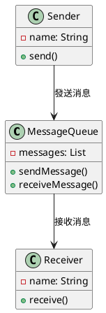
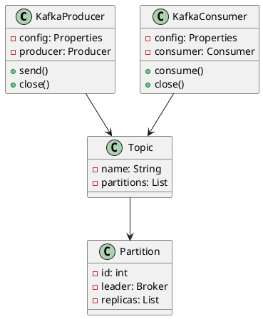
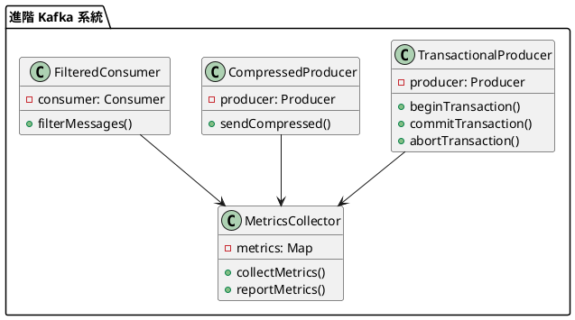

# 消息隊列教學

## 初級（Beginner）層級

### 1. 概念說明
消息隊列就像學校的傳話筒：
- 當你有話要告訴同學時，可以寫在紙條上
- 把紙條放進傳話筒裡
- 同學可以從傳話筒裡取出紙條來看

#### 原因分析
1. 系統設計需求：
   - 解耦系統組件
   - 異步處理請求
   - 削峰填谷

2. 業務場景：
   - 高並發處理
   - 延遲任務
   - 事件驅動

#### 問題表象
1. 性能問題：
   - 系統響應慢
   - 資源利用率低
   - 擴展性受限

2. 業務影響：
   - 用戶體驗差
   - 系統穩定性低
   - 維護成本高

#### 避免方法
1. 基礎防護：
   - 合理設置隊列大小
   - 實現基本的監控
   - 添加錯誤處理

2. 數據處理：
   - 消息持久化
   - 消息重試機制
   - 死信隊列處理

#### 處理方案
1. 技術方案：
   - 使用消息隊列
   - 實現消息確認
   - 添加監控機制

2. 運維方案：
   - 監控隊列狀態
   - 設置告警閾值
   - 定期優化配置

初級學習者需要了解：
- 什麼是消息隊列
- 為什麼需要消息隊列
- 基本的消息發送和接收概念

### 2. PlantUML 圖解


### 3. 分段教學步驟

#### 步驟 1：基本消息隊列
```java
// 生產者配置
Properties producerProps = new Properties();
producerProps.put("bootstrap.servers", "localhost:9092");
producerProps.put("key.serializer", "org.apache.kafka.common.serialization.StringSerializer");
producerProps.put("value.serializer", "org.apache.kafka.common.serialization.StringSerializer");

// 消費者配置
Properties consumerProps = new Properties();
consumerProps.put("bootstrap.servers", "localhost:9092");
consumerProps.put("group.id", "test-group");
consumerProps.put("key.deserializer", "org.apache.kafka.common.serialization.StringDeserializer");
consumerProps.put("value.deserializer", "org.apache.kafka.common.serialization.StringDeserializer");

// 生產者示例
public class KafkaProducerExample {
    private final Producer<String, String> producer;
    
    public KafkaProducerExample() {
        this.producer = new KafkaProducer<>(producerProps);
    }
    
    public void sendMessage(String topic, String message) {
        ProducerRecord<String, String> record = new ProducerRecord<>(topic, message);
        producer.send(record, (metadata, exception) -> {
            if (exception != null) {
                System.err.println("發送消息失敗：" + exception.getMessage());
            } else {
                System.out.println("消息發送到分區：" + metadata.partition() + 
                    ", 偏移量：" + metadata.offset());
            }
        });
    }
    
    public void close() {
        producer.close();
    }
}

// 消費者示例
public class KafkaConsumerExample {
    private final Consumer<String, String> consumer;
    
    public KafkaConsumerExample() {
        this.consumer = new KafkaConsumer<>(consumerProps);
    }
    
    public void consumeMessages(String topic) {
        consumer.subscribe(Collections.singletonList(topic));
        
        while (true) {
            ConsumerRecords<String, String> records = consumer.poll(Duration.ofMillis(100));
            for (ConsumerRecord<String, String> record : records) {
                System.out.println("收到消息：" + record.value() + 
                    ", 分區：" + record.partition() + 
                    ", 偏移量：" + record.offset());
            }
        }
    }
    
    public void close() {
        consumer.close();
    }
}
```

#### 步驟 2：簡單的消息發送和接收
```java
public class MessageSystem {
    private final KafkaProducerExample producer;
    private final KafkaConsumerExample consumer;
    private final String topic;
    
    public MessageSystem(String topic) {
        this.producer = new KafkaProducerExample();
        this.consumer = new KafkaConsumerExample();
        this.topic = topic;
    }
    
    public void send(String message) {
        producer.sendMessage(topic, message);
    }
    
    public void startConsuming() {
        new Thread(() -> consumer.consumeMessages(topic)).start();
    }
    
    public void close() {
        producer.close();
        consumer.close();
    }
}
```

### 4. 配置說明

#### Maven 依賴配置
```xml
<dependencies>
    <dependency>
        <groupId>org.apache.kafka</groupId>
        <artifactId>kafka-clients</artifactId>
        <version>3.6.0</version>
    </dependency>
</dependencies>
```

#### Kafka 服務器配置
```properties
# server.properties
broker.id=0
listeners=PLAINTEXT://:9092
log.dirs=/tmp/kafka-logs
num.partitions=3
default.replication.factor=1
```

## 中級（Intermediate）層級

### 1. 概念說明
中級學習者需要理解：
- Kafka 的架構和組件
- 消息格式和序列化
- 消費者組和分區
- 錯誤處理和重試機制

#### Kafka 架構詳解
1. 核心組件：
   - Broker：消息代理服務器
   - Topic：消息主題
   - Partition：分區
   - Producer：生產者
   - Consumer：消費者

2. 優缺點：
   - 優點：高吞吐量、可擴展性強
   - 缺點：配置複雜、資源消耗大

3. 使用場景：
   - 日誌收集
   - 流式處理
   - 事件溯源

#### 消息格式詳解
1. 消息結構：
   - Key：分區路由
   - Value：消息內容
   - Headers：元數據
   - Timestamp：時間戳

2. 序列化方式：
   - String
   - JSON
   - Avro
   - Protobuf

#### 消費者組詳解
1. 工作原理：
   - 組內負載均衡
   - 分區分配策略
   - 消費進度管理

2. 注意事項：
   - 組內消費者數量
   - 分區分配策略
   - 消費進度提交

#### 錯誤處理詳解
1. 錯誤類型：
   - 網絡錯誤
   - 序列化錯誤
   - 處理錯誤

2. 處理策略：
   - 重試機制
   - 死信隊列
   - 錯誤日誌

### 2. PlantUML 圖解


### 3. 分段教學步驟

#### 步驟 1：消息格式和序列化
```java
// 自定義消息格式
public class CustomMessage {
    private String id;
    private String content;
    private long timestamp;
    
    // 序列化器
    public static class CustomSerializer implements Serializer<CustomMessage> {
        @Override
        public byte[] serialize(String topic, CustomMessage data) {
            try {
                return new ObjectMapper().writeValueAsBytes(data);
            } catch (JsonProcessingException e) {
                throw new RuntimeException(e);
            }
        }
    }
    
    // 反序列化器
    public static class CustomDeserializer implements Deserializer<CustomMessage> {
        @Override
        public CustomMessage deserialize(String topic, byte[] data) {
            try {
                return new ObjectMapper().readValue(data, CustomMessage.class);
            } catch (IOException e) {
                throw new RuntimeException(e);
            }
        }
    }
}
```

#### 步驟 2：消費者組和分區
```java
public class ConsumerGroupExample {
    private final Consumer<String, String> consumer;
    
    public ConsumerGroupExample(String groupId) {
        Properties props = new Properties();
        props.put("bootstrap.servers", "localhost:9092");
        props.put("group.id", groupId);
        props.put("key.deserializer", "org.apache.kafka.common.serialization.StringDeserializer");
        props.put("value.deserializer", "org.apache.kafka.common.serialization.StringDeserializer");
        
        this.consumer = new KafkaConsumer<>(props);
    }
    
    public void consumeWithPartition(String topic) {
        consumer.subscribe(Collections.singletonList(topic));
        
        while (true) {
            ConsumerRecords<String, String> records = consumer.poll(Duration.ofMillis(100));
            for (TopicPartition partition : records.partitions()) {
                List<ConsumerRecord<String, String>> partitionRecords = records.records(partition);
                for (ConsumerRecord<String, String> record : partitionRecords) {
                    System.out.println("分區 " + partition.partition() + 
                        " 收到消息：" + record.value());
                }
            }
        }
    }
}
```

## 高級（Advanced）層級

### 1. 概念說明
高級學習者需要掌握：
- 分布式事務
- 消息順序保證
- 消息回溯
- 監控和告警

#### 分布式事務詳解
1. 實現方式：
   - 兩階段提交
   - 最終一致性
   - 事務消息

2. 注意事項：
   - 性能影響
   - 一致性要求
   - 異常處理

#### 消息順序詳解
1. 保證方式：
   - 單分區
   - 消息鍵
   - 順序消費

2. 實現策略：
   - 分區選擇
   - 消費控制
   - 重試機制

#### 消息回溯詳解
1. 回溯方式：
   - 時間回溯
   - 偏移量回溯
   - 分區回溯

2. 使用場景：
   - 數據修復
   - 重放測試
   - 故障恢復

#### 監控和告警詳解
1. 監控指標：
   - 生產者指標
   - 消費者指標
   - 集群指標

2. 告警策略：
   - 多級告警
   - 智能降噪
   - 自動處理

### 2. PlantUML 圖解


### 3. 分段教學步驟

#### 步驟 1：事務性消息
```java
public class TransactionalProducerExample {
    private final Producer<String, String> producer;
    
    public TransactionalProducerExample() {
        Properties props = new Properties();
        props.put("bootstrap.servers", "localhost:9092");
        props.put("transactional.id", "my-transactional-id");
        props.put("enable.idempotence", "true");
        
        this.producer = new KafkaProducer<>(props);
        producer.initTransactions();
    }
    
    public void sendTransactionalMessages(String topic, List<String> messages) {
        try {
            producer.beginTransaction();
            
            for (String message : messages) {
                producer.send(new ProducerRecord<>(topic, message));
            }
            
            producer.commitTransaction();
        } catch (Exception e) {
            producer.abortTransaction();
            throw new RuntimeException("事務失敗", e);
        }
    }
}
```

#### 步驟 2：消息壓縮
```java
public class CompressedProducerExample {
    private final Producer<String, String> producer;
    
    public CompressedProducerExample() {
        Properties props = new Properties();
        props.put("bootstrap.servers", "localhost:9092");
        props.put("compression.type", "gzip");
        
        this.producer = new KafkaProducer<>(props);
    }
    
    public void sendCompressedMessage(String topic, String message) {
        producer.send(new ProducerRecord<>(topic, message));
    }
}
```

#### 步驟 3：消息過濾
```java
public class FilteredConsumerExample {
    private final Consumer<String, String> consumer;
    
    public FilteredConsumerExample() {
        Properties props = new Properties();
        props.put("bootstrap.servers", "localhost:9092");
        props.put("group.id", "filtered-group");
        
        this.consumer = new KafkaConsumer<>(props);
    }
    
    public void consumeWithFilter(String topic, Predicate<String> filter) {
        consumer.subscribe(Collections.singletonList(topic));
        
        while (true) {
            ConsumerRecords<String, String> records = consumer.poll(Duration.ofMillis(100));
            for (ConsumerRecord<String, String> record : records) {
                if (filter.test(record.value())) {
                    System.out.println("過濾後的消息：" + record.value());
                }
            }
        }
    }
}
```

### 4. 進階配置

#### 監控配置（使用 Prometheus）
```yaml
# prometheus.yml
scrape_configs:
  - job_name: 'kafka'
    static_configs:
      - targets: ['localhost:7071']
    metrics_path: '/metrics'
```

#### 性能優化配置
```properties
# producer.properties
compression.type=gzip
batch.size=16384
linger.ms=5
buffer.memory=33554432

# consumer.properties
fetch.min.bytes=1
fetch.max.wait.ms=500
max.partition.fetch.bytes=1048576
```

### 4. 常見問題與解決方案

#### 問題表象
1. 消息丟失：
   - 生產者發送失敗
   - 消息隊列崩潰
   - 消費者處理失敗

2. 消息重複：
   - 生產者重試
   - 消費者重試
   - 網絡問題導致重發

3. 消息堆積：
   - 消費者處理速度慢
   - 生產者發送速度過快
   - 系統資源不足

4. 順序問題：
   - 消息亂序
   - 並發處理導致順序錯亂
   - 分區分配不均

#### 避免方法
1. 消息可靠性：
   - 實現消息確認機制
   - 使用持久化存儲
   - 實現冪等性處理

2. 性能優化：
   - 合理設置批處理大小
   - 優化網絡配置
   - 實現負載均衡

3. 監控告警：
   - 設置消息堆積閾值
   - 監控消費延遲
   - 跟蹤錯誤率

#### 處理方案
1. 技術方案：
   ```java
   public class MessageQueueManager {
       private Producer producer;
       private Consumer consumer;
       private DeadLetterQueue deadLetterQueue;
       private MetricsCollector metricsCollector;
       
       public void handleMessageIssue(MessageIssue issue) {
           switch (issue.getType()) {
               case LOST:
                   handleLostMessage(issue);
                   break;
               case DUPLICATE:
                   handleDuplicateMessage(issue);
                   break;
               case STACKED:
                   handleStackedMessages(issue);
                   break;
               case OUT_OF_ORDER:
                   handleOutOfOrderMessages(issue);
                   break;
           }
       }
       
       private void handleLostMessage(MessageIssue issue) {
           // 重試發送
           producer.retrySend(issue.getMessage());
           // 記錄日誌
           metricsCollector.recordLostMessage();
       }
       
       private void handleDuplicateMessage(MessageIssue issue) {
           // 檢查冪等性
           if (!isMessageProcessed(issue.getMessage())) {
               consumer.processMessage(issue.getMessage());
           }
       }
       
       private void handleStackedMessages(MessageIssue issue) {
           // 增加消費者數量
           scaleConsumers();
           // 調整消費速度
           adjustConsumptionRate();
       }
       
       private void handleOutOfOrderMessages(MessageIssue issue) {
           // 使用順序隊列
           useOrderedQueue();
           // 實現消息排序
           sortMessages();
       }
   }
   ```

2. 監控方案：
   ```java
   public class MessageQueueMonitor {
       private MetricsCollector metricsCollector;
       private AlertManager alertManager;
       
       public void monitorQueue() {
           QueueMetrics metrics = metricsCollector.collectMetrics();
           
           // 檢查消息堆積
           if (metrics.getMessageCount() > THRESHOLD) {
               alertManager.alert("消息堆積警告", metrics.getDetails());
           }
           
           // 檢查消費延遲
           if (metrics.getConsumptionDelay() > MAX_DELAY) {
               alertManager.alert("消費延遲警告", metrics.getDetails());
           }
           
           // 檢查錯誤率
           if (metrics.getErrorRate() > ERROR_THRESHOLD) {
               alertManager.alert("錯誤率過高", metrics.getDetails());
           }
       }
   }
   ```

3. 最佳實踐：
   - 實現消息冪等性處理
   - 使用死信隊列處理失敗消息
   - 實現消息重試機制
   - 合理設置消息過期時間
   - 實現消息優先級處理
   - 使用消息壓縮減少網絡開銷
   - 實現消息過濾機制
   - 定期清理過期消息

### 5. 實戰案例

#### 案例一：訂單處理系統
```java
public class OrderProcessingSystem {
    private MessageQueue orderQueue;
    private OrderProcessor orderProcessor;
    private PaymentProcessor paymentProcessor;
    private InventoryManager inventoryManager;
    
    public void processOrder(Order order) {
        // 發送訂單消息
        orderQueue.send(new OrderMessage(order));
        
        // 處理訂單
        orderProcessor.processOrder(order);
        
        // 處理支付
        paymentProcessor.processPayment(order);
        
        // 更新庫存
        inventoryManager.updateInventory(order);
    }
    
    public void handleFailedOrder(Order order) {
        // 將失敗訂單發送到死信隊列
        orderQueue.sendToDeadLetterQueue(new OrderMessage(order));
        
        // 通知運維人員
        notifyOperations(order);
    }
}
```

#### 案例二：日誌收集系統
```java
public class LogCollectionSystem {
    private MessageQueue logQueue;
    private LogProcessor logProcessor;
    private StorageManager storageManager;
    
    public void collectLogs(LogMessage log) {
        // 發送日誌消息
        logQueue.send(log);
        
        // 處理日誌
        logProcessor.processLog(log);
        
        // 存儲日誌
        storageManager.storeLog(log);
    }
    
    public void handleLogBacklog() {
        // 檢查日誌堆積
        if (logQueue.getMessageCount() > BACKLOG_THRESHOLD) {
            // 增加處理能力
            scaleProcessors();
            // 優化存儲策略
            optimizeStorage();
        }
    }
}
```

這個教學文件提供了從基礎到進階的消息隊列學習路徑，每個層級都包含了相應的概念說明、圖解、教學步驟和實作範例。初級學習者可以從基本的消息發送和接收開始，中級學習者可以學習消息格式和處理，而高級學習者則可以掌握非同步處理和負載平衡等進階功能。 