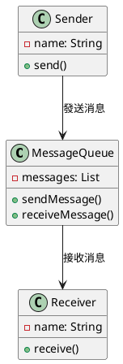
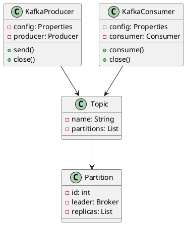
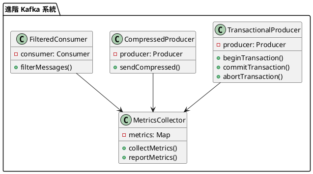

# 消息隊列教學

## 初級（Beginner）層級

### 1. 概念說明
消息隊列就像學校的傳話筒：
- 當你有話要告訴同學時，可以寫在紙條上
- 把紙條放進傳話筒裡
- 同學可以從傳話筒裡取出紙條來看

初級學習者需要了解：
- 什麼是消息隊列
- 為什麼需要消息隊列
- 基本的消息發送和接收概念

### 2. PlantUML 圖解


### 3. 分段教學步驟

#### 步驟 1：基本消息隊列
```java
// 生產者配置
Properties producerProps = new Properties();
producerProps.put("bootstrap.servers", "localhost:9092");
producerProps.put("key.serializer", "org.apache.kafka.common.serialization.StringSerializer");
producerProps.put("value.serializer", "org.apache.kafka.common.serialization.StringSerializer");

// 消費者配置
Properties consumerProps = new Properties();
consumerProps.put("bootstrap.servers", "localhost:9092");
consumerProps.put("group.id", "test-group");
consumerProps.put("key.deserializer", "org.apache.kafka.common.serialization.StringDeserializer");
consumerProps.put("value.deserializer", "org.apache.kafka.common.serialization.StringDeserializer");

// 生產者示例
public class KafkaProducerExample {
    private final Producer<String, String> producer;
    
    public KafkaProducerExample() {
        this.producer = new KafkaProducer<>(producerProps);
    }
    
    public void sendMessage(String topic, String message) {
        ProducerRecord<String, String> record = new ProducerRecord<>(topic, message);
        producer.send(record, (metadata, exception) -> {
            if (exception != null) {
                System.err.println("發送消息失敗：" + exception.getMessage());
            } else {
                System.out.println("消息發送到分區：" + metadata.partition() + 
                    ", 偏移量：" + metadata.offset());
            }
        });
    }
    
    public void close() {
        producer.close();
    }
}

// 消費者示例
public class KafkaConsumerExample {
    private final Consumer<String, String> consumer;
    
    public KafkaConsumerExample() {
        this.consumer = new KafkaConsumer<>(consumerProps);
    }
    
    public void consumeMessages(String topic) {
        consumer.subscribe(Collections.singletonList(topic));
        
        while (true) {
            ConsumerRecords<String, String> records = consumer.poll(Duration.ofMillis(100));
            for (ConsumerRecord<String, String> record : records) {
                System.out.println("收到消息：" + record.value() + 
                    ", 分區：" + record.partition() + 
                    ", 偏移量：" + record.offset());
            }
        }
    }
    
    public void close() {
        consumer.close();
    }
}
```

#### 步驟 2：簡單的消息發送和接收
```java
public class MessageSystem {
    private final KafkaProducerExample producer;
    private final KafkaConsumerExample consumer;
    private final String topic;
    
    public MessageSystem(String topic) {
        this.producer = new KafkaProducerExample();
        this.consumer = new KafkaConsumerExample();
        this.topic = topic;
    }
    
    public void send(String message) {
        producer.sendMessage(topic, message);
    }
    
    public void startConsuming() {
        new Thread(() -> consumer.consumeMessages(topic)).start();
    }
    
    public void close() {
        producer.close();
        consumer.close();
    }
}
```

### 4. 配置說明

#### Maven 依賴配置
```xml
<dependencies>
    <dependency>
        <groupId>org.apache.kafka</groupId>
        <artifactId>kafka-clients</artifactId>
        <version>3.6.0</version>
    </dependency>
</dependencies>
```

#### Kafka 服務器配置
```properties
# server.properties
broker.id=0
listeners=PLAINTEXT://:9092
log.dirs=/tmp/kafka-logs
num.partitions=3
default.replication.factor=1
```

## 中級（Intermediate）層級

### 1. 概念說明
中級學習者需要理解：
- Kafka 的架構和組件
- 消息格式和序列化
- 消費者組和分區
- 錯誤處理和重試機制

### 2. PlantUML 圖解


### 3. 分段教學步驟

#### 步驟 1：消息格式和序列化
```java
// 自定義消息格式
public class CustomMessage {
    private String id;
    private String content;
    private long timestamp;
    
    // 序列化器
    public static class CustomSerializer implements Serializer<CustomMessage> {
        @Override
        public byte[] serialize(String topic, CustomMessage data) {
            try {
                return new ObjectMapper().writeValueAsBytes(data);
            } catch (JsonProcessingException e) {
                throw new RuntimeException(e);
            }
        }
    }
    
    // 反序列化器
    public static class CustomDeserializer implements Deserializer<CustomMessage> {
        @Override
        public CustomMessage deserialize(String topic, byte[] data) {
            try {
                return new ObjectMapper().readValue(data, CustomMessage.class);
            } catch (IOException e) {
                throw new RuntimeException(e);
            }
        }
    }
}
```

#### 步驟 2：消費者組和分區
```java
public class ConsumerGroupExample {
    private final Consumer<String, String> consumer;
    
    public ConsumerGroupExample(String groupId) {
        Properties props = new Properties();
        props.put("bootstrap.servers", "localhost:9092");
        props.put("group.id", groupId);
        props.put("key.deserializer", "org.apache.kafka.common.serialization.StringDeserializer");
        props.put("value.deserializer", "org.apache.kafka.common.serialization.StringDeserializer");
        
        this.consumer = new KafkaConsumer<>(props);
    }
    
    public void consumeWithPartition(String topic) {
        consumer.subscribe(Collections.singletonList(topic));
        
        while (true) {
            ConsumerRecords<String, String> records = consumer.poll(Duration.ofMillis(100));
            for (TopicPartition partition : records.partitions()) {
                List<ConsumerRecord<String, String>> partitionRecords = records.records(partition);
                for (ConsumerRecord<String, String> record : partitionRecords) {
                    System.out.println("分區 " + partition.partition() + 
                        " 收到消息：" + record.value());
                }
            }
        }
    }
}
```

## 高級（Advanced）層級

### 1. 概念說明
高級學習者需要掌握：
- 事務性消息
- 消息壓縮
- 消息過濾
- 監控和指標收集

### 2. PlantUML 圖解


### 3. 分段教學步驟

#### 步驟 1：事務性消息
```java
public class TransactionalProducerExample {
    private final Producer<String, String> producer;
    
    public TransactionalProducerExample() {
        Properties props = new Properties();
        props.put("bootstrap.servers", "localhost:9092");
        props.put("transactional.id", "my-transactional-id");
        props.put("enable.idempotence", "true");
        
        this.producer = new KafkaProducer<>(props);
        producer.initTransactions();
    }
    
    public void sendTransactionalMessages(String topic, List<String> messages) {
        try {
            producer.beginTransaction();
            
            for (String message : messages) {
                producer.send(new ProducerRecord<>(topic, message));
            }
            
            producer.commitTransaction();
        } catch (Exception e) {
            producer.abortTransaction();
            throw new RuntimeException("事務失敗", e);
        }
    }
}
```

#### 步驟 2：消息壓縮
```java
public class CompressedProducerExample {
    private final Producer<String, String> producer;
    
    public CompressedProducerExample() {
        Properties props = new Properties();
        props.put("bootstrap.servers", "localhost:9092");
        props.put("compression.type", "gzip");
        
        this.producer = new KafkaProducer<>(props);
    }
    
    public void sendCompressedMessage(String topic, String message) {
        producer.send(new ProducerRecord<>(topic, message));
    }
}
```

#### 步驟 3：消息過濾
```java
public class FilteredConsumerExample {
    private final Consumer<String, String> consumer;
    
    public FilteredConsumerExample() {
        Properties props = new Properties();
        props.put("bootstrap.servers", "localhost:9092");
        props.put("group.id", "filtered-group");
        
        this.consumer = new KafkaConsumer<>(props);
    }
    
    public void consumeWithFilter(String topic, Predicate<String> filter) {
        consumer.subscribe(Collections.singletonList(topic));
        
        while (true) {
            ConsumerRecords<String, String> records = consumer.poll(Duration.ofMillis(100));
            for (ConsumerRecord<String, String> record : records) {
                if (filter.test(record.value())) {
                    System.out.println("過濾後的消息：" + record.value());
                }
            }
        }
    }
}
```

### 4. 進階配置

#### 監控配置（使用 Prometheus）
```yaml
# prometheus.yml
scrape_configs:
  - job_name: 'kafka'
    static_configs:
      - targets: ['localhost:7071']
    metrics_path: '/metrics'
```

#### 性能優化配置
```properties
# producer.properties
compression.type=gzip
batch.size=16384
linger.ms=5
buffer.memory=33554432

# consumer.properties
fetch.min.bytes=1
fetch.max.wait.ms=500
max.partition.fetch.bytes=1048576
```

這個教學文件提供了從基礎到進階的消息隊列學習路徑，每個層級都包含了相應的概念說明、圖解、教學步驟和實作範例。初級學習者可以從基本的消息發送和接收開始，中級學習者可以學習消息格式和處理，而高級學習者則可以掌握非同步處理和負載平衡等進階功能。 