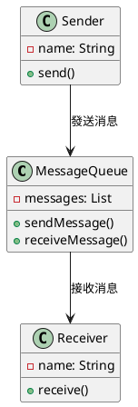
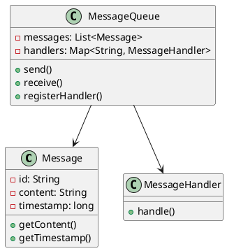
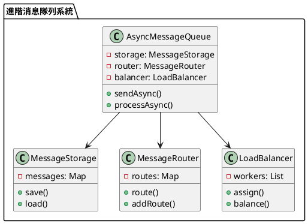

# 消息隊列教學

## 初級（Beginner）層級

### 1. 概念說明
消息隊列就像學校的傳話筒：
- 當你有話要告訴同學時，可以寫在紙條上
- 把紙條放進傳話筒裡
- 同學可以從傳話筒裡取出紙條來看

初級學習者需要了解：
- 什麼是消息隊列
- 為什麼需要消息隊列
- 基本的消息發送和接收概念

### 2. PlantUML 圖解


### 3. 分段教學步驟

#### 步驟 1：基本消息隊列
```java
public class SimpleMessageQueue {
    private List<String> messages;
    
    public SimpleMessageQueue() {
        messages = new ArrayList<>();
    }
    
    public void sendMessage(String message) {
        System.out.println("發送消息：" + message);
        messages.add(message);
    }
    
    public String receiveMessage() {
        if (!messages.isEmpty()) {
            String message = messages.remove(0);
            System.out.println("接收消息：" + message);
            return message;
        }
        return null;
    }
}
```

#### 步驟 2：簡單的消息發送和接收
```java
public class MessageSystem {
    private SimpleMessageQueue queue;
    
    public MessageSystem() {
        queue = new SimpleMessageQueue();
    }
    
    public void send(String message) {
        queue.sendMessage(message);
    }
    
    public void receive() {
        String message = queue.receiveMessage();
        if (message != null) {
            System.out.println("處理消息：" + message);
        }
    }
}
```

## 中級（Intermediate）層級

### 1. 概念說明
中級學習者需要理解：
- 消息隊列的實現方式
- 消息格式
- 消息處理
- 錯誤處理

### 2. PlantUML 圖解


### 3. 分段教學步驟

#### 步驟 1：消息格式
```java
public class Message {
    private String id;
    private String content;
    private long timestamp;
    
    public Message(String content) {
        this.id = UUID.randomUUID().toString();
        this.content = content;
        this.timestamp = System.currentTimeMillis();
    }
    
    public String getContent() {
        return content;
    }
    
    public long getTimestamp() {
        return timestamp;
    }
}
```

#### 步驟 2：消息處理
```java
public interface MessageHandler {
    void handle(Message message);
}

public class AdvancedMessageQueue {
    private List<Message> messages;
    private Map<String, MessageHandler> handlers;
    
    public AdvancedMessageQueue() {
        messages = new ArrayList<>();
        handlers = new HashMap<>();
    }
    
    public void send(Message message) {
        System.out.println("發送消息：" + message.getContent());
        messages.add(message);
    }
    
    public void registerHandler(String type, MessageHandler handler) {
        handlers.put(type, handler);
    }
    
    public void processMessages() {
        while (!messages.isEmpty()) {
            Message message = messages.remove(0);
            MessageHandler handler = handlers.get(message.getContent());
            if (handler != null) {
                handler.handle(message);
            }
        }
    }
}
```

## 高級（Advanced）層級

### 1. 概念說明
高級學習者需要掌握：
- 非同步消息處理
- 消息持久化
- 消息路由
- 負載平衡

### 2. PlantUML 圖解


### 3. 分段教學步驟

#### 步驟 1：非同步處理
```java
public class AsyncMessageQueue {
    private MessageStorage storage;
    private MessageRouter router;
    private LoadBalancer balancer;
    
    public AsyncMessageQueue(MessageStorage storage, MessageRouter router) {
        this.storage = storage;
        this.router = router;
        this.balancer = new LoadBalancer();
    }
    
    public CompletableFuture<Void> sendAsync(Message message) {
        return CompletableFuture.runAsync(() -> {
            // 保存消息
            storage.save(message);
            
            // 路由消息
            String route = router.route(message);
            
            // 分配處理
            balancer.assign(route, message);
        });
    }
    
    public CompletableFuture<Void> processAsync() {
        return CompletableFuture.runAsync(() -> {
            // 非同步處理消息
            while (true) {
                Message message = storage.load();
                if (message != null) {
                    processMessage(message);
                }
            }
        });
    }
}
```

#### 步驟 2：消息持久化
```java
public class MessageStorage {
    private Map<String, Message> messages;
    
    public MessageStorage() {
        messages = new HashMap<>();
    }
    
    public void save(Message message) {
        messages.put(message.getId(), message);
        System.out.println("保存消息：" + message.getContent());
    }
    
    public Message load() {
        if (!messages.isEmpty()) {
            String key = messages.keySet().iterator().next();
            return messages.remove(key);
        }
        return null;
    }
}
```

#### 步驟 3：負載平衡
```java
public class LoadBalancer {
    private List<Worker> workers;
    private int currentIndex;
    
    public LoadBalancer() {
        workers = new ArrayList<>();
        currentIndex = 0;
    }
    
    public void assign(String route, Message message) {
        Worker worker = getNextWorker();
        worker.process(route, message);
    }
    
    private Worker getNextWorker() {
        if (workers.isEmpty()) {
            throw new RuntimeException("沒有可用的處理器");
        }
        
        Worker worker = workers.get(currentIndex);
        currentIndex = (currentIndex + 1) % workers.size();
        return worker;
    }
    
    public void addWorker(Worker worker) {
        workers.add(worker);
    }
}

class Worker {
    public void process(String route, Message message) {
        System.out.println("處理消息：" + message.getContent() + " 路由：" + route);
    }
}
```

這個教學文件提供了從基礎到進階的消息隊列學習路徑，每個層級都包含了相應的概念說明、圖解、教學步驟和實作範例。初級學習者可以從基本的消息發送和接收開始，中級學習者可以學習消息格式和處理，而高級學習者則可以掌握非同步處理和負載平衡等進階功能。 