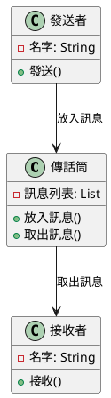
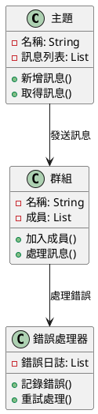
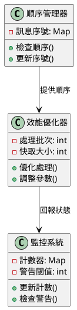

# 消息隊列教學

## 初級（Beginner）層級

### 1. 概念說明
消息隊列就像學校的傳話筒遊戲：
- 當你有話要告訴同學時，可以寫在紙條上
- 把紙條放進傳話筒裡
- 同學可以從傳話筒裡取出紙條來看

#### 為什麼需要消息隊列？
1. 簡單來說：
   - 當很多人同時要傳訊息時，不會混亂
   - 可以先把訊息存起來，等有空再處理
   - 如果系統出問題，訊息不會消失

2. 生活例子：
   - 就像學校的聯絡簿
   - 老師寫完後，學生可以慢慢看
   - 不會因為學生還沒看，就影響老師繼續寫

#### 可能遇到的問題
1. 簡單問題：
   - 訊息太多，來不及處理
   - 訊息可能重複收到
   - 系統太慢

2. 解決方法：
   - 設定訊息數量上限
   - 檢查是否重複
   - 定期清理舊訊息

### 2. PlantUML 圖解


### 3. 分段教學步驟

#### 步驟 1：建立簡單的訊息系統
```java
// 簡單的訊息類別
public class 訊息 {
    private String 內容;
    private String 發送者;
    
    public 訊息(String 內容, String 發送者) {
        this.內容 = 內容;
        this.發送者 = 發送者;
    }
    
    public String 取得內容() {
        return 內容;
    }
    
    public String 取得發送者() {
        return 發送者;
    }
}

// 簡單的訊息隊列
public class 訊息隊列 {
    private List<訊息> 訊息列表 = new ArrayList<>();
    
    public void 放入訊息(訊息 新訊息) {
        訊息列表.add(新訊息);
    }
    
    public 訊息 取出訊息() {
        if (訊息列表.isEmpty()) {
            return null;
        }
        return 訊息列表.remove(0);
    }
}
```

#### 步驟 2：使用訊息隊列
```java
public class 訊息系統 {
    private 訊息隊列 隊列 = new 訊息隊列();
    
    public void 發送訊息(String 內容, String 發送者) {
        訊息 新訊息 = new 訊息(內容, 發送者);
        隊列.放入訊息(新訊息);
        System.out.println("已發送訊息：" + 內容);
    }
    
    public void 接收訊息() {
        訊息 收到的訊息 = 隊列.取出訊息();
        if (收到的訊息 != null) {
            System.out.println("收到來自 " + 收到的訊息.取得發送者() + 
                " 的訊息：" + 收到的訊息.取得內容());
        }
    }
}
```

## 中級（Intermediate）層級

### 1. 概念說明
中級學習者需要理解：
- 訊息如何分類和組織
- 如何處理多個接收者
- 如何處理錯誤情況

#### 訊息分類
1. 主題（Topic）：
   - 就像學校的不同社團
   - 每個社團有自己的公告欄
   - 學生可以選擇要關注哪些社團

2. 群組（Group）：
   - 就像班級分組
   - 每組可以一起處理訊息
   - 避免重複處理

#### 錯誤處理
1. 常見錯誤：
   - 訊息發送失敗
   - 接收者離線
   - 系統當機

2. 解決方法：
   - 重試發送
   - 儲存備份
   - 錯誤通知

### 2. PlantUML 圖解


### 3. 分段教學步驟

#### 步驟 1：主題和群組
```java
public class 主題 {
    private String 名稱;
    private List<訊息> 訊息列表 = new ArrayList<>();
    
    public 主題(String 名稱) {
        this.名稱 = 名稱;
    }
    
    public void 新增訊息(訊息 新訊息) {
        訊息列表.add(新訊息);
    }
    
    public 訊息 取得訊息() {
        if (訊息列表.isEmpty()) {
            return null;
        }
        return 訊息列表.remove(0);
    }
}

public class 群組 {
    private String 名稱;
    private List<接收者> 成員 = new ArrayList<>();
    
    public 群組(String 名稱) {
        this.名稱 = 名稱;
    }
    
    public void 加入成員(接收者 新成員) {
        成員.add(新成員);
    }
    
    public void 處理訊息(主題 主題) {
        訊息 訊息 = 主題.取得訊息();
        if (訊息 != null) {
            for (接收者 成員 : 成員) {
                成員.接收(訊息);
            }
        }
    }
}
```

#### 步驟 2：錯誤處理
```java
public class 錯誤處理器 {
    private List<String> 錯誤日誌 = new ArrayList<>();
    
    public void 記錄錯誤(String 錯誤訊息) {
        錯誤日誌.add(錯誤訊息);
        System.out.println("記錄錯誤：" + 錯誤訊息);
    }
    
    public void 重試處理(訊息 訊息, int 重試次數) {
        for (int i = 0; i < 重試次數; i++) {
            try {
                // 嘗試處理訊息
                System.out.println("重試處理訊息：" + 訊息.取得內容());
                break;
            } catch (Exception e) {
                記錄錯誤("處理失敗：" + e.getMessage());
            }
        }
    }
}
```

## 高級（Advanced）層級

### 1. 概念說明
高級學習者需要掌握：
- 如何確保訊息順序
- 如何處理大量訊息
- 如何監控系統狀態

#### 訊息順序
1. 重要性：
   - 確保訊息按正確順序處理
   - 避免混亂和錯誤
   - 維持系統一致性

2. 實現方法：
   - 使用序號標記
   - 按順序處理
   - 等待前序訊息

#### 效能優化
1. 處理大量訊息：
   - 分批處理
   - 平行處理
   - 快取機制

2. 監控系統：
   - 追蹤訊息數量
   - 監控處理速度
   - 設定警告機制

### 2. PlantUML 圖解


### 3. 分段教學步驟

#### 步驟 1：順序管理
```java
public class 順序管理器 {
    private Map<String, Long> 訊息序號 = new HashMap<>();
    
    public boolean 檢查順序(String 主題, long 序號) {
        Long 最後序號 = 訊息序號.getOrDefault(主題, 0L);
        if (序號 <= 最後序號) {
            return false; // 序號不正確
        }
        訊息序號.put(主題, 序號);
        return true;
    }
    
    public void 更新序號(String 主題, long 序號) {
        訊息序號.put(主題, 序號);
    }
}

public class 有序訊息 extends 訊息 {
    private long 序號;
    
    public 有序訊息(String 內容, String 發送者, long 序號) {
        super(內容, 發送者);
        this.序號 = 序號;
    }
    
    public long 取得序號() {
        return 序號;
    }
}
```

#### 步驟 2：效能優化
```java
public class 效能優化器 {
    private int 處理批次 = 100;
    private int 快取大小 = 1000;
    
    public void 優化處理(List<訊息> 訊息列表) {
        // 分批處理
        for (int i = 0; i < 訊息列表.size(); i += 處理批次) {
            List<訊息> 批次 = 訊息列表.subList(i, 
                Math.min(i + 處理批次, 訊息列表.size()));
            處理批次(批次);
        }
    }
    
    private void 處理批次(List<訊息> 批次) {
        // 平行處理批次中的訊息
        批次.parallelStream().forEach(訊息 -> {
            System.out.println("處理訊息：" + 訊息.取得內容());
        });
    }
}
```

#### 步驟 3：監控系統
```java
public class 監控系統 {
    private Map<String, Integer> 計數器 = new HashMap<>();
    private int 警告閾值 = 1000;
    
    public void 更新計數(String 指標, int 數量) {
        int 當前數量 = 計數器.getOrDefault(指標, 0) + 數量;
        計數器.put(指標, 當前數量);
        
        if (當前數量 > 警告閾值) {
            發出警告(指標, 當前數量);
        }
    }
    
    private void 發出警告(String 指標, int 數量) {
        System.out.println("警告！" + 指標 + " 數量超過閾值：" + 數量);
    }
}
``` 