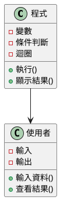
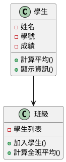
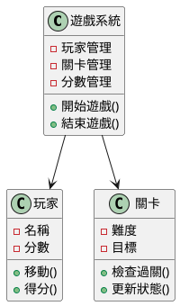

# 程式設計入門教學

## 初級（Beginner）層級

### 1. 概念說明
程式設計就像寫食譜：
- 每個步驟都要清楚
- 要按照順序執行
- 要考慮各種情況
- 要能重複使用

初級學習者需要了解：
- 什麼是程式
- 為什麼要寫程式
- 基本的程式結構

### 2. PlantUML 圖解


### 3. 分段教學步驟

#### 步驟 1：基本程式結構
```java
// 簡單的計算機程式
public class 計算機 {
    public static void main(String[] args) {
        // 宣告變數
        int 數字1 = 10;
        int 數字2 = 5;
        
        // 計算
        int 結果 = 數字1 + 數字2;
        
        // 顯示結果
        System.out.println("答案是：" + 結果);
    }
}
```

#### 步驟 2：條件判斷
```java
// 判斷成績等級
public class 成績判斷 {
    public static void main(String[] args) {
        int 分數 = 85;
        
        if (分數 >= 90) {
            System.out.println("A");
        } else if (分數 >= 80) {
            System.out.println("B");
        } else if (分數 >= 70) {
            System.out.println("C");
        } else {
            System.out.println("D");
        }
    }
}
```

## 中級（Intermediate）層級

### 1. 概念說明
中級學習者需要理解：
- 如何把程式分成小部分
- 如何重複使用程式碼
- 如何組織資料
- 如何讓程式更容易維護

### 2. PlantUML 圖解


### 3. 分段教學步驟

#### 步驟 1：使用函式
```java
// 計算成績的程式
public class 成績計算 {
    // 計算平均分數的函式
    public static double 計算平均(int[] 分數) {
        int 總分 = 0;
        for (int 分 : 分數) {
            總分 += 分;
        }
        return (double)總分 / 分數.length;
    }
    
    public static void main(String[] args) {
        int[] 分數 = {85, 90, 75, 88, 92};
        double 平均 = 計算平均(分數);
        System.out.println("平均分數是：" + 平均);
    }
}
```

#### 步驟 2：使用類別
```java
// 學生類別
public class 學生 {
    private String 姓名;
    private int 學號;
    private int[] 成績;
    
    public 學生(String 姓名, int 學號) {
        this.姓名 = 姓名;
        this.學號 = 學號;
        this.成績 = new int[3];
    }
    
    public void 設定成績(int 科目, int 分數) {
        成績[科目] = 分數;
    }
    
    public double 計算平均() {
        int 總分 = 0;
        for (int 分 : 成績) {
            總分 += 分;
        }
        return (double)總分 / 成績.length;
    }
}
```

## 高級（Advanced）層級

### 1. 概念說明
高級學習者需要掌握：
- 如何設計完整的系統
- 如何讓不同部分互相配合
- 如何處理多個任務
- 如何讓系統容易擴充

### 2. PlantUML 圖解


### 3. 分段教學步驟

#### 步驟 1：設計遊戲系統
```java
// 簡單的遊戲系統
public class 遊戲系統 {
    private 玩家 當前玩家;
    private 關卡 當前關卡;
    private 分數系統 分數系統;
    
    public void 開始遊戲(String 玩家名稱) {
        當前玩家 = new 玩家(玩家名稱);
        當前關卡 = new 關卡(1);
        分數系統 = new 分數系統();
    }
    
    public void 更新遊戲() {
        // 更新玩家狀態
        當前玩家.移動();
        
        // 檢查是否過關
        if (當前關卡.檢查過關()) {
            分數系統.增加分數(100);
            當前關卡 = new 關卡(當前關卡.取得難度() + 1);
        }
    }
}

class 玩家 {
    private String 名稱;
    private int 位置;
    
    public void 移動() {
        // 處理玩家移動
    }
}

class 關卡 {
    private int 難度;
    private int 目標;
    
    public boolean 檢查過關() {
        // 檢查是否達成目標
        return true;
    }
}
```

### 4. 常見問題與解決方案

#### 問題表象
1. 程式碼混亂：
   - 不知道從哪裡開始
   - 程式碼重複
   - 修改困難

2. 錯誤處理：
   - 程式當機
   - 結果不正確
   - 使用者輸入錯誤

3. 效能問題：
   - 程式跑太慢
   - 記憶體不足
   - 反應遲鈍

#### 避免方法
1. 程式碼整理：
   - 使用有意義的變數名稱
   - 把程式分成小部分
   - 寫註解說明

2. 錯誤處理：
   - 檢查使用者輸入
   - 使用 try-catch
   - 提供錯誤訊息

3. 效能優化：
   - 避免重複計算
   - 使用適當的資料結構
   - 減少不必要的操作

#### 處理方案
1. 程式碼重構：
```java
public class 程式優化 {
    // 原本的程式
    public void 舊方法() {
        // 很多重複的程式碼
    }
    
    // 優化後的程式
    public void 新方法() {
        // 把重複的程式碼變成函式
        共用函式();
    }
    
    private void 共用函式() {
        // 共用的程式碼
    }
}
```

2. 錯誤處理：
```java
public class 錯誤處理 {
    public void 處理輸入() {
        try {
            // 嘗試執行程式
            int 輸入 = 讀取使用者輸入();
            檢查輸入是否正確(輸入);
        } catch (Exception e) {
            // 處理錯誤
            System.out.println("發生錯誤：" + e.getMessage());
        }
    }
}
```

3. 效能優化：
```java
public class 效能優化 {
    // 優化前
    public void 慢方法() {
        for (int i = 0; i < 1000; i++) {
            // 重複計算
        }
    }
    
    // 優化後
    public void 快方法() {
        // 先計算好
        int 結果 = 計算一次();
        // 重複使用結果
        for (int i = 0; i < 1000; i++) {
            使用結果(結果);
        }
    }
}
``` 