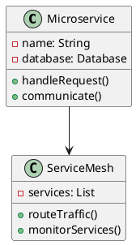
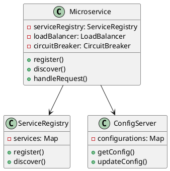
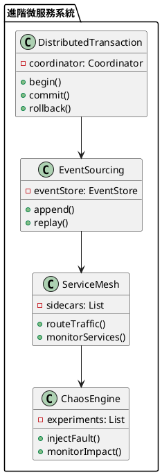

# 微服務架構教學

## 初級（Beginner）層級

### 1. 概念說明
微服務架構就像一個大型商場：
- 每個商店（微服務）都是獨立的
- 商店之間可以互相合作
- 每個商店都有自己的管理方式
- 商場提供基礎設施（服務網格）

初級學習者需要了解：
- 什麼是微服務
- 為什麼需要微服務
- 基本的服務拆分原則

### 2. PlantUML 圖解


### 3. 分段教學步驟

#### 步驟 1：基本微服務實現
```java
// 用戶服務
@RestController
public class UserService {
    private UserRepository userRepository;
    
    @PostMapping("/users")
    public User createUser(@RequestBody User user) {
        return userRepository.save(user);
    }
    
    @GetMapping("/users/{id}")
    public User getUser(@PathVariable Long id) {
        return userRepository.findById(id)
            .orElseThrow(() -> new UserNotFoundException(id));
    }
}

// 訂單服務
@RestController
public class OrderService {
    private OrderRepository orderRepository;
    private UserServiceClient userService;
    
    @PostMapping("/orders")
    public Order createOrder(@RequestBody Order order) {
        // 驗證用戶
        User user = userService.getUser(order.getUserId());
        if (user == null) {
            throw new UserNotFoundException(order.getUserId());
        }
        
        return orderRepository.save(order);
    }
}
```

## 中級（Intermediate）層級

### 1. 概念說明
中級學習者需要理解：
- 服務註冊與發現
- 負載均衡
- 熔斷機制
- 配置管理

### 2. PlantUML 圖解


### 3. 分段教學步驟

#### 步驟 1：服務註冊與發現
```java
@Configuration
public class ServiceDiscoveryConfig {
    @Bean
    public ServiceRegistry serviceRegistry() {
        return new ServiceRegistry();
    }
    
    @Bean
    public ServiceDiscovery serviceDiscovery(ServiceRegistry registry) {
        return new ServiceDiscovery(registry);
    }
}

@Service
public class ServiceDiscovery {
    private ServiceRegistry registry;
    private LoadBalancer loadBalancer;
    
    public ServiceInstance discoverService(String serviceName) {
        List<ServiceInstance> instances = registry.getInstances(serviceName);
        return loadBalancer.selectInstance(instances);
    }
}
```

#### 步驟 2：配置管理
```java
@Configuration
@EnableConfigServer
public class ConfigServer {
    private Map<String, Object> configurations;
    
    @GetMapping("/{service}/{profile}")
    public Map<String, Object> getConfig(
        @PathVariable String service,
        @PathVariable String profile) {
        return configurations.get(service + "-" + profile);
    }
    
    @PostMapping("/{service}/{profile}")
    public void updateConfig(
        @PathVariable String service,
        @PathVariable String profile,
        @RequestBody Map<String, Object> config) {
        configurations.put(service + "-" + profile, config);
        notifyServices(service, profile);
    }
}
```

## 高級（Advanced）層級

### 1. 概念說明
高級學習者需要掌握：
- 分散式事務
- 事件溯源
- 服務網格
- 混沌工程

### 2. PlantUML 圖解


### 3. 分段教學步驟

#### 步驟 1：分散式事務實現
```java
@Service
public class DistributedTransactionService {
    private TransactionCoordinator coordinator;
    
    @Transactional
    public void executeDistributedTransaction(TransactionContext context) {
        try {
            // 開始事務
            coordinator.begin(context);
            
            // 執行參與者操作
            for (TransactionParticipant participant : context.getParticipants()) {
                participant.prepare();
            }
            
            // 提交事務
            coordinator.commit(context);
        } catch (Exception e) {
            // 回滾事務
            coordinator.rollback(context);
            throw e;
        }
    }
}

class TransactionParticipant {
    public void prepare() {
        // 準備階段
    }
    
    public void commit() {
        // 提交階段
    }
    
    public void rollback() {
        // 回滾階段
    }
}
```

#### 步驟 2：事件溯源實現
```java
@Service
public class EventSourcingService {
    private EventStore eventStore;
    
    public void appendEvent(String aggregateId, Event event) {
        eventStore.append(aggregateId, event);
        notifySubscribers(aggregateId, event);
    }
    
    public Aggregate replayEvents(String aggregateId) {
        List<Event> events = eventStore.getEvents(aggregateId);
        return events.stream()
            .reduce(new Aggregate(aggregateId),
                (agg, event) -> agg.apply(event),
                (agg1, agg2) -> agg1);
    }
}

class EventStore {
    private Map<String, List<Event>> events;
    
    public void append(String aggregateId, Event event) {
        events.computeIfAbsent(aggregateId, k -> new ArrayList<>())
            .add(event);
    }
    
    public List<Event> getEvents(String aggregateId) {
        return events.getOrDefault(aggregateId, new ArrayList<>());
    }
}
```

### 4. 常見問題與解決方案

#### 問題表象
1. 服務拆分問題：
   - 服務邊界不清
   - 數據一致性難保證
   - 服務間依賴複雜

2. 通信問題：
   - 網絡延遲
   - 服務不可用
   - 消息丟失

3. 部署問題：
   - 版本管理困難
   - 配置複雜
   - 監控困難

4. 數據問題：
   - 數據一致性
   - 事務處理
   - 數據遷移

#### 避免方法
1. 服務拆分優化：
   - 遵循單一職責
   - 定義清晰邊界
   - 控制服務粒度

2. 通信問題防護：
   - 使用熔斷器
   - 實現重試機制
   - 設置超時控制

3. 部署問題解決：
   - 使用容器化
   - 實現CI/CD
   - 集中配置管理

4. 數據問題處理：
   - 使用事件溯源
   - 實現最終一致性
   - 規劃數據遷移

#### 處理方案
1. 技術方案：
   ```java
   public class MicroservicesManager {
       private ServiceRegistry registry;
       private ConfigServer configServer;
       private EventStore eventStore;
       private ChaosEngine chaosEngine;
       
       public void handleMicroservicesIssue(MicroservicesIssue issue) {
           switch (issue.getType()) {
               case SERVICE_SPLIT:
                   handleServiceSplitIssue(issue);
                   break;
               case COMMUNICATION:
                   handleCommunicationIssue(issue);
                   break;
               case DEPLOYMENT:
                   handleDeploymentIssue(issue);
                   break;
               case DATA:
                   handleDataIssue(issue);
                   break;
           }
       }
       
       private void handleServiceSplitIssue(MicroservicesIssue issue) {
           // 分析服務邊界
           analyzeServiceBoundaries();
           // 重構服務
           refactorServices();
           // 更新依賴關係
           updateDependencies();
       }
       
       private void handleCommunicationIssue(MicroservicesIssue issue) {
           // 檢查通信狀態
           checkCommunicationStatus();
           // 調整通信策略
           adjustCommunicationStrategy();
           // 實現熔斷機制
           implementCircuitBreaker();
       }
       
       private void handleDeploymentIssue(MicroservicesIssue issue) {
           // 檢查部署配置
           checkDeploymentConfig();
           // 更新版本
           updateVersions();
           // 執行部署
           executeDeployment();
       }
       
       private void handleDataIssue(MicroservicesIssue issue) {
           // 檢查數據一致性
           checkDataConsistency();
           // 執行數據遷移
           migrateData();
           // 更新數據模型
           updateDataModel();
       }
   }
   ```

2. 監控方案：
   ```java
   public class MicroservicesMonitor {
       private MetricsCollector metricsCollector;
       private AlertManager alertManager;
       
       public void monitorMicroservices() {
           MicroservicesMetrics metrics = metricsCollector.collectMetrics();
           
           // 檢查服務健康狀態
           if (metrics.getServiceHealth() < HEALTH_THRESHOLD) {
               alertManager.alert("服務健康警告", metrics.getDetails());
           }
           
           // 檢查響應時間
           if (metrics.getResponseTime() > RESPONSE_TIME_THRESHOLD) {
               alertManager.alert("響應時間警告", metrics.getDetails());
           }
           
           // 檢查錯誤率
           if (metrics.getErrorRate() > ERROR_RATE_THRESHOLD) {
               alertManager.alert("錯誤率警告", metrics.getDetails());
           }
       }
   }
   ```

3. 最佳實踐：
   - 合理拆分服務
   - 實現服務發現
   - 使用熔斷機制
   - 集中配置管理
   - 實現事件溯源
   - 使用服務網格
   - 進行混沌測試
   - 監控系統健康

### 5. 實戰案例

#### 案例一：電商系統微服務
```java
public class ECommerceMicroservices {
    private UserService userService;
    private OrderService orderService;
    private PaymentService paymentService;
    private InventoryService inventoryService;
    
    public void processOrder(OrderRequest request) {
        // 開始分散式事務
        TransactionContext context = new TransactionContext();
        
        try {
            // 創建訂單
            Order order = orderService.createOrder(request);
            
            // 扣減庫存
            inventoryService.decreaseStock(order.getItems());
            
            // 處理支付
            paymentService.processPayment(order);
            
            // 更新用戶積分
            userService.updatePoints(order.getUserId(), order.getAmount());
            
            // 提交事務
            context.commit();
        } catch (Exception e) {
            // 回滾事務
            context.rollback();
            throw e;
        }
    }
}
```

#### 案例二：社交媒體微服務
```java
public class SocialMediaMicroservices {
    private UserService userService;
    private PostService postService;
    private CommentService commentService;
    private NotificationService notificationService;
    
    public void createPost(PostRequest request) {
        // 開始事件溯源
        Event event = new PostCreatedEvent(request);
        
        try {
            // 創建帖子
            Post post = postService.createPost(request);
            
            // 更新用戶統計
            userService.updatePostCount(request.getUserId());
            
            // 發送通知
            notificationService.sendPostNotification(post);
            
            // 記錄事件
            eventStore.append(request.getUserId(), event);
        } catch (Exception e) {
            // 處理錯誤
            handleError(e);
        }
    }
} 