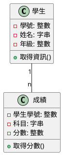
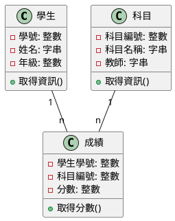
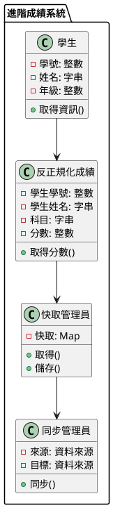

# 資料整理術：正規化與反正規化

## 初級（Beginner）層級

### 1. 概念說明
正規化與反正規化就像是在整理你的書包：
- 正規化：把不同科目的書本分開整理，就像把數學、國文、英文的書本分開放
- 反正規化：把常用的東西放在一起，方便快速拿取，就像把鉛筆盒和筆記本放在同一個夾層

初級學習者需要了解：
- 什麼是正規化（把資料分開整理）
- 什麼是反正規化（把相關資料放在一起）
- 基本的資料整理概念

### 2. 使用原因
為什麼要學習正規化與反正規化？
1. 讓資料更整齊：
   - 減少重複的資料
   - 避免資料混亂
   - 確保資料正確

2. 查詢更快：
   - 找資料更快速
   - 減少重複動作
   - 提高系統速度

3. 更好維護：
   - 更新資料更容易
   - 管理更簡單
   - 系統更容易擴充

### 3. 問題表象
常見的問題包括：
1. 資料問題：
   - 資料重複
   - 更新時容易出錯
   - 新增資料困難
   - 刪除資料麻煩

2. 速度問題：
   - 查詢很慢
   - 系統反應慢
   - 電腦資源消耗大

3. 維護問題：
   - 更新困難
   - 管理麻煩
   - 系統難以擴充

### 4. 避免方法
如何避免這些問題：
1. 設計時：
   - 好好規劃資料結構
   - 適當使用正規化
   - 適時使用反正規化

2. 實作時：
   - 使用索引加速
   - 使用快取機制
   - 優化查詢方式

3. 維護時：
   - 定期整理資料
   - 監控系統速度
   - 適時調整結構

### 5. 問題處理
遇到問題怎麼辦：
1. 資料問題：
   - 檢查資料是否正確
   - 修復錯誤資料
   - 重建索引

2. 速度問題：
   - 優化查詢方式
   - 調整資料結構
   - 增加快取

3. 維護問題：
   - 重新整理資料模型
   - 優化管理流程
   - 改進監控方式

### 6. PlantUML 圖解


### 7. 分段教學步驟

#### 步驟 1：基本資料結構
```java
public class 學生 {
    private int 學號;
    private String 姓名;
    private int 年級;
    
    public 學生(int 學號, String 姓名, int 年級) {
        this.學號 = 學號;
        this.姓名 = 姓名;
        this.年級 = 年級;
    }
    
    public String 取得資訊() {
        return "學號：" + 學號 + " 姓名：" + 姓名 + " 年級：" + 年級;
    }
}

public class 成績 {
    private int 學生學號;
    private String 科目;
    private int 分數;
    
    public 成績(int 學生學號, String 科目, int 分數) {
        this.學生學號 = 學生學號;
        this.科目 = 科目;
        this.分數 = 分數;
    }
    
    public String 取得分數() {
        return "科目：" + 科目 + " 分數：" + 分數;
    }
}
```

#### 步驟 2：資料查詢
```java
public class 成績系統 {
    private List<學生> 學生們;
    private List<成績> 成績們;
    
    public 成績系統() {
        學生們 = new ArrayList<>();
        成績們 = new ArrayList<>();
    }
    
    public void 新增學生(學生 學生) {
        學生們.add(學生);
    }
    
    public void 新增成績(成績 成績) {
        成績們.add(成績);
    }
    
    public void 顯示學生成績(int 學生學號) {
        學生 學生 = 尋找學生(學生學號);
        if (學生 != null) {
            System.out.println(學生.取得資訊());
            for (成績 成績 : 成績們) {
                if (成績.學生學號 == 學生學號) {
                    System.out.println(成績.取得分數());
                }
            }
        }
    }
}
```

## 中級（Intermediate）層級

### 1. 概念說明
中級學習者需要理解：
- 正規化的具體做法
- 資料之間的關聯
- 如何優化查詢
- 如何保持資料一致

### 2. PlantUML 圖解


### 3. 分段教學步驟

#### 步驟 1：正規化設計
```java
public class 科目 {
    private int 科目編號;
    private String 科目名稱;
    private String 教師;
    
    public 科目(int 科目編號, String 科目名稱, String 教師) {
        this.科目編號 = 科目編號;
        this.科目名稱 = 科目名稱;
        this.教師 = 教師;
    }
    
    public String 取得資訊() {
        return "科目：" + 科目名稱 + " 教師：" + 教師;
    }
}

public class 正規化成績 {
    private int 學生學號;
    private int 科目編號;
    private int 分數;
    
    public 正規化成績(int 學生學號, int 科目編號, int 分數) {
        this.學生學號 = 學生學號;
        this.科目編號 = 科目編號;
        this.分數 = 分數;
    }
    
    public String 取得分數(科目 科目) {
        return 科目.取得資訊() + " 分數：" + 分數;
    }
}
```

#### 步驟 2：資料關聯
```java
public class 成績管理員 {
    private Map<Integer, 學生> 學生們;
    private Map<Integer, 科目> 科目們;
    private List<正規化成績> 成績們;
    
    public 成績管理員() {
        學生們 = new HashMap<>();
        科目們 = new HashMap<>();
        成績們 = new ArrayList<>();
    }
    
    public void 新增學生(學生 學生) {
        學生們.put(學生.取得學號(), 學生);
    }
    
    public void 新增科目(科目 科目) {
        科目們.put(科目.取得科目編號(), 科目);
    }
    
    public void 新增成績(正規化成績 成績) {
        成績們.add(成績);
    }
    
    public void 顯示學生報告(int 學生學號) {
        學生 學生 = 學生們.get(學生學號);
        if (學生 != null) {
            System.out.println(學生.取得資訊());
            for (正規化成績 成績 : 成績們) {
                if (成績.學生學號 == 學生學號) {
                    科目 科目 = 科目們.get(成績.科目編號);
                    System.out.println(成績.取得分數(科目));
                }
            }
        }
    }
}
```

## 高級（Advanced）層級

### 1. 概念說明
高級學習者需要掌握：
- 反正規化的進階應用
- 查詢效能優化
- 資料同步
- 快取機制

### 2. PlantUML 圖解


### 3. 分段教學步驟

#### 步驟 1：反正規化設計
```java
public class 反正規化成績 {
    private int 學生學號;
    private String 學生姓名;
    private String 科目;
    private int 分數;
    
    public 反正規化成績(int 學生學號, String 學生姓名, String 科目, int 分數) {
        this.學生學號 = 學生學號;
        this.學生姓名 = 學生姓名;
        this.科目 = 科目;
        this.分數 = 分數;
    }
    
    public String 取得分數() {
        return "學生：" + 學生姓名 + " 科目：" + 科目 + " 分數：" + 分數;
    }
}
```

#### 步驟 2：快取管理
```java
public class 快取管理員 {
    private Map<String, 反正規化成績> 快取;
    
    public 快取管理員() {
        快取 = new HashMap<>();
    }
    
    public 反正規化成績 取得成績(String 索引) {
        return 快取.get(索引);
    }
    
    public void 儲存成績(String 索引, 反正規化成績 成績) {
        快取.put(索引, 成績);
    }
    
    public void 清除快取() {
        快取.clear();
    }
}
```

#### 步驟 3：資料同步
```java
public class 同步管理員 {
    private 資料來源 來源;
    private 資料來源 目標;
    private 快取管理員 快取;
    
    public 同步管理員(資料來源 來源, 資料來源 目標) {
        this.來源 = 來源;
        this.目標 = 目標;
        this.快取 = new 快取管理員();
    }
    
    public void 同步資料() {
        // 從正規化資料來源讀取
        List<正規化成績> 正規化成績們 = 來源.取得成績們();
        
        // 轉換為反正規化格式
        for (正規化成績 成績 : 正規化成績們) {
            反正規化成績 反正規化 = 轉換為反正規化(成績);
            
            // 更新快取
            快取.儲存成績(產生索引(反正規化), 反正規化);
            
            // 同步到目標資料來源
            目標.更新成績(反正規化);
        }
    }
    
    private 反正規化成績 轉換為反正規化(正規化成績 成績) {
        // 轉換邏輯
        return new 反正規化成績(
            成績.取得學生學號(),
            來源.取得學生姓名(成績.取得學生學號()),
            來源.取得科目名稱(成績.取得科目編號()),
            成績.取得分數()
        );
    }
}
```

### 4. 實戰案例

#### 案例一：圖書館借閱系統
```java
// 正規化設計
public class 借閱記錄 {
    private String 借閱編號;
    private String 學生學號;
    private Date 借閱日期;
    private List<借閱項目> 項目們;
    
    // 反正規化設計
    private String 學生姓名;
    private String 學生班級;
    private int 借閱總數;
}

// 使用 JPA 實現
@Entity
@Table(name = "借閱記錄")
public class 借閱記錄 {
    @Id
    private String 借閱編號;
    
    @ManyToOne
    @JoinColumn(name = "學生學號")
    private 學生 學生;
    
    @OneToMany(mappedBy = "借閱記錄")
    private List<借閱項目> 項目們;
    
    // 反正規化字段
    @Column(name = "學生姓名")
    private String 學生姓名;
    
    @Column(name = "借閱總數")
    private int 借閱總數;
}
```

#### 案例二：班級點名系統
```java
// 正規化設計
public class 點名記錄 {
    private String 記錄編號;
    private String 學生學號;
    private String 日期;
    private List<出席記錄> 記錄們;
    
    // 反正規化設計
    private String 學生姓名;
    private String 學生照片;
    private int 出席次數;
}

// 使用 MongoDB 實現
@Document(collection = "點名記錄")
public class 點名記錄 {
    @Id
    private String 記錄編號;
    
    private String 學生學號;
    private String 日期;
    
    // 反正規化字段
    private String 學生姓名;
    private String 學生照片;
    private int 出席次數;
    
    @DBRef
    private List<出席記錄> 記錄們;
}
```

### 5. 最佳實踐

#### 1. 使用現有工具
```java
// 使用 Hibernate 實現正規化
@Entity
@Table(name = "學生")
public class 學生 {
    @Id
    @GeneratedValue(strategy = GenerationType.IDENTITY)
    private Long 學號;
    
    private String 姓名;
    private int 年級;
    
    @OneToMany(mappedBy = "學生")
    private List<成績> 成績們;
}

// 使用 Redis 實現反正規化
public class 學生快取 {
    private final RedisTemplate<String, Object> redisTemplate;
    
    public void 快取學生(學生 學生) {
        String 索引 = "學生:" + 學生.取得學號();
        redisTemplate.opsForValue().set(索引, 學生);
    }
    
    public 學生 取得快取學生(Long 學號) {
        String 索引 = "學生:" + 學號;
        return (學生) redisTemplate.opsForValue().get(索引);
    }
}
```

#### 2. 監控與優化
```java
public class 資料庫監控員 {
    private 指標收集器 收集器;
    private 警告管理員 警告管理員;
    
    public void 監控() {
        資料庫指標 指標 = 收集器.收集指標();
        
        // 檢查資料完整性
        if (!指標.資料是否一致()) {
            警告管理員.警告("資料警告", 指標.取得詳細資訊());
        }
        
        // 檢查查詢效能
        if (指標.取得查詢效能() < 0.8) {
            警告管理員.警告("效能警告", 指標.取得詳細資訊());
        }
        
        // 檢查快取命中率
        if (指標.取得快取命中率() < 0.7) {
            警告管理員.警告("快取警告", 指標.取得詳細資訊());
        }
    }
}
```

#### 3. 錯誤處理與恢復
```java
public class 資料恢復 {
    private 資料驗證器 驗證器;
    private 資料修復器 修復器;
    
    public void 恢復() {
        // 檢查資料狀態
        檢查資料狀態();
        
        // 修復資料錯誤
        修復資料問題();
        
        // 重建索引
        重建索引();
    }
    
    private void 檢查資料狀態() {
        // 實現資料狀態檢查邏輯
    }
    
    private void 修復資料問題() {
        // 實現資料修復邏輯
    }
    
    private void 重建索引() {
        // 實現索引重建邏輯
    }
}
```

這個教學文件提供了從基礎到進階的正規化-反正規化學習路徑，每個層級都包含了相應的概念說明、圖解、教學步驟和實作範例。初級學習者可以從基本的資料結構開始，中級學習者可以學習正規化設計和資料關聯，而高級學習者則可以掌握反正規化設計和資料同步等進階功能。 