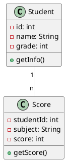
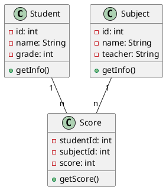
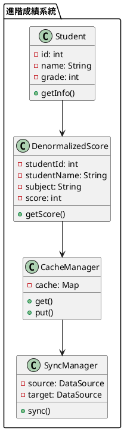

# 正規化-反正規化教學

## 初級（Beginner）層級

### 1. 概念說明
正規化-反正規化就像是在整理學校的成績單：
- 正規化：把重複的資料分開存放，就像把每個學生的成績分開記錄
- 反正規化：把相關的資料放在一起，方便快速查詢，就像把一個學生的所有科目成績放在同一張成績單上

初級學習者需要了解：
- 什麼是正規化
- 什麼是反正規化
- 基本的資料組織概念

### 2. 使用原因
正規化-反正規化的主要使用原因包括：
1. 數據完整性：
   - 減少數據冗餘
   - 避免數據不一致
   - 確保數據準確性

2. 查詢效能：
   - 優化查詢速度
   - 減少連接操作
   - 提高系統響應

3. 系統維護：
   - 簡化數據更新
   - 降低維護成本
   - 提高系統可擴展性

### 3. 問題表象
常見的問題表象包括：
1. 數據問題：
   - 數據冗餘
   - 更新異常
   - 插入異常
   - 刪除異常

2. 效能問題：
   - 查詢緩慢
   - 連接開銷大
   - 資源消耗高

3. 維護問題：
   - 更新困難
   - 維護成本高
   - 擴展性差

### 4. 避免方法
避免問題的方法包括：
1. 設計階段：
   - 合理規劃數據結構
   - 適當使用正規化
   - 適時採用反正規化

2. 實現階段：
   - 使用索引優化
   - 實現緩存機制
   - 優化查詢語句

3. 維護階段：
   - 定期數據清理
   - 監控系統效能
   - 及時調整結構

### 5. 問題處理
遇到問題時的處理方法：
1. 數據問題處理：
   - 檢查數據完整性
   - 修復異常數據
   - 重建索引結構

2. 效能問題處理：
   - 優化查詢語句
   - 調整數據結構
   - 增加緩存機制

3. 維護問題處理：
   - 重構數據模型
   - 優化維護流程
   - 改進監控機制

### 6. PlantUML 圖解


### 7. 分段教學步驟

#### 步驟 1：基本資料結構
```java
public class Student {
    private int id;
    private String name;
    private int grade;
    
    public Student(int id, String name, int grade) {
        this.id = id;
        this.name = name;
        this.grade = grade;
    }
    
    public String getInfo() {
        return "學號：" + id + " 姓名：" + name + " 年級：" + grade;
    }
}

public class Score {
    private int studentId;
    private String subject;
    private int score;
    
    public Score(int studentId, String subject, int score) {
        this.studentId = studentId;
        this.subject = subject;
        this.score = score;
    }
    
    public String getScore() {
        return "科目：" + subject + " 分數：" + score;
    }
}
```

#### 步驟 2：資料查詢
```java
public class GradeSystem {
    private List<Student> students;
    private List<Score> scores;
    
    public GradeSystem() {
        students = new ArrayList<>();
        scores = new ArrayList<>();
    }
    
    public void addStudent(Student student) {
        students.add(student);
    }
    
    public void addScore(Score score) {
        scores.add(score);
    }
    
    public void printStudentScores(int studentId) {
        Student student = findStudent(studentId);
        if (student != null) {
            System.out.println(student.getInfo());
            for (Score score : scores) {
                if (score.getStudentId() == studentId) {
                    System.out.println(score.getScore());
                }
            }
        }
    }
}
```

## 中級（Intermediate）層級

### 1. 概念說明
中級學習者需要理解：
- 正規化的實現方式
- 資料關聯
- 查詢優化
- 資料一致性

### 2. PlantUML 圖解


### 3. 分段教學步驟

#### 步驟 1：正規化設計
```java
public class Subject {
    private int id;
    private String name;
    private String teacher;
    
    public Subject(int id, String name, String teacher) {
        this.id = id;
        this.name = name;
        this.teacher = teacher;
    }
    
    public String getInfo() {
        return "科目：" + name + " 教師：" + teacher;
    }
}

public class NormalizedScore {
    private int studentId;
    private int subjectId;
    private int score;
    
    public NormalizedScore(int studentId, int subjectId, int score) {
        this.studentId = studentId;
        this.subjectId = subjectId;
        this.score = score;
    }
    
    public String getScore(Subject subject) {
        return subject.getInfo() + " 分數：" + score;
    }
}
```

#### 步驟 2：資料關聯
```java
public class GradeManager {
    private Map<Integer, Student> students;
    private Map<Integer, Subject> subjects;
    private List<NormalizedScore> scores;
    
    public GradeManager() {
        students = new HashMap<>();
        subjects = new HashMap<>();
        scores = new ArrayList<>();
    }
    
    public void addStudent(Student student) {
        students.put(student.getId(), student);
    }
    
    public void addSubject(Subject subject) {
        subjects.put(subject.getId(), subject);
    }
    
    public void addScore(NormalizedScore score) {
        scores.add(score);
    }
    
    public void printStudentReport(int studentId) {
        Student student = students.get(studentId);
        if (student != null) {
            System.out.println(student.getInfo());
            for (NormalizedScore score : scores) {
                if (score.getStudentId() == studentId) {
                    Subject subject = subjects.get(score.getSubjectId());
                    System.out.println(score.getScore(subject));
                }
            }
        }
    }
}
```

## 高級（Advanced）層級

### 1. 概念說明
高級學習者需要掌握：
- 反正規化的進階應用
- 查詢效能優化
- 資料同步
- 快取機制

### 2. PlantUML 圖解


### 3. 分段教學步驟

#### 步驟 1：反正規化設計
```java
public class DenormalizedScore {
    private int studentId;
    private String studentName;
    private String subject;
    private int score;
    
    public DenormalizedScore(int studentId, String studentName, String subject, int score) {
        this.studentId = studentId;
        this.studentName = studentName;
        this.subject = subject;
        this.score = score;
    }
    
    public String getScore() {
        return "學生：" + studentName + " 科目：" + subject + " 分數：" + score;
    }
}
```

#### 步驟 2：快取管理
```java
public class CacheManager {
    private Map<String, DenormalizedScore> cache;
    
    public CacheManager() {
        cache = new HashMap<>();
    }
    
    public DenormalizedScore getScore(String key) {
        return cache.get(key);
    }
    
    public void putScore(String key, DenormalizedScore score) {
        cache.put(key, score);
    }
    
    public void clearCache() {
        cache.clear();
    }
}
```

#### 步驟 3：資料同步
```java
public class SyncManager {
    private DataSource source;
    private DataSource target;
    private CacheManager cache;
    
    public SyncManager(DataSource source, DataSource target) {
        this.source = source;
        this.target = target;
        this.cache = new CacheManager();
    }
    
    public void syncData() {
        // 從正規化資料源讀取
        List<NormalizedScore> normalizedScores = source.getScores();
        
        // 轉換為反正規化格式
        for (NormalizedScore score : normalizedScores) {
            DenormalizedScore denormalized = convertToDenormalized(score);
            
            // 更新快取
            cache.putScore(generateKey(denormalized), denormalized);
            
            // 同步到目標資料源
            target.updateScore(denormalized);
        }
    }
    
    private DenormalizedScore convertToDenormalized(NormalizedScore score) {
        // 轉換邏輯
        return new DenormalizedScore(
            score.getStudentId(),
            source.getStudentName(score.getStudentId()),
            source.getSubjectName(score.getSubjectId()),
            score.getScore()
        );
    }
}
```

### 4. 實戰案例

#### 案例一：電商訂單系統
```java
// 正規化設計
public class Order {
    private String orderId;
    private String customerId;
    private Date orderDate;
    private List<OrderItem> items;
    
    // 反正規化設計
    private String customerName;
    private String customerAddress;
    private BigDecimal totalAmount;
}

// 使用 JPA 實現
@Entity
@Table(name = "orders")
public class Order {
    @Id
    private String orderId;
    
    @ManyToOne
    @JoinColumn(name = "customer_id")
    private Customer customer;
    
    @OneToMany(mappedBy = "order")
    private List<OrderItem> items;
    
    // 反正規化字段
    @Column(name = "customer_name")
    private String customerName;
    
    @Column(name = "total_amount")
    private BigDecimal totalAmount;
}
```

#### 案例二：社交媒體系統
```java
// 正規化設計
public class Post {
    private String postId;
    private String userId;
    private String content;
    private List<Comment> comments;
    
    // 反正規化設計
    private String userName;
    private String userAvatar;
    private int likeCount;
}

// 使用 MongoDB 實現
@Document(collection = "posts")
public class Post {
    @Id
    private String postId;
    
    private String userId;
    private String content;
    
    // 反正規化字段
    private String userName;
    private String userAvatar;
    private int likeCount;
    
    @DBRef
    private List<Comment> comments;
}
```

### 5. 最佳實踐

#### 1. 使用現有工具
```java
// 使用 Hibernate 實現正規化
@Entity
@Table(name = "students")
public class Student {
    @Id
    @GeneratedValue(strategy = GenerationType.IDENTITY)
    private Long id;
    
    private String name;
    private int grade;
    
    @OneToMany(mappedBy = "student")
    private List<Score> scores;
}

// 使用 Redis 實現反正規化
public class StudentCache {
    private final RedisTemplate<String, Object> redisTemplate;
    
    public void cacheStudent(Student student) {
        String key = "student:" + student.getId();
        redisTemplate.opsForValue().set(key, student);
    }
    
    public Student getCachedStudent(Long id) {
        String key = "student:" + id;
        return (Student) redisTemplate.opsForValue().get(key);
    }
}
```

#### 2. 監控與優化
```java
public class DatabaseMonitor {
    private MetricsCollector metricsCollector;
    private AlertManager alertManager;
    
    public void monitor() {
        DatabaseMetrics metrics = metricsCollector.collectMetrics();
        
        // 檢查數據完整性
        if (!metrics.isDataConsistent()) {
            alertManager.alert("數據警告", metrics.getDetails());
        }
        
        // 檢查查詢效能
        if (metrics.getQueryPerformance() < 0.8) {
            alertManager.alert("效能警告", metrics.getDetails());
        }
        
        // 檢查緩存命中率
        if (metrics.getCacheHitRate() < 0.7) {
            alertManager.alert("緩存警告", metrics.getDetails());
        }
    }
}
```

#### 3. 錯誤處理與恢復
```java
public class DataRecovery {
    private DataValidator validator;
    private DataRepairer repairer;
    
    public void recover() {
        // 檢查數據狀態
        checkDataState();
        
        // 修復數據錯誤
        fixDataIssues();
        
        // 重建索引
        rebuildIndexes();
    }
    
    private void checkDataState() {
        // 實現數據狀態檢查邏輯
    }
    
    private void fixDataIssues() {
        // 實現數據修復邏輯
    }
    
    private void rebuildIndexes() {
        // 實現索引重建邏輯
    }
}
```

這個教學文件提供了從基礎到進階的正規化-反正規化學習路徑，每個層級都包含了相應的概念說明、圖解、教學步驟和實作範例。初級學習者可以從基本的資料結構開始，中級學習者可以學習正規化設計和資料關聯，而高級學習者則可以掌握反正規化設計和資料同步等進階功能。 