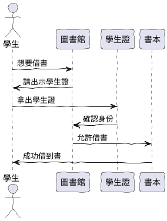
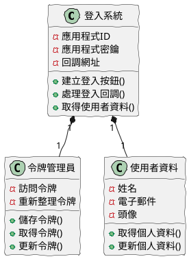
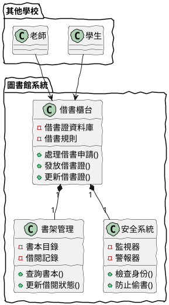

# OAuth2.0 入門教學

## 初級：理解 OAuth2.0 的基本概念

### 概念說明
OAuth2.0 就像是一個「數位鑰匙」系統，讓我們可以用一個帳號（例如 Google 帳號）登入其他網站，就像用一把鑰匙可以開很多門一樣。

想像一下：
- 你是一個學生，想要借學校圖書館的書
- 圖書館需要確認你的身份
- 你可以出示學生證（就像 OAuth2.0 的授權）
- 圖書館看到學生證就相信你是學生，不需要再問其他問題

可能遇到的問題：
1. 忘記登入：就像忘記帶學生證一樣，可能忘記用哪個帳號登入
2. 權限問題：就像有些書需要老師同意才能借，某些功能需要額外授權
3. 安全性問題：就像學生證可能被偷，授權碼也可能被竊取

解決方法：
1. 提供清楚的登入提示，就像圖書館的借書規則
2. 明確告知需要哪些權限，就像借書前先說明規定
3. 使用 HTTPS 確保安全傳輸，就像把學生證放在安全的地方

### PlantUML 圖解


### 分段教學步驟
1. 了解什麼是 OAuth2.0（數位鑰匙系統）
2. 認識基本的授權流程（出示學生證的過程）
3. 了解令牌（Token）的作用（學生證的有效期限）
4. 學習如何安全地使用 OAuth2.0（保管好學生證）

### 實作範例
```java
// 這是一個簡單的登入按鈕範例
public class LoginButton {
    public static void main(String[] args) {
        // 設定 Google 登入按鈕
        String googleLoginUrl = "https://accounts.google.com/o/oauth2/v2/auth" +
            "?client_id=你的應用程式ID" +
            "&redirect_uri=http://你的網站/callback" +
            "&response_type=code" +
            "&scope=email profile";
            
        System.out.println("點擊這裡登入：");
        System.out.println(googleLoginUrl);
    }
}
```

## 中級：實作 OAuth2.0 客戶端

### 概念說明
在這個層級，我們要學習如何建立一個可以讓使用者用 Google 帳號登入的網站。就像建立一個圖書館的借書系統。

主要概念：
- 客戶端 ID：就像是圖書館的借書證號碼
- 授權碼：臨時的借書許可
- 訪問令牌：實際用來借書的卡片
- 重新整理令牌：用來更新借書卡片的工具

可能遇到的問題：
1. 令牌過期：就像借書證過期了
2. 權限不足：就像想借的書需要更高權限
3. 安全性問題：如何保護使用者的資料

解決方法：
1. 使用重新整理令牌更新訪問令牌
2. 實作權限請求機制
3. 使用安全的儲存方式

### PlantUML 圖解


### 分段教學步驟
1. 設定 Google 開發者帳號
2. 建立登入按鈕
3. 處理登入回調
4. 取得使用者資料
5. 實作登出功能

### 實作範例
```java
import com.google.api.client.googleapis.auth.oauth2.GoogleAuthorizationCodeFlow;
import com.google.api.client.googleapis.auth.oauth2.GoogleTokenResponse;
import com.google.api.client.http.javanet.NetHttpTransport;
import com.google.api.client.json.jackson2.JacksonFactory;

public class GoogleLogin {
    private static final String CLIENT_ID = "你的應用程式ID";
    private static final String CLIENT_SECRET = "你的應用程式密鑰";
    
    public static void main(String[] args) {
        // 建立 Google 登入流程
        GoogleAuthorizationCodeFlow flow = new GoogleAuthorizationCodeFlow.Builder(
            new NetHttpTransport(),
            JacksonFactory.getDefaultInstance(),
            CLIENT_ID,
            CLIENT_SECRET,
            Arrays.asList("email", "profile"))
            .build();
            
        // 建立登入 URL
        String url = flow.newAuthorizationUrl()
            .setRedirectUri("http://你的網站/callback")
            .build();
            
        System.out.println("請訪問以下網址登入：");
        System.out.println(url);
    }
}
```

## 高級：實作 OAuth2.0 伺服器

### 概念說明
在這個層級，我們要學習如何建立一個完整的授權系統。就像建立一個新的圖書館系統，可以讓其他學校的學生也來借書。

主要概念：
- 授權伺服器：處理借書申請的櫃台
- 資源伺服器：存放書本的書架
- 令牌管理：管理借書證的系統
- 安全性考慮：防止有人偷書或冒用身份

可能遇到的問題：
1. 效能問題：太多人同時借書
2. 安全性問題：防止有人偷書
3. 擴展性問題：如何讓更多學校加入

解決方法：
1. 使用快取和負載平衡
2. 實作完整的安全機制
3. 使用微服務架構

### PlantUML 圖解


### 分段教學步驟
1. 設計授權系統架構
2. 實作使用者註冊
3. 實作令牌管理
4. 實作資源保護
5. 實作安全機制
6. 實作監控系統

### 實作範例
```java
import org.springframework.boot.SpringApplication;
import org.springframework.boot.autoconfigure.SpringBootApplication;
import org.springframework.security.config.annotation.web.builders.HttpSecurity;
import org.springframework.security.config.annotation.web.configuration.WebSecurityConfigurerAdapter;
import org.springframework.security.oauth2.config.annotation.web.configuration.EnableAuthorizationServer;

@SpringBootApplication
@EnableAuthorizationServer
public class LibrarySystem {
    public static void main(String[] args) {
        SpringApplication.run(LibrarySystem.class, args);
    }
    
    @Configuration
    public class SecurityConfig extends WebSecurityConfigurerAdapter {
        @Override
        protected void configure(HttpSecurity http) throws Exception {
            http
                .authorizeRequests()
                .antMatchers("/public/**").permitAll()  // 公開區域
                .antMatchers("/private/**").authenticated()  // 需要登入
                .and()
                .oauth2Login();  // 啟用 OAuth2 登入
        }
    }
}
```

## 總結

這份教學文件從 OAuth2.0 的基本概念開始，用圖書館借書的例子來解釋複雜的概念。每個難度層級都包含了必要的理論知識和實作範例，並使用簡單的圖表來幫助理解。

初級課程著重於理解 OAuth2.0 的基本概念，就像學習如何使用學生證借書。中級課程學習如何建立登入系統，就像建立圖書館的借書系統。高級課程則涵蓋完整的授權系統實作，就像建立一個可以讓多所學校共用的圖書館系統。 