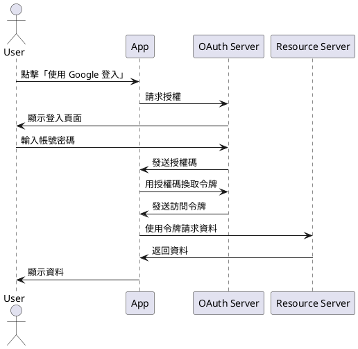
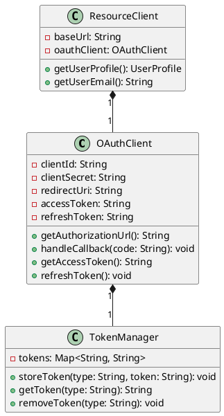
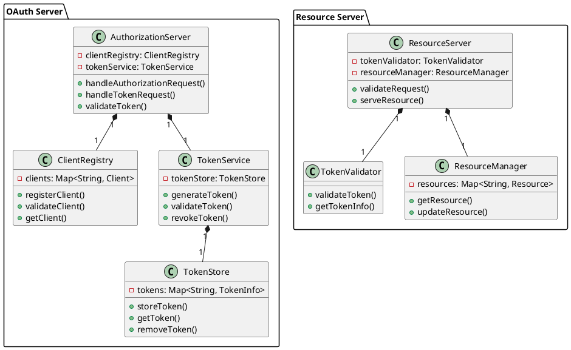

# OAuth2.0 入門教學

## 初級：理解 OAuth2.0 的基本概念

### 概念說明
OAuth2.0 就像是一個「授權代理人」系統，讓我們可以用一個帳號（例如 Google 帳號）登入其他網站，而不需要重新註冊。

想像一下：
- 你是一個學生，想要借學校圖書館的書
- 圖書館需要確認你的身份
- 你可以出示學生證（就像 OAuth2.0 的授權）
- 圖書館看到學生證就相信你是學生，不需要再問其他問題

可能遇到的問題：
1. 忘記登入：使用者可能忘記自己用哪個帳號登入
2. 權限問題：某些功能需要額外授權
3. 安全性問題：授權碼可能被竊取

解決方法：
1. 提供清楚的登入提示
2. 明確告知需要哪些權限
3. 使用 HTTPS 確保安全傳輸

### PlantUML 圖解


### 分段教學步驟
1. 了解什麼是 OAuth2.0
2. 認識基本的授權流程
3. 了解令牌（Token）的作用
4. 學習如何安全地使用 OAuth2.0

### 實作範例
```java
import java.net.URI;
import java.net.http.HttpClient;
import java.net.http.HttpRequest;
import java.net.http.HttpResponse;

public class SimpleOAuthClient {
    public static void main(String[] args) {
        // 設定 OAuth 參數
        String clientId = "your_client_id";
        String redirectUri = "http://localhost:8080/callback";
        String scope = "profile email";
        
        // 構建授權 URL
        String authUrl = "https://accounts.google.com/o/oauth2/v2/auth" +
            "?client_id=" + clientId +
            "&redirect_uri=" + redirectUri +
            "&response_type=code" +
            "&scope=" + scope;
        
        System.out.println("請訪問以下 URL 進行授權：");
        System.out.println(authUrl);
        
        // 這裡需要實作接收授權碼的回調處理
        // 實際應用中會使用 Web 伺服器來處理
    }
}
```

## 中級：實作 OAuth2.0 客戶端

### 概念說明
在這個層級，我們要學習如何實作一個 OAuth2.0 客戶端。這就像是一個「授權代理人」的具體實作。

主要概念：
- 客戶端 ID 和密鑰：就像是代理人的身份證
- 授權碼：臨時的授權證明
- 訪問令牌：實際用來存取資源的鑰匙
- 重新整理令牌：用來取得新的訪問令牌

可能遇到的問題：
1. 令牌過期：訪問令牌有使用期限
2. 權限不足：需要更多權限時怎麼辦
3. 安全性問題：如何安全地儲存令牌

解決方法：
1. 使用重新整理令牌更新訪問令牌
2. 實作權限請求機制
3. 使用安全的儲存方式（如加密）

### PlantUML 圖解


### 分段教學步驟
1. 設定 OAuth 客戶端
2. 實作授權流程
3. 處理令牌管理
4. 實作資源存取
5. 處理錯誤情況

### 實作範例
```java
import java.net.URI;
import java.net.http.HttpClient;
import java.net.http.HttpRequest;
import java.net.http.HttpResponse;
import java.util.HashMap;
import java.util.Map;
import com.google.gson.Gson;

public class OAuthClient {
    private final String clientId;
    private final String clientSecret;
    private final String redirectUri;
    private final TokenManager tokenManager;
    
    public OAuthClient(String clientId, String clientSecret, String redirectUri) {
        this.clientId = clientId;
        this.clientSecret = clientSecret;
        this.redirectUri = redirectUri;
        this.tokenManager = new TokenManager();
    }
    
    public String getAuthorizationUrl() {
        return "https://accounts.google.com/o/oauth2/v2/auth" +
            "?client_id=" + clientId +
            "&redirect_uri=" + redirectUri +
            "&response_type=code" +
            "&scope=profile email" +
            "&access_type=offline";
    }
    
    public void handleCallback(String code) {
        // 使用授權碼換取令牌
        Map<String, String> params = new HashMap<>();
        params.put("code", code);
        params.put("client_id", clientId);
        params.put("client_secret", clientSecret);
        params.put("redirect_uri", redirectUri);
        params.put("grant_type", "authorization_code");
        
        // 發送請求獲取令牌
        HttpClient client = HttpClient.newHttpClient();
        HttpRequest request = HttpRequest.newBuilder()
            .uri(URI.create("https://oauth2.googleapis.com/token"))
            .header("Content-Type", "application/x-www-form-urlencoded")
            .POST(HttpRequest.BodyPublishers.ofString(buildFormData(params)))
            .build();
            
        try {
            HttpResponse<String> response = client.send(request, 
                HttpResponse.BodyHandlers.ofString());
            
            // 解析回應並儲存令牌
            Gson gson = new Gson();
            TokenResponse tokenResponse = gson.fromJson(response.body(), 
                TokenResponse.class);
            
            tokenManager.storeToken("access_token", tokenResponse.accessToken);
            tokenManager.storeToken("refresh_token", tokenResponse.refreshToken);
        } catch (Exception e) {
            e.printStackTrace();
        }
    }
    
    private String buildFormData(Map<String, String> params) {
        StringBuilder result = new StringBuilder();
        for (Map.Entry<String, String> entry : params.entrySet()) {
            if (result.length() > 0) result.append("&");
            result.append(entry.getKey())
                  .append("=")
                  .append(entry.getValue());
        }
        return result.toString();
    }
}

class TokenResponse {
    String accessToken;
    String refreshToken;
    String tokenType;
    int expiresIn;
}
```

## 高級：實作 OAuth2.0 伺服器

### 概念說明
在這個層級，我們要學習如何實作一個完整的 OAuth2.0 伺服器。這就像是一個「授權中心」的實作。

主要概念：
- 授權伺服器：處理授權請求
- 資源伺服器：保護和提供資源
- 令牌管理：產生和驗證令牌
- 安全性考慮：防止攻擊和濫用

可能遇到的問題：
1. 效能問題：大量請求時的處理
2. 安全性問題：各種攻擊防護
3. 擴展性問題：如何支援更多客戶端

解決方法：
1. 使用快取和負載平衡
2. 實作完整的安全機制
3. 使用微服務架構

### PlantUML 圖解


### 分段教學步驟
1. 設計授權伺服器架構
2. 實作客戶端註冊
3. 實作令牌管理
4. 實作資源伺服器
5. 實作安全性機制
6. 實作監控和日誌

### 實作範例
```java
import org.springframework.boot.SpringApplication;
import org.springframework.boot.autoconfigure.SpringBootApplication;
import org.springframework.context.annotation.Bean;
import org.springframework.security.config.annotation.web.builders.HttpSecurity;
import org.springframework.security.config.annotation.web.configuration.EnableWebSecurity;
import org.springframework.security.config.annotation.web.configuration.WebSecurityConfigurerAdapter;
import org.springframework.security.oauth2.config.annotation.web.configuration.EnableAuthorizationServer;
import org.springframework.security.oauth2.config.annotation.web.configuration.EnableResourceServer;
import org.springframework.security.oauth2.provider.token.TokenStore;
import org.springframework.security.oauth2.provider.token.store.JwtAccessTokenConverter;
import org.springframework.security.oauth2.provider.token.store.JwtTokenStore;

@SpringBootApplication
@EnableAuthorizationServer
public class OAuthServerApplication {
    public static void main(String[] args) {
        SpringApplication.run(OAuthServerApplication.class, args);
    }
    
    @Bean
    public TokenStore tokenStore() {
        return new JwtTokenStore(accessTokenConverter());
    }
    
    @Bean
    public JwtAccessTokenConverter accessTokenConverter() {
        JwtAccessTokenConverter converter = new JwtAccessTokenConverter();
        converter.setSigningKey("your-secret-key");
        return converter;
    }
}

@Configuration
@EnableResourceServer
public class ResourceServerConfig extends ResourceServerConfigurerAdapter {
    @Override
    public void configure(HttpSecurity http) throws Exception {
        http
            .authorizeRequests()
            .antMatchers("/api/public/**").permitAll()
            .antMatchers("/api/private/**").authenticated();
    }
}

@RestController
@RequestMapping("/api/private")
public class ResourceController {
    @GetMapping("/user")
    public UserProfile getUserProfile(Principal principal) {
        // 根據 principal 獲取用戶資料
        return new UserProfile(principal.getName());
    }
}
```

## 總結

這份教學文件從 OAuth2.0 的基本概念開始，逐步引導學生學習更複雜的實作細節。每個難度層級都包含了必要的理論知識和實作範例，並使用 PlantUML 圖表來幫助理解系統架構。

初級課程著重於理解 OAuth2.0 的基本概念和流程，中級課程學習如何實作 OAuth2.0 客戶端，高級課程則涵蓋完整的 OAuth2.0 伺服器實作。這樣的學習路徑可以幫助學生逐步建立對 OAuth2.0 的深入理解。 