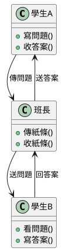
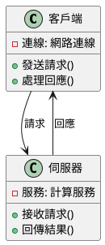
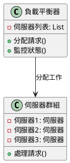

# RPC 遠端呼叫教學

## 初級（Beginner）層級

### 1. 概念說明
RPC（遠端程序呼叫）就像是在學校裡傳紙條：
- 你想問隔壁班的同學問題
- 你寫好問題，請班長幫忙傳過去
- 隔壁班同學收到後回答問題
- 班長再把答案傳回來給你

#### 為什麼需要 RPC？
1. 就像不同班級需要互相溝通：
   - 不同程式需要互相幫忙
   - 有些工作要請其他電腦幫忙
   - 可以讓程式分工合作

2. 可能遇到的問題：
   - 傳紙條可能被弄丟（網路問題）
   - 對方可能不在教室（服務當機）
   - 答案可能寫不清楚（資料格式不對）

3. 如何避免問題：
   - 寫清楚問題（資料格式要正確）
   - 多準備幾張紙條（重試機制）
   - 設定等待時間（超時控制）

### 2. PlantUML 圖解


### 3. 分段教學步驟

#### 步驟 1：寫一個簡單的 RPC 服務
```java
// 定義服務接口
public interface 計算服務 {
    int 加法(int 數字1, int 數字2);
}

// 實現服務
public class 計算服務實現 implements 計算服務 {
    public int 加法(int 數字1, int 數字2) {
        return 數字1 + 數字2;
    }
}

// 使用服務
public class 主程式 {
    public static void main(String[] args) {
        計算服務 服務 = new 計算服務實現();
        int 結果 = 服務.加法(5, 3);
        System.out.println("5 + 3 = " + 結果);
    }
}
```

## 中級（Intermediate）層級

### 1. 概念說明
中級學習者需要了解：
- 如何讓不同電腦互相溝通
- 資料如何安全傳輸
- 錯誤時該怎麼辦

#### 進階概念
1. 資料傳輸：
   - 就像寫信要貼郵票（序列化）
   - 信封要寫對地址（網路位址）
   - 要確認對方收到信（確認機制）

2. 錯誤處理：
   - 信可能寄丟（網路問題）
   - 地址可能寫錯（連接錯誤）
   - 對方可能不在家（服務當機）

### 2. PlantUML 圖解


### 3. 分段教學步驟

#### 步驟 1：使用 gRPC 框架
```java
// 定義服務
service 計算機服務 {
    rpc 加法 (加法請求) returns (加法回應) {}
}

message 加法請求 {
    int32 數字1 = 1;
    int32 數字2 = 2;
}

message 加法回應 {
    int32 結果 = 1;
}

// 實現服務
public class 計算機服務實現 extends 計算機服務Grpc.計算機服務ImplBase {
    @Override
    public void 加法(加法請求 請求, StreamObserver<加法回應> 回應觀察者) {
        int 結果 = 請求.get數字1() + 請求.get數字2();
        加法回應 回應 = 加法回應.newBuilder()
            .set結果(結果)
            .build();
        回應觀察者.onNext(回應);
        回應觀察者.onCompleted();
    }
}
```

## 高級（Advanced）層級

### 1. 概念說明
高級學習者需要掌握：
- 如何讓多台電腦一起工作
- 如何處理大量請求
- 如何確保服務穩定

#### 進階概念
1. 分散式系統：
   - 像是一個班級分成多個小組
   - 每個小組負責不同工作
   - 需要互相配合完成任務

2. 效能優化：
   - 像排隊買東西要有效率
   - 避免大家擠在一起
   - 合理分配工作

### 2. PlantUML 圖解


### 3. 分段教學步驟

#### 步驟 1：實現負載平衡
```java
public class 負載平衡器 {
    private List<伺服器> 伺服器列表;
    private int 當前索引 = 0;
    
    public 負載平衡器() {
        伺服器列表 = new ArrayList<>();
        // 加入多台伺服器
        伺服器列表.add(new 伺服器("伺服器1"));
        伺服器列表.add(new 伺服器("伺服器2"));
        伺服器列表.add(new 伺服器("伺服器3"));
    }
    
    public 伺服器 取得下一個伺服器() {
        伺服器 伺服器 = 伺服器列表.get(當前索引);
        當前索引 = (當前索引 + 1) % 伺服器列表.size();
        return 伺服器;
    }
}

// 使用負載平衡器
public class 主程式 {
    public static void main(String[] args) {
        負載平衡器 平衡器 = new 負載平衡器();
        
        // 模擬多個請求
        for (int i = 0; i < 10; i++) {
            伺服器 伺服器 = 平衡器.取得下一個伺服器();
            System.out.println("請求 " + i + " 分配給 " + 伺服器.取得名稱());
        }
    }
}
```

這個教學文件從基礎到進階，用國中生容易理解的方式解釋 RPC 的概念。初級學習者可以從基本的請求回應開始，中級學習者可以學習如何讓不同電腦互相溝通，而高級學習者則可以掌握如何讓多台電腦一起工作。 