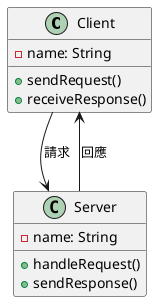
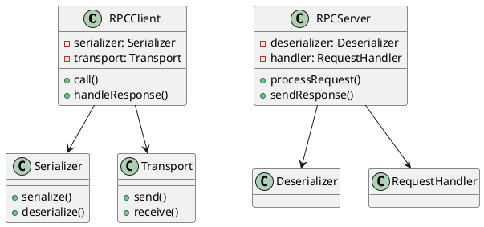
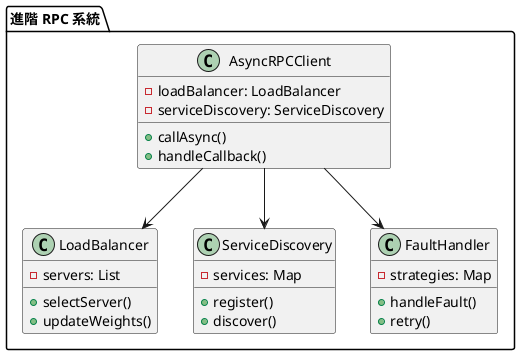

# RPC 教學

## 初級（Beginner）層級

### 1. 概念說明
RPC（遠端程序呼叫）就像是在學校裡，當你需要其他班級的同學幫忙時：
- 你可以請班長幫忙傳話給其他班級
- 其他班級的同學收到訊息後，會幫你完成任務
- 完成後，他們會把結果傳回來給你

初級學習者需要了解：
- 什麼是 RPC
- 為什麼需要 RPC
- 基本的遠端呼叫概念

### 2. PlantUML 圖解


### 3. 分段教學步驟

#### 步驟 1：基本請求回應
```java
public class SimpleRPC {
    private String clientName;
    private String serverName;
    
    public SimpleRPC(String clientName, String serverName) {
        this.clientName = clientName;
        this.serverName = serverName;
    }
    
    public String sendRequest(String request) {
        System.out.println(clientName + " 發送請求：" + request);
        // 模擬網路傳輸
        String response = handleRequest(request);
        System.out.println(clientName + " 收到回應：" + response);
        return response;
    }
    
    private String handleRequest(String request) {
        System.out.println(serverName + " 處理請求：" + request);
        // 模擬處理時間
        try {
            Thread.sleep(1000);
        } catch (InterruptedException e) {
            e.printStackTrace();
        }
        return "處理完成：" + request;
    }
}
```

#### 步驟 2：簡單的服務調用
```java
public class SimpleService {
    private SimpleRPC rpc;
    
    public SimpleService(String clientName, String serverName) {
        rpc = new SimpleRPC(clientName, serverName);
    }
    
    public void callService(String request) {
        String response = rpc.sendRequest(request);
        System.out.println("服務調用結果：" + response);
    }
}
```

## 中級（Intermediate）層級

### 1. 概念說明
中級學習者需要理解：
- RPC 的實現方式
- 請求序列化
- 回應反序列化
- 錯誤處理

### 2. PlantUML 圖解


### 3. 分段教學步驟

#### 步驟 1：序列化處理
```java
public interface Serializer {
    String serialize(Object obj);
    Object deserialize(String data, Class<?> type);
}

public class JSONSerializer implements Serializer {
    @Override
    public String serialize(Object obj) {
        // 簡單的 JSON 序列化
        return "{\"data\":\"" + obj.toString() + "\"}";
    }
    
    @Override
    public Object deserialize(String data, Class<?> type) {
        // 簡單的 JSON 反序列化
        return data.substring(8, data.length() - 2);
    }
}
```

#### 步驟 2：請求處理
```java
public class RPCClient {
    private Serializer serializer;
    private Transport transport;
    
    public RPCClient(Serializer serializer, Transport transport) {
        this.serializer = serializer;
        this.transport = transport;
    }
    
    public Object call(String method, Object... params) {
        // 序列化請求
        String request = serializer.serialize(new Request(method, params));
        
        // 發送請求
        String response = transport.send(request);
        
        // 反序列化回應
        return serializer.deserialize(response, Object.class);
    }
}

public class RPCServer {
    private Serializer serializer;
    private RequestHandler handler;
    
    public RPCServer(Serializer serializer, RequestHandler handler) {
        this.serializer = serializer;
        this.handler = handler;
    }
    
    public String processRequest(String request) {
        // 反序列化請求
        Request req = (Request) serializer.deserialize(request, Request.class);
        
        // 處理請求
        Object result = handler.handle(req);
        
        // 序列化回應
        return serializer.serialize(result);
    }
}
```

## 高級（Advanced）層級

### 1. 概念說明
高級學習者需要掌握：
- 非同步 RPC
- 負載平衡
- 服務發現
- 容錯處理

### 2. PlantUML 圖解


### 3. 分段教學步驟

#### 步驟 1：非同步調用
```java
public class AsyncRPCClient {
    private LoadBalancer loadBalancer;
    private ServiceDiscovery serviceDiscovery;
    private FaultHandler faultHandler;
    
    public AsyncRPCClient(LoadBalancer loadBalancer, ServiceDiscovery serviceDiscovery) {
        this.loadBalancer = loadBalancer;
        this.serviceDiscovery = serviceDiscovery;
        this.faultHandler = new FaultHandler();
    }
    
    public CompletableFuture<Object> callAsync(String service, String method, Object... params) {
        return CompletableFuture.supplyAsync(() -> {
            try {
                // 選擇服務器
                Server server = loadBalancer.selectServer(service);
                
                // 發送請求
                return sendRequest(server, method, params);
            } catch (Exception e) {
                // 處理錯誤
                return faultHandler.handleFault(e, () -> retry(service, method, params));
            }
        });
    }
    
    private Object sendRequest(Server server, String method, Object... params) {
        // 實現請求發送邏輯
        return null;
    }
    
    private Object retry(String service, String method, Object... params) {
        // 實現重試邏輯
        return null;
    }
}
```

#### 步驟 2：負載平衡
```java
public class LoadBalancer {
    private Map<String, List<Server>> servers;
    private Map<String, Integer> weights;
    
    public LoadBalancer() {
        servers = new HashMap<>();
        weights = new HashMap<>();
    }
    
    public Server selectServer(String service) {
        List<Server> serviceServers = servers.get(service);
        if (serviceServers == null || serviceServers.isEmpty()) {
            throw new RuntimeException("沒有可用的服務器");
        }
        
        // 簡單的輪詢負載平衡
        int index = weights.getOrDefault(service, 0);
        Server server = serviceServers.get(index);
        weights.put(service, (index + 1) % serviceServers.size());
        
        return server;
    }
    
    public void updateWeights(String service, Map<Server, Integer> newWeights) {
        // 更新服務器權重
    }
}
```

#### 步驟 3：容錯處理
```java
public class FaultHandler {
    private Map<Class<? extends Exception>, FaultStrategy> strategies;
    
    public FaultHandler() {
        strategies = new HashMap<>();
        // 初始化策略
        strategies.put(TimeoutException.class, new RetryStrategy(3));
        strategies.put(NetworkException.class, new CircuitBreakerStrategy());
    }
    
    public Object handleFault(Exception e, Supplier<Object> retrySupplier) {
        FaultStrategy strategy = strategies.get(e.getClass());
        if (strategy != null) {
            return strategy.handle(e, retrySupplier);
        }
        throw new RuntimeException("未處理的錯誤", e);
    }
}

interface FaultStrategy {
    Object handle(Exception e, Supplier<Object> retrySupplier);
}

class RetryStrategy implements FaultStrategy {
    private int maxRetries;
    
    public RetryStrategy(int maxRetries) {
        this.maxRetries = maxRetries;
    }
    
    @Override
    public Object handle(Exception e, Supplier<Object> retrySupplier) {
        for (int i = 0; i < maxRetries; i++) {
            try {
                return retrySupplier.get();
            } catch (Exception ex) {
                if (i == maxRetries - 1) {
                    throw new RuntimeException("重試失敗", ex);
                }
            }
        }
        throw new RuntimeException("重試失敗", e);
    }
}
```

這個教學文件提供了從基礎到進階的 RPC 學習路徑，每個層級都包含了相應的概念說明、圖解、教學步驟和實作範例。初級學習者可以從基本的請求回應開始，中級學習者可以學習序列化和請求處理，而高級學習者則可以掌握非同步調用和容錯處理等進階功能。 