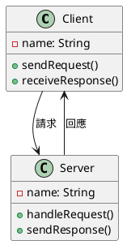
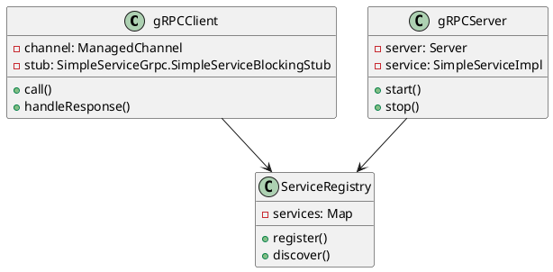
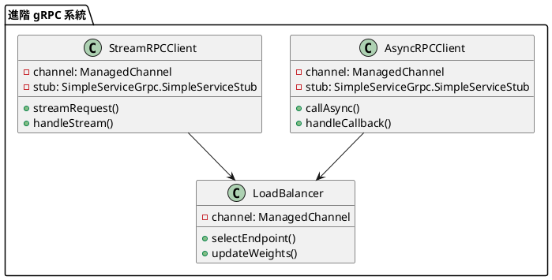

# RPC 教學

## 初級（Beginner）層級

### 1. 概念說明
RPC（遠端程序呼叫）就像是在學校裡，當你需要其他班級的同學幫忙時：
- 你可以請班長幫忙傳話給其他班級
- 其他班級的同學收到訊息後，會幫你完成任務
- 完成後，他們會把結果傳回來給你

#### 原因分析
1. 系統設計需求：
   - 服務解耦
   - 跨進程通信
   - 分布式系統

2. 業務場景：
   - 微服務架構
   - 跨語言調用
   - 高性能通信

#### 問題表象
1. 性能問題：
   - 網絡延遲
   - 序列化開銷
   - 資源消耗

2. 業務影響：
   - 調用失敗
   - 數據不一致
   - 系統複雜度

#### 避免方法
1. 基礎防護：
   - 超時控制
   - 重試機制
   - 錯誤處理

2. 數據處理：
   - 序列化優化
   - 壓縮傳輸
   - 緩存結果

#### 處理方案
1. 技術方案：
   - 使用 RPC 框架
   - 實現負載均衡
   - 添加監控機制

2. 運維方案：
   - 服務治理
   - 性能監控
   - 故障處理

初級學習者需要了解：
- 什麼是 RPC
- 為什麼需要 RPC
- 基本的遠端呼叫概念

### 2. PlantUML 圖解


### 3. 分段教學步驟

#### 步驟 1：定義服務接口（Protocol Buffers）
```protobuf
syntax = "proto3";

package com.example.rpc;

service SimpleService {
  rpc ProcessRequest (Request) returns (Response) {}
}

message Request {
  string data = 1;
}

message Response {
  string result = 1;
}
```

#### 步驟 2：實現服務端
```java
public class SimpleServiceImpl extends SimpleServiceGrpc.SimpleServiceImplBase {
    @Override
    public void processRequest(Request request, StreamObserver<Response> responseObserver) {
        String result = "處理完成：" + request.getData();
        Response response = Response.newBuilder()
            .setResult(result)
            .build();
        responseObserver.onNext(response);
        responseObserver.onCompleted();
    }
}

public class RPCServer {
    public static void main(String[] args) throws IOException, InterruptedException {
        Server server = ServerBuilder.forPort(50051)
            .addService(new SimpleServiceImpl())
            .build()
            .start();
        
        System.out.println("服務器啟動，監聽端口 50051");
        server.awaitTermination();
    }
}
```

#### 步驟 3：實現客戶端
```java
public class RPCClient {
    private final SimpleServiceGrpc.SimpleServiceBlockingStub blockingStub;

    public RPCClient(Channel channel) {
        blockingStub = SimpleServiceGrpc.newBlockingStub(channel);
    }

    public void callService(String requestData) {
        Request request = Request.newBuilder()
            .setData(requestData)
            .build();
        
        Response response = blockingStub.processRequest(request);
        System.out.println("服務調用結果：" + response.getResult());
    }

    public static void main(String[] args) {
        ManagedChannel channel = ManagedChannelBuilder.forAddress("localhost", 50051)
            .usePlaintext()
            .build();
        
        try {
            RPCClient client = new RPCClient(channel);
            client.callService("測試請求");
        } finally {
            channel.shutdown();
        }
    }
}
```

### 4. 配置說明

#### Maven 依賴配置
```xml
<dependencies>
    <dependency>
        <groupId>io.grpc</groupId>
        <artifactId>grpc-netty-shaded</artifactId>
        <version>1.58.0</version>
    </dependency>
    <dependency>
        <groupId>io.grpc</groupId>
        <artifactId>grpc-protobuf</artifactId>
        <version>1.58.0</version>
    </dependency>
    <dependency>
        <groupId>io.grpc</groupId>
        <artifactId>grpc-stub</artifactId>
        <version>1.58.0</version>
    </dependency>
</dependencies>
```

#### 編譯 Protocol Buffers
```xml
<build>
    <extensions>
        <extension>
            <groupId>kr.motd.maven</groupId>
            <artifactId>os-maven-plugin</artifactId>
            <version>1.7.1</version>
        </extension>
    </extensions>
    <plugins>
        <plugin>
            <groupId>org.xolstice.maven.plugins</groupId>
            <artifactId>protobuf-maven-plugin</artifactId>
            <version>0.6.1</version>
            <configuration>
                <protocArtifact>com.google.protobuf:protoc:3.21.7:exe:${os.detected.classifier}</protocArtifact>
                <pluginId>grpc-java</pluginId>
                <pluginArtifact>io.grpc:protoc-gen-grpc-java:1.58.0:exe:${os.detected.classifier}</pluginArtifact>
            </configuration>
            <executions>
                <execution>
                    <goals>
                        <goal>compile</goal>
                        <goal>compile-custom</goal>
                    </goals>
                </execution>
            </executions>
        </plugin>
    </plugins>
</build>
```

## 中級（Intermediate）層級

### 1. 概念說明
中級學習者需要理解：
- gRPC 的實現機制
- Protocol Buffers 序列化
- 服務註冊與發現
- 錯誤處理

#### gRPC 架構詳解
1. 核心組件：
   - Channel：通信通道
   - Stub：客戶端存根
   - Service：服務實現
   - Interceptor：攔截器

2. 優缺點：
   - 優點：高性能、跨語言、流式處理
   - 缺點：學習曲線陡、配置複雜

3. 使用場景：
   - 微服務通信
   - 實時數據流
   - 跨語言調用

#### Protocol Buffers 詳解
1. 消息定義：
   - 字段類型
   - 嵌套消息
   - 枚舉類型

2. 序列化特性：
   - 二進制格式
   - 向後兼容
   - 跨語言支持

#### 服務註冊與發現
1. 實現方式：
   - 服務註冊
   - 健康檢查
   - 負載均衡

2. 注意事項：
   - 服務狀態
   - 故障轉移
   - 配置管理

#### 錯誤處理詳解
1. 錯誤類型：
   - 網絡錯誤
   - 業務錯誤
   - 系統錯誤

2. 處理策略：
   - 重試機制
   - 熔斷降級
   - 錯誤日誌

### 2. PlantUML 圖解


### 3. 分段教學步驟

#### 步驟 1：服務註冊與發現
```java
// 使用 etcd 作為服務註冊中心
public class ServiceRegistry {
    private final Client etcdClient;
    
    public ServiceRegistry(String etcdUrl) {
        this.etcdClient = Client.builder()
            .endpoints(etcdUrl)
            .build();
    }
    
    public void registerService(String serviceName, String serviceUrl) {
        String key = "/services/" + serviceName;
        etcdClient.putKV()
            .key(key)
            .value(serviceUrl)
            .lease(60) // 60秒租約
            .sync();
    }
    
    public String discoverService(String serviceName) {
        String key = "/services/" + serviceName;
        GetResponse response = etcdClient.getKV()
            .key(key)
            .sync();
        return response.getKvs().get(0).getValue().toString();
    }
}
```

#### 步驟 2：錯誤處理
```java
public class RPCClient {
    private final SimpleServiceGrpc.SimpleServiceBlockingStub blockingStub;
    
    public void callService(String requestData) {
        try {
            Request request = Request.newBuilder()
                .setData(requestData)
                .build();
            
            Response response = blockingStub.processRequest(request);
            System.out.println("服務調用結果：" + response.getResult());
        } catch (StatusRuntimeException e) {
            if (e.getStatus().getCode() == Status.Code.UNAVAILABLE) {
                // 處理服務不可用錯誤
                System.err.println("服務不可用，正在重試...");
            } else {
                // 處理其他錯誤
                System.err.println("RPC 失敗: " + e.getStatus());
            }
        }
    }
}
```

## 高級（Advanced）層級

### 1. 概念說明
高級學習者需要掌握：
- 分布式事務
- 服務治理
- 性能優化
- 監控和告警

#### 分布式事務詳解
1. 實現方式：
   - 兩階段提交
   - 最終一致性
   - 補償事務

2. 注意事項：
   - 性能影響
   - 一致性要求
   - 異常處理

#### 服務治理詳解
1. 治理內容：
   - 服務註冊
   - 配置管理
   - 流量控制

2. 實現策略：
   - 服務網格
   - 限流熔斷
   - 負載均衡

#### 性能優化詳解
1. 優化方向：
   - 序列化
   - 網絡傳輸
   - 資源利用

2. 優化手段：
   - 連接池
   - 異步調用
   - 批量處理

#### 監控和告警詳解
1. 監控指標：
   - 調用延遲
   - 錯誤率
   - 資源使用

2. 告警策略：
   - 多級告警
   - 智能降噪
   - 自動處理

### 2. PlantUML 圖解


### 3. 分段教學步驟

#### 步驟 1：非同步調用
```java
public class AsyncRPCClient {
    private final SimpleServiceGrpc.SimpleServiceStub asyncStub;
    
    public void callAsync(String requestData) {
        Request request = Request.newBuilder()
            .setData(requestData)
            .build();
        
        asyncStub.processRequest(request, new StreamObserver<Response>() {
            @Override
            public void onNext(Response response) {
                System.out.println("收到回應：" + response.getResult());
            }
            
            @Override
            public void onError(Throwable t) {
                System.err.println("RPC 失敗: " + t);
            }
            
            @Override
            public void onCompleted() {
                System.out.println("RPC 完成");
            }
        });
    }
}
```

#### 步驟 2：流式 RPC
```java
// 定義流式服務
service StreamService {
    rpc StreamProcess (stream Request) returns (stream Response) {}
}

// 實現流式客戶端
public class StreamRPCClient {
    private final StreamServiceGrpc.StreamServiceStub asyncStub;
    
    public void streamRequests(List<String> requests) {
        StreamObserver<Request> requestObserver = asyncStub.streamProcess(
            new StreamObserver<Response>() {
                @Override
                public void onNext(Response response) {
                    System.out.println("收到回應：" + response.getResult());
                }
                
                @Override
                public void onError(Throwable t) {
                    System.err.println("RPC 失敗: " + t);
                }
                
                @Override
                public void onCompleted() {
                    System.out.println("流式 RPC 完成");
                }
            });
        
        for (String requestData : requests) {
            Request request = Request.newBuilder()
                .setData(requestData)
                .build();
            requestObserver.onNext(request);
        }
        requestObserver.onCompleted();
    }
}
```

#### 步驟 3：負載平衡配置
```java
// 使用 gRPC 的負載平衡功能
ManagedChannel channel = ManagedChannelBuilder.forTarget("dns:///my-service")
    .defaultLoadBalancingPolicy("round_robin")
    .usePlaintext()
    .build();
```

### 4. 進階配置

#### 服務網格集成（使用 Istio）
```yaml
apiVersion: networking.istio.io/v1alpha3
kind: VirtualService
metadata:
  name: grpc-service
spec:
  hosts:
  - grpc-service
  http:
  - route:
    - destination:
        host: grpc-service
        subset: v1
      weight: 80
    - destination:
        host: grpc-service
        subset: v2
      weight: 20
```

#### 監控配置（使用 Prometheus）
```yaml
# prometheus.yml
scrape_configs:
  - job_name: 'grpc-service'
    static_configs:
      - targets: ['localhost:9090']
    metrics_path: '/metrics'
```

這個教學文件提供了從基礎到進階的 RPC 學習路徑，每個層級都包含了相應的概念說明、圖解、教學步驟和實作範例。初級學習者可以從基本的請求回應開始，中級學習者可以學習序列化和請求處理，而高級學習者則可以掌握非同步調用和容錯處理等進階功能。 