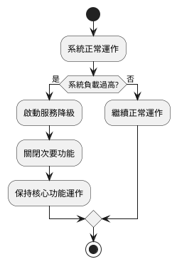
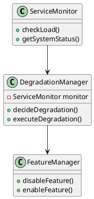
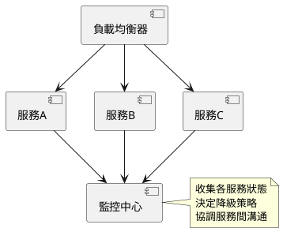

# 服務降級教學文件

## 初級篇：認識服務降級

### 概念說明
服務降級就像是一個「備用方案」。想像你在玩線上遊戲時，如果網路突然變慢，遊戲會自動降低畫質來保持順暢，這就是服務降級的概念。當系統遇到問題時，我們會暫時關閉一些不重要的功能，確保最重要的功能還能正常運作。

**為什麼需要服務降級？**
- 系統負載過高時
- 網路不穩定時
- 部分功能故障時

**可能遇到的問題：**
- 某些功能暫時無法使用
- 系統回應變慢
- 畫面品質降低

**如何避免問題：**
- 定期檢查系統狀態
- 設定合理的負載上限
- 準備好備用方案

### 流程圖解


### 教學步驟
1. 認識系統負載
   - 什麼是系統負載？
   - 如何知道系統負載過高？

2. 了解核心功能
   - 哪些功能最重要？
   - 哪些功能可以暫時關閉？

3. 學習降級策略
   - 如何決定要關閉哪些功能？
   - 如何通知使用者？

### 實作範例
```java
public class SimpleServiceDegradation {
    private boolean isSystemOverloaded = false;
    
    public void checkSystemStatus() {
        // 檢查系統負載
        if (isSystemOverloaded) {
            System.out.println("系統負載過高，啟動降級模式");
            disableSecondaryFeatures();
        } else {
            System.out.println("系統正常運作");
        }
    }
    
    private void disableSecondaryFeatures() {
        System.out.println("關閉次要功能");
        // 關閉一些不重要的功能
    }
}
```

## 中級篇：模組化服務降級

### 概念說明
在中級階段，我們要學習如何將服務降級的功能模組化。就像一個大型商場，當人潮過多時，會關閉一些次要的入口，只保留主要出入口，並有專門的人員來管理這些出入口。

**模組化的重要性：**
- 更容易維護
- 可以獨立測試
- 方便擴展功能

**可能遇到的問題：**
- 模組之間溝通不順暢
- 降級策略衝突
- 資源分配不均

**解決方案：**
- 建立清晰的模組介面
- 制定統一的降級策略
- 使用監控系統追蹤狀態

### 類別圖解


### 教學步驟
1. 建立監控模組
   - 如何監控系統狀態？
   - 如何收集系統指標？

2. 設計降級管理器
   - 如何決定降級策略？
   - 如何執行降級操作？

3. 實作功能管理器
   - 如何控制功能開關？
   - 如何管理功能依賴？

### 實作範例
```java
public class ServiceMonitor {
    private double currentLoad;
    
    public boolean isSystemOverloaded() {
        return currentLoad > 80.0;
    }
    
    public double getCurrentLoad() {
        return currentLoad;
    }
}

public class DegradationManager {
    private ServiceMonitor monitor;
    private FeatureManager featureManager;
    
    public void checkAndDegrade() {
        if (monitor.isSystemOverloaded()) {
            System.out.println("系統負載過高，執行降級策略");
            featureManager.disableNonCriticalFeatures();
        }
    }
}

public class FeatureManager {
    public void disableNonCriticalFeatures() {
        System.out.println("關閉非關鍵功能");
        // 實作關閉非關鍵功能的邏輯
    }
}
```

## 高級篇：分散式服務降級

### 概念說明
在高級階段，我們要學習如何在分散式系統中實現服務降級。想像一個大型購物網站，當某個地區的伺服器負載過高時，可以將部分流量轉移到其他地區的伺服器，或是暫時關閉某些功能。

**分散式系統的挑戰：**
- 多個服務之間的協調
- 資料一致性問題
- 網路延遲問題

**進階概念：**
- 熔斷機制（Circuit Breaker）
- 限流（Rate Limiting）
- 負載均衡（Load Balancing）

### 架構圖解


### 教學步驟
1. 理解分散式系統
   - 什麼是分散式系統？
   - 分散式系統的優缺點

2. 學習進階降級策略
   - 熔斷機制
   - 限流策略
   - 負載均衡

3. 實作監控與協調
   - 如何監控多個服務？
   - 如何協調服務間的通訊？

### 實作範例
```java
public class CircuitBreaker {
    private int failureThreshold;
    private int timeout;
    private State state;
    
    public enum State {
        CLOSED, OPEN, HALF_OPEN
    }
    
    public void execute(Runnable operation) {
        if (state == State.OPEN) {
            System.out.println("熔斷器開啟，執行降級操作");
            executeFallback();
            return;
        }
        
        try {
            operation.run();
            resetFailureCount();
        } catch (Exception e) {
            handleFailure();
        }
    }
    
    private void handleFailure() {
        failureCount++;
        if (failureCount >= failureThreshold) {
            state = State.OPEN;
            scheduleReset();
        }
    }
}

public class RateLimiter {
    private int maxRequests;
    private int timeWindow;
    
    public boolean allowRequest() {
        // 檢查是否超過請求限制
        return currentRequests < maxRequests;
    }
}
```

## 總結

服務降級是一個重要的系統設計概念，從初級到高級，我們學習了：
1. 初級：基本的降級概念和簡單實現
2. 中級：模組化的降級系統設計
3. 高級：分散式系統中的進階降級策略

記住，服務降級不是失敗，而是一種保護機制，確保系統在面對壓力時仍能提供基本服務。就像在暴風雨中，我們會關閉一些不必要的門窗，但保持主要通道暢通，確保安全。 