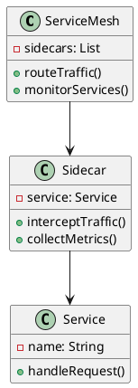
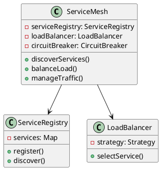
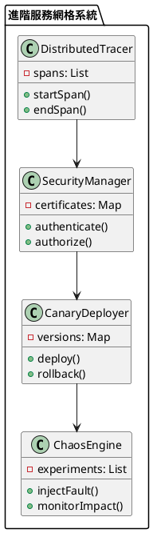

# 服務網格（Service Mesh）教學

## 初級（Beginner）層級

### 1. 概念說明
服務網格就像城市中的交通系統：
- 服務之間的通信就像車輛在道路上行駛
- 服務網格就像交通管理系統，負責路由、監控和安全
- 讓開發者專注於業務邏輯，而不是基礎設施

初級學習者需要了解：
- 什麼是服務網格
- 為什麼需要服務網格
- 基本的服務通信概念

### 2. PlantUML 圖解


### 3. 分段教學步驟

#### 步驟 1：基本服務網格實現
```java
public class SimpleServiceMesh {
    private List<Service> services;
    private Map<Service, Sidecar> sidecars;
    
    public SimpleServiceMesh() {
        services = new ArrayList<>();
        sidecars = new HashMap<>();
    }
    
    public void registerService(Service service) {
        services.add(service);
        Sidecar sidecar = new Sidecar(service);
        sidecars.put(service, sidecar);
    }
    
    public void routeRequest(Request request) {
        Service targetService = findTargetService(request);
        Sidecar sidecar = sidecars.get(targetService);
        
        // 攔截並處理流量
        sidecar.interceptTraffic(request);
        
        // 轉發到目標服務
        targetService.handleRequest(request);
    }
}

class Sidecar {
    private Service service;
    private MetricsCollector metricsCollector;
    
    public void interceptTraffic(Request request) {
        // 收集指標
        metricsCollector.collect(request);
        
        // 實現流量控制
        if (shouldRateLimit(request)) {
            throw new RateLimitExceededException();
        }
    }
}
```

## 中級（Intermediate）層級

### 1. 概念說明
中級學習者需要理解：
- 服務發現
- 負載均衡
- 熔斷機制
- 流量管理

### 2. PlantUML 圖解


### 3. 分段教學步驟

#### 步驟 1：服務發現實現
```java
public class ServiceRegistry {
    private Map<String, ServiceInfo> services;
    
    public void registerService(ServiceInfo serviceInfo) {
        services.put(serviceInfo.getName(), serviceInfo);
        notifySubscribers(serviceInfo);
    }
    
    public ServiceInfo discoverService(String serviceName) {
        return services.get(serviceName);
    }
    
    private void notifySubscribers(ServiceInfo serviceInfo) {
        // 通知所有訂閱者服務變更
    }
}

class ServiceInfo {
    private String name;
    private String address;
    private int port;
    private Map<String, String> metadata;
}
```

#### 步驟 2：熔斷機制實現
```java
public class CircuitBreaker {
    private String serviceName;
    private int failureThreshold;
    private int timeout;
    private State state;
    
    public Response execute(Request request) {
        if (state == State.OPEN) {
            return handleOpenState(request);
        }
        
        try {
            Response response = executeRequest(request);
            recordSuccess();
            return response;
        } catch (Exception e) {
            recordFailure();
            return handleFailure(request, e);
        }
    }
    
    private void recordFailure() {
        failureCount++;
        if (failureCount >= failureThreshold) {
            state = State.OPEN;
            scheduleReset();
        }
    }
    
    private void scheduleReset() {
        // 在超時後重置熔斷器
    }
}
```

## 高級（Advanced）層級

### 1. 概念說明
高級學習者需要掌握：
- 分散式追蹤
- 安全通信
- 金絲雀發布
- 混沌工程

### 2. PlantUML 圖解


### 3. 分段教學步驟

#### 步驟 1：分散式追蹤實現
```java
public class DistributedTracer {
    private Span currentSpan;
    private List<Span> spans;
    
    public Span startSpan(String operationName) {
        Span span = new Span(operationName);
        span.setParent(currentSpan);
        currentSpan = span;
        spans.add(span);
        return span;
    }
    
    public void endSpan() {
        if (currentSpan != null) {
            currentSpan.end();
            currentSpan = currentSpan.getParent();
        }
    }
    
    public void exportSpans() {
        // 導出追蹤數據
    }
}

class Span {
    private String id;
    private String operationName;
    private long startTime;
    private long endTime;
    private Span parent;
    private Map<String, String> tags;
}
```

#### 步驟 2：金絲雀發布實現
```java
public class CanaryDeployer {
    private Map<String, ServiceVersion> versions;
    private TrafficSplitter trafficSplitter;
    
    public void deployNewVersion(ServiceVersion newVersion) {
        // 部署新版本
        deployVersion(newVersion);
        
        // 配置流量分配
        configureTrafficSplit(newVersion);
        
        // 監控新版本
        monitorNewVersion(newVersion);
    }
    
    private void configureTrafficSplit(ServiceVersion newVersion) {
        // 初始分配少量流量
        trafficSplitter.splitTraffic(newVersion, 0.1);
        
        // 根據監控結果調整流量
        adjustTrafficSplit(newVersion);
    }
    
    private void monitorNewVersion(ServiceVersion version) {
        // 監控關鍵指標
        Metrics metrics = collectMetrics(version);
        
        // 如果指標正常，增加流量
        if (metrics.isHealthy()) {
            increaseTraffic(version);
        } else {
            rollbackVersion(version);
        }
    }
}
```

### 4. 常見問題與解決方案

#### 問題表象
1. 服務通信問題：
   - 網絡延遲
   - 連接超時
   - 服務不可用

2. 配置管理：
   - 配置不一致
   - 更新困難
   - 版本衝突

3. 監控和追蹤：
   - 指標收集不完整
   - 追蹤鏈路斷裂
   - 日誌分散

4. 安全問題：
   - 未授權訪問
   - 數據洩露
   - 中間人攻擊

#### 避免方法
1. 通信問題防護：
   - 實現重試機制
   - 設置超時控制
   - 使用熔斷器

2. 配置管理優化：
   - 集中式配置
   - 版本控制
   - 配置驗證

3. 監控追蹤改進：
   - 統一採集
   - 鏈路追蹤
   - 日誌聚合

4. 安全防護：
   - 服務認證
   - 流量加密
   - 訪問控制

#### 處理方案
1. 技術方案：
   ```java
   public class ServiceMeshManager {
       private ServiceRegistry registry;
       private CircuitBreaker circuitBreaker;
       private SecurityManager securityManager;
       private DistributedTracer tracer;
       
       public void handleServiceMeshIssue(ServiceMeshIssue issue) {
           switch (issue.getType()) {
               case COMMUNICATION:
                   handleCommunicationIssue(issue);
                   break;
               case CONFIGURATION:
                   handleConfigurationIssue(issue);
                   break;
               case MONITORING:
                   handleMonitoringIssue(issue);
                   break;
               case SECURITY:
                   handleSecurityIssue(issue);
                   break;
           }
       }
       
       private void handleCommunicationIssue(ServiceMeshIssue issue) {
           // 檢查服務狀態
           ServiceStatus status = checkServiceStatus();
           // 調整通信策略
           adjustCommunicationStrategy(status);
           // 實現重試機制
           implementRetryMechanism();
       }
       
       private void handleConfigurationIssue(ServiceMeshIssue issue) {
           // 驗證配置
           validateConfiguration();
           // 同步配置
           syncConfiguration();
           // 重啟受影響服務
           restartAffectedServices();
       }
       
       private void handleMonitoringIssue(ServiceMeshIssue issue) {
           // 檢查監控系統
           checkMonitoringSystem();
           // 修復數據收集
           fixDataCollection();
           // 重建追蹤鏈路
           rebuildTraceLinks();
       }
       
       private void handleSecurityIssue(ServiceMeshIssue issue) {
           // 檢查安全配置
           checkSecurityConfig();
           // 更新證書
           updateCertificates();
           // 加強訪問控制
           strengthenAccessControl();
       }
   }
   ```

2. 監控方案：
   ```java
   public class ServiceMeshMonitor {
       private MetricsCollector metricsCollector;
       private AlertManager alertManager;
       
       public void monitorServiceMesh() {
           ServiceMeshMetrics metrics = metricsCollector.collectMetrics();
           
           // 檢查服務可用性
           if (metrics.getServiceAvailability() < AVAILABILITY_THRESHOLD) {
               alertManager.alert("服務可用性警告", metrics.getDetails());
           }
           
           // 檢查響應時間
           if (metrics.getResponseTime() > RESPONSE_TIME_THRESHOLD) {
               alertManager.alert("響應時間警告", metrics.getDetails());
           }
           
           // 檢查錯誤率
           if (metrics.getErrorRate() > ERROR_RATE_THRESHOLD) {
               alertManager.alert("錯誤率警告", metrics.getDetails());
           }
       }
   }
   ```

3. 最佳實踐：
   - 實現服務發現
   - 使用熔斷機制
   - 配置流量控制
   - 實現分散式追蹤
   - 加強安全防護
   - 優化監控系統
   - 實現金絲雀發布
   - 進行混沌測試

### 5. 實戰案例

#### 案例一：電商系統服務網格
```java
public class ECommerceServiceMesh {
    private ServiceRegistry registry;
    private LoadBalancer loadBalancer;
    private SecurityManager securityManager;
    
    public void handleRequest(Request request) {
        // 服務發現
        ServiceInfo service = registry.discoverService(request.getServiceName());
        
        // 負載均衡
        ServiceInstance instance = loadBalancer.selectInstance(service);
        
        // 安全認證
        if (!securityManager.authenticate(request)) {
            throw new AuthenticationException();
        }
        
        // 處理請求
        instance.handleRequest(request);
    }
}
```

#### 案例二：社交媒體服務網格
```java
public class SocialMediaServiceMesh {
    private DistributedTracer tracer;
    private CircuitBreaker circuitBreaker;
    private CanaryDeployer deployer;
    
    public void handleUserRequest(Request request) {
        // 開始追蹤
        Span span = tracer.startSpan("handleUserRequest");
        
        try {
            // 使用熔斷器
            circuitBreaker.execute(() -> {
                // 處理用戶請求
                processUserRequest(request);
            });
        } catch (Exception e) {
            span.setError(e);
            throw e;
        } finally {
            tracer.endSpan();
        }
    }
    
    public void deployNewFeature(ServiceVersion version) {
        // 執行金絲雀發布
        deployer.deployNewVersion(version);
    }
} 