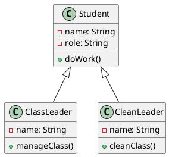
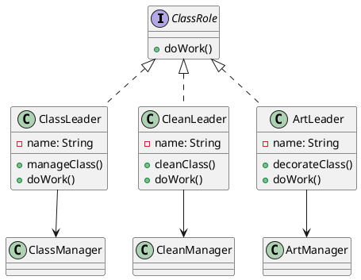
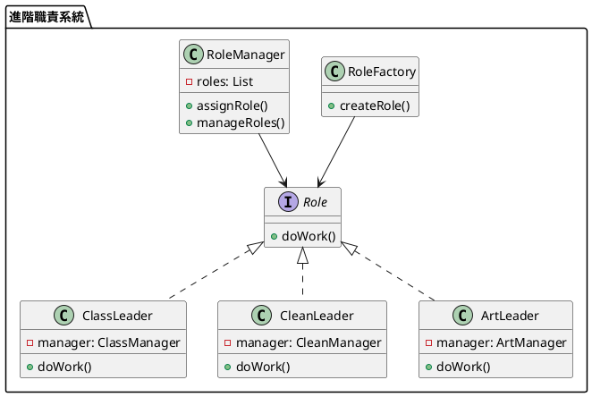

# 單一職責教學 - 以班級管理為例

## 初級（Beginner）層級

### 1. 概念說明
單一職責就像是在班級裡，每個同學都有自己負責的工作：
- 班長負責管理班級事務
- 衛生股長負責打掃工作
- 學藝股長負責布置教室

**為什麼需要單一職責？**
- 避免一個人做太多事情，容易出錯
- 當有問題時，可以快速找到負責的人
- 讓每個人都能專注做好自己的工作

**常見問題：**
- 一個同學同時負責太多工作，忙不過來
- 工作分配不清楚，大家互相推卸責任
- 當需要修改某項工作時，會影響到其他工作

**如何避免：**
- 每個人只負責一項主要工作
- 工作內容要明確寫下來
- 定期檢查工作分配是否合理

### 2. PlantUML 圖解


### 3. 分段教學步驟

#### 步驟 1：認識基本學生類別
```java
public class Student {
    private String name;
    private String role;
    
    public Student(String name, String role) {
        this.name = name;
        this.role = role;
    }
    
    public void doWork() {
        if (role.equals("班長")) {
            manageClass();
        } else if (role.equals("衛生股長")) {
            cleanClass();
        }
    }
    
    private void manageClass() {
        System.out.println(name + " 正在管理班級事務");
    }
    
    private void cleanClass() {
        System.out.println(name + " 正在打掃教室");
    }
}
```

#### 步驟 2：將工作分開
```java
public class ClassLeader extends Student {
    public ClassLeader(String name) {
        super(name, "班長");
    }
    
    @Override
    public void doWork() {
        manageClass();
    }
    
    private void manageClass() {
        System.out.println(getName() + " 正在管理班級事務");
    }
}

public class CleanLeader extends Student {
    public CleanLeader(String name) {
        super(name, "衛生股長");
    }
    
    @Override
    public void doWork() {
        cleanClass();
    }
    
    private void cleanClass() {
        System.out.println(getName() + " 正在打掃教室");
    }
}
```

## 中級（Intermediate）層級

### 1. 概念說明
中級學習者需要理解：
- 如何用程式碼來組織不同的工作
- 為什麼要使用介面（Interface）
- 如何讓程式更容易維護和擴展

**使用介面的好處：**
- 可以清楚地定義每個角色應該做什麼
- 讓程式更容易測試和修改
- 可以輕鬆添加新的角色

**常見問題：**
- 角色之間的工作有重複
- 新增角色時需要修改很多地方
- 很難測試每個角色的工作

**解決方法：**
- 使用介面定義工作內容
- 將具體工作交給專門的類別處理
- 使用依賴注入來管理角色

### 2. PlantUML 圖解


### 3. 分段教學步驟

#### 步驟 1：定義工作介面
```java
public interface ClassRole {
    void doWork();
}

public class ClassLeader implements ClassRole {
    private String name;
    private ClassManager manager;
    
    public ClassLeader(String name) {
        this.name = name;
        this.manager = new ClassManager();
    }
    
    @Override
    public void doWork() {
        manager.manageClass(name);
    }
}

public class CleanLeader implements ClassRole {
    private String name;
    private CleanManager manager;
    
    public CleanLeader(String name) {
        this.name = name;
        this.manager = new CleanManager();
    }
    
    @Override
    public void doWork() {
        manager.cleanClass(name);
    }
}
```

#### 步驟 2：管理工作
```java
public class ClassManager {
    public void manageClass(String name) {
        System.out.println(name + " 正在管理班級事務");
        // 班級管理相關的具體實現
    }
}

public class CleanManager {
    public void cleanClass(String name) {
        System.out.println(name + " 正在打掃教室");
        // 打掃相關的具體實現
    }
}
```

## 高級（Advanced）層級

### 1. 概念說明
高級學習者需要掌握：
- 如何設計可擴展的系統
- 如何使用工廠模式來創建角色
- 如何管理多個角色

**進階概念：**
- 工廠模式：統一創建角色的地方
- 依賴注入：讓角色更容易測試和修改
- 職責組合：可以組合多個角色

**常見問題：**
- 系統難以擴展
- 角色之間的關係複雜
- 測試困難

**解決方法：**
- 使用工廠模式創建角色
- 使用依賴注入管理角色
- 設計清晰的角色關係

### 2. PlantUML 圖解


### 3. 分段教學步驟

#### 步驟 1：角色工廠
```java
public interface Role {
    void doWork();
}

public class RoleFactory {
    public Role createRole(String type, String name) {
        switch (type) {
            case "班長":
                return new ClassLeader(name, new ClassManager());
            case "衛生股長":
                return new CleanLeader(name, new CleanManager());
            case "學藝股長":
                return new ArtLeader(name, new ArtManager());
            default:
                throw new IllegalArgumentException("未知的角色類型");
        }
    }
}

public class ClassLeader implements Role {
    private String name;
    private ClassManager manager;
    
    public ClassLeader(String name, ClassManager manager) {
        this.name = name;
        this.manager = manager;
    }
    
    @Override
    public void doWork() {
        manager.manageClass(name);
    }
}
```

#### 步驟 2：角色管理
```java
public class RoleManager {
    private List<Role> roles;
    
    public RoleManager() {
        roles = new ArrayList<>();
    }
    
    public void assignRole(Role role) {
        roles.add(role);
    }
    
    public void manageRoles() {
        for (Role role : roles) {
            role.doWork();
        }
    }
}
```

#### 步驟 3：擴展角色
```java
public class ArtLeader implements Role {
    private String name;
    private ArtManager manager;
    
    public ArtLeader(String name, ArtManager manager) {
        this.name = name;
        this.manager = manager;
    }
    
    @Override
    public void doWork() {
        manager.decorateClass(name);
    }
}

public class ArtManager {
    public void decorateClass(String name) {
        System.out.println(name + " 正在布置教室");
        // 布置教室相關的具體實現
    }
}
```

這個教學文件提供了從基礎到進階的單一職責學習路徑，每個層級都包含了相應的概念說明、圖解、教學步驟和實作範例。初級學習者可以從基本的學生類別開始，中級學習者可以學習介面定義和職責管理，而高級學習者則可以掌握職責工廠和職責擴展等進階功能。 