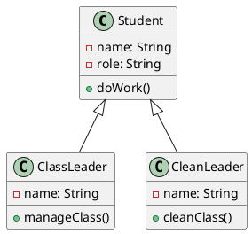
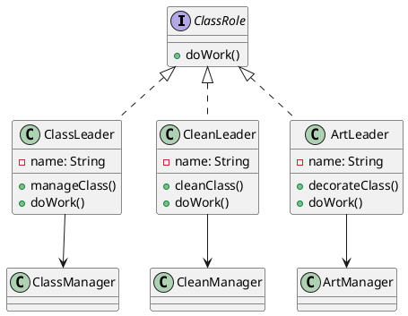
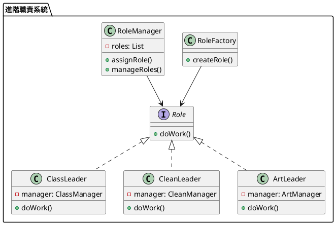

# 單一職責教學

## 初級（Beginner）層級

### 1. 概念說明
單一職責就像是在學校裡，每個同學都有自己負責的工作：
- 班長負責管理班級事務
- 衛生股長負責打掃工作
- 學藝股長負責布置教室
- 每個人只需要專注做好自己的事情

初級學習者需要了解：
- 什麼是單一職責
- 為什麼需要單一職責
- 基本的職責分離概念

### 2. PlantUML 圖解


### 3. 分段教學步驟

#### 步驟 1：基本學生類別
```java
public class Student {
    private String name;
    private String role;
    
    public Student(String name, String role) {
        this.name = name;
        this.role = role;
    }
    
    public void doWork() {
        if (role.equals("班長")) {
            manageClass();
        } else if (role.equals("衛生股長")) {
            cleanClass();
        }
    }
    
    private void manageClass() {
        System.out.println(name + " 正在管理班級事務");
    }
    
    private void cleanClass() {
        System.out.println(name + " 正在打掃教室");
    }
}
```

#### 步驟 2：職責分離
```java
public class ClassLeader extends Student {
    public ClassLeader(String name) {
        super(name, "班長");
    }
    
    @Override
    public void doWork() {
        manageClass();
    }
    
    private void manageClass() {
        System.out.println(getName() + " 正在管理班級事務");
    }
}

public class CleanLeader extends Student {
    public CleanLeader(String name) {
        super(name, "衛生股長");
    }
    
    @Override
    public void doWork() {
        cleanClass();
    }
    
    private void cleanClass() {
        System.out.println(getName() + " 正在打掃教室");
    }
}
```

## 中級（Intermediate）層級

### 1. 概念說明
中級學習者需要理解：
- 職責分離的實現方式
- 模組化設計
- 介面定義
- 職責邊界

### 2. PlantUML 圖解


### 3. 分段教學步驟

#### 步驟 1：介面定義
```java
public interface ClassRole {
    void doWork();
}

public class ClassLeader implements ClassRole {
    private String name;
    private ClassManager manager;
    
    public ClassLeader(String name) {
        this.name = name;
        this.manager = new ClassManager();
    }
    
    @Override
    public void doWork() {
        manager.manageClass(name);
    }
}

public class CleanLeader implements ClassRole {
    private String name;
    private CleanManager manager;
    
    public CleanLeader(String name) {
        this.name = name;
        this.manager = new CleanManager();
    }
    
    @Override
    public void doWork() {
        manager.cleanClass(name);
    }
}
```

#### 步驟 2：職責管理
```java
public class ClassManager {
    public void manageClass(String name) {
        System.out.println(name + " 正在管理班級事務");
        // 班級管理相關的具體實現
    }
}

public class CleanManager {
    public void cleanClass(String name) {
        System.out.println(name + " 正在打掃教室");
        // 打掃相關的具體實現
    }
}
```

## 高級（Advanced）層級

### 1. 概念說明
高級學習者需要掌握：
- 職責分離的進階應用
- 依賴注入
- 職責組合
- 職責擴展

### 2. PlantUML 圖解


### 3. 分段教學步驟

#### 步驟 1：職責工廠
```java
public interface Role {
    void doWork();
}

public class RoleFactory {
    public Role createRole(String type, String name) {
        switch (type) {
            case "班長":
                return new ClassLeader(name, new ClassManager());
            case "衛生股長":
                return new CleanLeader(name, new CleanManager());
            case "學藝股長":
                return new ArtLeader(name, new ArtManager());
            default:
                throw new IllegalArgumentException("未知的角色類型");
        }
    }
}

public class ClassLeader implements Role {
    private String name;
    private ClassManager manager;
    
    public ClassLeader(String name, ClassManager manager) {
        this.name = name;
        this.manager = manager;
    }
    
    @Override
    public void doWork() {
        manager.manageClass(name);
    }
}
```

#### 步驟 2：職責管理
```java
public class RoleManager {
    private List<Role> roles;
    
    public RoleManager() {
        roles = new ArrayList<>();
    }
    
    public void assignRole(Role role) {
        roles.add(role);
    }
    
    public void manageRoles() {
        for (Role role : roles) {
            role.doWork();
        }
    }
}
```

#### 步驟 3：職責擴展
```java
public class ArtLeader implements Role {
    private String name;
    private ArtManager manager;
    
    public ArtLeader(String name, ArtManager manager) {
        this.name = name;
        this.manager = manager;
    }
    
    @Override
    public void doWork() {
        manager.decorateClass(name);
    }
}

public class ArtManager {
    public void decorateClass(String name) {
        System.out.println(name + " 正在布置教室");
        // 布置教室相關的具體實現
    }
}
```

這個教學文件提供了從基礎到進階的單一職責學習路徑，每個層級都包含了相應的概念說明、圖解、教學步驟和實作範例。初級學習者可以從基本的學生類別開始，中級學習者可以學習介面定義和職責管理，而高級學習者則可以掌握職責工廠和職責擴展等進階功能。 