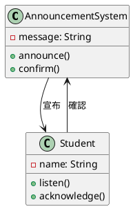
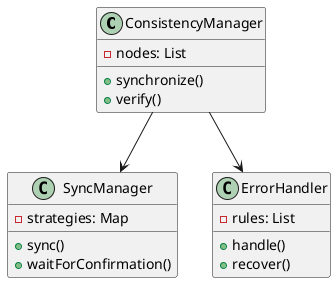
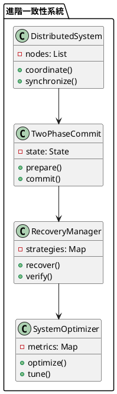

# 強一致性教學

## 初級（Beginner）層級

### 1. 概念說明
強一致性就像是在學校裡，當老師要宣布重要事項時：
- 必須確保所有同學都聽到並理解後，才能繼續下一個事項
- 不允許有任何同學沒聽到或理解錯誤
- 系統會等待所有同學都準備好，才進行下一步

初級學習者需要了解：
- 什麼是強一致性
- 為什麼需要強一致性
- 基本的資料同步方式

### 2. PlantUML 圖解


### 3. 分段教學步驟

#### 步驟 1：基本宣布系統
```java
public class SimpleAnnouncementSystem {
    private String message;
    private List<Student> students;
    
    public SimpleAnnouncementSystem() {
        students = new ArrayList<>();
    }
    
    public void addStudent(Student student) {
        students.add(student);
        System.out.println("加入學生: " + student.getName());
    }
    
    public void announce(String message) {
        this.message = message;
        System.out.println("開始宣布: " + message);
        
        // 等待所有學生確認
        for (Student student : students) {
            student.listen(message);
            while (!student.hasAcknowledged()) {
                try {
                    Thread.sleep(100);
                } catch (InterruptedException e) {
                    e.printStackTrace();
                }
            }
        }
        
        System.out.println("所有學生都已確認");
    }
}

class Student {
    private String name;
    private boolean acknowledged;
    
    public Student(String name) {
        this.name = name;
        this.acknowledged = false;
    }
    
    public void listen(String message) {
        System.out.println(name + " 聽到: " + message);
        acknowledged = true;
    }
    
    public boolean hasAcknowledged() {
        return acknowledged;
    }
    
    public String getName() {
        return name;
    }
}
```

#### 步驟 2：簡單的確認機制
```java
public class ConfirmationSystem {
    private SimpleAnnouncementSystem announcementSystem;
    
    public void waitForConfirmation() {
        // 等待所有學生確認
        while (!announcementSystem.isConfirmed()) {
            try {
                Thread.sleep(1000);
            } catch (InterruptedException e) {
                e.printStackTrace();
            }
        }
        System.out.println("所有確認完成");
    }
}
```

## 中級（Intermediate）層級

### 1. 概念說明
中級學習者需要理解：
- 強一致性的實現方式
- 同步機制
- 確認策略
- 錯誤處理

### 2. PlantUML 圖解


### 3. 分段教學步驟

#### 步驟 1：同步管理
```java
import java.util.*;

public class SyncManager {
    private List<Node> nodes;
    private Map<String, SyncStrategy> strategies;
    
    public void synchronize(String key, String value) {
        // 選擇同步策略
        SyncStrategy strategy = selectStrategy(key);
        
        // 執行同步
        strategy.sync(nodes, key, value);
        
        // 等待所有節點確認
        waitForConfirmation();
    }
    
    private SyncStrategy selectStrategy(String key) {
        return strategies.getOrDefault(key, new DefaultSyncStrategy());
    }
    
    private void waitForConfirmation() {
        boolean allConfirmed = false;
        while (!allConfirmed) {
            allConfirmed = true;
            for (Node node : nodes) {
                if (!node.isConfirmed()) {
                    allConfirmed = false;
                    break;
                }
            }
        }
    }
}

interface SyncStrategy {
    void sync(List<Node> nodes, String key, String value);
}

class DefaultSyncStrategy implements SyncStrategy {
    @Override
    public void sync(List<Node> nodes, String key, String value) {
        for (Node node : nodes) {
            node.update(key, value);
        }
    }
}
```

#### 步驟 2：錯誤處理
```java
public class ErrorHandler {
    private List<ErrorRule> rules;
    
    public void handleError(String key, ErrorType type) {
        // 選擇錯誤處理規則
        ErrorRule rule = selectRule(type);
        
        // 處理錯誤
        rule.handle(key);
        
        // 恢復系統狀態
        recover(key);
    }
    
    private ErrorRule selectRule(ErrorType type) {
        return rules.stream()
            .filter(rule -> rule.isApplicable(type))
            .findFirst()
            .orElse(new DefaultErrorRule());
    }
}

interface ErrorRule {
    boolean isApplicable(ErrorType type);
    void handle(String key);
}
```

## 高級（Advanced）層級

### 1. 概念說明
高級學習者需要掌握：
- 分散式系統設計
- 兩階段提交（Two-Phase Commit）
- 故障恢復
- 系統優化

### 2. PlantUML 圖解


### 3. 分段教學步驟

#### 步驟 1：兩階段提交
```java
import java.util.*;

public class TwoPhaseCommit {
    private List<Node> nodes;
    private State state;
    
    public void commit(String key, String value) {
        // 第一階段：準備
        boolean allPrepared = prepare(key, value);
        
        if (allPrepared) {
            // 第二階段：提交
            commitAll(key, value);
        } else {
            // 回滾
            rollback(key);
        }
    }
    
    private boolean prepare(String key, String value) {
        boolean allPrepared = true;
        for (Node node : nodes) {
            if (!node.prepare(key, value)) {
                allPrepared = false;
                break;
            }
        }
        return allPrepared;
    }
    
    private void commitAll(String key, String value) {
        for (Node node : nodes) {
            node.commit(key, value);
        }
    }
    
    private void rollback(String key) {
        for (Node node : nodes) {
            node.rollback(key);
        }
    }
}

enum State {
    PREPARING, COMMITTED, ROLLED_BACK
}
```

#### 步驟 2：故障恢復
```java
public class RecoveryManager {
    private DistributedSystem system;
    private TwoPhaseCommit commit;
    
    public void recover(String key) {
        // 檢查系統狀態
        SystemState state = checkSystemState();
        
        // 選擇恢復策略
        RecoveryStrategy strategy = selectStrategy(state);
        
        // 執行恢復
        strategy.recover(key);
        
        // 驗證恢復結果
        verifyRecovery(key);
    }
    
    private SystemState checkSystemState() {
        // 檢查系統狀態
        return system.getState();
    }
    
    private RecoveryStrategy selectStrategy(SystemState state) {
        return strategies.get(state);
    }
}

interface RecoveryStrategy {
    void recover(String key);
    void verify(String key);
}
```

#### 步驟 3：系統優化
```java
public class SystemOptimizer {
    private DistributedSystem system;
    private List<PerformanceMetric> metrics;
    
    public void optimize() {
        // 收集效能指標
        collectMetrics();
        
        // 分析系統效能
        analyzePerformance();
        
        // 調整系統參數
        tuneSystem();
    }
    
    private void analyzePerformance() {
        for (PerformanceMetric metric : metrics) {
            if (needsOptimization(metric)) {
                // 觸發優化
                triggerOptimization(metric);
            }
        }
    }
}

class PerformanceMetric {
    private String nodeId;
    private double syncTime;
    private double confirmationTime;
    private Date timestamp;
    
    public PerformanceMetric(String nodeId, double syncTime, double confirmationTime) {
        this.nodeId = nodeId;
        this.syncTime = syncTime;
        this.confirmationTime = confirmationTime;
        this.timestamp = new Date();
    }
}
```

這個教學文件提供了從基礎到進階的強一致性學習路徑，每個層級都包含了相應的概念說明、圖解、教學步驟和實作範例。初級學習者可以從基本的宣布系統開始，中級學習者可以學習同步機制和錯誤處理，而高級學習者則可以掌握兩階段提交和故障恢復等進階功能。 