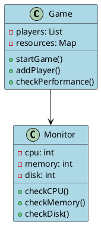
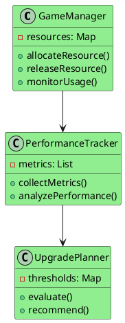
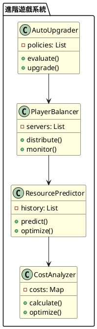

# 垂直擴展教學：讓你的程式跑得更快

## 初級（Beginner）層級

### 1. 概念說明
想像你在玩一個線上遊戲，當越來越多人加入時，遊戲可能會變慢。垂直擴展就像是：
- 升級你的電腦（增加記憶體）
- 換更好的顯示卡（升級 CPU）
- 買更大的硬碟（增加儲存空間）

初級學習者需要了解：
- 什麼是垂直擴展
- 為什麼需要擴展
- 基本的擴展方式

### 2. 使用原因
就像玩遊戲需要更好的電腦一樣，程式也需要更好的資源：
1. 效能需求：
   - 處理更多玩家
   - 遊戲運行更順暢
   - 載入地圖更快

2. 遊戲成長：
   - 玩家越來越多
   - 地圖越來越大
   - 遊戲內容更豐富

3. 遊戲體驗：
   - 減少卡頓
   - 避免當機
   - 讓遊戲更穩定

### 3. 問題表象
當遊戲變慢時，你可能會看到：
1. 效能問題：
   - 遊戲畫面卡頓
   - 載入時間變長
   - 操作反應變慢

2. 成本問題：
   - 需要更好的電腦
   - 電費變多
   - 維護成本增加

3. 擴展限制：
   - 電腦有極限
   - 升級越來越貴
   - 維護越來越難

### 4. 避免方法
如何避免遊戲變慢：
1. 遊戲設計：
   - 預留升級空間
   - 監控遊戲效能
   - 優化遊戲資源

2. 遊戲開發：
   - 使用效能監控工具
   - 定期檢查遊戲狀態
   - 優化遊戲程式碼

3. 遊戲維護：
   - 定期更新
   - 及時修復問題
   - 監控玩家體驗

### 5. 實戰案例

#### 案例一：簡單的效能監控
```java
public class GameMonitor {
    public static void main(String[] args) {
        // 檢查電腦效能
        System.out.println("CPU 使用率: " + getCPUUsage() + "%");
        System.out.println("記憶體使用: " + getMemoryUsage() + "MB");
        System.out.println("硬碟空間: " + getDiskSpace() + "GB");
    }
    
    private static int getCPUUsage() {
        // 簡單的 CPU 使用率檢查
        return 50; // 範例值
    }
    
    private static int getMemoryUsage() {
        // 簡單的記憶體使用檢查
        return 1024; // 範例值
    }
    
    private static int getDiskSpace() {
        // 簡單的硬碟空間檢查
        return 500; // 範例值
    }
}
```

### 6. PlantUML 圖解


## 中級（Intermediate）層級

### 1. 概念說明
中級學習者需要理解：
- 如何管理遊戲資源
- 如何監控遊戲效能
- 如何規劃升級策略
- 如何計算升級成本

### 2. PlantUML 圖解


### 3. 分段教學步驟

#### 步驟 1：資源管理
```java
public class GameResourceManager {
    private Map<String, Integer> resources;
    
    public GameResourceManager() {
        resources = new HashMap<>();
    }
    
    public void addResource(String type, int amount) {
        int current = resources.getOrDefault(type, 0);
        resources.put(type, current + amount);
        System.out.println("已增加 " + amount + " 單位的 " + type);
    }
    
    public void useResource(String type, int amount) {
        int current = resources.getOrDefault(type, 0);
        if (current >= amount) {
            resources.put(type, current - amount);
            System.out.println("已使用 " + amount + " 單位的 " + type);
        } else {
            System.out.println("資源不足！");
        }
    }
    
    public void checkResources() {
        for (Map.Entry<String, Integer> entry : resources.entrySet()) {
            System.out.println(entry.getKey() + " 剩餘: " + entry.getValue());
        }
    }
}
```

#### 步驟 2：效能監控
```java
public class GamePerformanceMonitor {
    private List<PerformanceMetric> metrics;
    
    public void checkGamePerformance() {
        // 收集遊戲效能數據
        metrics.add(new PerformanceMetric("FPS", getFPS()));
        metrics.add(new PerformanceMetric("Ping", getPing()));
        metrics.add(new PerformanceMetric("Players", getPlayerCount()));
    }
    
    public void showPerformance() {
        for (PerformanceMetric metric : metrics) {
            System.out.println(metric.getName() + ": " + metric.getValue());
        }
    }
}

class PerformanceMetric {
    private String name;
    private int value;
    
    public PerformanceMetric(String name, int value) {
        this.name = name;
        this.value = value;
    }
}
```

## 高級（Advanced）層級

### 1. 概念說明
高級學習者需要掌握：
- 自動化升級系統
- 玩家負載平衡
- 資源需求預測
- 成本效益分析

### 2. PlantUML 圖解


### 3. 分段教學步驟

#### 步驟 1：自動化升級
```java
public class GameAutoUpgrader {
    private List<UpgradePolicy> policies;
    private ResourcePredictor predictor;
    private CostAnalyzer analyzer;
    
    public void checkUpgrade() {
        // 預測未來需求
        Map<String, Integer> predictions = predictor.predict();
        
        // 計算升級成本
        Map<String, Double> costs = analyzer.calculate(predictions);
        
        // 決定是否升級
        for (UpgradePolicy policy : policies) {
            if (policy.shouldUpgrade(predictions, costs)) {
                upgrade(policy.getResourceType(), policy.getAmount());
            }
        }
    }
    
    private void upgrade(String type, int amount) {
        System.out.println("自動升級 " + type + " 增加 " + amount + " 單位");
    }
}
```

#### 步驟 2：玩家平衡
```java
public class GameServerBalancer {
    private List<GameServer> servers;
    private Map<GameServer, Integer> playerCount;
    
    public void addPlayer(Player player) {
        // 找出玩家最少的伺服器
        GameServer target = findBestServer();
        
        // 分配玩家
        target.addPlayer(player);
        
        // 更新玩家數量
        updatePlayerCount(target);
    }
    
    private GameServer findBestServer() {
        return servers.stream()
            .min((s1, s2) -> playerCount.get(s1) - playerCount.get(s2))
            .orElseThrow();
    }
}

class GameServer {
    private List<Player> players;
    
    public void addPlayer(Player player) {
        players.add(player);
    }
}
```

這個教學文件提供了從基礎到進階的遊戲效能優化學習路徑，每個層級都包含了相應的概念說明、圖解、教學步驟和實作範例。初級學習者可以從基本的效能監控開始，中級學習者可以學習資源管理和效能追蹤，而高級學習者則可以掌握自動化升級和玩家平衡等進階功能。 
這個教學文件提供了從基礎到進階的垂直擴展學習路徑，每個層級都包含了相應的概念說明、圖解、教學步驟和實作範例。初級學習者可以從基本的系統監控開始，中級學習者可以學習資源管理和效能監控，而高級學習者則可以掌握自動化擴展和負載平衡等進階功能。 