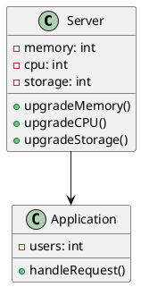
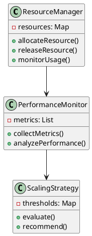
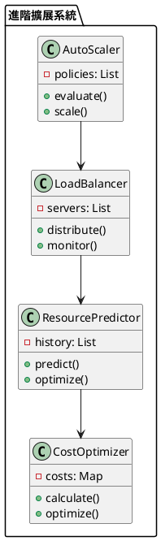

# 垂直擴展教學

## 初級（Beginner）層級

### 1. 概念說明
垂直擴展就像是在學校裡，當一個班級的學生越來越多時，我們可以：
- 增加教室的容量（增加記憶體）
- 換更大的教室（升級 CPU）
- 增加更多的設備（增加硬碟空間）

初級學習者需要了解：
- 什麼是垂直擴展
- 為什麼需要擴展
- 基本的擴展方式

### 2. PlantUML 圖解


### 3. 分段教學步驟

#### 步驟 1：基本系統監控
```java
public class SystemMonitor {
    private int memoryUsage;
    private int cpuUsage;
    private int storageUsage;
    
    public void checkSystemStatus() {
        // 檢查記憶體使用量
        memoryUsage = getMemoryUsage();
        System.out.println("記憶體使用量: " + memoryUsage + "%");
        
        // 檢查 CPU 使用量
        cpuUsage = getCPUUsage();
        System.out.println("CPU 使用量: " + cpuUsage + "%");
        
        // 檢查儲存空間使用量
        storageUsage = getStorageUsage();
        System.out.println("儲存空間使用量: " + storageUsage + "%");
    }
    
    private int getMemoryUsage() {
        // 模擬取得記憶體使用量
        return 75;
    }
    
    private int getCPUUsage() {
        // 模擬取得 CPU 使用量
        return 60;
    }
    
    private int getStorageUsage() {
        // 模擬取得儲存空間使用量
        return 80;
    }
}
```

#### 步驟 2：簡單的擴展決策
```java
public class ScalingDecision {
    private SystemMonitor monitor;
    
    public void makeDecision() {
        monitor.checkSystemStatus();
        
        if (monitor.getMemoryUsage() > 80) {
            System.out.println("建議增加記憶體");
        }
        
        if (monitor.getCPUUsage() > 70) {
            System.out.println("建議升級 CPU");
        }
        
        if (monitor.getStorageUsage() > 90) {
            System.out.println("建議增加儲存空間");
        }
    }
}
```

## 中級（Intermediate）層級

### 1. 概念說明
中級學習者需要理解：
- 系統資源管理
- 效能監控
- 擴展策略
- 成本效益分析

### 2. PlantUML 圖解


### 3. 分段教學步驟

#### 步驟 1：資源管理
```java
import java.util.*;

public class ResourceManager {
    private Map<String, Integer> resources;
    private List<PerformanceMetric> metrics;
    
    public ResourceManager() {
        resources = new HashMap<>();
        metrics = new ArrayList<>();
    }
    
    public void allocateResource(String resourceType, int amount) {
        resources.put(resourceType, resources.getOrDefault(resourceType, 0) + amount);
        System.out.println("已分配 " + amount + " 單位的 " + resourceType);
    }
    
    public void releaseResource(String resourceType, int amount) {
        int current = resources.getOrDefault(resourceType, 0);
        resources.put(resourceType, Math.max(0, current - amount));
        System.out.println("已釋放 " + amount + " 單位的 " + resourceType);
    }
    
    public void monitorUsage() {
        for (Map.Entry<String, Integer> entry : resources.entrySet()) {
            System.out.println(entry.getKey() + " 使用量: " + entry.getValue());
        }
    }
}

class PerformanceMetric {
    private String name;
    private int value;
    private Date timestamp;
    
    public PerformanceMetric(String name, int value) {
        this.name = name;
        this.value = value;
        this.timestamp = new Date();
    }
}
```

#### 步驟 2：效能監控
```java
public class PerformanceMonitor {
    private List<PerformanceMetric> metrics;
    
    public void collectMetrics() {
        // 收集各種效能指標
        metrics.add(new PerformanceMetric("CPU", getCPUUsage()));
        metrics.add(new PerformanceMetric("Memory", getMemoryUsage()));
        metrics.add(new PerformanceMetric("Storage", getStorageUsage()));
    }
    
    public void analyzePerformance() {
        for (PerformanceMetric metric : metrics) {
            System.out.println(metric.getName() + " 效能分析: " + metric.getValue());
        }
    }
}
```

## 高級（Advanced）層級

### 1. 概念說明
高級學習者需要掌握：
- 自動化擴展
- 負載平衡
- 資源預測
- 成本優化

### 2. PlantUML 圖解


### 3. 分段教學步驟

#### 步驟 1：自動化擴展
```java
import java.util.*;
import java.time.*;

public class AutoScaler {
    private List<ScalingPolicy> policies;
    private ResourcePredictor predictor;
    private CostOptimizer optimizer;
    
    public AutoScaler() {
        policies = new ArrayList<>();
        predictor = new ResourcePredictor();
        optimizer = new CostOptimizer();
    }
    
    public void evaluate() {
        // 預測未來資源需求
        Map<String, Integer> predictions = predictor.predict();
        
        // 計算成本效益
        Map<String, Double> costs = optimizer.calculate(predictions);
        
        // 根據策略決定是否擴展
        for (ScalingPolicy policy : policies) {
            if (policy.shouldScale(predictions, costs)) {
                scale(policy.getResourceType(), policy.getAmount());
            }
        }
    }
    
    private void scale(String resourceType, int amount) {
        System.out.println("自動擴展 " + resourceType + " 增加 " + amount + " 單位");
    }
}

class ScalingPolicy {
    private String resourceType;
    private int threshold;
    private int amount;
    
    public boolean shouldScale(Map<String, Integer> predictions, Map<String, Double> costs) {
        return predictions.getOrDefault(resourceType, 0) > threshold;
    }
}
```

#### 步驟 2：負載平衡
```java
public class LoadBalancer {
    private List<Server> servers;
    private Map<Server, Integer> loadMap;
    
    public void distribute(Request request) {
        // 找出負載最低的伺服器
        Server target = findLeastLoadedServer();
        
        // 分配請求
        target.handleRequest(request);
        
        // 更新負載狀態
        updateLoad(target);
    }
    
    private Server findLeastLoadedServer() {
        return servers.stream()
            .min((s1, s2) -> loadMap.get(s1) - loadMap.get(s2))
            .orElseThrow();
    }
    
    private void updateLoad(Server server) {
        loadMap.put(server, loadMap.get(server) + 1);
    }
}

class Server {
    public void handleRequest(Request request) {
        // 處理請求
    }
}
```

#### 步驟 3：資源預測
```java
public class ResourcePredictor {
    private List<ResourceUsage> history;
    
    public Map<String, Integer> predict() {
        Map<String, Integer> predictions = new HashMap<>();
        
        // 使用歷史數據預測未來需求
        for (ResourceUsage usage : history) {
            int predicted = predictNextValue(usage);
            predictions.put(usage.getResourceType(), predicted);
        }
        
        return predictions;
    }
    
    private int predictNextValue(ResourceUsage usage) {
        // 使用簡單的線性回歸預測
        return usage.getCurrentValue() + 
               (usage.getCurrentValue() - usage.getPreviousValue());
    }
}

class ResourceUsage {
    private String resourceType;
    private int currentValue;
    private int previousValue;
}
```

這個教學文件提供了從基礎到進階的垂直擴展學習路徑，每個層級都包含了相應的概念說明、圖解、教學步驟和實作範例。初級學習者可以從基本的系統監控開始，中級學習者可以學習資源管理和效能監控，而高級學習者則可以掌握自動化擴展和負載平衡等進階功能。 