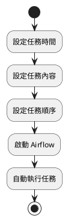
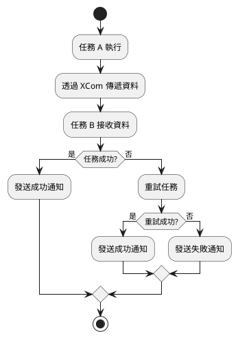
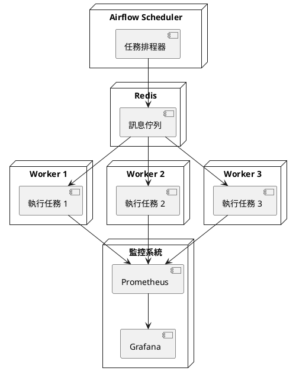

# Apache Airflow 教學文件

這份教學文件將分為初級、中級、高級三個階段，幫助你從不會用到會上線、除錯與調校，全面掌握 Airflow 這套排程與工作流工具。

---

## 🟢 初級階段：Airflow 是什麼？怎麼安裝與開始使用？

### ✅ 概念說明

Airflow 就像是一個「自動執行任務的管家」。想像你每天都要做很多事情，像是：
- 早上 7 點起床
- 8 點吃早餐
- 9 點上學
- 下午 4 點放學
- 晚上 10 點睡覺

如果這些事情都能自動完成，那該有多好！Airflow 就是幫你自動完成這些事情的系統。

**可能遇到的問題：**
1. 任務沒有按時執行
2. 任務執行失敗
3. 不知道任務是否完成

**如何避免：**
1. 設定正確的時間
2. 檢查任務的依賴關係
3. 設定通知機制

### ✅ 流程圖解



### ✅ 安裝步驟

1. 下載 Airflow
```bash
git clone https://github.com/apache/airflow.git
cd airflow
cd docs/apache-airflow/start/docker-compose
```

2. 設定環境
```bash
cp .env.example .env
```

3. 啟動 Airflow
```bash
docker-compose up airflow-init
docker-compose up -d
```

### ✅ 實作範例

建立你的第一個自動化任務：

```python
from airflow import DAG
from airflow.operators.python import PythonOperator
from datetime import datetime

def say_hello():
    print("早安！今天也要加油！")

def say_bye():
    print("晚安！明天見！")

# 設定任務
default_args = {
    'start_date': datetime(2024, 1, 1)
}

# 建立 DAG（就像是一個任務清單）
dag = DAG('daily_routine', 
          schedule_interval='@daily', 
          default_args=default_args, 
          catchup=False)

# 建立任務
morning_task = PythonOperator(
    task_id='say_morning',
    python_callable=say_hello,
    dag=dag
)

night_task = PythonOperator(
    task_id='say_night',
    python_callable=say_bye,
    dag=dag
)

# 設定任務順序
morning_task >> night_task
```

---

## 🟡 中級階段：實務應用與進階操作

### ✅ 概念說明

在中級階段，我們要學習如何：
1. 讓任務之間可以互相溝通
2. 處理任務失敗的情況
3. 發送通知給使用者

**可能遇到的問題：**
1. 任務之間需要傳遞資料
2. 任務執行失敗需要重試
3. 需要知道任務的執行結果

**如何避免：**
1. 使用 XCom 傳遞資料
2. 設定重試機制
3. 設定通知系統

### ✅ 流程圖解



### ✅ 實作範例

建立一個會互相溝通的任務系統：

```python
from airflow import DAG
from airflow.operators.python import PythonOperator
from airflow.operators.email import EmailOperator
from datetime import datetime, timedelta

def get_weather(**kwargs):
    # 假裝我們從網路取得天氣資料
    weather = "晴天"
    kwargs['ti'].xcom_push(key='weather', value=weather)
    return weather

def decide_activity(**kwargs):
    weather = kwargs['ti'].xcom_pull(task_ids='get_weather', key='weather')
    if weather == "晴天":
        return "去公園玩"
    else:
        return "在家看書"

default_args = {
    'start_date': datetime(2024, 1, 1),
    'retries': 3,
    'retry_delay': timedelta(minutes=5)
}

dag = DAG('weather_activity', 
          schedule_interval='@daily', 
          default_args=default_args)

get_weather_task = PythonOperator(
    task_id='get_weather',
    python_callable=get_weather,
    provide_context=True,
    dag=dag
)

decide_activity_task = PythonOperator(
    task_id='decide_activity',
    python_callable=decide_activity,
    provide_context=True,
    dag=dag
)

send_email = EmailOperator(
    task_id='send_email',
    to='you@example.com',
    subject='今日活動建議',
    html_content='根據天氣，建議你：{{ task_instance.xcom_pull(task_ids="decide_activity") }}',
    dag=dag
)

get_weather_task >> decide_activity_task >> send_email
```

---

## 🔴 高級階段：錯誤排查與效能優化

### ✅ 概念說明

在高級階段，我們要學習：
1. 如何處理大量任務
2. 如何讓任務執行得更快
3. 如何監控系統健康狀態

**可能遇到的問題：**
1. 任務太多導致系統變慢
2. 資源不足
3. 難以追蹤問題

**如何避免：**
1. 使用分散式架構
2. 設定資源限制
3. 建立監控系統

### ✅ 架構圖解



### ✅ 實作範例

設定分散式系統與監控：

```python
# 設定 Celery Executor
executor = CeleryExecutor(
    app_name='airflow',
    broker_url='redis://redis:6379/0',
    result_backend='redis://redis:6379/0'
)

# 設定資源池
default_args = {
    'pool': 'default_pool',
    'pool_slots': 1,
    'priority_weight': 1,
    'queue': 'default'
}

# 設定監控
from airflow.contrib.operators.prometheus_operator import PrometheusOperator

monitor_task = PrometheusOperator(
    task_id='monitor_metrics',
    prometheus_config={
        'scrape_interval': '15s',
        'evaluation_interval': '15s'
    },
    dag=dag
)

# 設定 Slack 通知
from airflow.contrib.operators.slack_webhook_operator import SlackWebhookOperator

slack_notification = SlackWebhookOperator(
    task_id='slack_notification',
    webhook_token='your-slack-token',
    message='任務執行完成！',
    channel='#airflow-notifications',
    dag=dag
)
```

---

這份教學完整涵蓋了 Airflow 的初級、中級與高級操作範疇，讓你從完全不懂到可以部署生產任務、擴充與優化！
