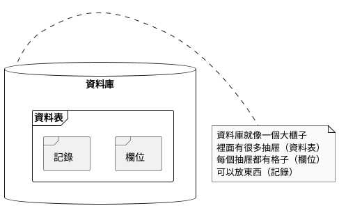
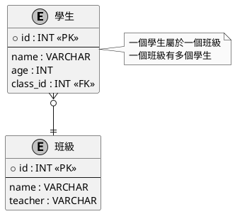
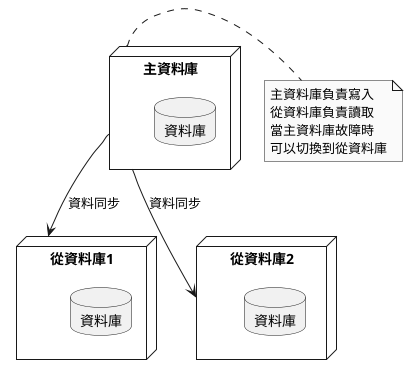

# MariaDB 資料庫程式設計教學

## 目錄

1. [初級篇：資料庫基礎入門](#初級篇資料庫基礎入門)
2. [中級篇：資料庫應用開發](#中級篇資料庫應用開發)
3. [高級篇：資料庫系統設計](#高級篇資料庫系統設計)

## 初級篇：資料庫基礎入門

### 1. 概念說明

#### 什麼是資料庫？
想像一下，資料庫就像是一個超級大的電子檔案櫃，可以幫我們把資料整理得整整齊齊。MariaDB 就是一個專門管理這個檔案櫃的系統。

#### 為什麼要學資料庫？
- 可以幫我們把資料整理得很有條理
- 可以快速找到需要的資料
- 可以避免資料重複或錯誤
- 可以讓多個人同時使用資料

#### 常見問題與解決方法
1. 資料不見了怎麼辦？
   - 定期備份資料
   - 使用交易功能保護資料
   
2. 資料查詢很慢怎麼辦？
   - 建立適當的索引
   - 優化查詢語句

### 2. 基本架構圖



### 3. 分段教學步驟

#### 第一步：安裝 MariaDB
1. 下載 MariaDB 安裝程式
2. 按照安裝精靈的指示完成安裝
3. 記住設定的密碼

#### 第二步：建立第一個資料庫
1. 打開命令提示字元
2. 輸入：`mysql -u root -p`
3. 輸入密碼
4. 建立資料庫：`CREATE DATABASE school;`
5. 使用資料庫：`USE school;`

#### 第三步：建立資料表
1. 建立學生資料表：
```sql
CREATE TABLE students (
    id INT PRIMARY KEY,
    name VARCHAR(50),
    age INT,
    class VARCHAR(20)
);
```

### 4. 實作範例

```java
import java.sql.*;

public class SimpleDatabase {
    public static void main(String[] args) {
        try {
            // 連接資料庫
            Connection conn = DriverManager.getConnection(
                "jdbc:mysql://localhost:3306/school",
                "root",
                "password"
            );
            
            // 新增學生資料
            Statement stmt = conn.createStatement();
            String sql = "INSERT INTO students VALUES (1, '小明', 15, '一年一班')";
            stmt.executeUpdate(sql);
            
            // 查詢學生資料
            ResultSet rs = stmt.executeQuery("SELECT * FROM students");
            while (rs.next()) {
                System.out.println("姓名：" + rs.getString("name"));
                System.out.println("年齡：" + rs.getInt("age"));
            }
            
            // 關閉連接
            conn.close();
        } catch (Exception e) {
            System.out.println("發生錯誤：" + e.getMessage());
        }
    }
}
```

## 中級篇：資料庫應用開發

### 1. 概念說明

#### 資料庫設計原則
- 每個資料表應該只負責一件事情
- 避免重複的資料
- 使用適當的資料類型
- 建立必要的索引

#### 常見問題與解決方法
1. 資料不一致怎麼辦？
   - 使用外鍵約束
   - 設定資料驗證規則
   
2. 多人同時使用資料怎麼辦？
   - 使用交易機制
   - 設定適當的權限

### 2. 資料庫關係圖



### 3. 分段教學步驟

#### 第一步：建立關聯式資料表
1. 建立班級資料表：
```sql
CREATE TABLE classes (
    id INT PRIMARY KEY,
    name VARCHAR(50),
    teacher VARCHAR(50)
);
```

2. 修改學生資料表，加入外鍵：
```sql
ALTER TABLE students
ADD FOREIGN KEY (class_id) REFERENCES classes(id);
```

#### 第二步：使用交易功能
```sql
START TRANSACTION;
INSERT INTO classes VALUES (1, '一年一班', '王老師');
INSERT INTO students VALUES (1, '小明', 15, 1);
COMMIT;
```

### 4. 實作範例

```java
import java.sql.*;

public class TransactionExample {
    public static void main(String[] args) {
        Connection conn = null;
        try {
            conn = DriverManager.getConnection(
                "jdbc:mysql://localhost:3306/school",
                "root",
                "password"
            );
            
            // 開始交易
            conn.setAutoCommit(false);
            
            // 新增班級
            PreparedStatement pstmt = conn.prepareStatement(
                "INSERT INTO classes VALUES (?, ?, ?)"
            );
            pstmt.setInt(1, 1);
            pstmt.setString(2, "一年一班");
            pstmt.setString(3, "王老師");
            pstmt.executeUpdate();
            
            // 新增學生
            pstmt = conn.prepareStatement(
                "INSERT INTO students VALUES (?, ?, ?, ?)"
            );
            pstmt.setInt(1, 1);
            pstmt.setString(2, "小明");
            pstmt.setInt(3, 15);
            pstmt.setInt(4, 1);
            pstmt.executeUpdate();
            
            // 提交交易
            conn.commit();
            
        } catch (Exception e) {
            if (conn != null) {
                try {
                    // 發生錯誤時回滾
                    conn.rollback();
                } catch (SQLException ex) {
                    ex.printStackTrace();
                }
            }
            e.printStackTrace();
        } finally {
            if (conn != null) {
                try {
                    conn.close();
                } catch (SQLException e) {
                    e.printStackTrace();
                }
            }
        }
    }
}
```

## 高級篇：資料庫系統設計

### 1. 概念說明

#### 系統架構設計
- 主從式架構：一個主資料庫，多個從資料庫
- 資料同步：確保多個資料庫的資料一致
- 效能優化：提高資料庫的處理速度
- 安全性：保護資料不被未授權存取

#### 常見問題與解決方法
1. 系統當機怎麼辦？
   - 設定自動備份
   - 建立容錯機制
   
2. 資料量太大怎麼辦？
   - 使用分表策略
   - 優化查詢語句
   - 使用快取機制

### 2. 主從架構圖



### 3. 分段教學步驟

#### 第一步：設定主從複製
1. 在主資料庫設定：
```sql
GRANT REPLICATION SLAVE ON *.* TO 'repl'@'%' IDENTIFIED BY 'password';
FLUSH PRIVILEGES;
```

2. 在從資料庫設定：
```sql
CHANGE MASTER TO
MASTER_HOST='master_host',
MASTER_USER='repl',
MASTER_PASSWORD='password',
MASTER_LOG_FILE='mysql-bin.000001',
MASTER_LOG_POS=4;
START SLAVE;
```

#### 第二步：設定自動備份
1. 建立備份腳本：
```bash
#!/bin/bash
mysqldump -u root -p school > backup_$(date +%Y%m%d).sql
```

2. 設定定時執行：
```bash
0 2 * * * /path/to/backup.sh
```

### 4. 實作範例

```java
import java.sql.*;
import java.util.concurrent.*;

public class HighAvailabilitySystem {
    private static final String MASTER_URL = "jdbc:mysql://master:3306/school";
    private static final String SLAVE1_URL = "jdbc:mysql://slave1:3306/school";
    private static final String SLAVE2_URL = "jdbc:mysql://slave2:3306/school";
    
    private Connection masterConn;
    private Connection[] slaveConns;
    private int currentSlave = 0;
    
    public HighAvailabilitySystem() throws SQLException {
        // 連接主資料庫
        masterConn = DriverManager.getConnection(
            MASTER_URL, "root", "password"
        );
        
        // 連接從資料庫
        slaveConns = new Connection[2];
        slaveConns[0] = DriverManager.getConnection(
            SLAVE1_URL, "root", "password"
        );
        slaveConns[1] = DriverManager.getConnection(
            SLAVE2_URL, "root", "password"
        );
    }
    
    // 寫入操作使用主資料庫
    public void writeData(String sql) throws SQLException {
        Statement stmt = masterConn.createStatement();
        stmt.executeUpdate(sql);
    }
    
    // 讀取操作使用從資料庫
    public ResultSet readData(String sql) throws SQLException {
        // 輪流使用從資料庫
        Connection slaveConn = slaveConns[currentSlave];
        currentSlave = (currentSlave + 1) % slaveConns.length;
        
        Statement stmt = slaveConn.createStatement();
        return stmt.executeQuery(sql);
    }
    
    public static void main(String[] args) {
        try {
            HighAvailabilitySystem system = new HighAvailabilitySystem();
            
            // 寫入資料
            system.writeData("INSERT INTO students VALUES (1, '小明', 15, 1)");
            
            // 讀取資料
            ResultSet rs = system.readData("SELECT * FROM students");
            while (rs.next()) {
                System.out.println("姓名：" + rs.getString("name"));
            }
            
        } catch (SQLException e) {
            e.printStackTrace();
        }
    }
}
```
