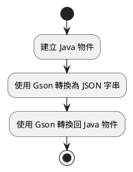
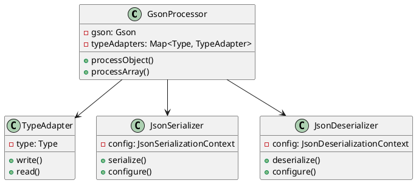
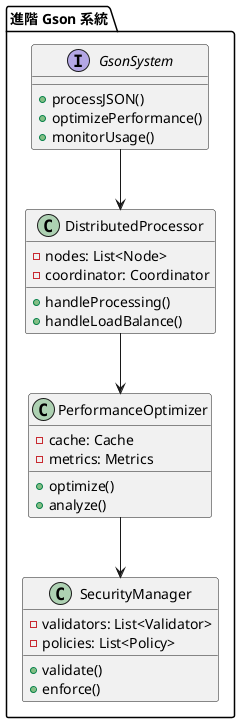

# Gson 教學

## 初級（Beginner）層級

### 1. 概念說明
Gson 就像是一個魔術師，可以幫我們把 Java 物件和 JSON 字串互相變換，就像把玩具變成圖片，或是把圖片變回玩具一樣。初級學習者需要了解：
- 什麼是 JSON
- 為什麼需要 JSON
- 基本的 JSON 轉換方式

### 2. PlantUML 圖解


### 3. 分段教學步驟

#### 步驟 1：基本專案設定
```xml
<!-- pom.xml -->
<dependencies>
    <dependency>
        <groupId>com.google.code.gson</groupId>
        <artifactId>gson</artifactId>
        <version>2.10.1</version>
    </dependency>
</dependencies>
```

#### 步驟 2：基本使用
```java
import com.google.gson.Gson;

public class Student {
    private String name;
    private int age;
    private String grade;
    
    // 建構函式
    public Student(String name, int age, String grade) {
        this.name = name;
        this.age = age;
        this.grade = grade;
    }
    
    // 轉換為 JSON 字串
    public String toJson() {
        Gson gson = new Gson();
        return gson.toJson(this);
    }
    
    // 從 JSON 字串轉換回物件
    public static Student fromJson(String json) {
        Gson gson = new Gson();
        return gson.fromJson(json, Student.class);
    }
}
```

#### 步驟 3：簡單範例
```java
public class Main {
    public static void main(String[] args) {
        // 建立學生物件
        Student student = new Student("張小明", 13, "七年級");
        
        // 轉換為 JSON 字串
        String json = student.toJson();
        System.out.println("JSON 字串: " + json);
        
        // 轉換回物件
        Student student2 = Student.fromJson(json);
        System.out.println("學生姓名: " + student2.name);
    }
}
```

## 中級（Intermediate）層級

### 1. 概念說明
中級學習者需要理解：
- JSON 序列化與反序列化
- 複雜物件的處理
- 日期格式處理
- 自訂轉換器

### 2. PlantUML 圖解


### 3. 分段教學步驟

#### 步驟 1：進階配置
```java
import com.google.gson.*;
import java.lang.reflect.Type;
import java.text.SimpleDateFormat;
import java.util.Date;

public class AdvancedGsonConfig {
    private static final Gson gson = new GsonBuilder()
        .setDateFormat("yyyy-MM-dd HH:mm:ss")
        .setPrettyPrinting()
        .registerTypeAdapter(Date.class, new DateSerializer())
        .create();
    
    public static String toJson(Object obj) {
        return gson.toJson(obj);
    }
    
    public static <T> T fromJson(String json, Class<T> clazz) {
        return gson.fromJson(json, clazz);
    }
}
```

#### 步驟 2：複雜物件處理
```java
import com.google.gson.annotations.SerializedName;

public class SchoolClass {
    @SerializedName("class_name")
    private String className;
    
    @SerializedName("teacher")
    private Teacher teacher;
    
    @SerializedName("students")
    private List<Student> students;
    
    @SerializedName("create_time")
    private Date createTime;
    
    // 省略建構函式和其他方法
}

public class Teacher {
    @SerializedName("teacher_id")
    private String id;
    
    @SerializedName("teacher_name")
    private String name;
    
    @SerializedName("subject")
    private String subject;
    
    // 省略建構函式和其他方法
}
```

#### 步驟 3：自訂轉換器
```java
import com.google.gson.*;
import java.lang.reflect.Type;
import java.text.SimpleDateFormat;
import java.util.Date;

public class DateSerializer implements JsonSerializer<Date>, JsonDeserializer<Date> {
    private final SimpleDateFormat format = new SimpleDateFormat("yyyy-MM-dd HH:mm:ss");
    
    @Override
    public JsonElement serialize(Date date, Type type, JsonSerializationContext context) {
        return new JsonPrimitive(format.format(date));
    }
    
    @Override
    public Date deserialize(JsonElement json, Type type, JsonDeserializationContext context) {
        try {
            return format.parse(json.getAsString());
        } catch (Exception e) {
            throw new JsonParseException(e);
        }
    }
}
```

## 高級（Advanced）層級

### 1. 概念說明
高級學習者需要掌握：
- 分散式 JSON 處理
- 效能優化
- 安全性控制
- 監控與分析

### 2. PlantUML 圖解


### 3. 分段教學步驟

#### 步驟 1：分散式處理
```java
import org.springframework.stereotype.Component;
import java.util.List;
import java.util.concurrent.CompletableFuture;

@Component
public class DistributedGsonProcessor {
    private final List<GsonNode> nodes;
    private final Gson gson;
    
    public DistributedGsonProcessor(List<GsonNode> nodes) {
        this.nodes = nodes;
        this.gson = new GsonBuilder()
            .setDateFormat("yyyy-MM-dd HH:mm:ss")
            .create();
    }
    
    public CompletableFuture<String> processJSON(String json) {
        return CompletableFuture.supplyAsync(() -> {
            try {
                return nodes.stream()
                    .map(node -> node.process(json))
                    .findFirst()
                    .orElseThrow(() -> new RuntimeException("處理失敗"));
            } catch (Exception ex) {
                handleNodeFailure(ex);
                return null;
            }
        });
    }
    
    private void handleNodeFailure(Exception ex) {
        System.err.println("Gson 處理節點失敗: " + ex.getMessage());
    }
}
```

#### 步驟 2：效能優化
```java
import org.springframework.stereotype.Component;
import java.util.concurrent.ConcurrentHashMap;
import java.util.concurrent.atomic.AtomicLong;

@Component
public class GsonPerformanceOptimizer {
    private final ConcurrentHashMap<String, GsonCache> cache = new ConcurrentHashMap<>();
    private final AtomicLong totalProcessed = new AtomicLong();
    private final AtomicLong totalTime = new AtomicLong();
    private final Gson gson;
    
    public GsonPerformanceOptimizer() {
        this.gson = new GsonBuilder()
            .setDateFormat("yyyy-MM-dd HH:mm:ss")
            .create();
    }
    
    public String processWithCache(String json) {
        String key = generateKey(json);
        GsonCache cached = cache.get(key);
        
        if (cached != null && !cached.isExpired()) {
            return cached.getValue();
        }
        
        long startTime = System.nanoTime();
        String result = processJSON(json);
        long duration = System.nanoTime() - startTime;
        
        cache.put(key, new GsonCache(result));
        recordMetrics(duration);
        
        return result;
    }
    
    private void recordMetrics(long duration) {
        totalProcessed.incrementAndGet();
        totalTime.addAndGet(duration);
    }
    
    private static class GsonCache {
        private final String value;
        private final long timestamp;
        
        GsonCache(String value) {
            this.value = value;
            this.timestamp = System.currentTimeMillis();
        }
        
        boolean isExpired() {
            return System.currentTimeMillis() - timestamp > 3600000; // 1小時
        }
        
        String getValue() {
            return value;
        }
    }
}
```

#### 步驟 3：安全性控制
```java
import org.springframework.stereotype.Component;
import java.util.List;
import java.util.concurrent.CopyOnWriteArrayList;

@Component
public class GsonSecurityManager {
    private final List<GsonValidator> validators = new CopyOnWriteArrayList<>();
    private final List<SecurityPolicy> policies = new CopyOnWriteArrayList<>();
    private final Gson gson;
    
    public GsonSecurityManager() {
        this.gson = new GsonBuilder()
            .setDateFormat("yyyy-MM-dd HH:mm:ss")
            .create();
    }
    
    public void addValidator(GsonValidator validator) {
        validators.add(validator);
    }
    
    public void addPolicy(SecurityPolicy policy) {
        policies.add(policy);
    }
    
    public boolean validateJSON(String json) {
        return validators.stream()
            .allMatch(validator -> validator.validate(json));
    }
    
    public boolean enforcePolicies(String json) {
        return policies.stream()
            .allMatch(policy -> policy.enforce(json));
    }
    
    public interface GsonValidator {
        boolean validate(String json);
    }
    
    public interface SecurityPolicy {
        boolean enforce(String json);
    }
}
```

這個教學文件提供了從基礎到進階的 Gson 學習路徑，每個層級都包含了相應的概念說明、圖解、教學步驟和實作範例。初級學習者可以從基本的 JSON 轉換開始，中級學習者可以學習更複雜的物件處理和自訂轉換，而高級學習者則可以掌握完整的分散式處理系統和效能優化。 