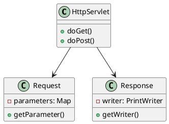
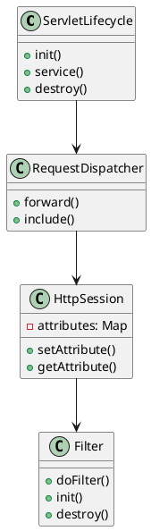
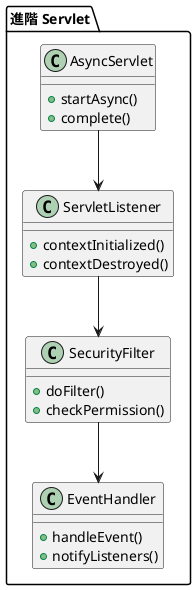

# Jakarta Servlet 教學

## 初級（Beginner）層級

### 1. 概念說明
Jakarta Servlet 就像是一個班級的班級網站系統，可以處理同學們的請求和回應。初級學習者需要了解：
- 什麼是 Servlet
- 基本的請求處理
- 簡單的回應生成

### 2. PlantUML 圖解


### 3. 分段教學步驟

#### 步驟 1：基本 Servlet
```java
import jakarta.servlet.*;
import jakarta.servlet.http.*;
import java.io.*;

public class HelloServlet extends HttpServlet {
    
    @Override
    protected void doGet(HttpServletRequest request, HttpServletResponse response)
            throws ServletException, IOException {
        // 設定回應類型
        response.setContentType("text/html");
        
        // 取得輸出流
        PrintWriter out = response.getWriter();
        
        // 寫入 HTML 內容
        out.println("<html>");
        out.println("<head><title>歡迎頁面</title></head>");
        out.println("<body>");
        out.println("<h1>歡迎來到班級網站！</h1>");
        out.println("</body>");
        out.println("</html>");
    }
}
```

#### 步驟 2：處理表單請求
```java
import jakarta.servlet.*;
import jakarta.servlet.http.*;
import java.io.*;

public class StudentFormServlet extends HttpServlet {
    
    @Override
    protected void doPost(HttpServletRequest request, HttpServletResponse response)
            throws ServletException, IOException {
        // 取得表單參數
        String name = request.getParameter("name");
        String studentId = request.getParameter("studentId");
        
        response.setContentType("text/html");
        PrintWriter out = response.getWriter();
        
        out.println("<html>");
        out.println("<head><title>學生資料</title></head>");
        out.println("<body>");
        out.println("<h1>學生資料確認</h1>");
        out.println("<p>姓名: " + name + "</p>");
        out.println("<p>學號: " + studentId + "</p>");
        out.println("</body>");
        out.println("</html>");
    }
}
```

## 中級（Intermediate）層級

### 1. 概念說明
中級學習者需要理解：
- Servlet 生命週期
- 請求分派
- 會話管理
- 過濾器使用

### 2. PlantUML 圖解


### 3. 分段教學步驟

#### 步驟 1：Servlet 生命週期
```java
import jakarta.servlet.*;
import jakarta.servlet.http.*;
import java.io.*;

public class LifecycleServlet extends HttpServlet {
    
    @Override
    public void init() throws ServletException {
        System.out.println("Servlet 初始化...");
    }
    
    @Override
    protected void service(HttpServletRequest request, HttpServletResponse response)
            throws ServletException, IOException {
        System.out.println("處理請求...");
        super.service(request, response);
    }
    
    @Override
    public void destroy() {
        System.out.println("Servlet 銷毀...");
    }
    
    @Override
    protected void doGet(HttpServletRequest request, HttpServletResponse response)
            throws ServletException, IOException {
        response.setContentType("text/html");
        PrintWriter out = response.getWriter();
        out.println("<h1>Servlet 生命週期測試</h1>");
    }
}
```

#### 步驟 2：會話管理
```java
import jakarta.servlet.*;
import jakarta.servlet.http.*;
import java.io.*;

public class SessionServlet extends HttpServlet {
    
    @Override
    protected void doGet(HttpServletRequest request, HttpServletResponse response)
            throws ServletException, IOException {
        // 取得或建立會話
        HttpSession session = request.getSession();
        
        // 設定會話屬性
        session.setAttribute("lastVisit", new java.util.Date());
        
        response.setContentType("text/html");
        PrintWriter out = response.getWriter();
        
        out.println("<html>");
        out.println("<head><title>會話管理</title></head>");
        out.println("<body>");
        out.println("<h1>歡迎回來！</h1>");
        out.println("<p>上次訪問時間: " + session.getAttribute("lastVisit") + "</p>");
        out.println("</body>");
        out.println("</html>");
    }
}
```

## 高級（Advanced）層級

### 1. 概念說明
高級學習者需要掌握：
- 非同步處理
- 事件監聽
- 進階過濾器
- 安全性控制

### 2. PlantUML 圖解


### 3. 分段教學步驟

#### 步驟 1：非同步處理
```java
import jakarta.servlet.*;
import jakarta.servlet.http.*;
import java.io.*;
import java.util.concurrent.*;

public class AsyncServlet extends HttpServlet {
    
    private ExecutorService executor = Executors.newFixedThreadPool(10);
    
    @Override
    protected void doGet(HttpServletRequest request, HttpServletResponse response)
            throws ServletException, IOException {
        // 開始非同步處理
        AsyncContext asyncContext = request.startAsync();
        
        // 提交任務到執行緒池
        executor.submit(() -> {
            try {
                // 模擬長時間處理
                Thread.sleep(2000);
                
                // 取得回應物件
                ServletResponse resp = asyncContext.getResponse();
                resp.setContentType("text/html");
                PrintWriter out = resp.getWriter();
                
                out.println("<html>");
                out.println("<head><title>非同步處理</title></head>");
                out.println("<body>");
                out.println("<h1>處理完成！</h1>");
                out.println("</body>");
                out.println("</html>");
                
                // 完成非同步處理
                asyncContext.complete();
            } catch (Exception e) {
                e.printStackTrace();
            }
        });
    }
    
    @Override
    public void destroy() {
        executor.shutdown();
    }
}
```

#### 步驟 2：事件監聽
```java
import jakarta.servlet.*;
import jakarta.servlet.http.*;

public class SessionListener implements HttpSessionListener {
    
    @Override
    public void sessionCreated(HttpSessionEvent se) {
        System.out.println("新的會話建立: " + se.getSession().getId());
    }
    
    @Override
    public void sessionDestroyed(HttpSessionEvent se) {
        System.out.println("會話結束: " + se.getSession().getId());
    }
}

public class ContextListener implements ServletContextListener {
    
    @Override
    public void contextInitialized(ServletContextEvent sce) {
        System.out.println("應用程式啟動...");
    }
    
    @Override
    public void contextDestroyed(ServletContextEvent sce) {
        System.out.println("應用程式關閉...");
    }
}
```

#### 步驟 3：安全性控制
```java
import jakarta.servlet.*;
import jakarta.servlet.http.*;
import java.io.*;

public class SecurityFilter implements Filter {
    
    @Override
    public void init(FilterConfig config) throws ServletException {
        System.out.println("安全性過濾器初始化");
    }
    
    @Override
    public void doFilter(ServletRequest request, ServletResponse response, FilterChain chain)
            throws IOException, ServletException {
        HttpServletRequest httpRequest = (HttpServletRequest) request;
        HttpServletResponse httpResponse = (HttpServletResponse) response;
        
        // 檢查是否已登入
        HttpSession session = httpRequest.getSession(false);
        if (session == null || session.getAttribute("user") == null) {
            // 未登入，重定向到登入頁面
            httpResponse.sendRedirect("login.html");
            return;
        }
        
        // 檢查權限
        if (!hasPermission(httpRequest)) {
            httpResponse.sendError(HttpServletResponse.SC_FORBIDDEN, "權限不足");
            return;
        }
        
        // 繼續處理請求
        chain.doFilter(request, response);
    }
    
    private boolean hasPermission(HttpServletRequest request) {
        // 實作權限檢查邏輯
        return true;
    }
    
    @Override
    public void destroy() {
        System.out.println("安全性過濾器銷毀");
    }
}
```

這個教學文件提供了從基礎到進階的 Jakarta Servlet 學習路徑，每個層級都包含了相應的概念說明、圖解、教學步驟和實作範例。初級學習者可以從基本的請求處理開始，中級學習者可以學習會話管理和生命週期，而高級學習者則可以掌握非同步處理和安全性控制等進階功能。 