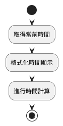
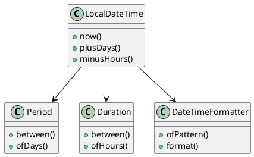
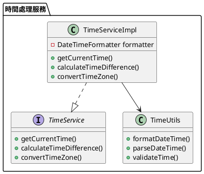

# Java 8 時間 API 教學

## 初級（Beginner）層級

### 1. 概念說明
Java 8 時間 API 提供了一套全新的時間處理方式，比舊的 `Date` 和 `Calendar` 更容易使用。初級學習者需要掌握：
- 如何取得當前時間
- 如何格式化時間顯示
- 如何進行簡單的時間計算

### 2. PlantUML 圖解


### 3. 分段教學步驟

#### 步驟 1：取得當前時間
```java
// 取得當前日期
LocalDate today = LocalDate.now();
System.out.println("今天的日期是: " + today);

// 取得當前時間
LocalTime now = LocalTime.now();
System.out.println("現在的時間是: " + now);

// 取得當前日期和時間
LocalDateTime currentDateTime = LocalDateTime.now();
System.out.println("現在的日期和時間是: " + currentDateTime);
```

#### 步驟 2：格式化時間顯示
```java
DateTimeFormatter formatter = DateTimeFormatter.ofPattern("yyyy年MM月dd日 HH:mm:ss");
String formattedDateTime = currentDateTime.format(formatter);
System.out.println("格式化後的時間: " + formattedDateTime);
```

#### 步驟 3：簡單的時間計算
```java
// 計算明天的日期
LocalDate tomorrow = today.plusDays(1);
System.out.println("明天的日期是: " + tomorrow);

// 計算一小時後的時間
LocalTime oneHourLater = now.plusHours(1);
System.out.println("一小時後的時間是: " + oneHourLater);
```

## 中級（Intermediate）層級

### 1. 概念說明
中級學習者需要理解：
- 時間區間（Period 和 Duration）的計算
- 時區（Zone）的概念
- 時間的比較和排序
- 自定義時間格式的處理

### 2. PlantUML 圖解


### 3. 分段教學步驟

#### 步驟 1：時間區間計算
```java
// 計算兩個日期之間的間隔
LocalDate startDate = LocalDate.of(2023, 1, 1);
LocalDate endDate = LocalDate.of(2023, 12, 31);
Period period = Period.between(startDate, endDate);
System.out.println("兩個日期之間相差: " + period.getYears() + "年 " + 
    period.getMonths() + "月 " + period.getDays() + "天");

// 計算兩個時間點之間的間隔
LocalTime startTime = LocalTime.of(9, 0);
LocalTime endTime = LocalTime.of(17, 30);
Duration duration = Duration.between(startTime, endTime);
System.out.println("工作時間是: " + duration.toHours() + "小時");
```

#### 步驟 2：時區處理
```java
// 取得不同時區的時間
ZoneId taipeiZone = ZoneId.of("Asia/Taipei");
ZoneId newYorkZone = ZoneId.of("America/New_York");

ZonedDateTime taipeiTime = ZonedDateTime.now(taipeiZone);
ZonedDateTime newYorkTime = ZonedDateTime.now(newYorkZone);

System.out.println("台北時間: " + taipeiTime);
System.out.println("紐約時間: " + newYorkTime);
```

#### 步驟 3：時間比較和排序
```java
List<LocalDateTime> dates = Arrays.asList(
    LocalDateTime.of(2023, 1, 1, 12, 0),
    LocalDateTime.of(2023, 1, 2, 9, 0),
    LocalDateTime.of(2023, 1, 1, 15, 0)
);

// 排序時間
dates.sort(LocalDateTime::compareTo);
System.out.println("排序後的時間:");
dates.forEach(System.out::println);

// 比較時間
LocalDateTime date1 = LocalDateTime.of(2023, 1, 1, 12, 0);
LocalDateTime date2 = LocalDateTime.of(2023, 1, 2, 12, 0);

if (date1.isBefore(date2)) {
    System.out.println("date1 在 date2 之前");
} else if (date1.isAfter(date2)) {
    System.out.println("date1 在 date2 之後");
} else {
    System.out.println("兩個時間相同");
}
```

## 高級（Advanced）層級

### 1. 概念說明
高級學習者需要掌握：
- 時間 API 的設計模式
- 時間處理的單元測試
- 複雜的時間轉換和計算
- 時間 API 的擴展和自定義

### 2. PlantUML 圖解


### 3. 分段教學步驟

#### 步驟 1：建立時間處理服務
```java
public interface TimeService {
    String getCurrentTime(String format);
    Duration calculateTimeDifference(LocalDateTime start, LocalDateTime end);
    ZonedDateTime convertTimeZone(ZonedDateTime time, ZoneId targetZone);
}

public class TimeServiceImpl implements TimeService {
    private final DateTimeFormatter formatter;
    
    public TimeServiceImpl(String defaultFormat) {
        this.formatter = DateTimeFormatter.ofPattern(defaultFormat);
    }
    
    @Override
    public String getCurrentTime(String format) {
        return LocalDateTime.now().format(DateTimeFormatter.ofPattern(format));
    }
    
    @Override
    public Duration calculateTimeDifference(LocalDateTime start, LocalDateTime end) {
        return Duration.between(start, end);
    }
    
    @Override
    public ZonedDateTime convertTimeZone(ZonedDateTime time, ZoneId targetZone) {
        return time.withZoneSameInstant(targetZone);
    }
}
```

#### 步驟 2：時間處理的單元測試
```java
public class TimeServiceTest {
    private TimeService timeService;
    
    @BeforeEach
    void setUp() {
        timeService = new TimeServiceImpl("yyyy-MM-dd HH:mm:ss");
    }
    
    @Test
    void testGetCurrentTime() {
        String currentTime = timeService.getCurrentTime("yyyy-MM-dd");
        assertNotNull(currentTime);
        assertTrue(currentTime.matches("\\d{4}-\\d{2}-\\d{2}"));
    }
    
    @Test
    void testCalculateTimeDifference() {
        LocalDateTime start = LocalDateTime.of(2023, 1, 1, 12, 0);
        LocalDateTime end = LocalDateTime.of(2023, 1, 1, 14, 30);
        
        Duration difference = timeService.calculateTimeDifference(start, end);
        assertEquals(2, difference.toHours());
        assertEquals(30, difference.toMinutesPart());
    }
}
```

#### 步驟 3：複雜的時間轉換和計算
```java
public class TimeUtils {
    public static LocalDateTime parseDateTime(String dateTimeStr, String pattern) {
        return LocalDateTime.parse(dateTimeStr, DateTimeFormatter.ofPattern(pattern));
    }
    
    public static boolean isBusinessHours(LocalDateTime time) {
        LocalTime localTime = time.toLocalTime();
        return !localTime.isBefore(LocalTime.of(9, 0)) && 
               !localTime.isAfter(LocalTime.of(17, 0));
    }
    
    public static List<LocalDateTime> getBusinessDays(LocalDate start, LocalDate end) {
        List<LocalDateTime> businessDays = new ArrayList<>();
        LocalDate current = start;
        
        while (!current.isAfter(end)) {
            if (current.getDayOfWeek() != DayOfWeek.SATURDAY && 
                current.getDayOfWeek() != DayOfWeek.SUNDAY) {
                businessDays.add(current.atTime(9, 0));
            }
            current = current.plusDays(1);
        }
        
        return businessDays;
    }
}
```

### 4. 實作範例：工作日計算系統
```java
public class BusinessDayCalculator {
    private final TimeService timeService;
    
    public BusinessDayCalculator(TimeService timeService) {
        this.timeService = timeService;
    }
    
    public long calculateBusinessHours(LocalDateTime start, LocalDateTime end) {
        List<LocalDateTime> businessDays = TimeUtils.getBusinessDays(
            start.toLocalDate(), 
            end.toLocalDate()
        );
        
        return businessDays.stream()
            .filter(TimeUtils::isBusinessHours)
            .count();
    }
    
    public String formatBusinessHours(LocalDateTime start, LocalDateTime end) {
        long hours = calculateBusinessHours(start, end);
        return String.format("從 %s 到 %s 共有 %d 個工作小時",
            timeService.getCurrentTime("yyyy-MM-dd HH:mm"),
            timeService.getCurrentTime("yyyy-MM-dd HH:mm"),
            hours
        );
    }
}
```

這個教學文件提供了從基礎到進階的 Java 8 時間 API 學習路徑，每個層級都包含了相應的概念說明、圖解、教學步驟和實作範例。初級學習者可以從基本的時間操作開始，中級學習者可以學習更複雜的時間處理，而高級學習者則可以掌握完整的時間處理系統設計。 