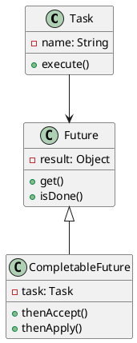
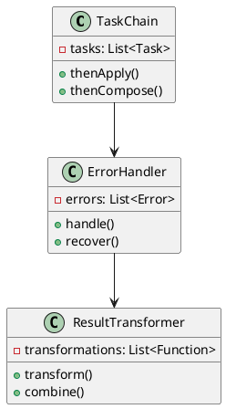
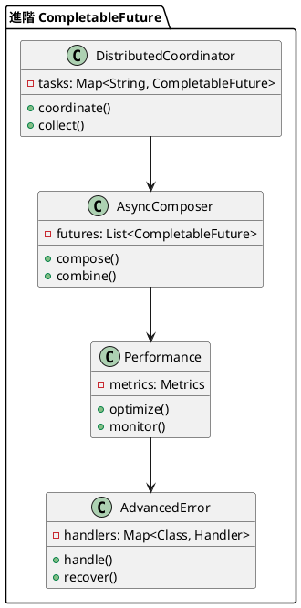

# Java CompletableFuture 教學

## 初級（Beginner）層級

### 1. 概念說明
CompletableFuture 就像是一個班級的任務分配系統，可以讓多個同學同時完成不同的任務，並且在任務完成後通知大家。初級學習者需要了解：
- 什麼是 CompletableFuture
- 為什麼需要 CompletableFuture
- 基本的非同步任務處理

### 2. PlantUML 圖解


### 3. 分段教學步驟

#### 步驟 1：基本非同步任務
```java
import java.util.concurrent.*;

public class SimpleFutureExample {
    
    public static void main(String[] args) {
        // 建立一個非同步任務
        CompletableFuture<String> homeworkTask = CompletableFuture.supplyAsync(() -> {
            System.out.println("小明正在寫數學作業");
            try {
                Thread.sleep(1000); // 模擬寫作業時間
            } catch (InterruptedException e) {
                e.printStackTrace();
            }
            return "數學作業完成";
        });
        
        // 當任務完成時執行
        homeworkTask.thenAccept(result -> {
            System.out.println("收到通知: " + result);
        });
        
        System.out.println("等待作業完成...");
    }
}
```

#### 步驟 2：多個非同步任務
```java
import java.util.concurrent.*;

public class MultipleFutureExample {
    
    public static void main(String[] args) {
        // 建立多個非同步任務
        CompletableFuture<String> mathHomework = CompletableFuture.supplyAsync(() -> {
            System.out.println("小明正在寫數學作業");
            try {
                Thread.sleep(1000);
            } catch (InterruptedException e) {
                e.printStackTrace();
            }
            return "數學作業完成";
        });
        
        CompletableFuture<String> chineseHomework = CompletableFuture.supplyAsync(() -> {
            System.out.println("小華正在寫國文作業");
            try {
                Thread.sleep(1500);
            } catch (InterruptedException e) {
                e.printStackTrace();
            }
            return "國文作業完成";
        });
        
        // 當所有任務完成時執行
        CompletableFuture.allOf(mathHomework, chineseHomework)
            .thenAccept(v -> {
                System.out.println("所有作業都完成了！");
            });
    }
}
```

## 中級（Intermediate）層級

### 1. 概念說明
中級學習者需要理解：
- 任務鏈式處理
- 錯誤處理
- 任務組合
- 結果轉換

### 2. PlantUML 圖解


### 3. 分段教學步驟

#### 步驟 1：任務鏈式處理
```java
import java.util.concurrent.*;

public class TaskChainExample {
    
    public static void main(String[] args) {
        // 建立一個任務鏈
        CompletableFuture.supplyAsync(() -> {
            System.out.println("第一步：寫作業");
            return "作業完成";
        })
        .thenApply(result -> {
            System.out.println("第二步：檢查作業");
            return result + "，檢查完成";
        })
        .thenApply(result -> {
            System.out.println("第三步：交作業");
            return result + "，已交作業";
        })
        .thenAccept(finalResult -> {
            System.out.println("最終結果: " + finalResult);
        });
    }
}
```

#### 步驟 2：錯誤處理
```java
import java.util.concurrent.*;

public class ErrorHandlingExample {
    
    public static void main(String[] args) {
        CompletableFuture.supplyAsync(() -> {
            System.out.println("開始寫作業");
            if (Math.random() > 0.5) {
                throw new RuntimeException("作業寫錯了！");
            }
            return "作業完成";
        })
        .exceptionally(error -> {
            System.out.println("發生錯誤: " + error.getMessage());
            return "重新寫作業";
        })
        .thenAccept(result -> {
            System.out.println("結果: " + result);
        });
    }
}
```

## 高級（Advanced）層級

### 1. 概念說明
高級學習者需要掌握：
- 分散式任務協調
- 非同步任務組合
- 效能優化
- 進階錯誤處理

### 2. PlantUML 圖解


### 3. 分段教學步驟

#### 步驟 1：分散式任務協調
```java
import java.util.*;
import java.util.concurrent.*;

public class DistributedCoordination {
    
    private static class TaskCoordinator {
        private final Map<String, CompletableFuture<String>> tasks = new HashMap<>();
        
        public void addTask(String taskId, CompletableFuture<String> future) {
            tasks.put(taskId, future);
        }
        
        public CompletableFuture<List<String>> collectResults() {
            return CompletableFuture.allOf(
                tasks.values().toArray(new CompletableFuture[0])
            ).thenApply(v -> {
                List<String> results = new ArrayList<>();
                tasks.forEach((id, future) -> {
                    try {
                        results.add(id + ": " + future.get());
                    } catch (Exception e) {
                        results.add(id + ": 失敗");
                    }
                });
                return results;
            });
        }
    }
    
    public static void main(String[] args) {
        TaskCoordinator coordinator = new TaskCoordinator();
        
        // 添加多個任務
        coordinator.addTask("數學作業", CompletableFuture.supplyAsync(() -> {
            try {
                Thread.sleep(1000);
                return "完成";
            } catch (InterruptedException e) {
                throw new RuntimeException(e);
            }
        }));
        
        coordinator.addTask("國文作業", CompletableFuture.supplyAsync(() -> {
            try {
                Thread.sleep(1500);
                return "完成";
            } catch (InterruptedException e) {
                throw new RuntimeException(e);
            }
        }));
        
        // 收集所有結果
        coordinator.collectResults()
            .thenAccept(results -> {
                System.out.println("所有任務結果:");
                results.forEach(System.out::println);
            });
    }
}
```

#### 步驟 2：非同步任務組合
```java
import java.util.concurrent.*;

public class AsyncComposition {
    
    private static class HomeworkSystem {
        private final ExecutorService pool = Executors.newFixedThreadPool(3);
        
        public CompletableFuture<String> writeHomework(String subject) {
            return CompletableFuture.supplyAsync(() -> {
                try {
                    Thread.sleep(1000);
                    return subject + "作業完成";
                } catch (InterruptedException e) {
                    throw new RuntimeException(e);
                }
            }, pool);
        }
        
        public CompletableFuture<String> checkHomework(String result) {
            return CompletableFuture.supplyAsync(() -> {
                try {
                    Thread.sleep(500);
                    return result + "，檢查完成";
                } catch (InterruptedException e) {
                    throw new RuntimeException(e);
                }
            }, pool);
        }
        
        public CompletableFuture<String> gradeHomework(String result) {
            return CompletableFuture.supplyAsync(() -> {
                try {
                    Thread.sleep(300);
                    return result + "，評分為 A";
                } catch (InterruptedException e) {
                    throw new RuntimeException(e);
                }
            }, pool);
        }
    }
    
    public static void main(String[] args) {
        HomeworkSystem system = new HomeworkSystem();
        
        // 組合多個非同步任務
        system.writeHomework("數學")
            .thenCompose(system::checkHomework)
            .thenCompose(system::gradeHomework)
            .thenAccept(System.out::println);
    }
}
```

#### 步驟 3：進階錯誤處理
```java
import java.util.concurrent.*;

public class AdvancedErrorHandling {
    
    private static class ErrorHandlingSystem {
        public CompletableFuture<String> processHomework(String subject) {
            return CompletableFuture.supplyAsync(() -> {
                if (Math.random() > 0.7) {
                    throw new RuntimeException(subject + "作業寫錯了");
                }
                return subject + "作業完成";
            })
            .handle((result, error) -> {
                if (error != null) {
                    System.out.println("處理錯誤: " + error.getMessage());
                    return "重新寫" + subject + "作業";
                }
                return result;
            })
            .thenCompose(result -> {
                if (result.startsWith("重新寫")) {
                    return CompletableFuture.supplyAsync(() -> {
                        try {
                            Thread.sleep(1000);
                            return result.replace("重新寫", "完成");
                        } catch (InterruptedException e) {
                            throw new RuntimeException(e);
                        }
                    });
                }
                return CompletableFuture.completedFuture(result);
            });
        }
    }
    
    public static void main(String[] args) {
        ErrorHandlingSystem system = new ErrorHandlingSystem();
        
        system.processHomework("數學")
            .thenAccept(System.out::println);
    }
}
```

這個教學文件提供了從基礎到進階的 Java CompletableFuture 學習路徑，每個層級都包含了相應的概念說明、圖解、教學步驟和實作範例。初級學習者可以從基本的非同步任務開始，中級學習者可以學習任務鏈式處理和錯誤處理，而高級學習者則可以掌握分散式任務協調和進階錯誤處理等進階功能。 