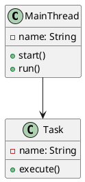
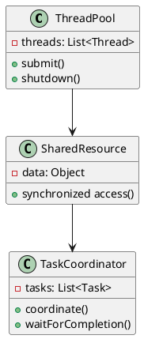
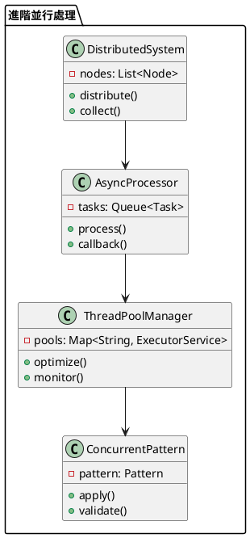

# Java 並行處理教學

## 初級（Beginner）層級

### 1. 概念說明
Java 並行處理就像是一個班級的小組活動，可以讓多個同學同時完成不同的任務。初級學習者需要了解：
- 什麼是並行處理
- 為什麼需要並行處理
- 基本的執行緒概念

### 2. PlantUML 圖解


### 3. 分段教學步驟

#### 步驟 1：基本執行緒
```java
public class SimpleThreadExample {
    
    public static void main(String[] args) {
        // 建立一個新的執行緒
        Thread student1 = new Thread(() -> {
            System.out.println("小明正在寫數學作業");
            try {
                Thread.sleep(1000); // 模擬寫作業時間
            } catch (InterruptedException e) {
                e.printStackTrace();
            }
            System.out.println("小明完成數學作業");
        });
        
        // 建立另一個執行緒
        Thread student2 = new Thread(() -> {
            System.out.println("小華正在寫國文作業");
            try {
                Thread.sleep(1500); // 模擬寫作業時間
            } catch (InterruptedException e) {
                e.printStackTrace();
            }
            System.out.println("小華完成國文作業");
        });
        
        // 啟動執行緒
        student1.start();
        student2.start();
    }
}
```

#### 步驟 2：簡單的並行任務
```java
public class SimpleConcurrentTask {
    
    public static void main(String[] args) {
        // 建立一個執行緒池
        ExecutorService pool = Executors.newFixedThreadPool(3);
        
        // 提交多個任務
        pool.submit(() -> {
            System.out.println("第一組正在打掃教室");
            try {
                Thread.sleep(2000);
            } catch (InterruptedException e) {
                e.printStackTrace();
            }
            System.out.println("第一組完成打掃");
        });
        
        pool.submit(() -> {
            System.out.println("第二組正在整理圖書");
            try {
                Thread.sleep(1500);
            } catch (InterruptedException e) {
                e.printStackTrace();
            }
            System.out.println("第二組完成整理");
        });
        
        // 關閉執行緒池
        pool.shutdown();
    }
}
```

## 中級（Intermediate）層級

### 1. 概念說明
中級學習者需要理解：
- 執行緒同步
- 共享資源管理
- 執行緒間通訊
- 任務協調

### 2. PlantUML 圖解


### 3. 分段教學步驟

#### 步驟 1：執行緒同步
```java
public class SynchronizedExample {
    
    private static class Classroom {
        private int availableSeats = 30;
        
        public synchronized void takeSeat(String studentName) {
            if (availableSeats > 0) {
                System.out.println(studentName + " 找到座位");
                availableSeats--;
                System.out.println("剩餘座位: " + availableSeats);
            } else {
                System.out.println(studentName + " 沒有座位了");
            }
        }
    }
    
    public static void main(String[] args) {
        Classroom classroom = new Classroom();
        ExecutorService pool = Executors.newFixedThreadPool(5);
        
        for (int i = 1; i <= 35; i++) {
            final int studentId = i;
            pool.submit(() -> {
                classroom.takeSeat("學生" + studentId);
            });
        }
        
        pool.shutdown();
    }
}
```

#### 步驟 2：執行緒間通訊
```java
public class ThreadCommunication {
    
    private static class MessageBoard {
        private String message;
        private boolean hasNewMessage = false;
        
        public synchronized void postMessage(String msg) {
            while (hasNewMessage) {
                try {
                    wait();
                } catch (InterruptedException e) {
                    e.printStackTrace();
                }
            }
            message = msg;
            hasNewMessage = true;
            notifyAll();
        }
        
        public synchronized String readMessage() {
            while (!hasNewMessage) {
                try {
                    wait();
                } catch (InterruptedException e) {
                    e.printStackTrace();
                }
            }
            hasNewMessage = false;
            notifyAll();
            return message;
        }
    }
    
    public static void main(String[] args) {
        MessageBoard board = new MessageBoard();
        
        // 老師發佈消息
        new Thread(() -> {
            String[] messages = {"今天要考試", "記得帶課本", "下週有戶外教學"};
            for (String msg : messages) {
                board.postMessage(msg);
                try {
                    Thread.sleep(2000);
                } catch (InterruptedException e) {
                    e.printStackTrace();
                }
            }
        }).start();
        
        // 學生接收消息
        new Thread(() -> {
            while (true) {
                String message = board.readMessage();
                System.out.println("收到通知: " + message);
            }
        }).start();
    }
}
```

## 高級（Advanced）層級

### 1. 概念說明
高級學習者需要掌握：
- 分散式任務處理
- 非同步程式設計
- 執行緒池優化
- 並行設計模式

### 2. PlantUML 圖解


### 3. 分段教學步驟

#### 步驟 1：分散式任務處理
```java
public class DistributedProcessing {
    
    private static class DistributedTask {
        private final String taskId;
        private final CompletableFuture<String> result;
        
        public DistributedTask(String taskId) {
            this.taskId = taskId;
            this.result = new CompletableFuture<>();
        }
        
        public void complete(String result) {
            this.result.complete(result);
        }
        
        public CompletableFuture<String> getResult() {
            return result;
        }
    }
    
    public static void main(String[] args) {
        // 建立分散式任務
        List<DistributedTask> tasks = IntStream.range(1, 6)
            .mapToObj(i -> new DistributedTask("任務" + i))
            .toList();
        
        // 分散處理任務
        ExecutorService pool = Executors.newFixedThreadPool(3);
        for (DistributedTask task : tasks) {
            pool.submit(() -> {
                try {
                    Thread.sleep(1000);
                    task.complete("完成 " + task.taskId);
                } catch (InterruptedException e) {
                    e.printStackTrace();
                }
            });
        }
        
        // 收集結果
        CompletableFuture.allOf(
            tasks.stream()
                .map(DistributedTask::getResult)
                .toArray(CompletableFuture[]::new)
        ).thenAccept(v -> {
            tasks.forEach(t -> 
                t.getResult().thenAccept(System.out::println)
            );
        });
        
        pool.shutdown();
    }
}
```

#### 步驟 2：非同步程式設計
```java
public class AsyncProgramming {
    
    private static class SchoolSystem {
        private final ExecutorService pool = Executors.newFixedThreadPool(3);
        
        public CompletableFuture<String> checkHomework(String studentName) {
            return CompletableFuture.supplyAsync(() -> {
                try {
                    Thread.sleep(1000);
                    return studentName + " 的作業已完成";
                } catch (InterruptedException e) {
                    throw new RuntimeException(e);
                }
            }, pool);
        }
        
        public CompletableFuture<String> gradeHomework(String result) {
            return CompletableFuture.supplyAsync(() -> {
                try {
                    Thread.sleep(500);
                    return result + "，評分為 A";
                } catch (InterruptedException e) {
                    throw new RuntimeException(e);
                }
            }, pool);
        }
    }
    
    public static void main(String[] args) {
        SchoolSystem system = new SchoolSystem();
        
        // 非同步處理作業
        system.checkHomework("小明")
            .thenCompose(system::gradeHomework)
            .thenAccept(System.out::println);
            
        System.out.println("正在處理其他事情...");
    }
}
```

#### 步驟 3：執行緒池優化
```java
public class ThreadPoolOptimization {
    
    private static class OptimizedThreadPool {
        private final ThreadPoolExecutor executor;
        
        public OptimizedThreadPool() {
            this.executor = new ThreadPoolExecutor(
                2,  // 核心執行緒數
                4,  // 最大執行緒數
                60, // 閒置時間
                TimeUnit.SECONDS,
                new LinkedBlockingQueue<>(10), // 任務佇列
                new ThreadPoolExecutor.CallerRunsPolicy() // 拒絕策略
            );
        }
        
        public void submitTask(String taskName) {
            executor.submit(() -> {
                System.out.println("開始執行 " + taskName);
                try {
                    Thread.sleep(1000);
                } catch (InterruptedException e) {
                    e.printStackTrace();
                }
                System.out.println("完成 " + taskName);
            });
        }
        
        public void shutdown() {
            executor.shutdown();
        }
    }
    
    public static void main(String[] args) {
        OptimizedThreadPool pool = new OptimizedThreadPool();
        
        // 提交多個任務
        for (int i = 1; i <= 10; i++) {
            pool.submitTask("任務" + i);
        }
        
        pool.shutdown();
    }
}
```

這個教學文件提供了從基礎到進階的 Java 並行處理學習路徑，每個層級都包含了相應的概念說明、圖解、教學步驟和實作範例。初級學習者可以從基本的執行緒概念開始，中級學習者可以學習執行緒同步和通訊，而高級學習者則可以掌握分散式處理和非同步程式設計等進階功能。 