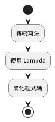
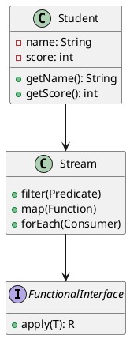
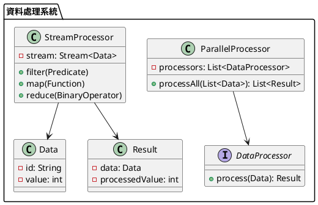

# Java Lambda 教學

## 初級（Beginner）層級

### 1. 概念說明
Lambda 表達式是 Java 8 引入的一種簡潔的程式寫法，可以讓程式碼更簡短易讀。初級學習者需要了解：
- 什麼是 Lambda 表達式
- Lambda 的基本語法
- 如何使用 Lambda 來簡化程式碼

### 2. PlantUML 圖解


### 3. 分段教學步驟

#### 步驟 1：基本 Lambda 語法
```java
// 傳統寫法
Runnable runnable = new Runnable() {
    @Override
    public void run() {
        System.out.println("Hello World!");
    }
};

// Lambda 寫法
Runnable lambdaRunnable = () -> System.out.println("Hello World!");
```

#### 步驟 2：使用 Lambda 排序
```java
import java.util.*;

public class SimpleLambda {
    public static void main(String[] args) {
        List<String> names = Arrays.asList("小明", "小華", "小美", "小強");
        
        // 傳統寫法
        Collections.sort(names, new Comparator<String>() {
            @Override
            public int compare(String a, String b) {
                return a.compareTo(b);
            }
        });
        
        // Lambda 寫法
        Collections.sort(names, (a, b) -> a.compareTo(b));
        
        System.out.println("排序後的名單：");
        names.forEach(name -> System.out.println(name));
    }
}
```

#### 步驟 3：簡單的 Lambda 應用
```java
import java.util.*;

public class SimpleLambdaExample {
    public static void main(String[] args) {
        List<Integer> numbers = Arrays.asList(1, 2, 3, 4, 5);
        
        // 使用 Lambda 計算平方
        numbers.forEach(number -> {
            int square = number * number;
            System.out.println(number + " 的平方是 " + square);
        });
        
        // 使用 Lambda 過濾偶數
        numbers.stream()
            .filter(number -> number % 2 == 0)
            .forEach(number -> System.out.println(number + " 是偶數"));
    }
}
```

## 中級（Intermediate）層級

### 1. 概念說明
中級學習者需要理解：
- 函數式介面（Functional Interface）
- 方法參考（Method Reference）
- Stream API 的基本使用
- Lambda 的進階語法

### 2. PlantUML 圖解


### 3. 分段教學步驟

#### 步驟 1：自定義函數式介面
```java
@FunctionalInterface
interface StringProcessor {
    String process(String input);
}

public class CustomLambda {
    public static void main(String[] args) {
        // 使用 Lambda 實作介面
        StringProcessor toUpperCase = str -> str.toUpperCase();
        StringProcessor addExclamation = str -> str + "!";
        
        String result = toUpperCase.process("hello");
        System.out.println(result); // 輸出: HELLO
        
        result = addExclamation.process("hello");
        System.out.println(result); // 輸出: hello!
    }
}
```

#### 步驟 2：方法參考
```java
import java.util.*;

public class MethodReference {
    public static void main(String[] args) {
        List<String> names = Arrays.asList("小明", "小華", "小美", "小強");
        
        // Lambda 寫法
        names.forEach(name -> System.out.println(name));
        
        // 方法參考寫法
        names.forEach(System.out::println);
        
        // 排序範例
        List<Integer> numbers = Arrays.asList(5, 3, 1, 4, 2);
        
        // Lambda 寫法
        numbers.sort((a, b) -> a.compareTo(b));
        
        // 方法參考寫法
        numbers.sort(Integer::compareTo);
    }
}
```

#### 步驟 3：Stream API 使用
```java
import java.util.*;
import java.util.stream.*;

public class StreamExample {
    public static void main(String[] args) {
        List<Student> students = Arrays.asList(
            new Student("小明", 85),
            new Student("小華", 92),
            new Student("小美", 78),
            new Student("小強", 65)
        );
        
        // 計算平均分數
        double average = students.stream()
            .mapToInt(Student::getScore)
            .average()
            .orElse(0.0);
        System.out.println("平均分數：" + average);
        
        // 找出及格學生
        List<Student> passedStudents = students.stream()
            .filter(student -> student.getScore() >= 60)
            .collect(Collectors.toList());
        
        System.out.println("及格學生：");
        passedStudents.forEach(student -> 
            System.out.println(student.getName() + ": " + student.getScore()));
    }
}

class Student {
    private String name;
    private int score;
    
    public Student(String name, int score) {
        this.name = name;
        this.score = score;
    }
    
    public String getName() { return name; }
    public int getScore() { return score; }
}
```

## 高級（Advanced）層級

### 1. 概念說明
高級學習者需要掌握：
- 並行處理（Parallel Stream）
- 自定義 Stream 操作
- 複雜的 Lambda 組合
- 效能優化

### 2. PlantUML 圖解


### 3. 分段教學步驟

#### 步驟 1：並行處理
```java
import java.util.*;
import java.util.stream.*;
import java.util.concurrent.*;

public class ParallelProcessing {
    public static void main(String[] args) {
        List<Integer> numbers = IntStream.range(1, 1000000)
            .boxed()
            .collect(Collectors.toList());
        
        // 順序處理
        long startTime = System.currentTimeMillis();
        long sum = numbers.stream()
            .mapToLong(i -> i * i)
            .sum();
        long endTime = System.currentTimeMillis();
        System.out.println("順序處理時間：" + (endTime - startTime) + "ms");
        
        // 並行處理
        startTime = System.currentTimeMillis();
        sum = numbers.parallelStream()
            .mapToLong(i -> i * i)
            .sum();
        endTime = System.currentTimeMillis();
        System.out.println("並行處理時間：" + (endTime - startTime) + "ms");
    }
}
```

#### 步驟 2：自定義 Stream 操作
```java
import java.util.*;
import java.util.stream.*;
import java.util.function.*;

public class CustomStreamOperations {
    public static void main(String[] args) {
        // 自定義收集器
        Collector<String, StringBuilder, String> stringJoiner = 
            Collector.of(
                StringBuilder::new,
                StringBuilder::append,
                StringBuilder::append,
                StringBuilder::toString
            );
        
        List<String> words = Arrays.asList("Hello", "World", "Java", "Lambda");
        String result = words.stream()
            .collect(stringJoiner);
        System.out.println("合併結果：" + result);
        
        // 自定義 Stream 操作
        List<Integer> numbers = Arrays.asList(1, 2, 3, 4, 5);
        int sum = numbers.stream()
            .reduce(0, (a, b) -> a + b);
        System.out.println("總和：" + sum);
        
        // 複雜的 Lambda 組合
        Function<Integer, Integer> square = x -> x * x;
        Function<Integer, Integer> addOne = x -> x + 1;
        
        Function<Integer, Integer> squareAndAddOne = square.andThen(addOne);
        System.out.println("(3^2) + 1 = " + squareAndAddOne.apply(3));
    }
}
```

#### 步驟 3：效能優化
```java
import java.util.*;
import java.util.stream.*;
import java.util.concurrent.*;

public class OptimizedLambda {
    private static final int THRESHOLD = 1000;
    
    public static void main(String[] args) {
        List<Integer> numbers = IntStream.range(1, 1000000)
            .boxed()
            .collect(Collectors.toList());
        
        // 使用 ForkJoinPool 進行並行處理
        ForkJoinPool pool = new ForkJoinPool(4);
        try {
            long sum = pool.submit(() -> 
                numbers.parallelStream()
                    .mapToLong(i -> {
                        // 模擬複雜計算
                        try {
                            Thread.sleep(1);
                        } catch (InterruptedException e) {
                            e.printStackTrace();
                        }
                        return i * i;
                    })
                    .sum()
            ).get();
            
            System.out.println("計算結果：" + sum);
        } catch (Exception e) {
            e.printStackTrace();
        } finally {
            pool.shutdown();
        }
        
        // 使用 Stream 的短路操作優化
        Optional<Integer> firstEven = numbers.stream()
            .filter(n -> {
                System.out.println("檢查數字：" + n);
                return n % 2 == 0;
            })
            .findFirst();
            
        firstEven.ifPresent(n -> 
            System.out.println("找到第一個偶數：" + n));
    }
}
```

這個教學文件提供了從基礎到進階的 Java Lambda 學習路徑，每個層級都包含了相應的概念說明、圖解、教學步驟和實作範例。初級學習者可以從基本的 Lambda 語法開始，中級學習者可以學習更複雜的函數式程式設計，而高級學習者則可以掌握完整的並行處理和效能優化。 