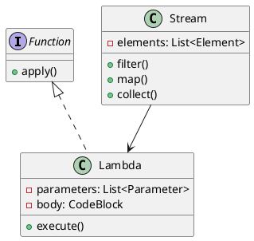
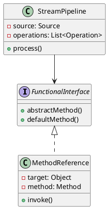
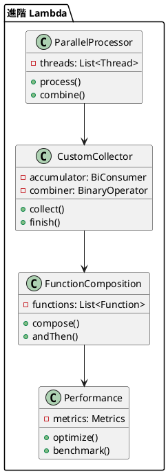

# Java Lambda 教學

## 初級（Beginner）層級

### 1. 概念說明
Java Lambda 就像是一個班級的任務分配系統，可以讓程式碼更簡潔地描述要做的事情。初級學習者需要了解：
- 什麼是 Lambda 表達式
- 為什麼需要 Lambda 表達式
- 基本的 Lambda 語法

### 2. PlantUML 圖解


### 3. 分段教學步驟

#### 步驟 1：基本語法
```java
// 傳統寫法
Runnable oldWay = new Runnable() {
    @Override
    public void run() {
        System.out.println("傳統寫法");
    }
};

// Lambda 寫法
Runnable newWay = () -> System.out.println("Lambda 寫法");
```

#### 步驟 2：簡單範例
```java
import java.util.*;
import java.util.function.*;

public class ClassLambdaExample {
    
    public static void main(String[] args) {
        // 1. 無參數的 Lambda
        Runnable morningAnnouncement = () -> 
            System.out.println("早安！今天天氣真好！");
        
        // 2. 帶參數的 Lambda
        Consumer<String> printMessage = message -> 
            System.out.println("收到訊息: " + message);
        
        // 3. 帶返回值的 Lambda
        Function<Integer, String> gradeConverter = score -> {
            if (score >= 90) return "A";
            if (score >= 80) return "B";
            if (score >= 70) return "C";
            return "D";
        };
        
        // 使用 Lambda
        morningAnnouncement.run();
        printMessage.accept("今天要考試");
        System.out.println("分數轉換: " + gradeConverter.apply(85));
    }
}
```

## 中級（Intermediate）層級

### 1. 概念說明
中級學習者需要理解：
- 函數式介面
- 方法引用
- Stream API
- 集合操作

### 2. PlantUML 圖解


### 3. 分段教學步驟

#### 步驟 1：函數式介面
```java
import java.util.*;
import java.util.function.*;

public class ClassFunctionalInterface {
    
    // 自定義函數式介面
    @FunctionalInterface
    interface StudentFilter {
        boolean test(Student student);
    }
    
    public static void main(String[] args) {
        List<Student> students = List.of(
            new Student("小明", 85),
            new Student("小華", 92),
            new Student("小美", 78)
        );
        
        // 使用 Lambda 過濾學生
        StudentFilter highScoreFilter = student -> student.score >= 90;
        
        // 使用內建函數式介面
        Predicate<Student> passingFilter = student -> student.score >= 60;
        
        // 過濾並顯示結果
        students.stream()
            .filter(highScoreFilter::test)
            .forEach(student -> System.out.println(student.name));
    }
    
    record Student(String name, int score) {}
}
```

#### 步驟 2：方法引用
```java
import java.util.*;
import java.util.function.*;

public class ClassMethodReference {
    
    public static void main(String[] args) {
        List<String> names = List.of("小明", "小華", "小美");
        
        // 1. 靜態方法引用
        names.forEach(System.out::println);
        
        // 2. 實例方法引用
        String prefix = "學生: ";
        names.forEach(prefix::concat);
        
        // 3. 建構函數引用
        Supplier<List<String>> listSupplier = ArrayList::new;
        List<String> newList = listSupplier.get();
    }
}
```

#### 步驟 3：Stream API
```java
import java.util.*;
import java.util.stream.*;

public class ClassStreamExample {
    
    public static void main(String[] args) {
        List<Student> students = List.of(
            new Student("小明", 85),
            new Student("小華", 92),
            new Student("小美", 78)
        );
        
        // 1. 過濾
        students.stream()
            .filter(s -> s.score >= 80)
            .forEach(s -> System.out.println(s.name));
        
        // 2. 轉換
        List<String> names = students.stream()
            .map(s -> s.name)
            .toList();
        
        // 3. 統計
        double average = students.stream()
            .mapToInt(s -> s.score)
            .average()
            .orElse(0);
            
        System.out.println("平均分數: " + average);
    }
    
    record Student(String name, int score) {}
}
```

## 高級（Advanced）層級

### 1. 概念說明
高級學習者需要掌握：
- 並行處理
- 自定義收集器
- 函數式組合
- 效能優化

### 2. PlantUML 圖解


### 3. 分段教學步驟

#### 步驟 1：並行處理
```java
import java.util.*;
import java.util.concurrent.*;
import java.util.stream.*;

public class ClassParallelProcessing {
    
    public static void main(String[] args) {
        List<Integer> numbers = IntStream.range(1, 100)
            .boxed()
            .toList();
        
        // 1. 並行計算總和
        int sum = numbers.parallelStream()
            .reduce(0, Integer::sum);
        
        // 2. 並行過濾和收集
        List<Integer> evenNumbers = numbers.parallelStream()
            .filter(n -> n % 2 == 0)
            .toList();
        
        // 3. 並行分組
        Map<Boolean, List<Integer>> partitioned = numbers.parallelStream()
            .collect(Collectors.partitioningBy(n -> n % 2 == 0));
    }
}
```

#### 步驟 2：自定義收集器
```java
import java.util.*;
import java.util.stream.*;

public class ClassCustomCollector {
    
    public static void main(String[] args) {
        List<Student> students = List.of(
            new Student("小明", 85),
            new Student("小華", 92),
            new Student("小美", 78)
        );
        
        // 自定義收集器：計算平均分數
        Collector<Student, ?, Double> averageScoreCollector = 
            Collectors.collectingAndThen(
                Collectors.averagingInt(Student::score),
                avg -> Math.round(avg * 100) / 100.0
            );
        
        double average = students.stream()
            .collect(averageScoreCollector);
            
        System.out.println("平均分數: " + average);
    }
    
    record Student(String name, int score) {}
}
```

#### 步驟 3：函數式組合
```java
import java.util.*;
import java.util.function.*;

public class ClassFunctionComposition {
    
    public static void main(String[] args) {
        // 1. 函數組合
        Function<Integer, Integer> addOne = x -> x + 1;
        Function<Integer, Integer> multiplyByTwo = x -> x * 2;
        
        // 組合函數：先加1，再乘以2
        Function<Integer, Integer> composed = addOne.andThen(multiplyByTwo);
        System.out.println("結果: " + composed.apply(5)); // 輸出: 12
        
        // 2. 謂詞組合
        Predicate<Integer> isEven = x -> x % 2 == 0;
        Predicate<Integer> isGreaterThanTen = x -> x > 10;
        
        // 組合謂詞：大於10的偶數
        Predicate<Integer> isEvenAndGreaterThanTen = 
            isEven.and(isGreaterThanTen);
            
        System.out.println("是否為大於10的偶數: " + 
            isEvenAndGreaterThanTen.test(12));
    }
}
```

這個教學文件提供了從基礎到進階的 Java Lambda 學習路徑，每個層級都包含了相應的概念說明、圖解、教學步驟和實作範例。初級學習者可以從基本的 Lambda 語法開始，中級學習者可以學習更複雜的函數式介面和 Stream API，而高級學習者則可以掌握並行處理和函數式組合等進階功能。 