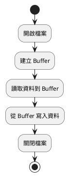
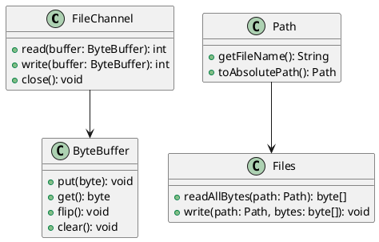
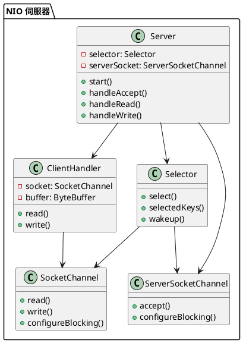

# Java NIO 教學

## 初級（Beginner）層級

### 1. 概念說明
Java NIO（New I/O）是 Java 提供的一套新的 I/O 處理方式，比傳統的 I/O 更有效率。初級學習者需要了解：
- 什麼是 NIO
- 基本的檔案讀寫操作
- 如何使用 Buffer 來處理資料

### 2. PlantUML 圖解


### 3. 分段教學步驟

#### 步驟 1：基本檔案讀取
```java
import java.nio.file.*;
import java.nio.charset.*;

public class SimpleFileReader {
    public static void main(String[] args) {
        try {
            // 讀取檔案內容
            Path filePath = Paths.get("test.txt");
            byte[] fileBytes = Files.readAllBytes(filePath);
            
            // 將位元組轉換為字串
            String content = new String(fileBytes, StandardCharsets.UTF_8);
            System.out.println("檔案內容：");
            System.out.println(content);
        } catch (Exception e) {
            System.out.println("發生錯誤：" + e.getMessage());
        }
    }
}
```

#### 步驟 2：基本檔案寫入
```java
import java.nio.file.*;
import java.nio.charset.*;

public class SimpleFileWriter {
    public static void main(String[] args) {
        try {
            // 要寫入的內容
            String content = "這是測試內容\n第二行";
            
            // 寫入檔案
            Path filePath = Paths.get("output.txt");
            Files.write(filePath, content.getBytes(StandardCharsets.UTF_8));
            
            System.out.println("檔案寫入完成！");
        } catch (Exception e) {
            System.out.println("發生錯誤：" + e.getMessage());
        }
    }
}
```

#### 步驟 3：使用 Buffer 讀取檔案
```java
import java.nio.*;
import java.nio.file.*;
import java.nio.charset.*;

public class BufferFileReader {
    public static void main(String[] args) {
        try {
            // 開啟檔案
            Path filePath = Paths.get("test.txt");
            byte[] fileBytes = Files.readAllBytes(filePath);
            
            // 建立 ByteBuffer
            ByteBuffer buffer = ByteBuffer.wrap(fileBytes);
            
            // 讀取資料
            while (buffer.hasRemaining()) {
                byte b = buffer.get();
                System.out.print((char) b);
            }
        } catch (Exception e) {
            System.out.println("發生錯誤：" + e.getMessage());
        }
    }
}
```

## 中級（Intermediate）層級

### 1. 概念說明
中級學習者需要理解：
- Channel 的概念和使用
- Buffer 的進階操作
- 檔案系統的基本操作
- 非阻塞式 I/O 的基本概念

### 2. PlantUML 圖解


### 3. 分段教學步驟

#### 步驟 1：使用 Channel 讀寫檔案
```java
import java.nio.*;
import java.nio.channels.*;
import java.nio.file.*;
import java.io.*;

public class ChannelFileIO {
    public static void main(String[] args) {
        try {
            // 開啟檔案通道
            Path sourcePath = Paths.get("source.txt");
            Path targetPath = Paths.get("target.txt");
            
            try (FileChannel sourceChannel = FileChannel.open(sourcePath, StandardOpenOption.READ);
                 FileChannel targetChannel = FileChannel.open(targetPath, 
                     StandardOpenOption.CREATE, StandardOpenOption.WRITE)) {
                
                // 建立緩衝區
                ByteBuffer buffer = ByteBuffer.allocate(1024);
                
                // 讀取並寫入
                while (sourceChannel.read(buffer) != -1) {
                    buffer.flip();  // 切換為讀取模式
                    targetChannel.write(buffer);
                    buffer.clear(); // 清空緩衝區
                }
                
                System.out.println("檔案複製完成！");
            }
        } catch (Exception e) {
            System.out.println("發生錯誤：" + e.getMessage());
        }
    }
}
```

#### 步驟 2：檔案系統操作
```java
import java.nio.file.*;
import java.nio.file.attribute.*;
import java.io.IOException;
import java.util.stream.*;

public class FileSystemOperations {
    public static void main(String[] args) {
        try {
            // 建立目錄
            Path dirPath = Paths.get("test_dir");
            Files.createDirectories(dirPath);
            
            // 建立檔案
            Path filePath = dirPath.resolve("test.txt");
            Files.createFile(filePath);
            
            // 寫入內容
            Files.write(filePath, "測試內容".getBytes());
            
            // 列出目錄內容
            System.out.println("目錄內容：");
            try (Stream<Path> paths = Files.list(dirPath)) {
                paths.forEach(System.out::println);
            }
            
            // 讀取檔案屬性
            BasicFileAttributes attrs = Files.readAttributes(filePath, BasicFileAttributes.class);
            System.out.println("檔案大小：" + attrs.size() + " 位元組");
            System.out.println("建立時間：" + attrs.creationTime());
            
        } catch (IOException e) {
            System.out.println("發生錯誤：" + e.getMessage());
        }
    }
}
```

#### 步驟 3：Buffer 進階操作
```java
import java.nio.*;

public class AdvancedBufferOperations {
    public static void main(String[] args) {
        // 建立緩衝區
        ByteBuffer buffer = ByteBuffer.allocate(100);
        
        // 寫入資料
        buffer.put("Hello".getBytes());
        buffer.put("World".getBytes());
        
        // 切換為讀取模式
        buffer.flip();
        
        // 讀取資料
        byte[] data = new byte[buffer.remaining()];
        buffer.get(data);
        
        System.out.println("讀取的資料：" + new String(data));
        
        // 清空緩衝區
        buffer.clear();
        
        // 重新寫入
        buffer.put("New Data".getBytes());
        buffer.flip();
        
        // 再次讀取
        data = new byte[buffer.remaining()];
        buffer.get(data);
        
        System.out.println("新的資料：" + new String(data));
    }
}
```

## 高級（Advanced）層級

### 1. 概念說明
高級學習者需要掌握：
- Selector 和非阻塞式 I/O
- 網路程式設計
- 多執行緒處理
- 效能優化

### 2. PlantUML 圖解


### 3. 分段教學步驟

#### 步驟 1：建立非阻塞式伺服器
```java
import java.nio.*;
import java.nio.channels.*;
import java.net.*;
import java.util.*;

public class NonBlockingServer {
    private Selector selector;
    private ServerSocketChannel serverSocket;
    
    public void start(int port) throws IOException {
        // 建立 Selector
        selector = Selector.open();
        
        // 建立 ServerSocketChannel
        serverSocket = ServerSocketChannel.open();
        serverSocket.bind(new InetSocketAddress(port));
        serverSocket.configureBlocking(false);
        serverSocket.register(selector, SelectionKey.OP_ACCEPT);
        
        System.out.println("伺服器啟動，監聽端口：" + port);
        
        while (true) {
            selector.select();
            Set<SelectionKey> selectedKeys = selector.selectedKeys();
            Iterator<SelectionKey> keyIterator = selectedKeys.iterator();
            
            while (keyIterator.hasNext()) {
                SelectionKey key = keyIterator.next();
                keyIterator.remove();
                
                if (key.isAcceptable()) {
                    handleAccept(key);
                } else if (key.isReadable()) {
                    handleRead(key);
                }
            }
        }
    }
    
    private void handleAccept(SelectionKey key) throws IOException {
        ServerSocketChannel serverChannel = (ServerSocketChannel) key.channel();
        SocketChannel clientChannel = serverChannel.accept();
        clientChannel.configureBlocking(false);
        clientChannel.register(selector, SelectionKey.OP_READ);
        System.out.println("新的客戶端連接：" + clientChannel.getRemoteAddress());
    }
    
    private void handleRead(SelectionKey key) throws IOException {
        SocketChannel channel = (SocketChannel) key.channel();
        ByteBuffer buffer = ByteBuffer.allocate(1024);
        
        int bytesRead = channel.read(buffer);
        if (bytesRead == -1) {
            channel.close();
            return;
        }
        
        buffer.flip();
        byte[] data = new byte[buffer.remaining()];
        buffer.get(data);
        String message = new String(data);
        System.out.println("收到訊息：" + message);
        
        // 回傳訊息
        ByteBuffer response = ByteBuffer.wrap(("收到：" + message).getBytes());
        channel.write(response);
    }
    
    public static void main(String[] args) throws IOException {
        new NonBlockingServer().start(8080);
    }
}
```

#### 步驟 2：建立非阻塞式客戶端
```java
import java.nio.*;
import java.nio.channels.*;
import java.net.*;
import java.util.*;

public class NonBlockingClient {
    private Selector selector;
    private SocketChannel socketChannel;
    
    public void connect(String host, int port) throws IOException {
        // 建立 Selector
        selector = Selector.open();
        
        // 建立 SocketChannel
        socketChannel = SocketChannel.open();
        socketChannel.configureBlocking(false);
        socketChannel.connect(new InetSocketAddress(host, port));
        socketChannel.register(selector, SelectionKey.OP_CONNECT);
        
        while (true) {
            selector.select();
            Set<SelectionKey> selectedKeys = selector.selectedKeys();
            Iterator<SelectionKey> keyIterator = selectedKeys.iterator();
            
            while (keyIterator.hasNext()) {
                SelectionKey key = keyIterator.next();
                keyIterator.remove();
                
                if (key.isConnectable()) {
                    handleConnect(key);
                } else if (key.isReadable()) {
                    handleRead(key);
                }
            }
        }
    }
    
    private void handleConnect(SelectionKey key) throws IOException {
        SocketChannel channel = (SocketChannel) key.channel();
        if (channel.isConnectionPending()) {
            channel.finishConnect();
        }
        channel.configureBlocking(false);
        channel.register(selector, SelectionKey.OP_READ);
        
        // 發送測試訊息
        ByteBuffer buffer = ByteBuffer.wrap("Hello Server!".getBytes());
        channel.write(buffer);
    }
    
    private void handleRead(SelectionKey key) throws IOException {
        SocketChannel channel = (SocketChannel) key.channel();
        ByteBuffer buffer = ByteBuffer.allocate(1024);
        
        int bytesRead = channel.read(buffer);
        if (bytesRead == -1) {
            channel.close();
            return;
        }
        
        buffer.flip();
        byte[] data = new byte[buffer.remaining()];
        buffer.get(data);
        System.out.println("收到回應：" + new String(data));
    }
    
    public static void main(String[] args) throws IOException {
        new NonBlockingClient().connect("localhost", 8080);
    }
}
```

#### 步驟 3：效能優化
```java
import java.nio.*;
import java.nio.channels.*;
import java.net.*;
import java.util.concurrent.*;

public class OptimizedServer {
    private final ExecutorService threadPool;
    private final Selector selector;
    private final ServerSocketChannel serverSocket;
    
    public OptimizedServer(int port) throws IOException {
        // 建立執行緒池
        threadPool = Executors.newFixedThreadPool(Runtime.getRuntime().availableProcessors());
        
        // 建立 Selector
        selector = Selector.open();
        
        // 建立 ServerSocketChannel
        serverSocket = ServerSocketChannel.open();
        serverSocket.bind(new InetSocketAddress(port));
        serverSocket.configureBlocking(false);
        serverSocket.register(selector, SelectionKey.OP_ACCEPT);
    }
    
    public void start() {
        System.out.println("伺服器啟動，使用 " + Runtime.getRuntime().availableProcessors() + " 個執行緒");
        
        while (true) {
            try {
                selector.select();
                Set<SelectionKey> selectedKeys = selector.selectedKeys();
                Iterator<SelectionKey> keyIterator = selectedKeys.iterator();
                
                while (keyIterator.hasNext()) {
                    SelectionKey key = keyIterator.next();
                    keyIterator.remove();
                    
                    if (key.isAcceptable()) {
                        handleAccept(key);
                    } else if (key.isReadable()) {
                        // 將讀取操作交給執行緒池處理
                        threadPool.execute(() -> {
                            try {
                                handleRead(key);
                            } catch (IOException e) {
                                e.printStackTrace();
                            }
                        });
                    }
                }
            } catch (IOException e) {
                e.printStackTrace();
            }
        }
    }
    
    private void handleAccept(SelectionKey key) throws IOException {
        ServerSocketChannel serverChannel = (ServerSocketChannel) key.channel();
        SocketChannel clientChannel = serverChannel.accept();
        clientChannel.configureBlocking(false);
        clientChannel.register(selector, SelectionKey.OP_READ);
        System.out.println("新的客戶端連接：" + clientChannel.getRemoteAddress());
    }
    
    private void handleRead(SelectionKey key) throws IOException {
        SocketChannel channel = (SocketChannel) key.channel();
        ByteBuffer buffer = ByteBuffer.allocate(1024);
        
        int bytesRead = channel.read(buffer);
        if (bytesRead == -1) {
            channel.close();
            return;
        }
        
        buffer.flip();
        byte[] data = new byte[buffer.remaining()];
        buffer.get(data);
        String message = new String(data);
        
        // 模擬處理時間
        try {
            Thread.sleep(100);
        } catch (InterruptedException e) {
            e.printStackTrace();
        }
        
        // 回傳訊息
        ByteBuffer response = ByteBuffer.wrap(("處理完成：" + message).getBytes());
        channel.write(response);
    }
    
    public static void main(String[] args) throws IOException {
        new OptimizedServer(8080).start();
    }
}
```

這個教學文件提供了從基礎到進階的 Java NIO 學習路徑，每個層級都包含了相應的概念說明、圖解、教學步驟和實作範例。初級學習者可以從基本的檔案操作開始，中級學習者可以學習更複雜的 Channel 和 Buffer 操作，而高級學習者則可以掌握完整的非阻塞式 I/O 和效能優化。 