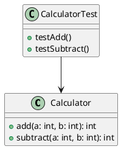
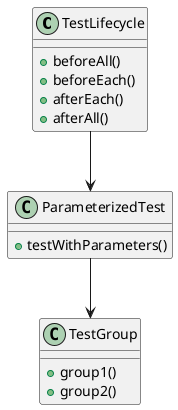
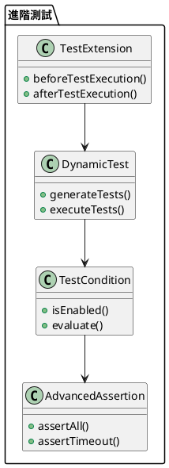

# JUnit 5 教學

## 初級（Beginner）層級

### 1. 概念說明
JUnit 5 就像是一個自動化的作業檢查系統，可以幫我們檢查程式碼是否正確。初級學習者需要了解：
- 什麼是單元測試
- 為什麼需要測試
- 基本的測試方法

### 2. PlantUML 圖解


### 3. 分段教學步驟

#### 步驟 1：基本測試
```java
import org.junit.jupiter.api.Test;
import static org.junit.jupiter.api.Assertions.*;

public class CalculatorTest {
    
    @Test
    void testAdd() {
        // 建立計算機
        Calculator calculator = new Calculator();
        
        // 測試加法
        int result = calculator.add(2, 3);
        
        // 檢查結果是否正確
        assertEquals(5, result, "2 + 3 應該等於 5");
    }
    
    @Test
    void testSubtract() {
        Calculator calculator = new Calculator();
        int result = calculator.subtract(5, 3);
        assertEquals(2, result, "5 - 3 應該等於 2");
    }
}

class Calculator {
    public int add(int a, int b) {
        return a + b;
    }
    
    public int subtract(int a, int b) {
        return a - b;
    }
}
```

#### 步驟 2：測試不同情況
```java
import org.junit.jupiter.api.Test;
import static org.junit.jupiter.api.Assertions.*;

public class GradeCalculatorTest {
    
    @Test
    void testCalculateGrade() {
        GradeCalculator calculator = new GradeCalculator();
        
        // 測試及格情況
        assertEquals("及格", calculator.calculateGrade(70));
        
        // 測試不及格情況
        assertEquals("不及格", calculator.calculateGrade(50));
        
        // 測試滿分情況
        assertEquals("滿分", calculator.calculateGrade(100));
    }
}

class GradeCalculator {
    public String calculateGrade(int score) {
        if (score >= 100) return "滿分";
        if (score >= 60) return "及格";
        return "不及格";
    }
}
```

## 中級（Intermediate）層級

### 1. 概念說明
中級學習者需要理解：
- 測試生命週期
- 參數化測試
- 測試前置和後置處理
- 測試分組

### 2. PlantUML 圖解


### 3. 分段教學步驟

#### 步驟 1：測試生命週期
```java
import org.junit.jupiter.api.*;
import static org.junit.jupiter.api.Assertions.*;

public class StudentTest {
    
    private Student student;
    
    @BeforeAll
    static void setupAll() {
        System.out.println("準備開始測試...");
    }
    
    @BeforeEach
    void setup() {
        student = new Student("小明");
        System.out.println("建立新的學生...");
    }
    
    @Test
    void testAddScore() {
        student.addScore(80);
        assertEquals(80, student.getScore());
    }
    
    @AfterEach
    void cleanup() {
        System.out.println("清理測試資料...");
    }
    
    @AfterAll
    static void cleanupAll() {
        System.out.println("所有測試完成！");
    }
}

class Student {
    private String name;
    private int score;
    
    public Student(String name) {
        this.name = name;
    }
    
    public void addScore(int score) {
        this.score = score;
    }
    
    public int getScore() {
        return score;
    }
}
```

#### 步驟 2：參數化測試
```java
import org.junit.jupiter.params.*;
import org.junit.jupiter.params.provider.*;
import static org.junit.jupiter.api.Assertions.*;

public class MathTest {
    
    @ParameterizedTest
    @ValueSource(ints = {1, 2, 3, 4, 5})
    void testSquare(int number) {
        assertEquals(number * number, square(number));
    }
    
    @ParameterizedTest
    @CsvSource({
        "2, 3, 5",
        "5, 7, 12",
        "10, 20, 30"
    })
    void testAdd(int a, int b, int expected) {
        assertEquals(expected, add(a, b));
    }
    
    private int square(int x) {
        return x * x;
    }
    
    private int add(int a, int b) {
        return a + b;
    }
}
```

## 高級（Advanced）層級

### 1. 概念說明
高級學習者需要掌握：
- 測試擴展
- 動態測試
- 測試條件
- 進階斷言

### 2. PlantUML 圖解


### 3. 分段教學步驟

#### 步驟 1：動態測試
```java
import org.junit.jupiter.api.*;
import static org.junit.jupiter.api.Assertions.*;
import static org.junit.jupiter.api.DynamicTest.*;

public class DynamicTestExample {
    
    @TestFactory
    Collection<DynamicTest> generateTests() {
        return List.of(
            dynamicTest("測試加法", () -> {
                assertEquals(5, add(2, 3));
            }),
            dynamicTest("測試減法", () -> {
                assertEquals(2, subtract(5, 3));
            }),
            dynamicTest("測試乘法", () -> {
                assertEquals(6, multiply(2, 3));
            })
        );
    }
    
    private int add(int a, int b) {
        return a + b;
    }
    
    private int subtract(int a, int b) {
        return a - b;
    }
    
    private int multiply(int a, int b) {
        return a * b;
    }
}
```

#### 步驟 2：進階斷言
```java
import org.junit.jupiter.api.*;
import static org.junit.jupiter.api.Assertions.*;
import java.time.Duration;

public class AdvancedAssertionTest {
    
    @Test
    void testStudentScores() {
        Student student = new Student("小明");
        student.addScore(80);
        student.addScore(90);
        student.addScore(85);
        
        assertAll("檢查學生成績",
            () -> assertEquals(255, student.getTotalScore()),
            () -> assertEquals(85, student.getAverageScore()),
            () -> assertTrue(student.hasPassed())
        );
    }
    
    @Test
    void testTimeout() {
        assertTimeout(Duration.ofSeconds(1), () -> {
            // 模擬一個耗時操作
            Thread.sleep(500);
            System.out.println("操作完成");
        });
    }
}

class Student {
    private String name;
    private List<Integer> scores = new ArrayList<>();
    
    public Student(String name) {
        this.name = name;
    }
    
    public void addScore(int score) {
        scores.add(score);
    }
    
    public int getTotalScore() {
        return scores.stream().mapToInt(Integer::intValue).sum();
    }
    
    public int getAverageScore() {
        return getTotalScore() / scores.size();
    }
    
    public boolean hasPassed() {
        return getAverageScore() >= 60;
    }
}
```

#### 步驟 3：測試條件
```java
import org.junit.jupiter.api.*;
import static org.junit.jupiter.api.Assertions.*;
import static org.junit.jupiter.api.condition.OS.*;
import static org.junit.jupiter.api.condition.JRE.*;

public class ConditionalTest {
    
    @Test
    @EnabledOnOs(WINDOWS)
    void testWindowsOnly() {
        System.out.println("這個測試只在 Windows 上執行");
    }
    
    @Test
    @EnabledForJreRange(min = JRE.JAVA_11, max = JRE.JAVA_17)
    void testJavaVersion() {
        System.out.println("這個測試在 Java 11 到 17 之間執行");
    }
    
    @Test
    @DisabledIfSystemProperty(named = "os.arch", matches = ".*64.*")
    void test32BitOnly() {
        System.out.println("這個測試只在 32 位元系統上執行");
    }
}
```

這個教學文件提供了從基礎到進階的 JUnit 5 學習路徑，每個層級都包含了相應的概念說明、圖解、教學步驟和實作範例。初級學習者可以從基本的測試方法開始，中級學習者可以學習測試生命週期和參數化測試，而高級學習者則可以掌握動態測試和進階斷言等進階功能。 