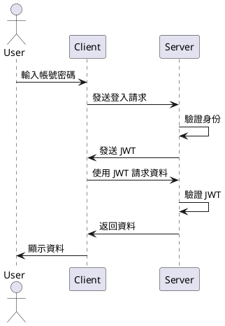
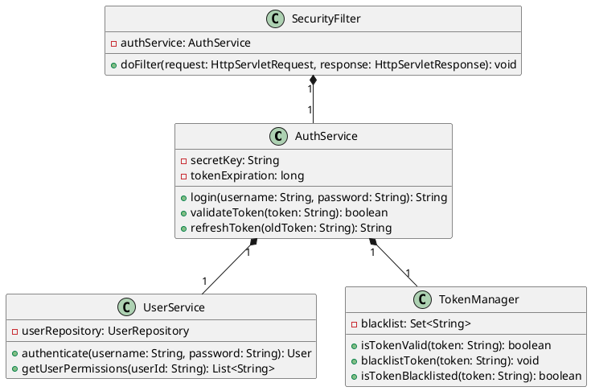
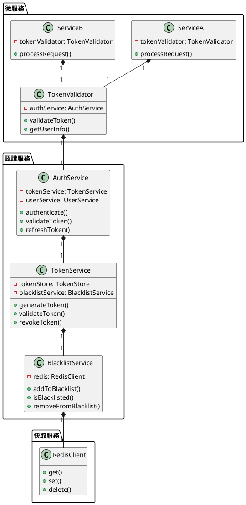

# JWT (JSON Web Token) 入門教學

## 初級：理解 JWT 的基本概念

### 概念說明
JWT 就像是一張「數位門票」，用來證明你是誰，以及你可以做什麼。想像一下：

- 你是一個學生，想要進入學校的圖書館
- 圖書管理員會檢查你的學生證
- 學生證上寫著你的名字、學號和可以借幾本書
- 這些資訊都是可以被驗證的，就像 JWT 一樣

JWT 由三個部分組成：
1. 標頭（Header）：說明這是什麼類型的票證
2. 內容（Payload）：包含實際的資訊
3. 簽名（Signature）：確保票證是真的

可能遇到的問題：
1. 忘記帶票證：JWT 過期或遺失
2. 票證被偽造：JWT 被竄改
3. 權限不足：JWT 中的權限不夠

解決方法：
1. 設定合理的過期時間
2. 使用安全的簽名演算法
3. 定期檢查權限

### PlantUML 圖解


### 分段教學步驟
1. 了解 JWT 的基本結構
2. 學習如何產生 JWT
3. 學習如何驗證 JWT
4. 了解 JWT 的安全性

### 實作範例
```java
import io.jsonwebtoken.Jwts;
import io.jsonwebtoken.SignatureAlgorithm;
import java.util.Date;

public class SimpleJWTExample {
    private static final String SECRET_KEY = "your-secret-key";
    
    public static void main(String[] args) {
        // 產生 JWT
        String token = Jwts.builder()
            .setSubject("user123")  // 使用者 ID
            .setIssuedAt(new Date())  // 發行時間
            .setExpiration(new Date(System.currentTimeMillis() + 86400000))  // 24 小時後過期
            .signWith(SignatureAlgorithm.HS256, SECRET_KEY)
            .compact();
            
        System.out.println("產生的 JWT: " + token);
        
        // 驗證 JWT
        try {
            String subject = Jwts.parser()
                .setSigningKey(SECRET_KEY)
                .parseClaimsJws(token)
                .getBody()
                .getSubject();
                
            System.out.println("驗證成功！使用者 ID: " + subject);
        } catch (Exception e) {
            System.out.println("驗證失敗！");
        }
    }
}
```

## 中級：實作 JWT 認證系統

### 概念說明
在這個層級，我們要學習如何實作一個完整的 JWT 認證系統。這就像是一個「數位門禁系統」的實作。

主要概念：
- 登入系統：處理使用者認證
- 令牌管理：產生和驗證 JWT
- 權限控制：根據 JWT 決定可以存取哪些資源
- 安全性考慮：防止攻擊和濫用

可能遇到的問題：
1. 令牌過期：需要重新登入
2. 權限變更：需要更新令牌
3. 安全性問題：如何防止令牌被竊取

解決方法：
1. 實作重新整理令牌機制
2. 使用短期的訪問令牌
3. 實作安全的儲存機制

### PlantUML 圖解


### 分段教學步驟
1. 設定 JWT 認證系統
2. 實作使用者認證
3. 實作令牌管理
4. 實作權限控制
5. 實作安全性機制

### 實作範例
```java
import io.jsonwebtoken.*;
import org.springframework.security.authentication.UsernamePasswordAuthenticationToken;
import org.springframework.security.core.Authentication;
import org.springframework.security.core.userdetails.UserDetails;
import org.springframework.security.core.userdetails.UserDetailsService;
import org.springframework.stereotype.Component;

@Component
public class JwtTokenProvider {
    private final String secretKey = "your-secret-key";
    private final long validityInMilliseconds = 3600000; // 1 小時
    
    private final UserDetailsService userDetailsService;
    
    public JwtTokenProvider(UserDetailsService userDetailsService) {
        this.userDetailsService = userDetailsService;
    }
    
    public String createToken(String username, List<String> roles) {
        Claims claims = Jwts.claims().setSubject(username);
        claims.put("roles", roles);
        
        Date now = new Date();
        Date validity = new Date(now.getTime() + validityInMilliseconds);
        
        return Jwts.builder()
            .setClaims(claims)
            .setIssuedAt(now)
            .setExpiration(validity)
            .signWith(SignatureAlgorithm.HS256, secretKey)
            .compact();
    }
    
    public Authentication getAuthentication(String token) {
        UserDetails userDetails = userDetailsService.loadUserByUsername(getUsername(token));
        return new UsernamePasswordAuthenticationToken(userDetails, "", userDetails.getAuthorities());
    }
    
    public String getUsername(String token) {
        return Jwts.parser().setSigningKey(secretKey).parseClaimsJws(token).getBody().getSubject();
    }
    
    public boolean validateToken(String token) {
        try {
            Jws<Claims> claims = Jwts.parser().setSigningKey(secretKey).parseClaimsJws(token);
            return !claims.getBody().getExpiration().before(new Date());
        } catch (JwtException | IllegalArgumentException e) {
            return false;
        }
    }
}
```

## 高級：實作分散式 JWT 認證系統

### 概念說明
在這個層級，我們要學習如何實作一個分散式的 JWT 認證系統。這就像是一個「跨校園的門禁系統」的實作。

主要概念：
- 分散式認證：多個服務共用認證
- 令牌管理：集中式令牌管理
- 微服務架構：服務間的認證
- 安全性考慮：分散式系統的安全

可能遇到的問題：
1. 效能問題：大量請求時的處理
2. 一致性問題：多個服務間的狀態同步
3. 安全性問題：分散式系統的攻擊防護

解決方法：
1. 使用快取和負載平衡
2. 實作分散式鎖定機制
3. 使用安全的通訊協定

### PlantUML 圖解


### 分段教學步驟
1. 設計分散式認證架構
2. 實作令牌管理服務
3. 實作黑名單服務
4. 實作微服務認證
5. 實作快取機制
6. 實作監控和日誌

### 實作範例
```java
import org.springframework.boot.SpringApplication;
import org.springframework.boot.autoconfigure.SpringBootApplication;
import org.springframework.context.annotation.Bean;
import org.springframework.data.redis.connection.RedisConnectionFactory;
import org.springframework.data.redis.core.RedisTemplate;
import org.springframework.security.config.annotation.web.builders.HttpSecurity;
import org.springframework.security.config.annotation.web.configuration.EnableWebSecurity;
import org.springframework.security.config.annotation.web.configuration.WebSecurityConfigurerAdapter;
import org.springframework.security.oauth2.config.annotation.web.configuration.EnableResourceServer;

@SpringBootApplication
@EnableResourceServer
public class AuthServiceApplication {
    public static void main(String[] args) {
        SpringApplication.run(AuthServiceApplication.class, args);
    }
    
    @Bean
    public RedisTemplate<String, String> redisTemplate(RedisConnectionFactory connectionFactory) {
        RedisTemplate<String, String> template = new RedisTemplate<>();
        template.setConnectionFactory(connectionFactory);
        return template;
    }
}

@Configuration
@EnableWebSecurity
public class SecurityConfig extends WebSecurityConfigurerAdapter {
    @Override
    protected void configure(HttpSecurity http) throws Exception {
        http
            .authorizeRequests()
            .antMatchers("/auth/**").permitAll()
            .antMatchers("/api/**").authenticated()
            .and()
            .oauth2ResourceServer()
            .jwt();
    }
}

@Service
public class TokenBlacklistService {
    private final RedisTemplate<String, String> redisTemplate;
    private static final String BLACKLIST_KEY = "token:blacklist";
    
    public TokenBlacklistService(RedisTemplate<String, String> redisTemplate) {
        this.redisTemplate = redisTemplate;
    }
    
    public void addToBlacklist(String token, long expirationTime) {
        redisTemplate.opsForValue().set(
            BLACKLIST_KEY + ":" + token,
            "blacklisted",
            expirationTime,
            TimeUnit.MILLISECONDS
        );
    }
    
    public boolean isBlacklisted(String token) {
        return Boolean.TRUE.equals(
            redisTemplate.hasKey(BLACKLIST_KEY + ":" + token)
        );
    }
}
```

## 總結

這份教學文件從 JWT 的基本概念開始，逐步引導學生學習更複雜的實作細節。每個難度層級都包含了必要的理論知識和實作範例，並使用 PlantUML 圖表來幫助理解系統架構。

初級課程著重於理解 JWT 的基本概念和結構，中級課程學習如何實作 JWT 認證系統，高級課程則涵蓋分散式 JWT 認證系統的實作。這樣的學習路徑可以幫助學生逐步建立對 JWT 的深入理解。 