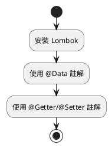
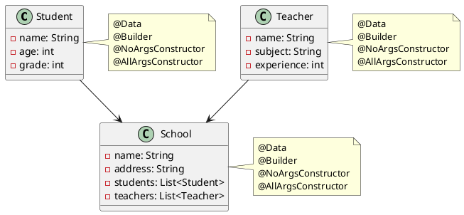
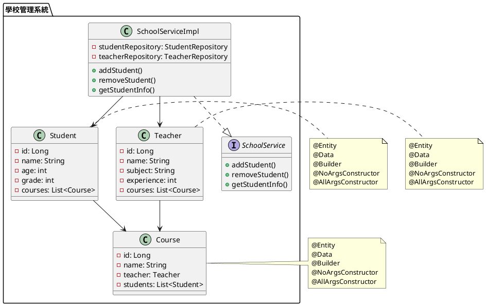

# Lombok 教學

## 初級（Beginner）層級

### 1. 概念說明
Lombok 是一個可以幫助我們減少重複程式碼的工具。初級學習者需要了解：
- 什麼是 Lombok
- 如何安裝 Lombok
- 基本的 Lombok 註解使用方式

### 2. PlantUML 圖解


### 3. 分段教學步驟

#### 步驟 1：安裝 Lombok
1. 在 Maven 專案的 `pom.xml` 中加入依賴：
```xml
<dependency>
    <groupId>org.projectlombok</groupId>
    <artifactId>lombok</artifactId>
    <version>1.18.30</version>
    <scope>provided</scope>
</dependency>
```

2. 在 IDE 中安裝 Lombok 插件（以 IntelliJ IDEA 為例）：
   - 開啟 Settings -> Plugins
   - 搜尋 "Lombok" 並安裝
   - 重啟 IDE

#### 步驟 2：基本使用
```java
// 沒有使用 Lombok 的類別
public class Student {
    private String name;
    private int age;
    
    public String getName() {
        return name;
    }
    
    public void setName(String name) {
        this.name = name;
    }
    
    public int getAge() {
        return age;
    }
    
    public void setAge(int age) {
        this.age = age;
    }
}

// 使用 Lombok 的類別
@Data
public class Student {
    private String name;
    private int age;
}
```

#### 步驟 3：常用註解
```java
// 使用 @Getter 和 @Setter
@Getter
@Setter
public class Book {
    private String title;
    private String author;
}

// 使用 @NoArgsConstructor 和 @AllArgsConstructor
@NoArgsConstructor
@AllArgsConstructor
public class Point {
    private int x;
    private int y;
}
```

## 中級（Intermediate）層級

### 1. 概念說明
中級學習者需要理解：
- Lombok 的進階註解
- 如何自定義 Lombok 行為
- 如何處理繼承關係
- 如何處理建構子

### 2. PlantUML 圖解


### 3. 分段教學步驟

#### 步驟 1：使用 @Builder 建立物件
```java
@Builder
@Data
public class Student {
    private String name;
    private int age;
    private int grade;
    
    public static void main(String[] args) {
        // 使用 Builder 建立物件
        Student student = Student.builder()
            .name("小明")
            .age(15)
            .grade(9)
            .build();
            
        System.out.println(student);
    }
}
```

#### 步驟 2：處理繼承關係
```java
@Data
public class Person {
    private String name;
    private int age;
}

@Data
@EqualsAndHashCode(callSuper = true)
public class Student extends Person {
    private int grade;
    private String school;
}
```

#### 步驟 3：自定義建構子
```java
@Data
@NoArgsConstructor
@AllArgsConstructor
public class Teacher {
    private String name;
    private String subject;
    private int experience;
    
    @Builder
    public Teacher(String name, String subject) {
        this.name = name;
        this.subject = subject;
        this.experience = 0;
    }
}
```

## 高級（Advanced）層級

### 1. 概念說明
高級學習者需要掌握：
- Lombok 的進階功能
- 如何整合 Lombok 與其他框架
- 如何處理複雜的物件關係
- 如何進行單元測試

### 2. PlantUML 圖解


### 3. 分段教學步驟

#### 步驟 1：整合 Spring Boot
```java
@Entity
@Data
@Builder
@NoArgsConstructor
@AllArgsConstructor
public class Student {
    @Id
    @GeneratedValue(strategy = GenerationType.IDENTITY)
    private Long id;
    
    private String name;
    private int age;
    private int grade;
    
    @ManyToMany
    @JoinTable(
        name = "student_course",
        joinColumns = @JoinColumn(name = "student_id"),
        inverseJoinColumns = @JoinColumn(name = "course_id")
    )
    private List<Course> courses;
}

@Service
@RequiredArgsConstructor
public class SchoolServiceImpl implements SchoolService {
    private final StudentRepository studentRepository;
    private final TeacherRepository teacherRepository;
    
    @Override
    public Student addStudent(Student student) {
        return studentRepository.save(student);
    }
    
    @Override
    public void removeStudent(Long studentId) {
        studentRepository.deleteById(studentId);
    }
    
    @Override
    public Student getStudentInfo(Long studentId) {
        return studentRepository.findById(studentId)
            .orElseThrow(() -> new StudentNotFoundException("找不到學生"));
    }
}
```

#### 步驟 2：單元測試
```java
@ExtendWith(MockitoExtension.class)
class SchoolServiceTest {
    @Mock
    private StudentRepository studentRepository;
    
    @Mock
    private TeacherRepository teacherRepository;
    
    @InjectMocks
    private SchoolServiceImpl schoolService;
    
    @Test
    void testAddStudent() {
        // 準備測試資料
        Student student = Student.builder()
            .name("小明")
            .age(15)
            .grade(9)
            .build();
            
        // 設定模擬行為
        when(studentRepository.save(any(Student.class)))
            .thenReturn(student);
            
        // 執行測試
        Student savedStudent = schoolService.addStudent(student);
        
        // 驗證結果
        assertNotNull(savedStudent);
        assertEquals("小明", savedStudent.getName());
        assertEquals(15, savedStudent.getAge());
        assertEquals(9, savedStudent.getGrade());
        
        // 驗證方法呼叫
        verify(studentRepository).save(any(Student.class));
    }
}
```

#### 步驟 3：進階功能使用
```java
@Slf4j
@Service
@RequiredArgsConstructor
public class SchoolServiceImpl implements SchoolService {
    private final StudentRepository studentRepository;
    private final TeacherRepository teacherRepository;
    
    @SneakyThrows
    public void processStudentData(Student student) {
        // 使用 @SneakyThrows 處理異常
        processStudent(student);
    }
    
    @Synchronized
    public void updateStudentGrade(Long studentId, int newGrade) {
        // 使用 @Synchronized 確保執行緒安全
        Student student = getStudentInfo(studentId);
        student.setGrade(newGrade);
        studentRepository.save(student);
    }
    
    private void processStudent(Student student) {
        log.info("處理學生資料: {}", student);
        // 處理邏輯...
    }
}
```

這個教學文件提供了從基礎到進階的 Lombok 學習路徑，每個層級都包含了相應的概念說明、圖解、教學步驟和實作範例。初級學習者可以從基本的註解使用開始，中級學習者可以學習更複雜的物件關係處理，而高級學習者則可以掌握完整的系統整合和進階功能使用。 