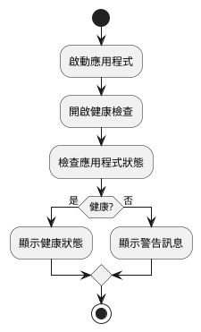
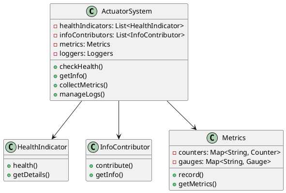
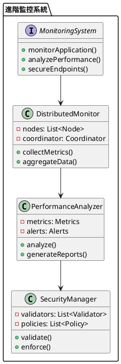

# Spring Actuator 教學

## 初級（Beginner）層級

### 1. 概念說明
Spring Actuator 就像是一個健康檢查員，可以幫我們檢查應用程式的健康狀況，就像醫生檢查我們的身體一樣。初級學習者需要了解：
- 什麼是應用程式監控
- 為什麼需要監控
- 基本的健康檢查方式

### 2. PlantUML 圖解


### 3. 分段教學步驟

#### 步驟 1：基本專案設定
```xml
<!-- pom.xml -->
<dependencies>
    <dependency>
        <groupId>org.springframework.boot</groupId>
        <artifactId>spring-boot-starter-actuator</artifactId>
        <version>3.3.10</version>
    </dependency>
</dependencies>
```

#### 步驟 2：基本配置
```yaml
# application.yml
management:
  endpoints:
    web:
      exposure:
        include: health,info
  endpoint:
    health:
      show-details: always
```

#### 步驟 3：簡單範例
```java
import org.springframework.boot.actuate.health.Health;
import org.springframework.boot.actuate.health.HealthIndicator;
import org.springframework.stereotype.Component;

@Component
public class StudentHealthIndicator implements HealthIndicator {
    @Override
    public Health health() {
        // 檢查學生資料庫是否正常
        return isDatabaseHealthy() 
            ? Health.up().build()
            : Health.down().build();
    }
    
    private boolean isDatabaseHealthy() {
        // 實際的資料庫健康檢查邏輯
        return true;
    }
}
```

## 中級（Intermediate）層級

### 1. 概念說明
中級學習者需要理解：
- 自訂健康指標
- 應用程式資訊
- 度量指標
- 日誌管理

### 2. PlantUML 圖解


### 3. 分段教學步驟

#### 步驟 1：自訂健康指標
```java
import org.springframework.boot.actuate.health.Health;
import org.springframework.boot.actuate.health.HealthIndicator;
import org.springframework.stereotype.Component;
import jakarta.sql.DataSource;

@Component
public class DatabaseHealthIndicator implements HealthIndicator {
    private final DataSource dataSource;
    
    public DatabaseHealthIndicator(DataSource dataSource) {
        this.dataSource = dataSource;
    }
    
    @Override
    public Health health() {
        try {
            // 檢查資料庫連線
            dataSource.getConnection();
            return Health.up()
                .withDetail("database", "connected")
                .build();
        } catch (Exception e) {
            return Health.down()
                .withDetail("error", e.getMessage())
                .build();
        }
    }
}
```

#### 步驟 2：應用程式資訊
```java
import org.springframework.boot.actuate.info.Info;
import org.springframework.boot.actuate.info.InfoContributor;
import org.springframework.stereotype.Component;
import java.time.Instant;

@Component
public class StudentInfoContributor implements InfoContributor {
    private final StudentRepository studentRepository;
    
    public StudentInfoContributor(StudentRepository studentRepository) {
        this.studentRepository = studentRepository;
    }
    
    @Override
    public void contribute(Info.Builder builder) {
        builder.withDetail("studentCount", studentRepository.count())
               .withDetail("lastUpdate", Instant.now());
    }
}
```

#### 步驟 3：度量指標
```java
import io.micrometer.core.instrument.MeterRegistry;
import org.springframework.stereotype.Component;

@Component
public class StudentMetrics {
    private final MeterRegistry registry;
    private final Counter studentCounter;
    
    public StudentMetrics(MeterRegistry registry) {
        this.registry = registry;
        this.studentCounter = registry.counter("student.registrations");
    }
    
    public void recordStudentRegistration() {
        studentCounter.increment();
    }
}
```

## 高級（Advanced）層級

### 1. 概念說明
高級學習者需要掌握：
- 分散式監控
- 效能分析
- 安全控制
- 自訂端點

### 2. PlantUML 圖解


### 3. 分段教學步驟

#### 步驟 1：分散式監控
```java
import org.springframework.boot.actuate.endpoint.annotation.Endpoint;
import org.springframework.boot.actuate.endpoint.annotation.ReadOperation;
import org.springframework.stereotype.Component;
import java.util.Map;
import java.util.concurrent.ConcurrentHashMap;
import java.util.stream.Collectors;

@Component
@Endpoint(id = "distributed-metrics")
public class DistributedMetricsEndpoint {
    private final Map<String, NodeMetrics> nodeMetrics = new ConcurrentHashMap<>();
    
    @ReadOperation
    public Map<String, Object> metrics() {
        return nodeMetrics.entrySet().stream()
            .collect(Collectors.toMap(
                Map.Entry::getKey,
                entry -> entry.getValue().getMetrics()
            ));
    }
    
    public void updateNodeMetrics(String nodeId, NodeMetrics metrics) {
        nodeMetrics.put(nodeId, metrics);
    }
}
```

#### 步驟 2：效能分析
```java
import org.springframework.boot.actuate.endpoint.annotation.Endpoint;
import org.springframework.boot.actuate.endpoint.annotation.ReadOperation;
import org.springframework.stereotype.Component;
import java.util.Map;
import java.util.concurrent.ConcurrentHashMap;
import java.util.stream.Collectors;

@Component
@Endpoint(id = "performance")
public class PerformanceEndpoint {
    private final Map<String, PerformanceMetrics> metrics = new ConcurrentHashMap<>();
    
    @ReadOperation
    public Map<String, Object> analyze() {
        return metrics.entrySet().stream()
            .collect(Collectors.toMap(
                Map.Entry::getKey,
                entry -> {
                    PerformanceMetrics pm = entry.getValue();
                    return Map.of(
                        "averageResponseTime", pm.getAverageResponseTime(),
                        "errorRate", pm.getErrorRate(),
                        "throughput", pm.getThroughput()
                    );
                }
            ));
    }
}
```

#### 步驟 3：安全控制
```java
import org.springframework.boot.actuate.endpoint.annotation.Endpoint;
import org.springframework.boot.actuate.endpoint.annotation.ReadOperation;
import org.springframework.security.core.Authentication;
import org.springframework.security.core.context.SecurityContextHolder;
import org.springframework.stereotype.Component;
import java.util.Map;

@Component
@Endpoint(id = "security")
public class SecurityEndpoint {
    @ReadOperation
    public Map<String, Object> securityInfo() {
        Authentication auth = SecurityContextHolder.getContext().getAuthentication();
        return Map.of(
            "username", auth.getName(),
            "roles", auth.getAuthorities(),
            "isAuthenticated", auth.isAuthenticated()
        );
    }
}
```

這個教學文件提供了從基礎到進階的 Spring Actuator 學習路徑，每個層級都包含了相應的概念說明、圖解、教學步驟和實作範例。初級學習者可以從基本的健康檢查開始，中級學習者可以學習更複雜的監控指標和度量，而高級學習者則可以掌握完整的分散式監控系統和效能分析。 