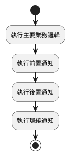
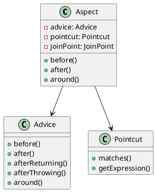
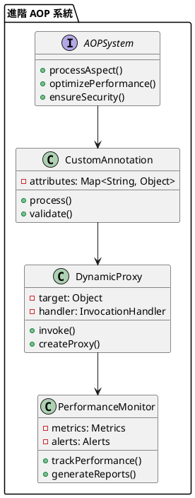

# Spring AOP 教學

## 初級（Beginner）層級

### 1. 概念說明
Spring AOP 就像是一個班級的班長，可以幫我們處理一些重複的工作，比如點名、收作業等。初級學習者需要了解：
- 什麼是 AOP（面向切面編程）
- 為什麼需要 AOP
- 基本的 AOP 使用方式

### 2. PlantUML 圖解


### 3. 分段教學步驟

#### 步驟 1：基本專案設定
```xml
<!-- pom.xml -->
<dependencies>
    <dependency>
        <groupId>org.springframework.boot</groupId>
        <artifactId>spring-boot-starter-aop</artifactId>
        <version>3.3.10</version>
    </dependency>
</dependencies>
```

#### 步驟 2：基本配置
```yaml
# application.yml
spring:
  aop:
    auto: true
```

#### 步驟 3：簡單範例
```java
import org.springframework.stereotype.Component;
import org.aspectj.lang.annotation.Aspect;
import org.aspectj.lang.annotation.Before;

@Aspect
@Component
public class LoggingAspect {
    @Before("execution(* com.example.service.*.*(..))")
    public void logBefore() {
        System.out.println("方法執行前記錄日誌");
    }
}
```

## 中級（Intermediate）層級

### 1. 概念說明
中級學習者需要理解：
- 通知類型
- 切點表達式
- 連接點
- 切面組合

### 2. PlantUML 圖解


### 3. 分段教學步驟

#### 步驟 1：通知類型
```java
import org.springframework.stereotype.Component;
import org.aspectj.lang.annotation.Aspect;
import org.aspectj.lang.annotation.*;
import org.aspectj.lang.ProceedingJoinPoint;

@Aspect
@Component
public class AdvancedLoggingAspect {
    @Before("execution(* com.example.service.*.*(..))")
    public void logBefore() {
        System.out.println("方法執行前");
    }
    
    @After("execution(* com.example.service.*.*(..))")
    public void logAfter() {
        System.out.println("方法執行後");
    }
    
    @Around("execution(* com.example.service.*.*(..))")
    public Object logAround(ProceedingJoinPoint joinPoint) throws Throwable {
        System.out.println("方法執行前");
        Object result = joinPoint.proceed();
        System.out.println("方法執行後");
        return result;
    }
}
```

#### 步驟 2：切點表達式
```java
import org.springframework.stereotype.Component;
import org.aspectj.lang.annotation.Aspect;
import org.aspectj.lang.annotation.Pointcut;

@Aspect
@Component
public class PointcutAspect {
    @Pointcut("execution(* com.example.service.*.*(..))")
    public void serviceMethods() {}
    
    @Pointcut("execution(* com.example.repository.*.*(..))")
    public void repositoryMethods() {}
    
    @Before("serviceMethods() || repositoryMethods()")
    public void logBefore() {
        System.out.println("方法執行前");
    }
}
```

#### 步驟 3：連接點
```java
import org.springframework.stereotype.Component;
import org.aspectj.lang.annotation.Aspect;
import org.aspectj.lang.JoinPoint;
import org.aspectj.lang.annotation.Before;

@Aspect
@Component
public class JoinPointAspect {
    @Before("execution(* com.example.service.*.*(..))")
    public void logJoinPoint(JoinPoint joinPoint) {
        System.out.println("方法名稱: " + joinPoint.getSignature().getName());
        System.out.println("參數: " + java.util.Arrays.toString(joinPoint.getArgs()));
    }
}
```

## 高級（Advanced）層級

### 1. 概念說明
高級學習者需要掌握：
- 自訂註解
- 動態代理
- 效能優化
- 安全控制

### 2. PlantUML 圖解


### 3. 分段教學步驟

#### 步驟 1：自訂註解
```java
import java.lang.annotation.ElementType;
import java.lang.annotation.Retention;
import java.lang.annotation.RetentionPolicy;
import java.lang.annotation.Target;

@Target(ElementType.METHOD)
@Retention(RetentionPolicy.RUNTIME)
public @interface LogExecutionTime {
    String value() default "";
}

@Aspect
@Component
public class CustomAnnotationAspect {
    @Around("@annotation(logExecutionTime)")
    public Object logExecutionTime(ProceedingJoinPoint joinPoint, LogExecutionTime logExecutionTime) throws Throwable {
        long startTime = System.currentTimeMillis();
        Object result = joinPoint.proceed();
        long executionTime = System.currentTimeMillis() - startTime;
        System.out.println(logExecutionTime.value() + " 執行時間: " + executionTime + "ms");
        return result;
    }
}
```

#### 步驟 2：動態代理
```java
import org.springframework.stereotype.Component;
import java.lang.reflect.InvocationHandler;
import java.lang.reflect.Method;
import java.lang.reflect.Proxy;
import java.util.Map;
import java.util.concurrent.ConcurrentHashMap;

@Component
public class DynamicProxyService {
    private final Map<Class<?>, Object> proxyCache = new ConcurrentHashMap<>();
    
    public <T> T createProxy(T target) {
        return (T) proxyCache.computeIfAbsent(target.getClass(), 
            clazz -> Proxy.newProxyInstance(
                clazz.getClassLoader(),
                clazz.getInterfaces(),
                new LoggingInvocationHandler(target)
            )
        );
    }
    
    private static class LoggingInvocationHandler implements InvocationHandler {
        private final Object target;
        
        public LoggingInvocationHandler(Object target) {
            this.target = target;
        }
        
        @Override
        public Object invoke(Object proxy, Method method, Object[] args) throws Throwable {
            System.out.println("方法執行前: " + method.getName());
            Object result = method.invoke(target, args);
            System.out.println("方法執行後: " + method.getName());
            return result;
        }
    }
}
```

#### 步驟 3：效能優化
```java
import org.springframework.stereotype.Component;
import org.aspectj.lang.annotation.Aspect;
import org.aspectj.lang.ProceedingJoinPoint;
import java.util.Map;
import java.util.concurrent.ConcurrentHashMap;

@Aspect
@Component
public class PerformanceAspect {
    private final Map<String, PerformanceMetrics> metrics = new ConcurrentHashMap<>();
    
    @Around("execution(* com.example.service.*.*(..))")
    public Object monitorPerformance(ProceedingJoinPoint joinPoint) throws Throwable {
        long startTime = System.currentTimeMillis();
        String methodName = joinPoint.getSignature().getName();
        
        try {
            Object result = joinPoint.proceed();
            recordPerformance(methodName, startTime, true);
            return result;
        } catch (Exception e) {
            recordPerformance(methodName, startTime, false);
            throw e;
        }
    }
    
    private void recordPerformance(String methodName, long startTime, boolean success) {
        long duration = System.currentTimeMillis() - startTime;
        metrics.compute(methodName, (key, value) -> {
            if (value == null) {
                return new PerformanceMetrics(duration, success);
            }
            value.update(duration, success);
            return value;
        });
    }
}
```

這個教學文件提供了從基礎到進階的 Spring AOP 學習路徑，每個層級都包含了相應的概念說明、圖解、教學步驟和實作範例。初級學習者可以從基本的 AOP 概念開始，中級學習者可以學習更複雜的切面編程技術，而高級學習者則可以掌握完整的 AOP 系統和效能優化。 