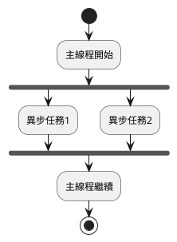
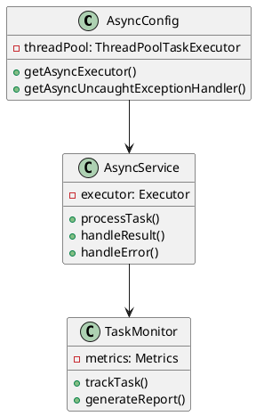
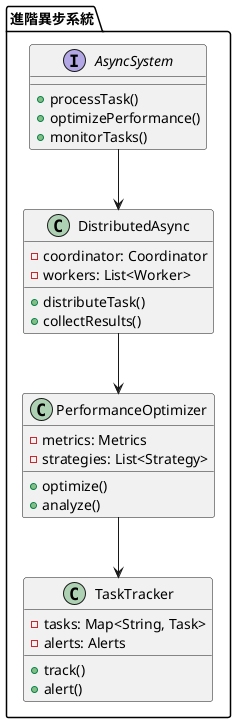

# Spring Async 教學

## 初級（Beginner）層級

### 1. 概念說明
Spring Async 就像是一個班級的值日生，可以同時處理多個任務，比如一邊收作業一邊點名。初級學習者需要了解：
- 什麼是異步處理
- 為什麼需要異步處理
- 基本的異步處理方式

### 2. PlantUML 圖解


### 3. 分段教學步驟

#### 步驟 1：基本專案設定
```xml
<!-- pom.xml -->
<dependencies>
    <dependency>
        <groupId>org.springframework.boot</groupId>
        <artifactId>spring-boot-starter</artifactId>
        <version>3.3.10</version>
    </dependency>
</dependencies>
```

#### 步驟 2：基本配置
```yaml
# application.yml
spring:
  task:
    execution:
      pool:
        core-size: 5
        max-size: 10
        queue-capacity: 100
```

#### 步驟 3：簡單範例
```java
import org.springframework.scheduling.annotation.Async;
import org.springframework.stereotype.Service;

@Service
public class StudentService {
    @Async
    public void processStudentData(Student student) {
        // 異步處理學生資料
        System.out.println("處理學生資料: " + student.getName());
    }
}
```

## 中級（Intermediate）層級

### 1. 概念說明
中級學習者需要理解：
- 異步執行緒池配置
- 異步返回值處理
- 異常處理
- 任務監控

### 2. PlantUML 圖解


### 3. 分段教學步驟

#### 步驟 1：異步配置
```java
import org.springframework.context.annotation.Configuration;
import org.springframework.scheduling.annotation.EnableAsync;
import org.springframework.scheduling.concurrent.ThreadPoolTaskExecutor;
import java.util.concurrent.Executor;

@Configuration
@EnableAsync
public class AsyncConfig {
    public Executor getAsyncExecutor() {
        ThreadPoolTaskExecutor executor = new ThreadPoolTaskExecutor();
        executor.setCorePoolSize(5);
        executor.setMaxPoolSize(10);
        executor.setQueueCapacity(100);
        executor.setThreadNamePrefix("Async-");
        executor.initialize();
        return executor;
    }
}
```

#### 步驟 2：異步返回值
```java
import org.springframework.scheduling.annotation.Async;
import org.springframework.stereotype.Service;
import java.util.concurrent.CompletableFuture;

@Service
public class GradeService {
    @Async
    public CompletableFuture<Grade> calculateGrade(Student student) {
        // 異步計算成績
        return CompletableFuture.completedFuture(new Grade(student.getId(), 90));
    }
}
```

#### 步驟 3：異常處理
```java
import org.springframework.scheduling.annotation.Async;
import org.springframework.stereotype.Service;
import java.util.concurrent.CompletableFuture;

@Service
public class ExamService {
    @Async
    public CompletableFuture<Void> processExam(Exam exam) {
        try {
            // 處理考試
            return CompletableFuture.completedFuture(null);
        } catch (Exception e) {
            return CompletableFuture.failedFuture(e);
        }
    }
}
```

## 高級（Advanced）層級

### 1. 概念說明
高級學習者需要掌握：
- 分散式異步處理
- 效能優化
- 任務調度
- 監控與追蹤

### 2. PlantUML 圖解


### 3. 分段教學步驟

#### 步驟 1：分散式異步處理
```java
import org.springframework.scheduling.annotation.Async;
import org.springframework.stereotype.Service;
import java.util.Map;
import java.util.concurrent.CompletableFuture;
import java.util.concurrent.ConcurrentHashMap;

@Service
public class DistributedAsyncService {
    private final Map<String, CompletableFuture<?>> tasks = new ConcurrentHashMap<>();
    
    @Async
    public CompletableFuture<Void> processDistributedTask(String taskId) {
        return CompletableFuture.runAsync(() -> {
            // 分散式任務處理
            System.out.println("處理任務: " + taskId);
        });
    }
    
    public void trackTask(String taskId, CompletableFuture<?> future) {
        tasks.put(taskId, future);
    }
}
```

#### 步驟 2：效能優化
```java
import org.springframework.scheduling.annotation.Async;
import org.springframework.stereotype.Service;
import java.util.Map;
import java.util.concurrent.CompletableFuture;
import java.util.concurrent.ConcurrentHashMap;

@Service
public class OptimizedAsyncService {
    private final Map<String, PerformanceMetrics> metrics = new ConcurrentHashMap<>();
    
    @Async
    public CompletableFuture<Void> processOptimizedTask(String taskId) {
        long startTime = System.currentTimeMillis();
        
        return CompletableFuture.runAsync(() -> {
            try {
                // 執行任務
                processTask(taskId);
                recordPerformance(taskId, startTime, true);
            } catch (Exception e) {
                recordPerformance(taskId, startTime, false);
                throw e;
            }
        });
    }
    
    private void recordPerformance(String taskId, long startTime, boolean success) {
        long duration = System.currentTimeMillis() - startTime;
        metrics.compute(taskId, (key, value) -> {
            if (value == null) {
                return new PerformanceMetrics(duration, success);
            }
            value.update(duration, success);
            return value;
        });
    }
}
```

#### 步驟 3：任務監控
```java
import org.springframework.scheduling.annotation.Async;
import org.springframework.stereotype.Service;
import java.util.Map;
import java.util.concurrent.CompletableFuture;
import java.util.concurrent.ConcurrentHashMap;

@Service
public class MonitoredAsyncService {
    private final Map<String, TaskStatus> taskStatuses = new ConcurrentHashMap<>();
    
    @Async
    public CompletableFuture<Void> processMonitoredTask(String taskId) {
        taskStatuses.put(taskId, new TaskStatus("RUNNING"));
        
        return CompletableFuture.runAsync(() -> {
            try {
                // 執行任務
                processTask(taskId);
                taskStatuses.put(taskId, new TaskStatus("COMPLETED"));
            } catch (Exception e) {
                taskStatuses.put(taskId, new TaskStatus("FAILED", e.getMessage()));
                throw e;
            }
        });
    }
    
    public TaskStatus getTaskStatus(String taskId) {
        return taskStatuses.get(taskId);
    }
}
```

這個教學文件提供了從基礎到進階的 Spring Async 學習路徑，每個層級都包含了相應的概念說明、圖解、教學步驟和實作範例。初級學習者可以從基本的異步處理開始，中級學習者可以學習更複雜的異步配置和異常處理，而高級學習者則可以掌握完整的分散式異步系統和效能優化。 