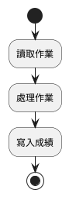
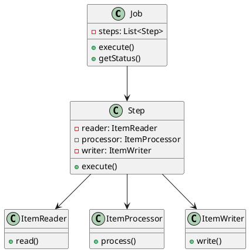
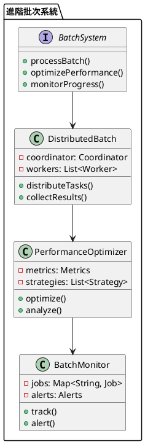

# Spring Batch 教學

## 初級（Beginner）層級

### 1. 概念說明
Spring Batch 就像是一個班級的作業批改系統，可以自動處理大量的作業。初級學習者需要了解：
- 什麼是批次處理
- 為什麼需要批次處理
- 基本的批次處理方式

### 2. PlantUML 圖解


### 3. 分段教學步驟

#### 步驟 1：基本專案設定
```xml
<!-- pom.xml -->
<dependencies>
    <dependency>
        <groupId>org.springframework.boot</groupId>
        <artifactId>spring-boot-starter-batch</artifactId>
        <version>3.3.10</version>
    </dependency>
</dependencies>
```

#### 步驟 2：基本配置
```yaml
# application.yml
spring:
  batch:
    job:
      enabled: true
```

#### 步驟 3：簡單範例
```java
import org.springframework.batch.core.Job;
import org.springframework.batch.core.Step;
import org.springframework.batch.core.job.builder.JobBuilder;
import org.springframework.batch.core.repository.JobRepository;
import org.springframework.batch.core.step.builder.StepBuilder;
import org.springframework.batch.item.ItemProcessor;
import org.springframework.batch.item.ItemReader;
import org.springframework.batch.item.ItemWriter;
import org.springframework.context.annotation.Bean;
import org.springframework.context.annotation.Configuration;
import org.springframework.transaction.PlatformTransactionManager;

@Configuration
public class SimpleBatchConfig {
    
    @Bean
    public Job simpleJob(JobRepository jobRepository, Step simpleStep) {
        return new JobBuilder("simpleJob", jobRepository)
            .start(simpleStep)
            .build();
    }
    
    @Bean
    public Step simpleStep(JobRepository jobRepository, 
                         PlatformTransactionManager transactionManager,
                         ItemReader<String> reader,
                         ItemProcessor<String, String> processor,
                         ItemWriter<String> writer) {
        return new StepBuilder("simpleStep", jobRepository)
            .<String, String>chunk(10, transactionManager)
            .reader(reader)
            .processor(processor)
            .writer(writer)
            .build();
    }
}
```

## 中級（Intermediate）層級

### 1. 概念說明
中級學習者需要理解：
- 批次處理的組成部分
- 資料讀取和寫入
- 錯誤處理
- 監控和報告

### 2. PlantUML 圖解


### 3. 分段教學步驟

#### 步驟 1：進階批次配置
```java
import org.springframework.batch.core.Job;
import org.springframework.batch.core.Step;
import org.springframework.batch.core.job.builder.JobBuilder;
import org.springframework.batch.core.repository.JobRepository;
import org.springframework.batch.core.step.builder.StepBuilder;
import org.springframework.batch.item.ItemProcessor;
import org.springframework.batch.item.ItemReader;
import org.springframework.batch.item.ItemWriter;
import org.springframework.context.annotation.Bean;
import org.springframework.context.annotation.Configuration;
import org.springframework.transaction.PlatformTransactionManager;

@Configuration
public class AdvancedBatchConfig {
    
    @Bean
    public Job advancedJob(JobRepository jobRepository, Step step1, Step step2) {
        return new JobBuilder("advancedJob", jobRepository)
            .start(step1)
            .next(step2)
            .build();
    }
    
    @Bean
    public Step step1(JobRepository jobRepository, 
                     PlatformTransactionManager transactionManager,
                     ItemReader<Student> reader,
                     ItemProcessor<Student, Grade> processor,
                     ItemWriter<Grade> writer) {
        return new StepBuilder("step1", jobRepository)
            .<Student, Grade>chunk(10, transactionManager)
            .reader(reader)
            .processor(processor)
            .writer(writer)
            .build();
    }
}
```

#### 步驟 2：自訂讀取器和寫入器
```java
import org.springframework.batch.item.ItemReader;
import org.springframework.batch.item.ItemWriter;
import java.util.List;

public class StudentReader implements ItemReader<Student> {
    private List<Student> students;
    private int currentIndex = 0;
    
    public StudentReader(List<Student> students) {
        this.students = students;
    }
    
    @Override
    public Student read() {
        if (currentIndex < students.size()) {
            return students.get(currentIndex++);
        }
        return null;
    }
}

public class GradeWriter implements ItemWriter<Grade> {
    @Override
    public void write(List<? extends Grade> grades) {
        grades.forEach(grade -> 
            System.out.println("學生 " + grade.getStudentId() + " 的成績: " + grade.getScore())
        );
    }
}
```

#### 步驟 3：錯誤處理
```java
import org.springframework.batch.core.step.skip.SkipPolicy;
import org.springframework.batch.item.ItemProcessor;
import org.springframework.batch.item.ItemWriter;

public class SkipPolicyImpl implements SkipPolicy {
    @Override
    public boolean shouldSkip(Throwable t, int skipCount) {
        return skipCount < 3;
    }
}

public class ErrorHandlingProcessor implements ItemProcessor<Student, Grade> {
    @Override
    public Grade process(Student student) throws Exception {
        try {
            return calculateGrade(student);
        } catch (Exception e) {
            System.err.println("處理學生 " + student.getId() + " 時發生錯誤: " + e.getMessage());
            throw e;
        }
    }
}
```

## 高級（Advanced）層級

### 1. 概念說明
高級學習者需要掌握：
- 分散式批次處理
- 效能優化
- 監控和追蹤
- 安全控制

### 2. PlantUML 圖解


### 3. 分段教學步驟

#### 步驟 1：分散式批次處理
```java
import org.springframework.batch.core.Job;
import org.springframework.batch.core.Step;
import org.springframework.batch.core.job.builder.JobBuilder;
import org.springframework.batch.core.repository.JobRepository;
import org.springframework.batch.core.step.builder.StepBuilder;
import org.springframework.context.annotation.Bean;
import org.springframework.context.annotation.Configuration;
import org.springframework.transaction.PlatformTransactionManager;
import java.util.Map;
import java.util.concurrent.ConcurrentHashMap;

@Configuration
public class DistributedBatchConfig {
    private final Map<String, Job> jobRegistry = new ConcurrentHashMap<>();
    
    @Bean
    public Job distributedJob(JobRepository jobRepository, Step masterStep) {
        return new JobBuilder("distributedJob", jobRepository)
            .start(masterStep)
            .build();
    }
    
    @Bean
    public Step masterStep(JobRepository jobRepository, 
                         PlatformTransactionManager transactionManager) {
        return new StepBuilder("masterStep", jobRepository)
            .partitioner("slaveStep", partitioner())
            .gridSize(3)
            .build();
    }
}
```

#### 步驟 2：效能優化
```java
import org.springframework.batch.core.Job;
import org.springframework.batch.core.Step;
import org.springframework.batch.core.job.builder.JobBuilder;
import org.springframework.batch.core.repository.JobRepository;
import org.springframework.batch.core.step.builder.StepBuilder;
import org.springframework.context.annotation.Bean;
import org.springframework.context.annotation.Configuration;
import org.springframework.transaction.PlatformTransactionManager;
import java.util.Map;
import java.util.concurrent.ConcurrentHashMap;

@Configuration
public class OptimizedBatchConfig {
    private final Map<String, PerformanceMetrics> metrics = new ConcurrentHashMap<>();
    
    @Bean
    public Job optimizedJob(JobRepository jobRepository, Step optimizedStep) {
        return new JobBuilder("optimizedJob", jobRepository)
            .start(optimizedStep)
            .build();
    }
    
    @Bean
    public Step optimizedStep(JobRepository jobRepository, 
                            PlatformTransactionManager transactionManager) {
        return new StepBuilder("optimizedStep", jobRepository)
            .<Student, Grade>chunk(100, transactionManager)
            .reader(optimizedReader())
            .processor(optimizedProcessor())
            .writer(optimizedWriter())
            .build();
    }
}
```

#### 步驟 3：監控和追蹤
```java
import org.springframework.batch.core.Job;
import org.springframework.batch.core.Step;
import org.springframework.batch.core.job.builder.JobBuilder;
import org.springframework.batch.core.repository.JobRepository;
import org.springframework.batch.core.step.builder.StepBuilder;
import org.springframework.context.annotation.Bean;
import org.springframework.context.annotation.Configuration;
import org.springframework.transaction.PlatformTransactionManager;
import java.util.Map;
import java.util.concurrent.ConcurrentHashMap;

@Configuration
public class MonitoredBatchConfig {
    private final Map<String, JobStatus> jobStatuses = new ConcurrentHashMap<>();
    
    @Bean
    public Job monitoredJob(JobRepository jobRepository, Step monitoredStep) {
        return new JobBuilder("monitoredJob", jobRepository)
            .start(monitoredStep)
            .listener(new JobExecutionListener() {
                @Override
                public void beforeJob(JobExecution jobExecution) {
                    jobStatuses.put(jobExecution.getJobId(), new JobStatus("RUNNING"));
                }
                
                @Override
                public void afterJob(JobExecution jobExecution) {
                    jobStatuses.put(jobExecution.getJobId(), 
                        new JobStatus(jobExecution.getStatus().name()));
                }
            })
            .build();
    }
}
```

這個教學文件提供了從基礎到進階的 Spring Batch 學習路徑，每個層級都包含了相應的概念說明、圖解、教學步驟和實作範例。初級學習者可以從基本的批次處理開始，中級學習者可以學習更複雜的批次配置和錯誤處理，而高級學習者則可以掌握完整的分散式批次系統和效能優化。 