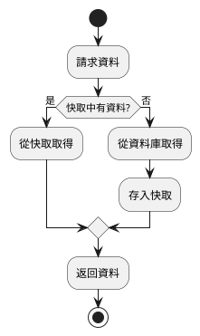
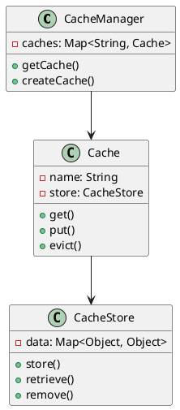
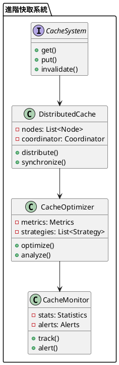

# Spring Cache 教學

## 初級（Beginner）層級

### 1. 概念說明
Spring Cache 就像是一個班級的筆記本，可以快速找到之前記錄的內容，不需要每次都重新計算。初級學習者需要了解：
- 什麼是快取
- 為什麼需要快取
- 基本的快取使用方式

### 2. PlantUML 圖解


### 3. 分段教學步驟

#### 步驟 1：基本專案設定
```xml
<!-- pom.xml -->
<dependencies>
    <dependency>
        <groupId>org.springframework.boot</groupId>
        <artifactId>spring-boot-starter-cache</artifactId>
        <version>3.3.10</version>
    </dependency>
    <dependency>
        <groupId>com.github.ben-manes.caffeine</groupId>
        <artifactId>caffeine</artifactId>
    </dependency>
</dependencies>
```

#### 步驟 2：基本配置
```yaml
# application.yml
spring:
  cache:
    type: caffeine
    caffeine:
      spec: maximumSize=500,expireAfterWrite=600s
```

#### 步驟 3：簡單範例
```java
import org.springframework.cache.annotation.Cacheable;
import org.springframework.stereotype.Service;

@Service
public class StudentService {
    @Cacheable("students")
    public Student getStudentById(String id) {
        // 模擬從資料庫讀取
        System.out.println("從資料庫讀取學生資料: " + id);
        return new Student(id, "學生" + id);
    }
}
```

## 中級（Intermediate）層級

### 1. 概念說明
中級學習者需要理解：
- 快取策略
- 快取更新
- 快取失效
- 快取監控

### 2. PlantUML 圖解


### 3. 分段教學步驟

#### 步驟 1：快取配置
```java
import org.springframework.cache.CacheManager;
import org.springframework.cache.annotation.EnableCaching;
import org.springframework.cache.caffeine.CaffeineCacheManager;
import org.springframework.context.annotation.Bean;
import org.springframework.context.annotation.Configuration;
import com.github.benmanes.caffeine.cache.Caffeine;
import java.util.concurrent.TimeUnit;

@Configuration
@EnableCaching
public class CacheConfig {
    @Bean
    public CacheManager cacheManager() {
        CaffeineCacheManager cacheManager = new CaffeineCacheManager();
        cacheManager.setCaffeine(Caffeine.newBuilder()
            .expireAfterWrite(10, TimeUnit.MINUTES)
            .maximumSize(100));
        return cacheManager;
    }
}
```

#### 步驟 2：快取操作
```java
import org.springframework.cache.annotation.*;
import org.springframework.stereotype.Service;

@Service
public class GradeService {
    @Cacheable(value = "grades", key = "#studentId")
    public Grade getGrade(String studentId) {
        // 從資料庫讀取成績
        return new Grade(studentId, 90);
    }
    
    @CachePut(value = "grades", key = "#grade.studentId")
    public Grade updateGrade(Grade grade) {
        // 更新資料庫中的成績
        return grade;
    }
    
    @CacheEvict(value = "grades", key = "#studentId")
    public void deleteGrade(String studentId) {
        // 從資料庫刪除成績
    }
}
```

#### 步驟 3：條件快取
```java
import org.springframework.cache.annotation.Cacheable;
import org.springframework.stereotype.Service;

@Service
public class ExamService {
    @Cacheable(value = "exams", 
              key = "#studentId", 
              condition = "#studentId.startsWith('A')",
              unless = "#result.score < 60")
    public Exam getExamResult(String studentId) {
        // 從資料庫讀取考試結果
        return new Exam(studentId, 85);
    }
}
```

## 高級（Advanced）層級

### 1. 概念說明
高級學習者需要掌握：
- 分散式快取
- 快取一致性
- 效能優化
- 監控和追蹤

### 2. PlantUML 圖解


### 3. 分段教學步驟

#### 步驟 1：分散式快取
```java
import org.springframework.cache.annotation.EnableCaching;
import org.springframework.context.annotation.Bean;
import org.springframework.context.annotation.Configuration;
import org.springframework.data.redis.cache.RedisCacheManager;
import org.springframework.data.redis.connection.RedisConnectionFactory;
import org.springframework.data.redis.core.RedisTemplate;
import org.springframework.data.redis.serializer.GenericJackson2JsonRedisSerializer;
import org.springframework.data.redis.serializer.StringRedisSerializer;

@Configuration
@EnableCaching
public class DistributedCacheConfig {
    @Bean
    public RedisTemplate<String, Object> redisTemplate(RedisConnectionFactory connectionFactory) {
        RedisTemplate<String, Object> template = new RedisTemplate<>();
        template.setConnectionFactory(connectionFactory);
        template.setKeySerializer(new StringRedisSerializer());
        template.setValueSerializer(new GenericJackson2JsonRedisSerializer());
        return template;
    }
    
    @Bean
    public CacheManager cacheManager(RedisTemplate<String, Object> redisTemplate) {
        return RedisCacheManager.builder(redisTemplate.getConnectionFactory())
            .cacheDefaults(RedisCacheConfiguration.defaultCacheConfig()
                .entryTtl(Duration.ofMinutes(10)))
            .build();
    }
}
```

#### 步驟 2：快取一致性
```java
import org.springframework.cache.annotation.*;
import org.springframework.stereotype.Service;
import java.util.concurrent.ConcurrentHashMap;

@Service
public class ConsistentCacheService {
    private final Map<String, CacheVersion> versions = new ConcurrentHashMap<>();
    
    @CachePut(value = "data", key = "#id")
    public Data updateData(String id, Data data) {
        versions.compute(id, (key, version) -> 
            version == null ? new CacheVersion(1) : version.increment()
        );
        return data;
    }
    
    @Cacheable(value = "data", key = "#id")
    public Data getData(String id) {
        CacheVersion version = versions.get(id);
        if (version != null && version.isStale()) {
            versions.remove(id);
            return null;
        }
        return fetchData(id);
    }
}
```

#### 步驟 3：效能監控
```java
import org.springframework.cache.annotation.*;
import org.springframework.stereotype.Service;
import java.util.Map;
import java.util.concurrent.ConcurrentHashMap;

@Service
public class MonitoredCacheService {
    private final Map<String, CacheMetrics> metrics = new ConcurrentHashMap<>();
    
    @Cacheable(value = "monitored", key = "#id")
    public Object getWithMetrics(String id) {
        long startTime = System.currentTimeMillis();
        try {
            Object result = fetchData(id);
            recordMetrics(id, startTime, true);
            return result;
        } catch (Exception e) {
            recordMetrics(id, startTime, false);
            throw e;
        }
    }
    
    private void recordMetrics(String id, long startTime, boolean success) {
        long duration = System.currentTimeMillis() - startTime;
        metrics.compute(id, (key, value) -> {
            if (value == null) {
                return new CacheMetrics(duration, success);
            }
            value.update(duration, success);
            return value;
        });
    }
}
```

這個教學文件提供了從基礎到進階的 Spring Cache 學習路徑，每個層級都包含了相應的概念說明、圖解、教學步驟和實作範例。初級學習者可以從基本的快取概念開始，中級學習者可以學習更複雜的快取配置和操作，而高級學習者則可以掌握完整的分散式快取系統和效能優化。
