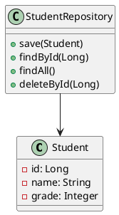
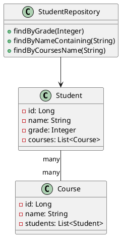
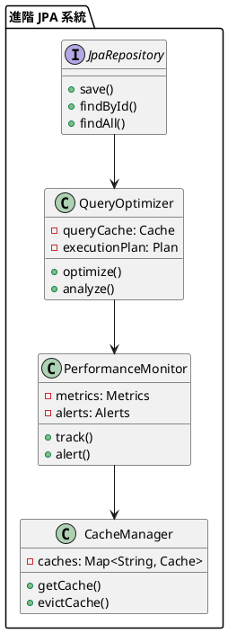

# Spring Data JPA 教學

## 初級（Beginner）層級

### 1. 概念說明
Spring Data JPA 就像是一個班級的班長，幫助我們管理班級資料。初級學習者需要了解：
- 什麼是 JPA
- 為什麼需要 JPA
- 基本的資料庫操作

### 2. PlantUML 圖解


### 3. 分段教學步驟

#### 步驟 1：基本專案設定
```xml
<!-- pom.xml -->
<dependencies>
    <dependency>
        <groupId>org.springframework.boot</groupId>
        <artifactId>spring-boot-starter-data-jpa</artifactId>
        <version>3.3.10</version>
    </dependency>
    <dependency>
        <groupId>com.h2database</groupId>
        <artifactId>h2</artifactId>
        <scope>runtime</scope>
    </dependency>
</dependencies>
```

#### 步驟 2：基本配置
```yaml
# application.yml
spring:
  datasource:
    url: jdbc:h2:mem:testdb
    username: sa
    password: 
  jpa:
    hibernate:
      ddl-auto: update
    show-sql: true
```

#### 步驟 3：簡單範例
```java
import jakarta.persistence.Entity;
import jakarta.persistence.GeneratedValue;
import jakarta.persistence.GenerationType;
import jakarta.persistence.Id;

@Entity
public class Student {
    @Id
    @GeneratedValue(strategy = GenerationType.IDENTITY)
    private Long id;
    private String name;
    private Integer grade;
    
    // 建構函數、getter 和 setter
}

import org.springframework.data.jpa.repository.JpaRepository;
import org.springframework.stereotype.Repository;

@Repository
public interface StudentRepository extends JpaRepository<Student, Long> {
    List<Student> findByGrade(Integer grade);
}
```

## 中級（Intermediate）層級

### 1. 概念說明
中級學習者需要理解：
- 關聯關係
- 查詢方法
- 事務管理
- 效能優化

### 2. PlantUML 圖解


### 3. 分段教學步驟

#### 步驟 1：關聯關係
```java
import jakarta.persistence.*;
import java.util.List;

@Entity
public class Student {
    @Id
    @GeneratedValue(strategy = GenerationType.IDENTITY)
    private Long id;
    private String name;
    private Integer grade;
    
    @ManyToMany
    @JoinTable(
        name = "student_course",
        joinColumns = @JoinColumn(name = "student_id"),
        inverseJoinColumns = @JoinColumn(name = "course_id")
    )
    private List<Course> courses;
}

@Entity
public class Course {
    @Id
    @GeneratedValue(strategy = GenerationType.IDENTITY)
    private Long id;
    private String name;
    
    @ManyToMany(mappedBy = "courses")
    private List<Student> students;
}
```

#### 步驟 2：自定義查詢
```java
import org.springframework.data.jpa.repository.JpaRepository;
import org.springframework.data.jpa.repository.Query;
import org.springframework.data.repository.query.Param;
import org.springframework.stereotype.Repository;
import java.util.List;

@Repository
public interface StudentRepository extends JpaRepository<Student, Long> {
    // 方法名稱查詢
    List<Student> findByGradeGreaterThan(Integer grade);
    
    // JPQL 查詢
    @Query("SELECT s FROM Student s WHERE s.name LIKE %:keyword%")
    List<Student> searchByName(@Param("keyword") String keyword);
    
    // 原生 SQL 查詢
    @Query(value = "SELECT * FROM student WHERE grade > :grade", nativeQuery = true)
    List<Student> findStudentsWithGradeAbove(@Param("grade") Integer grade);
}
```

#### 步驟 3：事務管理
```java
import org.springframework.stereotype.Service;
import org.springframework.transaction.annotation.Transactional;
import jakarta.persistence.EntityManager;
import jakarta.persistence.PersistenceContext;

@Service
public class StudentService {
    @PersistenceContext
    private EntityManager entityManager;
    
    @Transactional
    public void updateStudentGrade(Long studentId, Integer newGrade) {
        Student student = entityManager.find(Student.class, studentId);
        if (student != null) {
            student.setGrade(newGrade);
            entityManager.merge(student);
        }
    }
}
```

## 高級（Advanced）層級

### 1. 概念說明
高級學習者需要掌握：
- 進階查詢
- 效能優化
- 快取策略
- 監控和追蹤

### 2. PlantUML 圖解


### 3. 分段教學步驟

#### 步驟 1：進階查詢
```java
import org.springframework.data.jpa.repository.JpaRepository;
import org.springframework.data.jpa.repository.JpaSpecificationExecutor;
import org.springframework.data.jpa.repository.Query;
import org.springframework.data.repository.query.Param;
import org.springframework.stereotype.Repository;
import java.util.List;

@Repository
public interface StudentRepository extends JpaRepository<Student, Long>, JpaSpecificationExecutor<Student> {
    // 投影查詢
    @Query("SELECT new com.example.dto.StudentDTO(s.id, s.name, s.grade) FROM Student s")
    List<StudentDTO> findAllStudentDTOs();
    
    // 動態查詢
    default List<Student> findStudentsByCriteria(String name, Integer grade) {
        return findAll((root, query, cb) -> {
            List<Predicate> predicates = new ArrayList<>();
            if (name != null) {
                predicates.add(cb.like(root.get("name"), "%" + name + "%"));
            }
            if (grade != null) {
                predicates.add(cb.equal(root.get("grade"), grade));
            }
            return cb.and(predicates.toArray(new Predicate[0]));
        });
    }
}
```

#### 步驟 2：效能優化
```java
import org.springframework.data.jpa.repository.JpaRepository;
import org.springframework.data.jpa.repository.Query;
import org.springframework.data.jpa.repository.QueryHints;
import jakarta.persistence.QueryHint;
import org.springframework.stereotype.Repository;
import java.util.List;

@Repository
public interface StudentRepository extends JpaRepository<Student, Long> {
    // 使用查詢提示優化效能
    @QueryHints({
        @QueryHint(name = "org.hibernate.readOnly", value = "true"),
        @QueryHint(name = "org.hibernate.fetchSize", value = "50")
    })
    @Query("SELECT s FROM Student s WHERE s.grade > :grade")
    List<Student> findStudentsWithGradeAbove(@Param("grade") Integer grade);
    
    // 使用實體圖
    @EntityGraph(attributePaths = {"courses"})
    List<Student> findAll();
}
```

#### 步驟 3：監控和追蹤
```java
import org.springframework.stereotype.Service;
import org.springframework.transaction.annotation.Transactional;
import jakarta.persistence.EntityManager;
import jakarta.persistence.PersistenceContext;
import java.util.Map;
import java.util.concurrent.ConcurrentHashMap;

@Service
public class MonitoredStudentService {
    @PersistenceContext
    private EntityManager entityManager;
    
    private final Map<String, QueryMetrics> metrics = new ConcurrentHashMap<>();
    
    @Transactional
    public Student getStudentWithMetrics(Long id) {
        long startTime = System.currentTimeMillis();
        try {
            Student student = entityManager.find(Student.class, id);
            recordMetrics("findById", startTime, true);
            return student;
        } catch (Exception e) {
            recordMetrics("findById", startTime, false);
            throw e;
        }
    }
    
    private void recordMetrics(String operation, long startTime, boolean success) {
        long duration = System.currentTimeMillis() - startTime;
        metrics.compute(operation, (key, value) -> {
            if (value == null) {
                return new QueryMetrics(duration, success);
            }
            value.update(duration, success);
            return value;
        });
    }
}
```

這個教學文件提供了從基礎到進階的 Spring Data JPA 學習路徑，每個層級都包含了相應的概念說明、圖解、教學步驟和實作範例。初級學習者可以從基本的資料庫操作開始，中級學習者可以學習更複雜的關聯關係和查詢方法，而高級學習者則可以掌握進階查詢和效能優化技巧。 