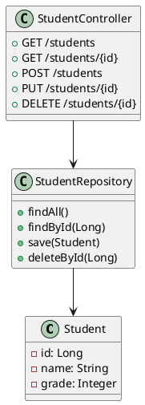
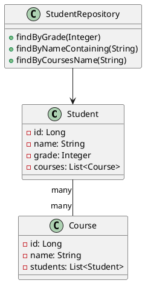
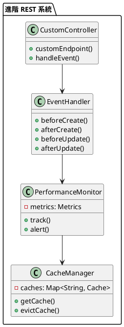

# Spring Data REST 教學

## 初級（Beginner）層級

### 1. 概念說明
Spring Data REST 就像是一個班級的線上聯絡簿，可以讓家長和老師輕鬆地查看和更新學生的資訊。初級學習者需要了解：
- 什麼是 REST API
- 為什麼需要 REST API
- 基本的 CRUD 操作

### 2. PlantUML 圖解


### 3. 分段教學步驟

#### 步驟 1：基本專案設定
```xml
<!-- pom.xml -->
<dependencies>
    <dependency>
        <groupId>org.springframework.boot</groupId>
        <artifactId>spring-boot-starter-data-rest</artifactId>
        <version>3.3.10</version>
    </dependency>
    <dependency>
        <groupId>org.springframework.boot</groupId>
        <artifactId>spring-boot-starter-data-jpa</artifactId>
        <version>3.3.10</version>
    </dependency>
    <dependency>
        <groupId>com.h2database</groupId>
        <artifactId>h2</artifactId>
        <scope>runtime</scope>
    </dependency>
</dependencies>
```

#### 步驟 2：基本配置
```yaml
# application.yml
spring:
  data:
    rest:
      base-path: /api
  datasource:
    url: jdbc:h2:mem:testdb
    username: sa
    password: 
  jpa:
    hibernate:
      ddl-auto: update
```

#### 步驟 3：簡單範例
```java
import jakarta.persistence.Entity;
import jakarta.persistence.GeneratedValue;
import jakarta.persistence.GenerationType;
import jakarta.persistence.Id;

@Entity
public class Student {
    @Id
    @GeneratedValue(strategy = GenerationType.IDENTITY)
    private Long id;
    private String name;
    private Integer grade;
    
    // 建構函數、getter 和 setter
}

import org.springframework.data.jpa.repository.JpaRepository;
import org.springframework.data.rest.core.annotation.RepositoryRestResource;

@RepositoryRestResource(path = "students")
public interface StudentRepository extends JpaRepository<Student, Long> {
}
```

## 中級（Intermediate）層級

### 1. 概念說明
中級學習者需要理解：
- 自定義查詢
- 分頁和排序
- 關聯關係
- 安全性

### 2. PlantUML 圖解


### 3. 分段教學步驟

#### 步驟 1：自定義查詢和分頁
```java
import org.springframework.data.domain.Page;
import org.springframework.data.domain.Pageable;
import org.springframework.data.jpa.repository.JpaRepository;
import org.springframework.data.rest.core.annotation.RepositoryRestResource;
import org.springframework.data.rest.core.annotation.RestResource;

@RepositoryRestResource(path = "students")
public interface StudentRepository extends JpaRepository<Student, Long> {
    @RestResource(path = "by-grade", rel = "by-grade")
    Page<Student> findByGrade(Integer grade, Pageable pageable);
    
    @RestResource(path = "by-name", rel = "by-name")
    Page<Student> findByNameContaining(String name, Pageable pageable);
}
```

#### 步驟 2：關聯關係
```java
import jakarta.persistence.*;
import java.util.List;

@Entity
public class Student {
    @Id
    @GeneratedValue(strategy = GenerationType.IDENTITY)
    private Long id;
    private String name;
    private Integer grade;
    
    @ManyToMany
    @JoinTable(
        name = "student_course",
        joinColumns = @JoinColumn(name = "student_id"),
        inverseJoinColumns = @JoinColumn(name = "course_id")
    )
    private List<Course> courses;
}

@Entity
public class Course {
    @Id
    @GeneratedValue(strategy = GenerationType.IDENTITY)
    private Long id;
    private String name;
    
    @ManyToMany(mappedBy = "courses")
    private List<Student> students;
}

@RepositoryRestResource(path = "courses")
public interface CourseRepository extends JpaRepository<Course, Long> {
}
```

#### 步驟 3：安全性配置
```java
import org.springframework.context.annotation.Configuration;
import org.springframework.security.config.annotation.web.builders.HttpSecurity;
import org.springframework.security.config.annotation.web.configuration.EnableWebSecurity;
import org.springframework.security.config.annotation.web.configuration.WebSecurityConfigurerAdapter;

@Configuration
@EnableWebSecurity
public class SecurityConfig extends WebSecurityConfigurerAdapter {
    @Override
    protected void configure(HttpSecurity http) throws Exception {
        http
            .authorizeRequests()
                .antMatchers("/api/students").permitAll()
                .antMatchers("/api/students/**").authenticated()
                .antMatchers("/api/courses").authenticated()
            .and()
            .httpBasic();
    }
}
```

## 高級（Advanced）層級

### 1. 概念說明
高級學習者需要掌握：
- 自定義控制器
- 事件處理
- 效能優化
- 監控和追蹤

### 2. PlantUML 圖解


### 3. 分段教學步驟

#### 步驟 1：自定義控制器
```java
import org.springframework.data.rest.webmvc.BasePathAwareController;
import org.springframework.hateoas.CollectionModel;
import org.springframework.http.ResponseEntity;
import org.springframework.web.bind.annotation.*;

@BasePathAwareController
public class StudentController {
    private final StudentRepository studentRepository;
    
    public StudentController(StudentRepository studentRepository) {
        this.studentRepository = studentRepository;
    }
    
    @GetMapping("/students/search/top-performers")
    public ResponseEntity<CollectionModel<Student>> getTopPerformers() {
        List<Student> topStudents = studentRepository.findTop10ByOrderByGradeDesc();
        return ResponseEntity.ok(CollectionModel.of(topStudents));
    }
}
```

#### 步驟 2：事件處理
```java
import org.springframework.data.rest.core.annotation.*;
import org.springframework.stereotype.Component;

@Component
@RepositoryEventHandler(Student.class)
public class StudentEventHandler {
    @HandleBeforeCreate
    public void handleStudentBeforeCreate(Student student) {
        System.out.println("即將創建學生: " + student.getName());
    }
    
    @HandleAfterCreate
    public void handleStudentAfterCreate(Student student) {
        System.out.println("已創建學生: " + student.getName());
    }
    
    @HandleBeforeSave
    public void handleStudentBeforeSave(Student student) {
        System.out.println("即將更新學生: " + student.getName());
    }
    
    @HandleAfterSave
    public void handleStudentAfterSave(Student student) {
        System.out.println("已更新學生: " + student.getName());
    }
}
```

#### 步驟 3：效能監控
```java
import org.springframework.data.rest.webmvc.BasePathAwareController;
import org.springframework.http.ResponseEntity;
import org.springframework.web.bind.annotation.*;
import java.util.Map;
import java.util.concurrent.ConcurrentHashMap;

@BasePathAwareController
public class MonitoredStudentController {
    private final StudentRepository studentRepository;
    private final Map<String, RequestMetrics> metrics = new ConcurrentHashMap<>();
    
    public MonitoredStudentController(StudentRepository studentRepository) {
        this.studentRepository = studentRepository;
    }
    
    @GetMapping("/students")
    public ResponseEntity<?> getAllStudents() {
        long startTime = System.currentTimeMillis();
        try {
            var students = studentRepository.findAll();
            recordMetrics("getAllStudents", startTime, true);
            return ResponseEntity.ok(students);
        } catch (Exception e) {
            recordMetrics("getAllStudents", startTime, false);
            throw e;
        }
    }
    
    private void recordMetrics(String operation, long startTime, boolean success) {
        long duration = System.currentTimeMillis() - startTime;
        metrics.compute(operation, (key, value) -> {
            if (value == null) {
                return new RequestMetrics(duration, success);
            }
            value.update(duration, success);
            return value;
        });
    }
}
```

這個教學文件提供了從基礎到進階的 Spring Data REST 學習路徑，每個層級都包含了相應的概念說明、圖解、教學步驟和實作範例。初級學習者可以從基本的 REST API 操作開始，中級學習者可以學習更複雜的查詢和關聯關係，而高級學習者則可以掌握自定義控制器和事件處理等進階功能。 