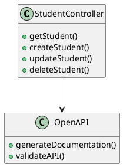
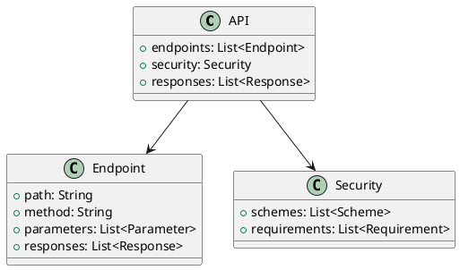
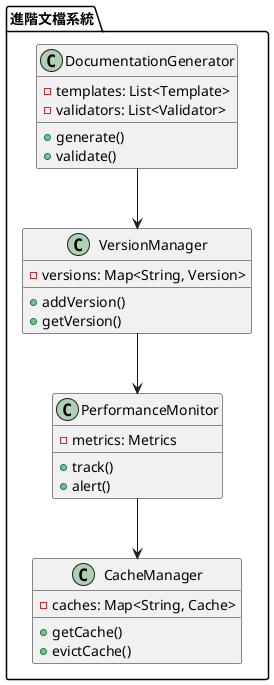

# Spring Doc 教學

## 初級（Beginner）層級

### 1. 概念說明
Spring Doc 就像是一個班級的說明書，幫助大家了解班級的各項規定和活動。初級學習者需要了解：
- 什麼是 API 文檔
- 為什麼需要 API 文檔
- 基本的文檔生成

### 2. PlantUML 圖解


### 3. 分段教學步驟

#### 步驟 1：基本專案設定
```xml
<!-- pom.xml -->
<dependencies>
    <dependency>
        <groupId>org.springdoc</groupId>
        <artifactId>springdoc-openapi-starter-webmvc-ui</artifactId>
        <version>2.5.0</version>
    </dependency>
    <dependency>
        <groupId>org.springframework.boot</groupId>
        <artifactId>spring-boot-starter-web</artifactId>
        <version>3.3.10</version>
    </dependency>
</dependencies>
```

#### 步驟 2：基本配置
```yaml
# application.yml
springdoc:
  swagger-ui:
    path: /swagger-ui.html
  api-docs:
    path: /v3/api-docs
```

#### 步驟 3：簡單範例
```java
import io.swagger.v3.oas.annotations.Operation;
import io.swagger.v3.oas.annotations.Parameter;
import io.swagger.v3.oas.annotations.tags.Tag;
import org.springframework.web.bind.annotation.*;

@RestController
@RequestMapping("/api/students")
@Tag(name = "學生管理", description = "學生相關的 API")
public class StudentController {
    
    @GetMapping("/{id}")
    @Operation(summary = "取得學生資料", description = "根據學生 ID 取得學生詳細資料")
    public Student getStudent(
        @Parameter(description = "學生 ID", required = true)
        @PathVariable Long id) {
        return new Student(id, "小明", 90);
    }
}
```

## 中級（Intermediate）層級

### 1. 概念說明
中級學習者需要理解：
- 文檔分組
- 參數說明
- 回應格式
- 安全性

### 2. PlantUML 圖解


### 3. 分段教學步驟

#### 步驟 1：文檔分組
```java
import io.swagger.v3.oas.annotations.*;
import org.springframework.web.bind.annotation.*;

@RestController
@RequestMapping("/api")
public class SchoolController {
    
    @Tag(name = "學生管理")
    @RestController
    @RequestMapping("/students")
    public class StudentController {
        @GetMapping("/{id}")
        @Operation(summary = "取得學生資料")
        public Student getStudent(@PathVariable Long id) {
            return new Student(id, "小明", 90);
        }
    }
    
    @Tag(name = "課程管理")
    @RestController
    @RequestMapping("/courses")
    public class CourseController {
        @GetMapping("/{id}")
        @Operation(summary = "取得課程資料")
        public Course getCourse(@PathVariable Long id) {
            return new Course(id, "數學");
        }
    }
}
```

#### 步驟 2：參數和回應說明
```java
import io.swagger.v3.oas.annotations.*;
import io.swagger.v3.oas.annotations.media.*;
import org.springframework.web.bind.annotation.*;

@RestController
@RequestMapping("/api/students")
public class StudentController {
    
    @PostMapping
    @Operation(summary = "創建學生", description = "創建新的學生資料")
    @ApiResponses({
        @ApiResponse(responseCode = "201", description = "成功創建學生",
            content = @Content(schema = @Schema(implementation = Student.class))),
        @ApiResponse(responseCode = "400", description = "請求參數錯誤")
    })
    public Student createStudent(
        @RequestBody
        @Schema(description = "學生資料", required = true)
        Student student) {
        return student;
    }
    
    @GetMapping("/search")
    @Operation(summary = "搜尋學生", description = "根據條件搜尋學生")
    public List<Student> searchStudents(
        @Parameter(description = "學生姓名", example = "小明")
        @RequestParam(required = false) String name,
        
        @Parameter(description = "最低分數", example = "60")
        @RequestParam(required = false) Integer minGrade) {
        return List.of(new Student(1L, name, minGrade));
    }
}
```

#### 步驟 3：安全性配置
```java
import io.swagger.v3.oas.annotations.*;
import io.swagger.v3.oas.annotations.security.*;
import org.springframework.web.bind.annotation.*;

@RestController
@RequestMapping("/api/students")
@SecurityRequirement(name = "bearerAuth")
public class StudentController {
    
    @GetMapping("/{id}")
    @Operation(summary = "取得學生資料", security = @SecurityRequirement(name = "bearerAuth"))
    public Student getStudent(@PathVariable Long id) {
        return new Student(id, "小明", 90);
    }
}

@Configuration
public class OpenApiConfig {
    @Bean
    public OpenAPI customOpenAPI() {
        return new OpenAPI()
            .components(new Components()
                .addSecuritySchemes("bearerAuth",
                    new SecurityScheme()
                        .type(SecurityScheme.Type.HTTP)
                        .scheme("bearer")
                        .bearerFormat("JWT")))
            .info(new Info()
                .title("學校管理系統 API")
                .version("1.0")
                .description("學校管理系統的 API 文檔"));
    }
}
```

## 高級（Advanced）層級

### 1. 概念說明
高級學習者需要掌握：
- 自定義文檔
- 多版本 API
- 效能優化
- 監控和追蹤

### 2. PlantUML 圖解


### 3. 分段教學步驟

#### 步驟 1：自定義文檔
```java
import io.swagger.v3.oas.annotations.*;
import io.swagger.v3.oas.models.*;
import org.springdoc.core.customizers.*;
import org.springframework.context.annotation.*;

@Configuration
public class CustomOpenApiConfig {
    @Bean
    public OpenApiCustomizer customOpenApi() {
        return openApi -> {
            openApi.getPaths().forEach((path, pathItem) -> {
                pathItem.readOperations().forEach(operation -> {
                    operation.addTagsItem("自定義標籤");
                    operation.setSummary(operation.getSummary() + " (自定義)");
                });
            });
        };
    }
    
    @Bean
    public OperationCustomizer operationCustomizer() {
        return (operation, handlerMethod) -> {
            operation.addParametersItem(new Parameter()
                .name("X-Custom-Header")
                .in("header")
                .description("自定義請求頭")
                .required(false)
                .schema(new StringSchema()));
            return operation;
        };
    }
}
```

#### 步驟 2：多版本 API
```java
import io.swagger.v3.oas.annotations.*;
import org.springframework.web.bind.annotation.*;

@RestController
@RequestMapping("/api")
public class VersionedController {
    
    @Tag(name = "v1")
    @RestController
    @RequestMapping("/v1/students")
    public class StudentControllerV1 {
        @GetMapping("/{id}")
        @Operation(summary = "取得學生資料 (v1)")
        public StudentV1 getStudent(@PathVariable Long id) {
            return new StudentV1(id, "小明", 90);
        }
    }
    
    @Tag(name = "v2")
    @RestController
    @RequestMapping("/v2/students")
    public class StudentControllerV2 {
        @GetMapping("/{id}")
        @Operation(summary = "取得學生資料 (v2)")
        public StudentV2 getStudent(@PathVariable Long id) {
            return new StudentV2(id, "小明", 90, "三年級");
        }
    }
}
```

#### 步驟 3：效能監控
```java
import io.swagger.v3.oas.annotations.*;
import org.springframework.web.bind.annotation.*;
import java.util.Map;
import java.util.concurrent.ConcurrentHashMap;

@RestController
@RequestMapping("/api/students")
public class MonitoredController {
    private final Map<String, ApiMetrics> metrics = new ConcurrentHashMap<>();
    
    @GetMapping("/{id}")
    @Operation(summary = "取得學生資料")
    public Student getStudent(@PathVariable Long id) {
        long startTime = System.currentTimeMillis();
        try {
            Student student = new Student(id, "小明", 90);
            recordMetrics("getStudent", startTime, true);
            return student;
        } catch (Exception e) {
            recordMetrics("getStudent", startTime, false);
            throw e;
        }
    }
    
    private void recordMetrics(String operation, long startTime, boolean success) {
        long duration = System.currentTimeMillis() - startTime;
        metrics.compute(operation, (key, value) -> {
            if (value == null) {
                return new ApiMetrics(duration, success);
            }
            value.update(duration, success);
            return value;
        });
    }
}
```

這個教學文件提供了從基礎到進階的 Spring Doc 學習路徑，每個層級都包含了相應的概念說明、圖解、教學步驟和實作範例。初級學習者可以從基本的 API 文檔生成開始，中級學習者可以學習更複雜的文檔分組和參數說明，而高級學習者則可以掌握自定義文檔和多版本 API 等進階功能。 