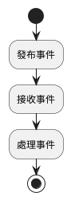
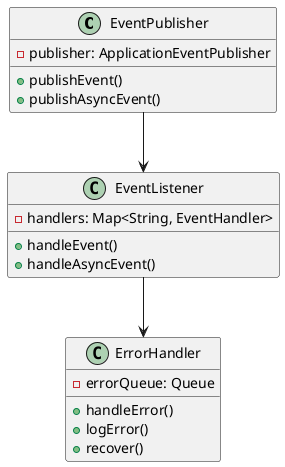
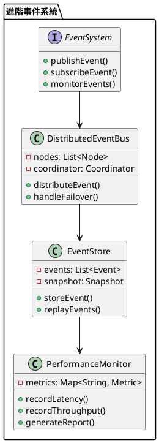

# Spring Event 教學

## 初級（Beginner）層級

### 1. 概念說明
Spring Event 是一個幫助我們在程式中傳遞訊息的工具。初級學習者需要了解：
- 什麼是事件（Event）
- 為什麼需要事件
- 基本的發布和接收事件方式

### 2. PlantUML 圖解


### 3. 分段教學步驟

#### 步驟 1：基本專案設定
```xml
<!-- pom.xml -->
<dependencies>
    <dependency>
        <groupId>org.springframework.boot</groupId>
        <artifactId>spring-boot-starter</artifactId>
    </dependency>
</dependencies>
```

#### 步驟 2：基本配置
```java
import org.springframework.context.annotation.Configuration;
import org.springframework.context.annotation.EnableAsync;

@Configuration
@EnableAsync
public class EventConfig {
}
```

#### 步驟 3：基本使用
```java
import org.springframework.context.ApplicationEvent;
import org.springframework.context.ApplicationEventPublisher;
import org.springframework.stereotype.Component;

// 定義事件
public class SimpleEvent extends ApplicationEvent {
    private final String message;
    
    public SimpleEvent(Object source, String message) {
        super(source);
        this.message = message;
    }
    
    public String getMessage() {
        return message;
    }
}

// 發布事件
@Component
public class EventPublisher {
    private final ApplicationEventPublisher publisher;
    
    public EventPublisher(ApplicationEventPublisher publisher) {
        this.publisher = publisher;
    }
    
    public void publishEvent(String message) {
        publisher.publishEvent(new SimpleEvent(this, message));
    }
}

// 接收事件
@Component
public class EventListener {
    @EventListener
    public void handleEvent(SimpleEvent event) {
        System.out.println("收到事件：" + event.getMessage());
    }
}
```

## 中級（Intermediate）層級

### 1. 概念說明
中級學習者需要理解：
- 事件的類型與分類
- 事件處理的順序
- 非同步事件處理
- 錯誤處理機制

### 2. PlantUML 圖解


### 3. 分段教學步驟

#### 步驟 1：進階事件定義
```java
import org.springframework.context.ApplicationEvent;
import org.springframework.context.ApplicationEventPublisher;
import org.springframework.stereotype.Component;

// 定義多種事件類型
public class UserEvent extends ApplicationEvent {
    public enum Type { CREATED, UPDATED, DELETED }
    
    private final Type type;
    private final String userId;
    
    public UserEvent(Object source, Type type, String userId) {
        super(source);
        this.type = type;
        this.userId = userId;
    }
    
    public Type getType() { return type; }
    public String getUserId() { return userId; }
}

@Component
public class AdvancedEventPublisher {
    private final ApplicationEventPublisher publisher;
    
    public AdvancedEventPublisher(ApplicationEventPublisher publisher) {
        this.publisher = publisher;
    }
    
    public void publishUserEvent(UserEvent.Type type, String userId) {
        publisher.publishEvent(new UserEvent(this, type, userId));
    }
}
```

#### 步驟 2：非同步事件處理
```java
import org.springframework.context.event.EventListener;
import org.springframework.scheduling.annotation.Async;
import org.springframework.stereotype.Component;

@Component
public class AsyncEventListener {
    
    @Async
    @EventListener
    public void handleAsyncEvent(UserEvent event) {
        System.out.println("非同步處理事件：" + event.getType() + " - " + event.getUserId());
        try {
            Thread.sleep(1000); // 模擬耗時操作
        } catch (InterruptedException e) {
            Thread.currentThread().interrupt();
        }
    }
}
```

#### 步驟 3：錯誤處理
```java
import org.springframework.context.event.EventListener;
import org.springframework.stereotype.Component;
import java.util.concurrent.ConcurrentHashMap;

@Component
public class EventErrorHandler {
    private final Map<String, ErrorStats> errorStats = new ConcurrentHashMap<>();
    
    @EventListener
    public void handleError(ErrorEvent event) {
        errorStats.computeIfAbsent(event.getType(), k -> new ErrorStats())
                 .recordError(event.getError());
        logError(event);
    }
    
    private void logError(ErrorEvent event) {
        System.err.printf("事件 %s 處理錯誤: %s%n", 
            event.getType(), 
            event.getError().getMessage());
    }
}
```

## 高級（Advanced）層級

### 1. 概念說明
高級學習者需要掌握：
- 分散式事件處理
- 事件溯源
- 效能優化
- 監控與追蹤

### 2. PlantUML 圖解


### 3. 分段教學步驟

#### 步驟 1：分散式事件處理
```java
import org.springframework.stereotype.Component;
import java.util.List;
import java.util.concurrent.CompletableFuture;

@Component
public class DistributedEventBus {
    private final List<EventNode> nodes;
    
    public DistributedEventBus(List<EventNode> nodes) {
        this.nodes = nodes;
    }
    
    public CompletableFuture<Void> publishDistributedEvent(Event event) {
        return CompletableFuture.allOf(
            nodes.stream()
                .map(node -> node.publishEvent(event))
                .toArray(CompletableFuture[]::new)
        );
    }
    
    private CompletableFuture<Void> handleNodeFailure(EventNode node, Event event) {
        // 處理節點失敗的邏輯
        return CompletableFuture.completedFuture(null);
    }
}
```

#### 步驟 2：事件溯源
```java
import org.springframework.stereotype.Component;
import java.util.ArrayList;
import java.util.List;

@Component
public class EventStore {
    private final List<Event> events = new ArrayList<>();
    
    public void storeEvent(Event event) {
        events.add(event);
        if (events.size() % 100 == 0) {
            createSnapshot();
        }
    }
    
    public List<Event> replayEvents() {
        return new ArrayList<>(events);
    }
    
    private void createSnapshot() {
        // 創建快照的邏輯
    }
}
```

#### 步驟 3：效能監控
```java
import org.springframework.stereotype.Component;
import java.util.concurrent.ConcurrentHashMap;
import java.util.concurrent.atomic.AtomicLong;

@Component
public class EventMetrics {
    private final Map<String, EventStats> stats = new ConcurrentHashMap<>();
    
    public void recordEvent(String eventType, long duration, boolean success) {
        stats.computeIfAbsent(eventType, k -> new EventStats())
            .recordEvent(duration, success);
    }
    
    public void generateReport() {
        stats.forEach((eventType, stat) -> {
            System.out.printf("事件類型: %s, 成功率: %.2f%%, 平均處理時間: %.2fms%n",
                eventType,
                stat.getSuccessRate() * 100,
                stat.getAverageDuration());
        });
    }
    
    private static class EventStats {
        private final AtomicLong totalEvents = new AtomicLong();
        private final AtomicLong successfulEvents = new AtomicLong();
        private final AtomicLong totalDuration = new AtomicLong();
        
        void recordEvent(long duration, boolean success) {
            totalEvents.incrementAndGet();
            if (success) {
                successfulEvents.incrementAndGet();
            }
            totalDuration.addAndGet(duration);
        }
        
        double getSuccessRate() {
            return totalEvents.get() > 0 
                ? (double) successfulEvents.get() / totalEvents.get() 
                : 0;
        }
        
        double getAverageDuration() {
            return totalEvents.get() > 0 
                ? (double) totalDuration.get() / totalEvents.get() 
                : 0;
        }
    }
}
```

這個教學文件提供了從基礎到進階的 Spring Event 學習路徑，每個層級都包含了相應的概念說明、圖解、教學步驟和實作範例。初級學習者可以從基本的事件發布和接收開始，中級學習者可以學習更複雜的事件類型和錯誤處理，而高級學習者則可以掌握完整的分散式事件處理和效能監控。 