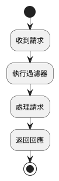
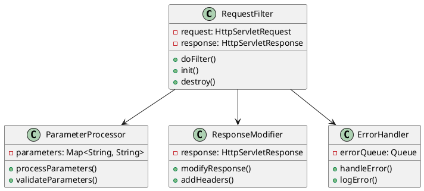
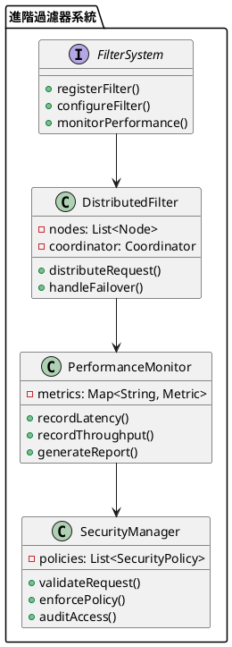

# Spring Filter 教學

## 初級（Beginner）層級

### 1. 概念說明
Spring Filter 就像是一個過濾器，可以過濾進出網站的請求，就像學校的安檢門一樣。初級學習者需要了解：
- 什麼是過濾器（Filter）
- 為什麼需要過濾器
- 基本的請求過濾方式

### 2. PlantUML 圖解


### 3. 分段教學步驟

#### 步驟 1：基本專案設定
```xml
<!-- pom.xml -->
<dependencies>
    <dependency>
        <groupId>org.springframework.boot</groupId>
        <artifactId>spring-boot-starter-web</artifactId>
    </dependency>
</dependencies>
```

#### 步驟 2：基本配置
```java
import org.springframework.boot.web.servlet.FilterRegistrationBean;
import org.springframework.context.annotation.Bean;
import org.springframework.context.annotation.Configuration;

@Configuration
public class FilterConfig {
    
    @Bean
    public FilterRegistrationBean<SimpleFilter> simpleFilter() {
        FilterRegistrationBean<SimpleFilter> registration = new FilterRegistrationBean<>();
        registration.setFilter(new SimpleFilter());
        registration.addUrlPatterns("/*");
        return registration;
    }
}
```

#### 步驟 3：基本使用
```java
import javax.servlet.*;
import javax.servlet.http.HttpServletRequest;
import java.io.IOException;

public class SimpleFilter implements Filter {
    
    @Override
    public void doFilter(ServletRequest request, 
                        ServletResponse response, 
                        FilterChain chain) throws IOException, ServletException {
        HttpServletRequest httpRequest = (HttpServletRequest) request;
        System.out.println("請求開始：" + httpRequest.getRequestURI());
        
        chain.doFilter(request, response);
        
        System.out.println("請求結束：" + httpRequest.getRequestURI());
    }
}
```

## 中級（Intermediate）層級

### 1. 概念說明
中級學習者需要理解：
- 過濾器的執行順序
- 請求參數的處理
- 回應的修改
- 錯誤處理機制

### 2. PlantUML 圖解


### 3. 分段教學步驟

#### 步驟 1：進階過濾器定義
```java
import javax.servlet.*;
import javax.servlet.http.HttpServletRequest;
import javax.servlet.http.HttpServletResponse;
import java.io.IOException;
import java.util.Map;

public class AdvancedFilter implements Filter {
    
    @Override
    public void doFilter(ServletRequest request, 
                        ServletResponse response, 
                        FilterChain chain) throws IOException, ServletException {
        HttpServletRequest httpRequest = (HttpServletRequest) request;
        HttpServletResponse httpResponse = (HttpServletResponse) response;
        
        // 處理請求參數
        Map<String, String[]> params = httpRequest.getParameterMap();
        params.forEach((key, values) -> {
            System.out.println("參數 " + key + ": " + String.join(", ", values));
        });
        
        // 添加請求頭
        httpResponse.addHeader("X-Request-Id", httpRequest.getSession().getId());
        
        chain.doFilter(request, response);
    }
}
```

#### 步驟 2：參數處理
```java
import javax.servlet.*;
import javax.servlet.http.HttpServletRequest;
import java.io.IOException;
import java.util.Map;
import java.util.concurrent.ConcurrentHashMap;

public class ParameterFilter implements Filter {
    private final Map<String, ParameterStats> stats = new ConcurrentHashMap<>();
    
    @Override
    public void doFilter(ServletRequest request, 
                        ServletResponse response, 
                        FilterChain chain) throws IOException, ServletException {
        HttpServletRequest httpRequest = (HttpServletRequest) request;
        String path = httpRequest.getRequestURI();
        Map<String, String[]> params = httpRequest.getParameterMap();
        
        stats.computeIfAbsent(path, k -> new ParameterStats())
             .recordParameters(params.size());
        
        chain.doFilter(request, response);
    }
    
    private static class ParameterStats {
        private int totalRequests = 0;
        private int totalParameters = 0;
        
        void recordParameters(int paramCount) {
            totalRequests++;
            totalParameters += paramCount;
        }
        
        double getAverageParameters() {
            return totalRequests > 0 
                ? (double) totalParameters / totalRequests 
                : 0;
        }
    }
}
```

#### 步驟 3：錯誤處理
```java
import javax.servlet.*;
import javax.servlet.http.HttpServletRequest;
import java.io.IOException;
import java.util.concurrent.ConcurrentHashMap;

public class ErrorFilter implements Filter {
    private final Map<String, ErrorStats> errorStats = new ConcurrentHashMap<>();
    
    @Override
    public void doFilter(ServletRequest request, 
                        ServletResponse response, 
                        FilterChain chain) throws IOException, ServletException {
        HttpServletRequest httpRequest = (HttpServletRequest) request;
        
        try {
            chain.doFilter(request, response);
        } catch (Exception ex) {
            String path = httpRequest.getRequestURI();
            errorStats.computeIfAbsent(path, k -> new ErrorStats())
                     .recordError(ex.getClass().getSimpleName());
            logError(httpRequest, ex);
            throw ex;
        }
    }
    
    private void logError(HttpServletRequest request, Exception ex) {
        System.err.printf("請求 %s 發生錯誤: %s%n", 
            request.getRequestURI(), 
            ex.getMessage());
    }
}
```

## 高級（Advanced）層級

### 1. 概念說明
高級學習者需要掌握：
- 分散式過濾器
- 效能監控
- 動態配置
- 安全控制

### 2. PlantUML 圖解


### 3. 分段教學步驟

#### 步驟 1：分散式過濾器
```java
import javax.servlet.*;
import javax.servlet.http.HttpServletRequest;
import java.io.IOException;
import java.util.List;
import java.util.concurrent.CompletableFuture;

public class DistributedFilter implements Filter {
    private final List<FilterNode> nodes;
    
    public DistributedFilter(List<FilterNode> nodes) {
        this.nodes = nodes;
    }
    
    @Override
    public void doFilter(ServletRequest request, 
                        ServletResponse response, 
                        FilterChain chain) throws IOException, ServletException {
        HttpServletRequest httpRequest = (HttpServletRequest) request;
        
        CompletableFuture.allOf(
            nodes.stream()
                .map(node -> node.processRequest(httpRequest))
                .toArray(CompletableFuture[]::new)
        ).thenRun(() -> {
            try {
                chain.doFilter(request, response);
            } catch (Exception e) {
                handleNodeFailure(httpRequest, e);
            }
        }).exceptionally(ex -> {
            handleNodeFailure(httpRequest, ex);
            return null;
        }).join();
    }
    
    private void handleNodeFailure(HttpServletRequest request, Throwable ex) {
        System.err.printf("節點處理請求 %s 失敗: %s%n", 
            request.getRequestURI(), 
            ex.getMessage());
    }
}
```

#### 步驟 2：效能監控
```java
import javax.servlet.*;
import javax.servlet.http.HttpServletRequest;
import java.io.IOException;
import java.util.concurrent.ConcurrentHashMap;
import java.util.concurrent.atomic.AtomicLong;

public class PerformanceFilter implements Filter {
    private final Map<String, RequestStats> stats = new ConcurrentHashMap<>();
    
    @Override
    public void doFilter(ServletRequest request, 
                        ServletResponse response, 
                        FilterChain chain) throws IOException, ServletException {
        HttpServletRequest httpRequest = (HttpServletRequest) request;
        String path = httpRequest.getRequestURI();
        
        RequestStats stat = stats.computeIfAbsent(path, k -> new RequestStats());
        stat.startRequest();
        long startTime = System.currentTimeMillis();
        
        try {
            chain.doFilter(request, response);
            stat.endRequest(System.currentTimeMillis() - startTime, true);
        } catch (Exception ex) {
            stat.endRequest(System.currentTimeMillis() - startTime, false);
            throw ex;
        }
    }
    
    private static class RequestStats {
        private final AtomicLong totalRequests = new AtomicLong();
        private final AtomicLong successfulRequests = new AtomicLong();
        private final AtomicLong totalDuration = new AtomicLong();
        
        void startRequest() {
            totalRequests.incrementAndGet();
        }
        
        void endRequest(long duration, boolean success) {
            if (success) {
                successfulRequests.incrementAndGet();
            }
            totalDuration.addAndGet(duration);
        }
        
        double getSuccessRate() {
            return totalRequests.get() > 0 
                ? (double) successfulRequests.get() / totalRequests.get() 
                : 0;
        }
        
        double getAverageDuration() {
            return totalRequests.get() > 0 
                ? (double) totalDuration.get() / totalRequests.get() 
                : 0;
        }
    }
}
```

#### 步驟 3：安全控制
```java
import javax.servlet.*;
import javax.servlet.http.HttpServletRequest;
import javax.servlet.http.HttpServletResponse;
import java.io.IOException;
import java.util.List;
import java.util.concurrent.ConcurrentHashMap;

public class SecurityFilter implements Filter {
    private final List<SecurityPolicy> policies;
    private final Map<String, AccessStats> accessStats = new ConcurrentHashMap<>();
    
    public SecurityFilter(List<SecurityPolicy> policies) {
        this.policies = policies;
    }
    
    @Override
    public void doFilter(ServletRequest request, 
                        ServletResponse response, 
                        FilterChain chain) throws IOException, ServletException {
        HttpServletRequest httpRequest = (HttpServletRequest) request;
        HttpServletResponse httpResponse = (HttpServletResponse) response;
        String path = httpRequest.getRequestURI();
        String clientId = httpRequest.getHeader("X-Client-Id");
        
        // 檢查訪問權限
        for (SecurityPolicy policy : policies) {
            if (!policy.validate(httpRequest)) {
                recordAccess(path, clientId, false);
                httpResponse.setStatus(HttpServletResponse.SC_FORBIDDEN);
                return;
            }
        }
        
        recordAccess(path, clientId, true);
        chain.doFilter(request, response);
    }
    
    private void recordAccess(String path, String clientId, boolean allowed) {
        accessStats.computeIfAbsent(path, k -> new AccessStats())
                  .recordAccess(clientId, allowed);
    }
}
```

這個教學文件提供了從基礎到進階的 Spring Filter 學習路徑，每個層級都包含了相應的概念說明、圖解、教學步驟和實作範例。初級學習者可以從基本的請求過濾開始，中級學習者可以學習更複雜的參數處理和錯誤處理，而高級學習者則可以掌握完整的分散式過濾和效能監控。 