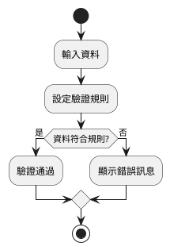
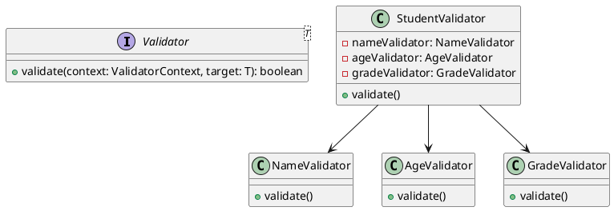
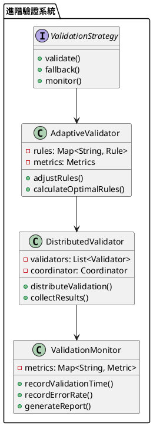

# Spring 使用 Fluent-Validator 教學

## 初級（Beginner）層級

### 1. 概念說明
Fluent-Validator 是一個幫助我們檢查資料是否正確的工具。初級學習者需要了解：
- 什麼是資料驗證
- 基本的驗證規則
- 簡單的錯誤訊息

### 2. PlantUML 圖解


### 3. 分段教學步驟

#### 步驟 1：基本專案設定
```xml
<!-- pom.xml -->
<dependencies>
    <dependency>
        <groupId>com.baidu.unbiz</groupId>
        <artifactId>fluent-validator</artifactId>
        <version>1.0.9</version>
    </dependency>
</dependencies>
```

#### 步驟 2：基本驗證類別
```java
import com.baidu.unbiz.fluentvalidator.ValidationError;
import com.baidu.unbiz.fluentvalidator.Validator;
import com.baidu.unbiz.fluentvalidator.ValidatorContext;
import org.springframework.stereotype.Component;

@Component
public class StudentValidator implements Validator<Student> {
    @Override
    public boolean validate(ValidatorContext context, Student student) {
        // 驗證姓名
        if (student.getName() == null || student.getName().isEmpty()) {
            context.addError(ValidationError.create("姓名不能為空"));
            return false;
        }
        
        // 驗證年齡
        if (student.getAge() < 0 || student.getAge() > 120) {
            context.addError(ValidationError.create("年齡必須在 0-120 之間"));
            return false;
        }
        
        return true;
    }
}
```

#### 步驟 3：基本使用
```java
import com.baidu.unbiz.fluentvalidator.Result;
import com.baidu.unbiz.fluentvalidator.ValidatorChain;
import org.springframework.stereotype.Service;

@Service
public class StudentService {
    private final StudentValidator studentValidator;

    public StudentService(StudentValidator studentValidator) {
        this.studentValidator = studentValidator;
    }

    public Result validateStudent(Student student) {
        return ValidatorChain.start()
            .add(studentValidator)
            .doValidate()
            .result();
    }
}
```

## 中級（Intermediate）層級

### 1. 概念說明
中級學習者需要理解：
- 複雜的驗證規則
- 自訂驗證器
- 驗證器組合
- 錯誤處理策略

### 2. PlantUML 圖解


### 3. 分段教學步驟

#### 步驟 1：進階驗證器
```java
import com.baidu.unbiz.fluentvalidator.Validator;
import com.baidu.unbiz.fluentvalidator.ValidatorContext;
import org.springframework.stereotype.Component;

@Component
public class NameValidator implements Validator<String> {
    @Override
    public boolean validate(ValidatorContext context, String name) {
        if (name == null || name.isEmpty()) {
            context.addError(ValidationError.create("姓名不能為空"));
            return false;
        }
        
        if (name.length() < 2 || name.length() > 20) {
            context.addError(ValidationError.create("姓名長度必須在 2-20 之間"));
            return false;
        }
        
        if (!name.matches("^[\\u4e00-\\u9fa5a-zA-Z]+$")) {
            context.addError(ValidationError.create("姓名只能包含中文和英文字母"));
            return false;
        }
        
        return true;
    }
}
```

#### 步驟 2：驗證器組合
```java
import com.baidu.unbiz.fluentvalidator.ValidatorChain;
import org.springframework.stereotype.Component;

@Component
public class StudentValidatorChain {
    private final NameValidator nameValidator;
    private final AgeValidator ageValidator;
    private final GradeValidator gradeValidator;

    public StudentValidatorChain(
            NameValidator nameValidator,
            AgeValidator ageValidator,
            GradeValidator gradeValidator) {
        this.nameValidator = nameValidator;
        this.ageValidator = ageValidator;
        this.gradeValidator = gradeValidator;
    }

    public Result validateStudent(Student student) {
        return ValidatorChain.start()
            .add(nameValidator)
            .add(ageValidator)
            .add(gradeValidator)
            .doValidate()
            .result();
    }
}
```

#### 步驟 3：錯誤處理
```java
import com.baidu.unbiz.fluentvalidator.Result;
import org.springframework.stereotype.Component;

@Component
public class ValidationErrorHandler {
    public void handleValidationErrors(Result result) {
        if (!result.isSuccess()) {
            result.getErrors().forEach(error -> {
                System.out.println("驗證錯誤: " + error.getErrorMsg());
            });
        }
    }
}
```

## 高級（Advanced）層級

### 1. 概念說明
高級學習者需要掌握：
- 進階驗證策略
- 自適應驗證
- 分散式驗證
- 效能監控

### 2. PlantUML 圖解


### 3. 分段教學步驟

#### 步驟 1：自適應驗證
```java
import com.baidu.unbiz.fluentvalidator.Validator;
import org.springframework.stereotype.Component;
import java.util.concurrent.ConcurrentHashMap;
import java.util.concurrent.atomic.AtomicInteger;

@Component
public class AdaptiveValidator {
    private final Map<String, ValidationRule> rules = new ConcurrentHashMap<>();
    private final AtomicInteger errorCount = new AtomicInteger(0);

    public void adjustRules() {
        int errors = errorCount.get();
        if (errors > 10) {
            // 增加驗證規則
            addStricterRules();
        } else if (errors < 2) {
            // 放寬驗證規則
            relaxRules();
        }
        errorCount.set(0);
    }

    private void addStricterRules() {
        // 實現更嚴格的驗證規則
    }

    private void relaxRules() {
        // 實現更寬鬆的驗證規則
    }

    public void recordError() {
        errorCount.incrementAndGet();
    }
}
```

#### 步驟 2：分散式驗證
```java
import com.baidu.unbiz.fluentvalidator.Result;
import org.springframework.stereotype.Component;
import java.util.concurrent.CompletableFuture;
import java.util.concurrent.ExecutorService;
import java.util.concurrent.Executors;

@Component
public class DistributedValidator {
    private final ExecutorService executor = Executors.newFixedThreadPool(4);
    private final List<Validator<Student>> validators;

    public DistributedValidator(List<Validator<Student>> validators) {
        this.validators = validators;
    }

    public CompletableFuture<Result> validateDistributed(Student student) {
        List<CompletableFuture<Result>> futures = validators.stream()
            .map(validator -> CompletableFuture.supplyAsync(
                () -> ValidatorChain.start()
                    .add(validator)
                    .doValidate()
                    .result(),
                executor))
            .collect(Collectors.toList());

        return CompletableFuture.allOf(futures.toArray(new CompletableFuture[0]))
            .thenApply(v -> combineResults(futures));
    }

    private Result combineResults(List<CompletableFuture<Result>> futures) {
        Result combinedResult = new Result();
        futures.forEach(future -> {
            try {
                Result result = future.get();
                combinedResult.addAll(result.getErrors());
            } catch (Exception e) {
                combinedResult.addError(ValidationError.create("驗證過程發生錯誤: " + e.getMessage()));
            }
        });
        return combinedResult;
    }
}
```

#### 步驟 3：效能監控
```java
import org.springframework.stereotype.Component;
import java.util.concurrent.ConcurrentHashMap;
import java.util.concurrent.atomic.AtomicLong;

@Component
public class ValidationMetrics {
    private final Map<String, ValidationStats> stats = new ConcurrentHashMap<>();

    public void recordValidation(String validatorName, long duration, boolean success) {
        stats.computeIfAbsent(validatorName, k -> new ValidationStats())
            .recordValidation(duration, success);
    }

    public void generateReport() {
        stats.forEach((name, stat) -> {
            System.out.printf("驗證器: %s, 成功率: %.2f%%, 平均驗證時間: %.2fms%n",
                name,
                stat.getSuccessRate() * 100,
                stat.getAverageDuration());
        });
    }

    private static class ValidationStats {
        private final AtomicLong totalValidations = new AtomicLong();
        private final AtomicLong successfulValidations = new AtomicLong();
        private final AtomicLong totalDuration = new AtomicLong();

        void recordValidation(long duration, boolean success) {
            totalValidations.incrementAndGet();
            if (success) {
                successfulValidations.incrementAndGet();
            }
            totalDuration.addAndGet(duration);
        }

        double getSuccessRate() {
            return totalValidations.get() > 0 
                ? (double) successfulValidations.get() / totalValidations.get() 
                : 0;
        }

        double getAverageDuration() {
            return totalValidations.get() > 0 
                ? (double) totalDuration.get() / totalValidations.get() 
                : 0;
        }
    }
}
```

這個教學文件提供了從基礎到進階的 Spring 使用 Fluent-Validator 學習路徑，每個層級都包含了相應的概念說明、圖解、教學步驟和實作範例。初級學習者可以從基本的資料驗證開始，中級學習者可以學習更複雜的驗證規則和組合，而高級學習者則可以掌握完整的自適應驗證和分散式驗證。 